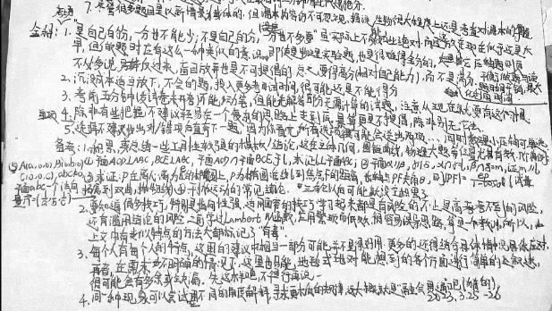

# 20230326·全科篇

> 背景：2023年3月25至26日，一模结束一个月后，给一位同学总结了自己所能想到的大部分解题方法。本文为其中适用于整体备考与应试的部分在添加注释后的版本，部分内容略有改动。
>
> 还请大家视自身情况酌情参考。

考场

1. “是自己的分，一分也不能少；不是自己的分，一分也不多要”，虽实际样也不能如此绝对，而且这放在现在似乎还是太早，但做题时应有这么一种类似的意识，即使是物理实验题，也是很难得全分的，其它压轴题则更不必多说。反过来，盲目放弃也是不可提倡的。总之，要得高分（相对自己能力），而不是满分。平衡做题与读题时间开销，最大化利用时间。

2. 沉没成本适当放下，不会的题，投入更多考试时间，很可能还是不能得分。

3. 考前五分钟（发试卷未开考）不能动笔，但能先解答部分无需计算的试题，注意从现在就要有这个习惯。

   > 实际上自己在高三上学期期末就已经开始了。

4. 除非有些把握，不建议轻易在一个复杂的思路上走到底。暴算更是不提倡，除非别无他法。

5. 单项选择不建议找出对/错项后直奔下一题，因为你看完所有选项后很可能会选出两项……同时数理小压轴可单选。

备考

1. 积累，或总结一些工具型较强的模板/结论，这在立体几何、圆锥曲线、物理大题等位置尤其有效。几个典例：

   1. 平面$AOD\bot ABC$，$BCE\bot ABC$，平面$AOD$交平面$BCE$于$l$，求证$l\bot 平面ABC$。
   2. 平面$\alpha//\beta$，$\gamma//\delta$，$\alpha\cap\gamma=l$，$\beta\cap\delta=m$，证$m//l$。
   3. 求证：$P$在离心率为$e$的椭圆上，$p$为椭圆准线到焦点的距离，长轴与$PF$夹角$\theta$，则$|PF|=\frac{ep}{1-ecos\theta}$（试拓展到双曲、抛物线）。
   4. 平抛运动的相关结论。
   5. $A(a,0,0)$，$B(0,b,0)$，$C(0,0,c)$，$abc\ne0$，平面$ABC$一个法向量$\vec n=\left(\frac1a,\frac1b,\frac1c\right)$。

   三轮以后可能就没空积累了。

2. 要知道，很多技巧，特别是指向性强，适用面窄的技巧学习起来都是有风险的，不止是高考考不到的风险，还有滥用结论的风险。之前曾学过Lambert W函数，应用繁琐而低效，很容易误导思路，算是一个教训。所以，上文中有类似特点的方法大都标记了“有毒”。

3. 每个人有每个人的特点，这里的建议中相当一部分可能并不是很好用。更多的还得结合具体情况具体应对。再者，在需求不明确的情况下，这里也只能地毯式地对能想到的各个方面进行了简单的叙述，但很可能会有多余或缺漏。先这样吧，不行再说。

4. 同一种现象可以尝试用不同的角度解释，寻求更本质的规律，这大概就是“融会贯通”吧。（猜的）

2023.3.25～26

原件：

