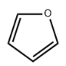

# 20230326·化学篇

> 背景：2023年3月25至26日，一模结束一个月后，给一位同学总结了自己所能想到的大部分解题方法。本文为其中的化学部分在添加注释后的版本，部分内容略有改动。

既然写了那就先写完吧。

1. 多选14、15作为单选处理，大题结构与有机尽可能保分，反应原理不扥可直接放弃部分题目（平衡常数三五分钟也算不出）。简答题务必保持规范。完成整张试卷不可奢望，好得的分得到就行。反应方程式应格外注意环境对生成物的影响、反应条件是否遗漏等细节。

   > 虽不必逐字背诵，但也可以留意标答或其他优秀答案的组织方式，对简答题的模板有一定的把握。

2. 大$\pi$键那块，可以先出去结构简式中$\pi$键，仅保留$\sigma$键组成的骨架，再结合分子结构分析杂化轨道类型，最终确定未参与杂化的p轨道电子数及大$\pi$键类型。当然，如果某分子能被视作另一分子的片段或具有相对常见的等电子体，可向这一方向靠拢。另外，杂化的目的是成$\sigma$键与容纳孤电子。

   > 例如，对于呋喃，我们可以先忽略其中的$\pi$键，但是保留$\sigma$键形成的骨架，并在不忽略$\pi$键时先分析出四个C原子的杂化类型均为$sp^2$。这时，我们得出，分子当中C的4个电子当中只有3个电子与其他原子形成了$\sigma$键，还有一个原子被“孤立”以参与$\pi$键的形成。类似地，我们得到，O原子的6个电子当中只有2个形成了$\sigma$键，其余4个电子当中，只有2个位于未参与杂化且垂直分子平面的$p$轨道当中来形成$\pi$键。所以，这里的大$\pi$键为$\Pi_5^6$。

3. 溶液中粒子浓度的计算中，应尝试利用比例关系、$pA-pB$图像斜率简化运算，$K_{sp}$相关计算中这一方法尤为高效（有时），例如$pH$每升高1，$\lg c_{Fe^{3+}}$降低3。

   > 这里$pA$、$pB$指习题中常出现的一种数据表示方式，即$pA=-\lg c(A)$。

4. 工艺流程中常见杂质离子沉淀$pH$应至少有个印象（$Fe^{3+}$1～3，$Al^{3+}$2～4，$Cu^{2+}$5～7$^{\Rightarrow还原}$，$Fe^{2+}$>7$^{\Rightarrow氧化}$）

   > 这里的“还原”与“氧化”指的是去除杂质的方式。

5. 电化学中首先应找准电流方向，借助同一极区电荷守恒再确定其他粒子运动（大多如此）

   > 自己当时会习惯性地在读题的同时标出电子的流向，并按极区成分与隔膜的类型写出粒子的流向（或流过隔膜的粒子的电性与流向）。

6. 有机化学书写复杂结构时建议用键线式，同时用$-Ph$等简记，简洁明了（答题卡上别写这）

   > 在草稿纸上找同分异构或写预想的反应路径时可以考虑这种方法，但是答题卡上不要出现$-Ph$一类标记。

7. 善用比例关系处理定量测量，除非有副产物一类意外影响

8. 配平：
   1. 奇葩方程式拆分处理（$Cu(OH)_2\cdot CO_3\Rightarrow 2CuO\cdot H_2O\cdot CO_2$）

      > 应该是对奇葩物质的拆分处理。对比较“奇怪”的物质，如$N_2O_2$，我们可以在配平时将其看作$O_2+N_2$。

   2. 不易确定化合价且难以拆分的对整体而非每个元素确定化合价。

      > 大概只可自行体会。

   3. 可以将一个较复杂的反应分解为多个步骤（$Cu+H_2SO_4\longrightarrow CuO+H_2O+SO_2\overset{H_2SO_4}{\longrightarrow}CuSO_4+H_2O+SO_2$）

      > 这一点与第1点相结合后其实是相当有用的。

知识散，技巧也散，实在总结不出了。

