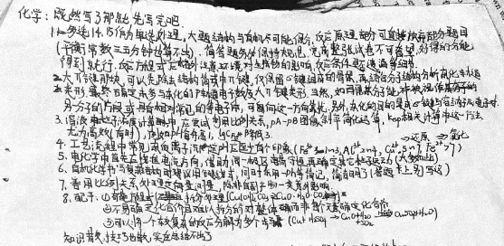

既然写了那就先写完吧。

1. 多选14、15作为单选处理，大题结构与有机尽可能保分，反应原理不扥可直接放弃部分题目（平衡常数三五分钟也算不出）。简答题务必保持规范。完成整张试卷不可奢望，好得的分得到就行。反应方程式应格外注意环境对生成物的影响、反应条件是否遗漏等细节。
2. 大$\pi$键那块，可以先出去结构简式中$\pi$键，仅保留$\sigma$键组成的骨架，再结合分子结构分析杂化轨道类型，最终确定未参与杂化的p轨道电子数及大$\pi$键类型。当然，如果某分子能被视作另一分子的片段或具有相对常见的等电子体，可向这一方向靠拢。另外，杂化的目的是成$\sigma$键与容纳孤电子。
3. 溶液中粒子浓度的计算中，应尝试利用比例关系、$pA-pB$图像斜率简化运算，$K_{sp}$相关计算中这一方法尤为高效（有时），例如$pH$每升高1，$\lg c_{Fe^{3+}}$降低3。
4. 工艺流程中常见杂质离子沉淀$pH$应至少有个印象（$Fe^{3+}$1～3，$Al^{3+}$2～4，$Cu^{2+}$5～7$^{\Rightarrow还原}$，$Fe^{2+}$>7$^{\Rightarrow氧化}$）
5. 电化学中首先应找准电流方向，借助同一极区电荷守恒再确定其他粒子运动（大多如此）
6. 有机化学数学复杂结构时建议用键线式，同时用$-Ph$等简记，简洁明了（答题卡上别写这）
7. 善用比例关系处理定量测量，除非有副产物一类意外影响
8. 配平：
   1. 奇葩方程式拆分处理（$Cu(OH)_2\cdot CO_3\Rightarrow 2CuO\cdot H_2O\cdot CO_2$）
   2. 不易确定化合价且难以拆分的对整体而非每个元素确定化合价
   3. 可以将一个较复杂的反应分解为多个步骤（$Cu+H_2SO_4\longrightarrow CuO+H_2O+SO_2\overset{H_2SO_4}{\longrightarrow}CuSO_4+H_2O+SO_2$）

知识散，技巧也散，实在总结不出了。

