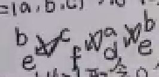
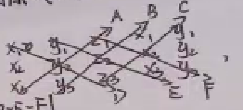
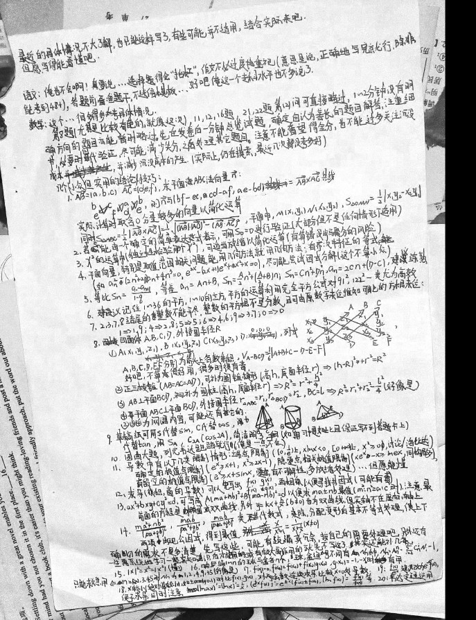

# 20230326·数学篇

> 背景：2023年3月25至26日，一模结束一个月后，给一位同学总结了自己所能想到的大部分解题方法。本文为其中的数学部分在添加注释后的版本，部分内容略有改动。

第8题，尤其是比较奇葩的（就像这次），11，12，16题21，22题的第(2)问可直接略过，1~2分钟没有明确方向的题目亦能暂时略过。先在发卷后一分钟总览试题，确定自认为擅长的题目解答，注重细节，必要时回代验证，尽可能减少失分，之后处理其他题目。注意不能奢望得全分，也不能过多关注沉没成本，并减少沉没成本的产生。（实际上，仍在摸索，最近几次都没考多好）

几个（小众）但实用的结论/技巧：

1. $\vec{AB}=(a,b,c)$ $\vec{AC}=(d,e,f)$，求平面ABC法向量$\vec{n}$：

   

   则$\vec{n}$与$(bf-ec,cd-af,ae-bd)=\vec{AB}\times\vec{AC}$共线。

   实际计算时取0分量较多的向量以简化运算。

   同时$S_{\triangle{ABC}}=\frac12 |\vec{AB}\times\vec{AC}|=\frac12\sqrt{(|\vec{AB}||\vec{AC}|)^2-(\vec{AB}\cdot\vec{AC})^2}$，平面中，$M(x_1,y_1)$，$N(x_2,y_2)$，$S_{\triangle{OMN}}=\frac12|x_1y_2-x_2y_1|$。

2. 若$a_n$能由一个确定的简单表达式表示，可用$S_0=0$进行验证。（大部分但不是任何情形下适用）

   > 比如，$S_n=2^n(3n+6)-6$可用$S_0=2^0\cdot6-6=0$验证其合理性。同样，如果不怕出错的话，这种方法也能用于求解一些待定的系数。

3. $\chi^2$的运算中（独立性检验那个$\chi^2$），可适当放缩以简化运算（有算错没步骤分的风险）

   > 后来听老师说**并不能**这么做，这里保留只是为了符合当时的事实。

4. 平面向量，特别是取值范围相关问题，能用几何方法就用几何方法；有齐次特征的等式（如$a_n^2-(2n^2+2)a_n+4n^3=0$，$e^{2x}-(2x+1)e^x+x^2+x=0$），尽可能尝试因式分解。（这个不算小众）

   > 所谓“齐次特征”，就是式中各项的次数可以认为是相同的。（只可意会，不可言传）

5. 等比$S_n=\frac{a_1-a_{n+1}}{1-q}$，等差$a_n=An+B\implies S_n=\frac A2n^2+(\frac A2+B)n$；$S_n=Cn^2+Dn\implies a_n=2Cn+(D-C)$，建议练熟。

   > 当时是在纸上写了十几个等差数列去用上面的公式求和，求完和再用公式还原回来，只折腾了两次就可以看到等比数列直接写出来前$n$项和了。

6. 建议记住1～36的平方，1～10的立方，平方的运算利用完全平方公式对$91^2$、$122^2$一类尤为高效。

   > 平方数、立方数的记忆还是需要慢慢积累的。另外还建议2的0～20次方、3的0～7次方、5的0～6次方以及它们与前几个素数的积。

   > 例如$91^2=(90+1)^2=90^2+2\cdot1\cdot90+1^2=8100+180+1=8281$

7. 2、3、7、8结尾的整数不能开尽平方，整数的平方根不是分数，且可由原数字末尾推知可能的方根末位：

   $1\implies1、9$；$4\implies2、8$；$5\implies5$；$6\implies4、6$；$9\implies3、7$；$0\implies0$

   > 证明放在了自己在当年5月底出的一次《每周押题》当中。

8. 四面体ABCD，外接圆半径R

   1. $A(x_1,y_1,z_1)B(x_2,y_2,z_2)C(x_3,y_3,z_3)D(0,0,0)$，列式

      

      A、B、C、D、E为箭头上各数乘积，$V_{ABCD}=\frac16|A+B+C-D-E-F|$

      好吧，不算很好用，很多时候有毒。

      > 然而后来还是做了视频了。

   2. 正三棱锥（AB=AC=AD）可不为圆锥模型（高h，底面半径r）$\implies(h-R)^2+r^2=R^2$

   3. $AB\bot 平面BCD$，补为圆柱（高h，底面半径r）$\implies R^2=r^2+\frac{h^2}{4}$

   4. 平面ABC$\bot$平面BCD，外接圆半径$r_{\triangle{ABC}}=r_1$，$r_{\triangle{BCD}}=r_2$，$BC=l\implies R^2=r_1^2+r_2^2-\frac{l^2}{4}$（好像是）

   2、3、4为网课内容，可能还有其它的。

9. 草稿纸上可用S代替sin，C代替cos，t代替tan，用$S_A$、$C_{2A}$（cos2A），简洁明了。（如果习惯如此且保证写不到答题卡上）

10. 圆曲大题，列完韦达跑路就行（俺是一点不会）

    > 其实笔者整个高三做对的圆曲大题屈指可数。

11. 导数中有以下几类限制情形：端点限制（$(0,\frac1e)$上$xlnx<0$，$[0,+\infin)$上，$x^2\ge0$，讨论，洛比达），确定的极值点限制（$e^x\ge x+1$，$x^2\ge 2x-1$）,隐零点相关极值限制（$xe^x-x\ge lnex$，同构居多），有留空的极值点限制（$e^x\ge x+sinx$，零点有不可解性，多放缩处理）...但愿能懂。

    > 放个placeholder，回头贴几张图。

12. 求导（乘积、商的导数）可以先写出$\matrix{f(x)&g(x)\\f'(x)&g'(x)}$，再交叉相乘，以便寻找公因式（可能有毒）

    > 用上瘾了会拖慢较简单的求导过程的速度。

13. $ax^2+bxy+cy^2=d$可写成$A(mx+ny)^2+B(mx-ny)^2=d$以便求$mx\pm ny$最值（$m^2:n^2=a:c$时）。注意最前面的方程通常是椭圆或双曲线。另外$y=kx+\frac bx(b\ne0)$也为双曲线，但实轴不在坐标轴上。

    > 也是做过视频的一条。

14. $\frac{ma^2+nb^2}{(pa+qb)}$、$\frac{mab}{pa^2+qn^2}$、$\frac{mab}{(pa+qb)^2}$类“零次”表达式，乘除、分配变形后基本不等式处理，使上下两项出现公因式，得到最值。$\frac{x}{x^2+1}=\frac1{x+\frac1x}$。

15. $|x|^2=x^2=|x^2|$

    > 试着找一下应用吧！

16. 编1～n的球与盒各n个，球、盒编号不同有$N_n$种，$N_n=A_n^n=\sum_{i=2}^{n-1}C_n^iN_i-1$。n=1、2、3、4、5时$N_n$为0、1、2、9、44。

    > 最近翻到的一个更简洁的公式：$N_n=round\left(\frac{n!}{e}\right)$，其中$round(x)$为四舍五入取整函数

17. $f'(x_0)=0$，则$f(x_0)=f(x_0)+f'(x_0)g(x_0)$，$g(x_0)=-1、-x_0$时有用。

    > 可用于求导判定单调性时出现隐零点，而我们需要判断隐零点处的函数值的情形。例如：
    > $$
    > f(x)=x\ln x+x^2
    > $$
    >
    > $$
    > f'(x)=\ln x+2x+1
    > $$
    >
    > 易验证必有$x_0$使$f'(x_0)=0$，则
    > $$
    > f(x_0)-xf'(x_0)=f(x_0)-0=x\ln x+x^2-x\ln x-2x^2-x=-x^2-x<0
    > $$

18. $x$绝对值较小，如$\pm0.1$时比$f(x)$、$g(x)$，对两函数连续求导，比较$x=0$处导数。

    > 其实不是很严谨的结论。

19. $\frac{f(x)}{e^x}$建议改为$e^{-x}f(x)$便于求导。同时注意$(\ln ax)'=(\ln x)'=\frac1x$，$[e^{\pm x}f(x)]'=e^{\pm x}[f'(x)\pm f(x)]$，$[\ln f(x)]'=\frac{f'(x)}{f(x)}$等。

20. 韦达定理逆用。

    > 易知$ax^2+bx+c=0$的根写出方程的各个系数。也可以用$(x+a)(x+b)=x^2+(a+b)x+ab$。

> 当时的原件