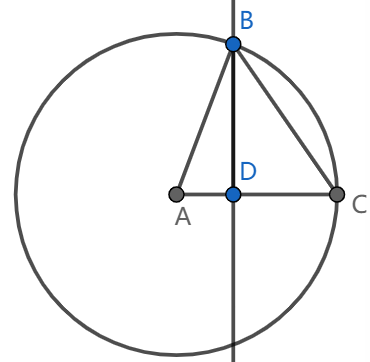
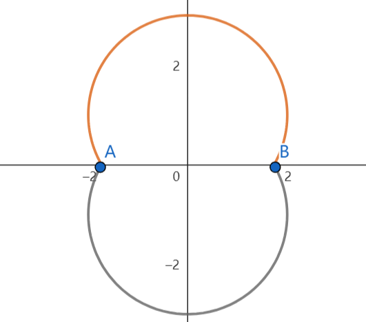

# 2023.4.28期

5. 复数列$\{a_n\}$中，$\frac{a_{n+1}}{a_n}=k$，$k$为关于$x$的方程$x^2-2i=0$的一个复数根且实部为非负数，$a_1=1$. 记$a_n$的实部与虚部分别为$Re_n$和$Im_n$.

   (1) 求$Re_n$、$Im_n$和$|a_n|$

   (2) $a_n$在复平面内对应向量为$\overrightarrow{OP_n}$，选择一问作答：

   (i) $\triangle OP_nP_{n+1}$的内切圆与外接圆半径分别为$b_n$、$d_n$，$\{b_n\}$、$\{d_n\}$的前$n$项和分别为$B_n$、$D_n$，求$\frac{B_n}{D_n}$

   (ii) 若$Q_1$与原点重合，$\overrightarrow{Q_nQ_{n+1}}=\overrightarrow{OP_n}$，求$|\overrightarrow{OQ_{4n+1}}|$（$n\in N^*$）

   > （1）解：不妨设$k=m+ni$，由题意
   >
   > $$
   > (m+ni)^2-2i=m^2+2mni-n^2-2i=0
   > $$
   > 所以
   > $$
   > \begin{cases}m^2-n^2=0\\2mn-2=0\end{cases}
   > $$
   > 解得
   > $$
   > m=n=\pm 1
   > $$
   > 因为$k$的实部非负，$m>0$，所以$k=1+i$
   >
   > 所以
   > $$
   > a_n=\frac{a_n}{a_{n-1}}\cdot\frac{a_{n-1}}{a_{n-2}}\cdot\dots\cdot\frac{a_2}{a_1}\cdot a_1=k^{n-1}=(1+i)^{n-1}
   > $$
   > 又因为$\arg{k}=\frac\pi4$，$|k|=\sqrt2$，所以
   > $$
   > a_n=(\sqrt2)^{n-1}\left[\cos{\left(\frac{n\pi}4-\frac\pi4\right)}+i\sin{\left(\frac{n\pi}4-\frac\pi4\right)}\right]
   > $$
   > 所以
   > $$
   > Re_n=(\sqrt2)^{n-1}\cos{\left(\frac{n\pi}4-\frac\pi4\right)}
   > $$
   >
   > $$
   > Im _n=(\sqrt2)^{n-1}\sin{\left(\frac{n\pi}4-\frac\pi4\right)}
   > $$
   >
   > $$
   > |a_n|=\sqrt{Re_n^2+Im_n^2}=(\sqrt2)^{n-1}
   > $$
   >
   > （2）解：（i）
   > $$
   > |OP_n|=|a_n|=(\sqrt2)^{n-1}
   > $$
   >
   > $$
   > |OP_{n+1}|=|a_n|=(\sqrt2)^{n}
   > $$
   >
   > $$
   > \begin{eqnarray}
   > 	|P_nP_{n+1}|&=&\left|\overrightarrow{OP_{n+1}}-\overrightarrow{OP_n}\right|=|a_{n+1}-a_n|\\
   > 	&=&(\sqrt2)^n\left|\cos{\frac{n\pi}4}+i\sin{\frac{n\pi}4}-\frac{\sqrt2}2\cos{\left(\frac{n\pi}4-\frac\pi4\right)}-\frac{\sqrt2}2i\sin{\left(\frac{n\pi}4-\frac\pi4\right)}\right|\\
   > 	&=&(\sqrt2)^n\left|\cos{\frac{n\pi}4}+i\sin{\frac{n\pi}4}-\frac12\left(\cos{\frac{n\pi}4}+\sin{\frac{n\pi}4}+i\sin{\frac{n\pi}4}-i\cos{\frac{n\pi}4}\right)\right|\\
   > 	&=&(\sqrt2)^{n-2}\left|\cos{\frac{n\pi}4}-\sin{\frac{n\pi}4}+i\left(\cos{\frac{n\pi}4}+\sin{\frac{n\pi}4}\right)\right|\\
   > 	&=&(\sqrt2)^{n-1}\left|\cos{\left(\frac{n\pi}4+\frac\pi4\right)}+i\sin{\left(\frac{n\pi}4+\frac\pi4\right)}\right|\\
   > 	&=&(\sqrt2)^{n-1}
   > \end{eqnarray}
   > $$
   > 注意到
   > $$
   > |OP_n|^2+|P_nP_{n+1}|^2=|OP_{n+1}|^2
   > $$
   > 所以
   > $$
   > \angle{OP_nP_{n+1}}=\frac\pi2
   > $$
   > 所以
   > $$
   > \tan{\angle{P_nOP_{n+1}}=\frac{|P_nP_{n+1}|}{|OP_n|}}=1
   > $$
   > 因为
   > $$
   > \angle{P_nOP_{n+1}}\in(0,\pi)
   > $$
   > 
   >
   > 所以
   > $$
   > \angle{P_nOP_{n+1}}=\frac\pi4
   > $$
   >
   > $$
   > \angle{P_nP_{n+1}O}=\frac\pi4
   > $$
   >
   > 由正弦定理
   > $$
   > \frac{|P_nP_{n+1}|}{\sin\angle{OP_nP_{n+1}}}={|P_nP_{n+1}|}=2d_n
   > $$
   > 所以
   > $$
   > d_n=(\sqrt2)^{n-3}
   > $$
   > 同时
   > $$
   > S_{\triangle{OP_nP_{n+1}}}=\frac12|P_nP_{n+1}||P_nO|=2^{n-2}=\frac12b_n(|OP_n|+|P_nP_{n+1}|+|OP_{n+1}|)=({\sqrt2+1})(\sqrt2)^{n-2}
   > $$
   > 所以$b_n=(\sqrt2-1)(\sqrt2)^{n-2}=(2-\sqrt2)d_n$
   >
   > 所以
   > $$
   > \frac{B_n}{D_n}=\frac{b_1+b_2+\dots+b_n}{d_1+d_2+\dots+d_n}=\frac{(2-\sqrt2)(d_1+d_2+\dots+d_n))}{d_1+d_2+\dots+d_n}=2-\sqrt2
   > $$
   > （ii）因为
   > $$
   > \overrightarrow{Q_nQ_{n+1}}=\overrightarrow{OP_n}=\overrightarrow{OQ_{n+1}}-\overrightarrow{OQ_n}
   > $$
   > 所以
   > $$
   > \overrightarrow{OQ_n}=OP_1+OP_2+\dots+OP_{n-1}
   > $$
   > 设 
   > $$
   > \begin{eqnarray}
   > R_n&=&Re_{4n+1}+Re_{4n+2}+Re_{4n+3}+Re_{4n+4}\\
   > &=&(\sqrt2)^{4n}\left[\cos{\left(n\pi\right)}+\sqrt2\cos{\left(n\pi+\frac{\pi}{4}\right)}+2\cos{\left(n\pi+\frac{\pi}{2}\right)}+2\sqrt2\cos{\left(n\pi+\frac{3\pi}{4}\right)}\right]\\
   > &=&(\sqrt2)^{4n}\left[\cos{\left(n\pi\right)}+\cos{\left(n\pi\right)}-\sin{\left(n\pi\right)}-2\sin{\left(n\pi\right)}-2\cos{\left(n\pi\right)}+2\sin{\left(n\pi\right)}\right]\\
   > &=&-4^n\sin{(n\pi)}
   > \end{eqnarray}
   > $$
   >
   > $$
   > \begin{eqnarray}
   > I_n&=&Im_{4n+1}+Im_{4n+2}+Im_{4n+3}+Im_{4n+4}\\
   > &=&(\sqrt2)^{4n}\left[\sin{\left(n\pi\right)}+\sqrt2\sin{\left(n\pi+\frac{\pi}{4}\right)}+2\sin{\left(n\pi+\frac{\pi}{2}\right)}+2\sqrt2\sin{\left(n\pi+\frac{3\pi}{4}\right)}\right]\\
   > &=&(\sqrt2)^{4n}\left[\sin{\left(n\pi\right)}+\sin{\left(n\pi\right)}+\cos{\left(n\pi\right)}+2\cos{\left(n\pi\right)}-2\sin{\left(n\pi\right)}+2\cos{\left(n\pi\right)}\right]\\
   > &=&5\cdot4^n\cos{\left(n\pi\right)}
   > \end{eqnarray}
   > $$
   >
   > 则
   > $$
   > \overrightarrow{OQ_{4n+1}}=\sum_{i=1}^{4n}OP_i=\left(\sum_{i=1}^{4n}Re_i,\sum_{i=1}^{4n}Im_i\right)=\left(\sum_{i=0}^{n-1}R_n,\sum_{i=0}^{n-1}I_i\right)
   > $$
   > 因为
   > $$
   > R_0=0\\
   > R_{n+1}=-4^{n+1}\sin(n\pi+\pi)=4R_n
   > $$
   > 所以$\forall n\in N$，$R_n=0$
   >
   > 类似地
   > $$
   > I_0=5\\
   > I_{n+1}=20\cdot4^n\cos{n\pi+\pi}=-4I_n
   > $$
   > 所以$\forall n\in N$，$I_n=5\cdot(-4)^n$
   >
   > 所以
   > $$
   > \overrightarrow{OQ_{4n+1}}=\left(0,5\sum_{i=0}^{n-1}(-4)^n\right)=\left(0,1-(-4)^n\right)
   > $$
   > 所以
   > $$
   > \overrightarrow{OQ_{4n+1}}=\left|1-(-4)^n\right|
   > $$

6. 现研究英语七选五的简化情形五选三. 某考生从5个备选项中选取n项随机填入3个给定空格，所选选项全部用到，所有空格均没有留空. 各题目只有一个正确答案且不重复，每题2.5分，记该考生得分为$X_n$.

   (1)求n的可能取值及$E(X_3)$

   (2)从期望的角度，判断n为何值时考生得分更多

   > （1）解：n的可能取值有1、2、3；X_3的可能取值有0、2.5、5、7.5
   > $$
   > P(X_3=0)=\frac{C_2^0C_3^3C_2^1+C_2^1C_3^2(1+C_2^1)+C_2^2C_3^1C_2^1A_2^2}{A_5^3}=\frac{32}{60}=\frac{8}{15}
   > $$
   >
   > $$
   > P(X_3=2.5)=\frac{C_2^0C_3^3C_3^1+C_2^1C_3^2C_2^1+C_2^2C_3^1A_2^2}{A_5^3}=\frac{21}{60}=\frac{7}{20}
   > $$
   >
   > $$
   > P(X_3=5)=\frac{C_2^0C_3^3\cdot0+C_2^1C_3^2}{A_5^3}=\frac{6}{60}=\frac1{10}
   > $$
   >
   > $$
   > P(X_3=7.5)=\frac{C_2^0C_3^3}{A_5^3}=\frac{1}{60}
   > $$
   >
   > 进而
   > $$
   > E(X_3)=0\cdot\frac{8}{15}+2.5\cdot\frac{7}{20}+5\cdot\frac{1}{10}+7.5\cdot\frac{1}{60}=\frac32
   > $$
   > （2）解：$X_1$的可能取值有0、2.5
   >
   > $$
   > P(X_1=0)=\frac{C_3^0C_2^1}{C_5^1}=\frac25
   > $$
   >
   > $$
   > P(X_1=2.5)=\frac{C_3^1C_2^0}{C_5^1}=\frac35
   > $$
   >
   > 所以
   > $$
   > E(X_1)=0\cdot\frac25+2.5\cdot\frac35=\frac32
   > $$
   > $X_2$的可能取值有0、2.5、5
   > $$
   > P(X_2=0)=\frac{C_2^0C_3^2C_2^1+C_2^1C_3^1(1+A_2^2)+C_2^2C_3^0(2^3-C_2^2\cdot1^2)}{C_5^2(2^3-C_2^2\cdot1^2)}=\frac{30}{60}=\frac12
   > $$
   >
   > $$
   > P(X_2=2.5)=\frac{C_2^0C_3^2C_2^1+C_2^1C_3^1(1+A_2^2)}{C_5^2(2^3-C_2^2\cdot1^2)}=\frac{24}{60}=\frac25
   > $$
   >
   > $$
   > P(X_2=5)=\frac{C_2^0C_3^2C_2^1}{C_5^2(2^3-C_2^2\cdot1^2)}=\frac{6}{60}=\frac{1}{10}
   > $$
   >
   > 所以
   > $$
   > E(X_2)=0\cdot\frac12+2.5\cdot\frac25+5\cdot\frac{1}{10}=\frac32
   > $$
   > 综上$E(X_1)=E(X_2)=E(X_3)=\frac32$，无论n取1，2，3中何值，$E(X_n)$均为最大值$\frac32$

7. $x\in (0,\frac{\pi}{2})$，求证：$1+(\frac{1}{\sin x}-\frac{1}{\tan x})^2<\frac{x^2}{\sin^2 x}<\frac{\pi^2}{4}$

   方法一：

   > 证明：先证左半部分
   >
   > 要证
   > $$
   > 1+\left(\frac{1}{\sin x}-\frac{1}{\tan x}\right)^2<\frac{x^2}{\sin^2 x}
   > $$
   > 即证
   > $$
   > \sin^2{x}\left[1+\left(\frac{1}{\sin x}-\frac{1}{\tan x}\right)^2\right]=\sin^2{x}+(1-\cos{x})^2
   > $$
   > 考虑到$x>0$且上述不等式两端均非负，亦即证
   > $$
   > \sqrt{\sin^2{x}+(1-\cos{x})^2}
   > $$
   > 构造如下图形
   >
   > 
   >
   > 其中圆A的半径$AC=1$，点B在圆A上，$BD\bot AC$，$\angle{BAC}=x$，则$AD=\cos{x}$，$BD=\sin{x}$，$BC=\sqrt{DB^2+DC^2}=\sqrt{\sin^2{x}+(1-\cos{x})^2}$，劣弧$\overset\frown{BC}=x$
   >
   > 考虑到BC之间，线段BC最短，故
   > $$
   > \sqrt{\sin^2{x}+(1-\cos{x})^2}<x
   > $$
   > 再证右半部分
   >
   > 要证
   > $$
   > \frac{x^2}{\sin^2 x}<\frac{\pi^2}{4}
   > $$
   > 即证
   > $$
   > x^2<\frac{\pi^2}{4}{\sin^2{x}}
   > $$
   > 即证
   > $$
   > x<\frac{\pi}{2}\sin{x}
   > $$
   > 设
   > $$
   > f(x)=x-\frac{\pi}2\sin{x}
   > $$
   >
   > $$
   > f'(x)=1-\frac{\pi}2\cos{x}
   > $$
   >
   > $$
   > f''(x)=\frac{\pi}{2}\sin{x}
   > $$
   >
   > $(0,\frac{\pi}{2})$上，$f''(x)>0$，$f'(x)$单调递增，而
   > $$
   > f'(0)=1-\frac\pi2<0
   > $$
   >
   > $$
   > f'(\frac\pi2)=1>0
   > $$
   >
   > 故存在$x_0\in(0,\frac\pi2)$，使得$f'(x_0)=0$，且：
   >
   > $0<x\le x_0$，$f'(x)<0$，$f(x)$单调递减,，$f(x)<f(0)=0$
   >
   > $x_0\le x<\frac\pi2$，$f'(x)>0$，$f(x)$单调递增，$f(x)<f(\frac\pi2)=0$
   >
   > 所以，$(0,\frac\pi2)$上$f(x)<0$，$x<\frac\pi2\sin{x}$
   >
   > 综上，原不等式得证

   方法二：

   > 证明：先证左半部分
   >
   > 要证
   > $$
   > 1+\left(\frac{1}{\sin x}-\frac{1}{\tan x}\right)^2<\frac{x^2}{\sin^2 x}
   > $$
   > 即证
   > $$
   > \begin{eqnarray}
   > \sin^2{x}\left[1+\left(\frac{1}{\sin x}-\frac{1}{\tan x}\right)^2\right]=\sin^2{x}+(1-\cos{x})^2=\sin^2{x}+\cos^2{x}+1-2\cos{x}=2-2\cos{x}
   > \end{eqnarray}
   > $$
   > 即证
   > $$
   > \cos{x}>1-\frac{x^2}2
   > $$
   > 设
   > $$
   > g(x)=\cos{x}-1+\frac{x^2}{2}
   > $$
   >
   > $$
   > g'(x)=-\sin{x}+x
   > $$
   >
   > $$
   > g''(x)=1-\cos{x}
   > $$
   >
   > $(0,\frac\pi2)$上，$g''(x)>0$，$g'(x)$单调递增，$g'(x)>g'(0)=0$，$g(x)$单调递增，$g(x)>g(0)=0$
   >
   > 故
   > $$
   > \cos{x}>1-\frac{x^2}2
   > $$
   > 右半部分的证明同方法一。
   >
   > 综上，原不等式得证。

8. （多选）$A(-\sqrt{3}, 0)$，A、B关于原点对称，平面xOy内有一动点P满足$\angle APB=\frac{\pi}{3}$，记P的轨迹为C，下列说法正确的有

   A. C为一个封闭图形

   B. |AP|+|BP|的最大值为$4\sqrt{3}$

   C. P到直线$\sqrt{3}x-y-7=0$的最短距离为2

   D. $\vec{OP}\cdot\vec{AP}$的取值范围为$(0, 5+2\sqrt{7}]$

   方法一：

   > 解：设P$(x,y)$，由题意有
   > $$
   > |PA|=\sqrt{(x+\sqrt3)^2+y^2}
   > $$
   >
   > $$
   > |PB|=\sqrt{(x-\sqrt3)^2+y^2}
   > $$
   >
   > $$
   > |AB|=2\sqrt3
   > $$
   >
   > 由余弦定理
   > $$
   > |PA|^2+|PB|^2-2|PA||PB|\cos\angle{APB}=|AB|^2
   > $$
   > 即
   > $$
   > (x+\sqrt3)^2+(x-\sqrt3)^2+2y^2-\sqrt{(x+\sqrt3)^2+y^2}\sqrt{(x-\sqrt3)^2+y^2}=12
   > $$
   > 即
   > $$
   > 2x^2+2y^2-6=\sqrt{x^2+y^2+3+2\sqrt3x}\sqrt{x^2+y^2+3-2\sqrt3x}
   > $$
   > 即
   > $$
   > (2x^2+2y^3-6)^2=(x^2+y^2+3+2\sqrt3x)(x^2+y^2+3-2\sqrt3x)
   > $$
   > 即
   > $$
   > (2x^2+2y^3-6)^2=(x^2+y^2+3)^2-12x^2
   > $$
   > 即
   > $$
   > \begin{eqnarray}
   > 	4(x^2+y^3-3)^2&=&(x^2+y^2+3)^2-12x^2\\
   > 	&=&x^4+y^4+9+6x^2+6y^2+2x^2y^2-12x^2\\
   > 	&=&x^4+y^4+9-6x^2-6y^2+2x^2y^2+12y^2\\
   > 	&=&(x^2+y^2+3)^2+12y^2
   > \end{eqnarray}
   > $$
   > 即
   > $$
   > (x^2+y^2-3)^2=4y^2
   > $$
   > 1）若$x^2+y^2-3<0$，P在以O为圆心，半径为$\sqrt3$的圆内，且AB为该圆的直径，此时$\angle APB$为钝角，大小不为$\frac\pi3$
   >
   > 2）若$x^2+y^2-3\ge0$
   >
   > i. 若$y>0$，上述方程可化为
   > $$
   > x^2+y^2-3=2y
   > $$
   > 即
   > $$
   > x^2+(y-1)^2=4
   > $$
   > 故P的轨迹在x轴上方的部分为以(0, 1)为圆心，半径为2的圆在x轴上方的部分
   >
   > ii. 若$y<0$，上述方程可化为
   > $$
   > x^2+(y+1)^2=4
   > $$
   > 故P的轨迹在x轴下方的部分为以(0, -1)为圆心，半径为2的圆在x轴下方的部分
   >
   > iii. 若$y=0$，在原方程$(x^2+y^2-3)^2=4y^2$中解得$x=\pm\sqrt3$，此时P与A或B重合，不合题意
   >
   > 故P的轨迹如下图所示
   >
   > 
   >
   > 因为曲线C在A、B两处有缺口，C不为封闭图形，A错误。
   >
   > 设$|AQ|+|BQ|=2d$，则$2d>2\sqrt3$时，$Q$的轨迹为椭圆$E:\frac{x^2}{d^2}+\frac{y^2}{d^2-3}=1$。设$N(0,3)$，则$N$为曲线$C$上离远点最远的点。当$2d>4\sqrt3$时，$E$上到原点最近的点为$(0,\pm\sqrt{d^2-3})$，到原点的距离为$\sqrt{d^2-3}>\sqrt{12-3}=3$，大于$C$上的点到原点距离的最大值，故$C$，$E$无交点，$d$取这些值时，$Q$点不能落到$C$上，所以$|AP|+|BP|\le4\sqrt3$。当$P$、$N$重合时，$|AP|+|BP|=4\sqrt3$，故$|AP|+|BP|$的最大值为$4\sqrt3$。B正确。
   >
   > 对于$C$的上半部分$x^2+(y-1)^2=4$，可求得圆心(0,1)到直线$\sqrt3x-y-7=0$的距离为$\frac{|-1-7|}{2}=4$，进而$P$到该直线的距离为$4-2=2$。过圆心(0,1)做直线$\sqrt3x-y-7=0$的垂线，交圆$x^2+(y-1)^2=4$于B，交点不在$C$上，故舍去此情形。
   >
   > 对于$C$的下半部分$x^2+(y+1)^2=4$，可求得圆心(0,-1)到直线$\sqrt3x-y-7=0$的距离为$\frac{|1-7|}{2}=3$，进而$P$到此直线的距离为$3-2=1$。过圆心(0,-1)做直线$\sqrt3x-y-7=0$的垂线，交圆$x^2+(y+1)^2=4$于点$M$，由交点的纵坐标符号易验证交点$M\in C$。
   >
   > 综上，$P$到直线$\sqrt3y-x-7=0$的距离的最小值为1。C错误。
   >
   > 取OA的中点K，有$\overrightarrow{OP}\cdot\overrightarrow{AP}=\frac14[(\overrightarrow{OP}+\overrightarrow{AP})^2-(\overrightarrow{OP}-\overrightarrow{AP})^2]=|KP|^2-|OK|^2=|KP|^2-\frac34$。对于$C$的上半部分$x^2+(y-1)^2=4$，可求得K到圆心(0,1)的距离为$\frac{\sqrt{7}}{2}$，圆上的点到K的距离的最大值为$\frac{\sqrt7}{2}+2$，最小值为$2-\frac{\sqrt7}{2}$，经验证分别在P位于$x$轴上、下方时取到，所以此处舍去最小值。进而，P在C的上半部分运动时，$\overrightarrow{OP}\cdot\overrightarrow{AP}$的最大值为$5+2\sqrt7$。同时，可以注意到，$|KP|$的下限可以在P位于A点附近时取到，但是$P$不能与$A$重合，且若$P$、$A$重合$\overrightarrow{OP}\cdot\overrightarrow{AP}=0$，故$\overrightarrow{OP}\cdot\overrightarrow{AP}\in (0,5+2\sqrt7]$。有对称性，$P$在$C$的下半部分运动时亦有同样的结论，D正确。
   >
   > 故选BD。

   方法二

   > 取点C(0,1)、D(0,-1)，因为$\angle{ACB}=\angle{ADB}=\frac{2\pi}{3}=2\angle{APB}$，由圆周角定理逆定理可确定$P$的轨迹为两段圆弧。余下部分同理。

9. （多选）在计算机中，实数通常以浮点数的形式近似储存，一套浮点数定义下能被准确表示的数字的集合为一个浮点数集，记为F(E, S)，其中E、S为参数，且满足$E\ge2$且$E\in N^*$、$S\in N^*$，而且有

   $$F(E,S)=\{0\}\cup(\bigcup^{2^{E-1}}_{i=-2^{E-1}+2}\{f|f=m\cdot2^{i-S},|m|\lt2^S,m\in Z\})$$

   其中$\bigcup_{i=m}^{n}A_i=A_m\cup A_{m+1}\cup A_{m+2}\cup\cdots\cup A_n$.

   对于任意实数r，可按照以下步骤得出其在浮点数集F(E, S)中的对应值R

   1. 若F(E, S)中元素均大于或小于r，分别记R为$-\infin$和$+\infin$
   2. 否则，如果F(E, S)中存在唯一值$R_0$使得$|R_0-r|$最小，$R=R_0$
   3. F(E, S)中若存在多个$R_0$使得$|R_0-r|$最小，R为其中绝对值最小的一个

   国际上规定，单、双精度浮点数集分别为F(8, 23)和F(11, 52).

   按照题目信息，下列说法正确的有（参考数据：$\lg5\approx 0.698970$）：

   A. 单精度浮点数集为双精度浮点数集的真子集

   B. $\forall n\in N^*$，$3^{-n}\notin F(E,S)$

   C. 已知$f_{n+1}(x)=f_1(f_n(X))$，$f_1(x)=R(x+1)$，R(x)为x在单精度浮点数集中对应的值，则$n\to+\infin$时，$f_n(0)$有最大值$2^{23}$

   D. 十进制表示下，单精度浮点数集中绝对值最小的非零元素的绝对值的小数部分的第一个和最后一个非零数位间（含两端）共有104位数字
   
   > A. 设集合$S_i=\{f|f=m\cdot2^{i-23},|m|<2^{23},m\in Z\}$，$D_i=\{f|f=m\cdot2^{i-52},|m|<2^{52},m\in Z\}$，这样$D_{i+29}=\{f|f=m\cdot2^{i-23},|m|<2^{52},m\in Z\}$，不难得出，$D_{i+29}\supsetneq S_i$。同时，$F(8,23)=\{0\}\cup(\bigcup_{i=-126}^{127}S_i)$，$F(11,52)=\{0\}\cup(\bigcup_{i=-1022}^{1023}D_i)=\{0\}\cup(\bigcup_{i=-1051}^{994}D_{i+29})\subsetneq\{0\}\cup(\bigcup_{i=-126}^{127}D_{i+29})\subsetneq\{0\}\cup(\bigcup_{i=-126}^{127}S_i)=F(8,23)$，所以单精度浮点数集为双精度浮点数集的真子集，A正确。
   >
   > B. 假设$\exist n\in N^*$，$3^{-n}\notin F(E,S)$，则$\exist m\in Z,k\in Z$，$3^{-n}=m\cdot2^k$，即$m=\frac{2^{-k}}{3^n}\in Z$。若$k\ge-n$，$0<\frac{2^{-k}}{3^n}\le\left(\frac23\right)^n<1$，此时$\frac{2^{-k}}{3^n}\in N$显然不成立，假设亦不成立。若$k<-n<0$，则$2^{-k}$应可以被$3^n$整除，继而应可以被3整除，但是，因为2的质因子当中只包含2，不包含3，而这一质因子分解是唯一的。故$2^{-k}$不可能能被3整除，出现矛盾，原假设不成立，进而B正确。
   >
   > C. 在$r<2^{23}$且$r\in N$时，则存在整数使得$r\in\{f|f=m,|m|<2^{23},m\in Z\}=S_{23}\subsetneq F(8,23)$，即$r\in F(8,23)$，所以$R(r)=r$。同时，$2^{23}\in\{f|f=m\cdot2,|m|<2^{23},m\in Z\}=S_{24}\subsetneq F(8,23)$，$R(2^{23})=2^{23}$。进而$f_n(0)\le2^{23}-1$且$f_n(0)\in N$时，$f_{n+1}(0)=f_1(f_n(0))=R(f_n(0)+1)=f_n(0)+1$，不难得出，$f_n(0)\le2^{23}$时，$\{f_n(0)\}$为公差为1的等差数列。考虑到$f_1(0)=R(0)+1=1$，所以$n\le2^{23}$时，$f_n(0)=n$。容易得到，$\max{S_i}=(2^{23}-1)\cdot 2^{i-23}=2^i-2^{i-23}$，进而，当$i\le23$时，$\max{S_i}=(2^{23}-1)\cdot 2^{i-23}\le2^{23}-1$，所以$i\le23$，$2^{23}+1\notin S_i$。$i\ge24$时，$S_i=\{f|f=2\cdot 2^{i-24}m,|m|<2^{23},m\in Z\}$，这时，$S_i$中全为偶数，$2^{23}+1\notin S_i$。所以$2^{23}+1\notin F(8,23)$。类似地，对于所有$2^{23}<r_1<2^{23}+2$，均有$r_1\notin F(8,23)$。同时不难验证$2^{23}+2\in F(8,23)$，这样，通过题干中的舍入规则，$R(2^{23}+1)=2^{23}$。所以$f_n(0)=2^{23}$时，$f_{n+1}(0)=R(2^{23}+1)=2^{23}=f_n(0)$。又$f_{2^{23}}(0)=2^{23}$，所以$n\ge2^{23}$，$f_n(0)=2^{23}$。综上可得$f_n(0)=\cases{n,n\le 2^{23}\\2^{23},n>2^{23}}$，所以，$f_n(0)$的最大值为$2^{23}$，C正确。
   >
   > D. 不难得出，$S_i$中绝对值最小的元素的绝对值$a=1\cdot2^{i-23}$，当保证$S_i\subseteq F(8,23)$的前提下$i$取最小值$-126$时，$a$取到$F(8,23)$中绝对值最小的非零元素的绝对值$a_m=2^{-149}$。$\lg{a_m}=-149\lg2=-149(\lg{10}-\lg5)\approx-149\cdot0.301030=-44.85347$，$a_m\approx10^{-44.85347}=10^{0.14653}\cdot10^{45}$。这样，$a_m$的小数部分当中第一个非零数字位于第$45$位。假设一个小数以5结尾，可被记作$f=0.d_1d_2d_3\dots d_{n-1}5=5\cdot 10^{-n}+\sum_{i=1}^{n-1}d_i\cdot10^{-i}$，则$\frac f2=\frac{5\cdot 10^{-n}+\sum_{i=1}^{n-1}d_i\cdot10^{-i}}{2}=2\cdot10^{-n}+5\cdot10^{n+1}+\sum_{i=1}^{n-1}\frac{d_i}{2}\cdot 10^{-i}=2\cdot10^{-n}+5\cdot10^{n+1}+\sum_{i=2}^{n}5d_i\cdot 10^{-i}=0.e_1e_2\dots e_n5$，即以5结尾的小数乘以$\frac12$后会多出一位，最后一位还是5。考虑到$2^{-1}=0.5$以5作结，有1位小数，不难得出，$2^{-n}$有$n$位小数。所以，$a_m=2^{-149}$的小数部分共有149位，所以，$a_m$小数部分的第一个和最后一个非零数位间共有$149-45+1=105$位数字，D错误。
   >
   > 故选ABC。