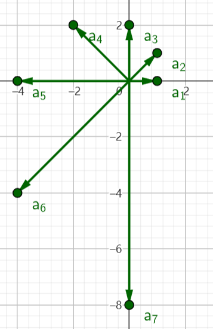
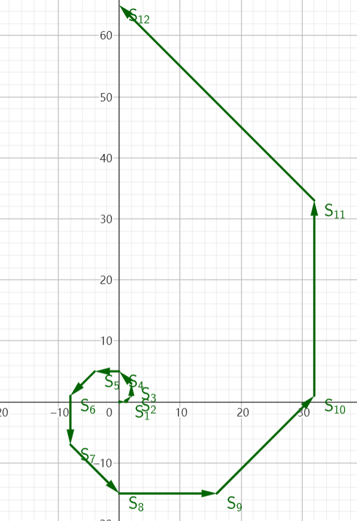
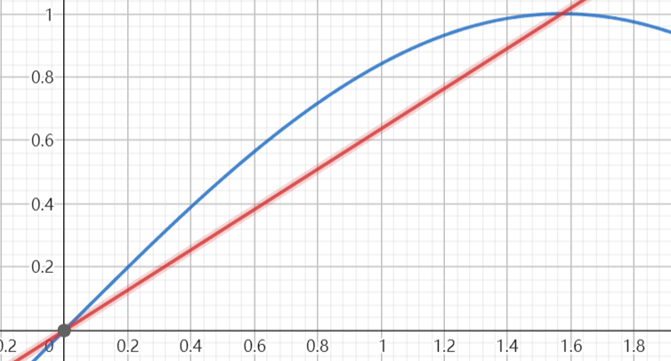

# 2023.4.28期

## 第5题

5. 复数列$\{a_n\}$中，$\frac{a_{n+1}}{a_n}=k$，$k$为关于$x$的方程$x^2-2i=0$的一个复数根且实部为非负数，$a_1=1$. 记$a_n$的实部与虚部分别为$Re_n$和$Im_n$.

   (1) 求$Re_n$、$Im_n$和$|a_n|$

   (2) $a_n$在复平面内对应向量为$\overrightarrow{OP_n}$，选择一问作答：

   (i) $\triangle OP_nP_{n+1}$的内切圆与外接圆半径分别为$b_n$、$d_n$，$\{b_n\}$、$\{d_n\}$的前$n$项和分别为$B_n$、$D_n$，求$\frac{B_n}{D_n}$

   (ii) 若$Q_1$与原点重合，$\overrightarrow{Q_nQ_{n+1}}=\overrightarrow{OP_n}$，求$|\overrightarrow{OQ_{4n+1}}|$（$n\in N^*$）

   ### 参考答案

   > （1）解：不妨设$k=m+ni$，由题意
   >
   > $$
   > (m+ni)^2-2i=m^2+2mni-n^2-2i=0
   > $$
   > 所以
   > $$
   > \begin{cases}m^2-n^2=0\\2mn-2=0\end{cases}
   > $$
   > 解得
   > $$
   > m=n=\pm 1
   > $$
   > 因为$k$的实部非负，$m>0$，所以$k=1+i$
   >
   > 所以
   > $$
   > a_n=\frac{a_n}{a_{n-1}}\cdot\frac{a_{n-1}}{a_{n-2}}\cdot\dots\cdot\frac{a_2}{a_1}\cdot a_1=k^{n-1}=(1+i)^{n-1}
   > $$
   > 又因为$\arg{k}=\frac\pi4$，$|k|=\sqrt2$，所以
   > $$
   > a_n=(\sqrt2)^{n-1}\left[\cos{\left(\frac{n\pi}4-\frac\pi4\right)}+i\sin{\left(\frac{n\pi}4-\frac\pi4\right)}\right]
   > $$
   > 所以
   > $$
   > Re_n=(\sqrt2)^{n-1}\cos{\left(\frac{n\pi}4-\frac\pi4\right)}
   > $$
   >
   > $$
   > Im _n=(\sqrt2)^{n-1}\sin{\left(\frac{n\pi}4-\frac\pi4\right)}
   > $$
   >
   > $$
   > |a_n|=\sqrt{Re_n^2+Im_n^2}=(\sqrt2)^{n-1}
   > $$
   >
   > （2）解：（i）
   > $$
   > |OP_n|=|a_n|=(\sqrt2)^{n-1}
   > $$
   >
   > $$
   > |OP_{n+1}|=|a_n|=(\sqrt2)^{n}
   > $$
   >
   > $$
   > \begin{eqnarray}
   > 	|P_nP_{n+1}|&=&\left|\overrightarrow{OP_{n+1}}-\overrightarrow{OP_n}\right|=|a_{n+1}-a_n|\\
   > 	&=&(\sqrt2)^n\left|\cos{\frac{n\pi}4}+i\sin{\frac{n\pi}4}-\frac{\sqrt2}2\cos{\left(\frac{n\pi}4-\frac\pi4\right)}-\frac{\sqrt2}2i\sin{\left(\frac{n\pi}4-\frac\pi4\right)}\right|\\
   > 	&=&(\sqrt2)^n\left|\cos{\frac{n\pi}4}+i\sin{\frac{n\pi}4}-\frac12\left(\cos{\frac{n\pi}4}+\sin{\frac{n\pi}4}+i\sin{\frac{n\pi}4}-i\cos{\frac{n\pi}4}\right)\right|\\
   > 	&=&(\sqrt2)^{n-2}\left|\cos{\frac{n\pi}4}-\sin{\frac{n\pi}4}+i\left(\cos{\frac{n\pi}4}+\sin{\frac{n\pi}4}\right)\right|\\
   > 	&=&(\sqrt2)^{n-1}\left|\cos{\left(\frac{n\pi}4+\frac\pi4\right)}+i\sin{\left(\frac{n\pi}4+\frac\pi4\right)}\right|\\
   > 	&=&(\sqrt2)^{n-1}
   > \end{eqnarray}
   > $$
   > 注意到
   > $$
   > |OP_n|^2+|P_nP_{n+1}|^2=|OP_{n+1}|^2
   > $$
   > 所以
   > $$
   > \angle{OP_nP_{n+1}}=\frac\pi2
   > $$
   > 所以
   > $$
   > \tan{\angle{P_nOP_{n+1}}=\frac{|P_nP_{n+1}|}{|OP_n|}}=1
   > $$
   > 因为
   > $$
   > \angle{P_nOP_{n+1}}\in(0,\pi)
   > $$
   > 
   >
   > 所以
   > $$
   > \angle{P_nOP_{n+1}}=\frac\pi4
   > $$
   >
   > $$
   > \angle{P_nP_{n+1}O}=\frac\pi4
   > $$
   >
   > 由正弦定理
   > $$
   > \frac{|P_nP_{n+1}|}{\sin\angle{OP_nP_{n+1}}}={|P_nP_{n+1}|}=2d_n
   > $$
   > 所以
   > $$
   > d_n=(\sqrt2)^{n-3}
   > $$
   > 同时
   > $$
   > S_{\triangle{OP_nP_{n+1}}}=\frac12|P_nP_{n+1}||P_nO|=2^{n-2}=\frac12b_n(|OP_n|+|P_nP_{n+1}|+|OP_{n+1}|)=({\sqrt2+1})(\sqrt2)^{n-2}
   > $$
   > 所以$b_n=(\sqrt2-1)(\sqrt2)^{n-2}=(2-\sqrt2)d_n$
   >
   > 所以
   > $$
   > \frac{B_n}{D_n}=\frac{b_1+b_2+\dots+b_n}{d_1+d_2+\dots+d_n}=\frac{(2-\sqrt2)(d_1+d_2+\dots+d_n))}{d_1+d_2+\dots+d_n}=2-\sqrt2
   > $$
   > （ii）因为
   > $$
   > \overrightarrow{Q_nQ_{n+1}}=\overrightarrow{OP_n}=\overrightarrow{OQ_{n+1}}-\overrightarrow{OQ_n}
   > $$
   > 所以
   > $$
   > \overrightarrow{OQ_n}=OP_1+OP_2+\dots+OP_{n-1}
   > $$
   > 设 
   > $$
   > \begin{eqnarray}
   > R_n&=&Re_{4n+1}+Re_{4n+2}+Re_{4n+3}+Re_{4n+4}\\
   > &=&(\sqrt2)^{4n}\left[\cos{\left(n\pi\right)}+\sqrt2\cos{\left(n\pi+\frac{\pi}{4}\right)}+2\cos{\left(n\pi+\frac{\pi}{2}\right)}+2\sqrt2\cos{\left(n\pi+\frac{3\pi}{4}\right)}\right]\\
   > &=&(\sqrt2)^{4n}\left[\cos{\left(n\pi\right)}+\cos{\left(n\pi\right)}-\sin{\left(n\pi\right)}-2\sin{\left(n\pi\right)}-2\cos{\left(n\pi\right)}+2\sin{\left(n\pi\right)}\right]\\
   > &=&-4^n\sin{(n\pi)}
   > \end{eqnarray}
   > $$
   >
   > $$
   > \begin{eqnarray}
   > I_n&=&Im_{4n+1}+Im_{4n+2}+Im_{4n+3}+Im_{4n+4}\\
   > &=&(\sqrt2)^{4n}\left[\sin{\left(n\pi\right)}+\sqrt2\sin{\left(n\pi+\frac{\pi}{4}\right)}+2\sin{\left(n\pi+\frac{\pi}{2}\right)}+2\sqrt2\sin{\left(n\pi+\frac{3\pi}{4}\right)}\right]\\
   > &=&(\sqrt2)^{4n}\left[\sin{\left(n\pi\right)}+\sin{\left(n\pi\right)}+\cos{\left(n\pi\right)}+2\cos{\left(n\pi\right)}-2\sin{\left(n\pi\right)}+2\cos{\left(n\pi\right)}\right]\\
   > &=&5\cdot4^n\cos{\left(n\pi\right)}
   > \end{eqnarray}
   > $$
   >
   > 则
   > $$
   > \overrightarrow{OQ_{4n+1}}=\sum_{i=1}^{4n}OP_i=\left(\sum_{i=1}^{4n}Re_i,\sum_{i=1}^{4n}Im_i\right)=\left(\sum_{i=0}^{n-1}R_n,\sum_{i=0}^{n-1}I_i\right)
   > $$
   > 因为
   > $$
   > R_0=0\\
   > R_{n+1}=-4^{n+1}\sin(n\pi+\pi)=4R_n
   > $$
   > 所以$\forall n\in N$，$R_n=0$
   >
   > 类似地
   > $$
   > I_0=5\\
   > I_{n+1}=20\cdot4^n\cos{n\pi+\pi}=-4I_n
   > $$
   > 所以$\forall n\in N$，$I_n=5\cdot(-4)^n$
   >
   > 所以
   > $$
   > \overrightarrow{OQ_{4n+1}}=\left(0,5\sum_{i=0}^{n-1}(-4)^n\right)=\left(0,1-(-4)^n\right)
   > $$
   > 所以
   > $$
   > \overrightarrow{OQ_{4n+1}}=\left|1-(-4)^n\right|
   > $$

   ### 解析

   > 看了答案就会发现，其实这里没有什么可以解析的qwq。

   ### 命题思路与背景

   > 多年以来，复数在高中教学中都是一个被高度边缘化的模块，我们对复数的掌握多也停留在其基本定义与四则运算上，对于它的实际应用甚至只是它的向三角形式则知之甚少。所以笔者试着以复数为一个核心知识点，命制一道综合性的大题。
   >
   > 也记不清当时是如何考虑的了，自己是选择了以复数的三角形式展开命题。因为复数的三角形式下有著名的棣莫弗公式：
   > $$
   > (\cos x+i\sin x)^n=\cos(nx)+i\sin(nx)
   > $$
   > 其中出现了$(\cos x+i\sin x)^n$这一指数项，所以，这里又考虑与等比数列进行结合。等比数列必有公比，但这里的公比显然不适合直接给出，故我们又加上一个对复数的四则运算和基本概念的考察
   >
   > > 公比$k$为关于$x$的方程$x^2-2i=0$的一个复数根且实部为非负数
   >
   > 因为这里的数列是复数列，相对于实数列的通项求解，这里基于复数的三角定义给出了复数列实部、虚部与模的通项的求解这一问题，也就是第一问。
   >
   > 然后，因为复数有明显的几何意义，所以，我们又给出了关于其几何性质的考察。这里考虑了复数列各项对应的向量共起点放置与首尾相接放置两种情况。分别绘制前7项和前12项的图像如下：
   >
   > 
   >
   > 
   >
   > 我们注意到两点：
   >
   > - 共起点放置时，相邻复数列中两项对应的向量均构成等腰直角三角形的邻边；
   > - 首尾相接时，相邻序数为4的倍数的向量的终点在$y$轴上。
   >
   > 根据这两点，我们分别命制了第二问的两小问。因为这些问题的运算量均较大，故此处给出仅选做一题即可的要求。

   ### 简析

   > 本题主要综合了复数、数列以及向量与解三角形三个模块的知识，尽管情景略显冷门，但在学有余力的前提下也值得一做。19～21题难度（22题卷面）。

## 第6题

6. 现研究英语七选五的简化情形五选三. 某考生从5个备选项中选取n项随机填入3个给定空格，所选选项全部用到，所有空格均没有留空. 各题目只有一个正确答案且不重复，每题2.5分，记该考生得分为$X_n$.

   (1)求n的可能取值及$E(X_3)$

   (2)从期望的角度，判断n为何值时考生得分更多

   ### 参考答案

   > （1）解：$n$的可能取值有1、2、3；$X_3$的可能取值有0、2.5、5、7.5
   > $$
   > P(X_3=0)=\frac{C_2^0C_3^3C_2^1+C_2^1C_3^2(1+C_2^1)+C_2^2C_3^1C_2^1A_2^2}{A_5^3}=\frac{32}{60}=\frac{8}{15}
   > $$
   >
   > $$
   > P(X_3=2.5)=\frac{C_2^0C_3^3C_3^1+C_2^1C_3^2C_2^1+C_2^2C_3^1A_2^2}{A_5^3}=\frac{21}{60}=\frac{7}{20}
   > $$
   >
   > $$
   > P(X_3=5)=\frac{C_2^0C_3^3\cdot0+C_2^1C_3^2}{A_5^3}=\frac{6}{60}=\frac1{10}
   > $$
   >
   > $$
   > P(X_3=7.5)=\frac{C_2^0C_3^3}{A_5^3}=\frac{1}{60}
   > $$
   >
   > 进而
   > $$
   > E(X_3)=0\cdot\frac{8}{15}+2.5\cdot\frac{7}{20}+5\cdot\frac{1}{10}+7.5\cdot\frac{1}{60}=\frac32
   > $$
   > （2）解：$X_1$的可能取值有0、2.5
   >
   > $$
   > P(X_1=0)=\frac{C_3^0C_2^1}{C_5^1}=\frac25
   > $$
   >
   > $$
   > P(X_1=2.5)=\frac{C_3^1C_2^0}{C_5^1}=\frac35
   > $$
   >
   > 所以
   > $$
   > E(X_1)=0\cdot\frac25+2.5\cdot\frac35=\frac32
   > $$
   > $X_2$的可能取值有0、2.5、5
   > $$
   > P(X_2=0)=\frac{C_2^0C_3^2C_2^1+C_2^1C_3^1(1+A_2^2)+C_2^2C_3^0(2^3-C_2^2\cdot1^2)}{C_5^2(2^3-C_2^2\cdot1^2)}=\frac{30}{60}=\frac12
   > $$
   >
   > $$
   > P(X_2=2.5)=\frac{C_2^0C_3^2C_2^1+C_2^1C_3^1(1+A_2^2)}{C_5^2(2^3-C_2^2\cdot1^2)}=\frac{24}{60}=\frac25
   > $$
   >
   > $$
   > P(X_2=5)=\frac{C_2^0C_3^2C_2^1}{C_5^2(2^3-C_2^2\cdot1^2)}=\frac{6}{60}=\frac{1}{10}
   > $$
   >
   > 所以
   > $$
   > E(X_2)=0\cdot\frac12+2.5\cdot\frac25+5\cdot\frac{1}{10}=\frac32
   > $$
   > 综上$E(X_1)=E(X_2)=E(X_3)=\frac32$，无论n取1，2，3中何值，$E(X_n)$均为最大值$\frac32$。

   ### 解析

   > 由题意，我们可以将作答“五选三”的过程视为“选择选项”和“填空”两个过程，也就是从五个选项当中选取$n$个选项，以及将原选中的$n$个选项可重复但不可遗漏地填入给出的三个空格当中两步。很容易得到，只有当$n\le3$时才有可能在第二步当中填充空格时不发生遗漏，而且$n\ge1$必须成立，所以$n$的可能取值为1、2、3。同时易知，$n$给定时，前一步共有$C_5^n$种情况。
   >
   > 首先来看第一问当中$n=3$的情形。容易得到，填空情况共有$A_5^3=C_5^3A_3^3=60$种。其中，我们发现，我们在从五个选项当中选出三个选项时可能选中的错项（不对应任何空白的选项）个数分别为0、1、2，我们需要对这些情况分别展开讨论。
   >
   > 先计算$X_3=0$，即没有做对任何一题时的情形数量。
   >
   > 若我们没有选中错项，则我们选择的选项应该是三个正确的选项，我们应该使我们选中的选项全部不被填在正确的位置，我们选择我们选中的选项中字母顺序靠前的一个，填在错误的位置，这样，其他两个选项的填写位置就是唯一确定的，每种选项的组合对应的情形有2种，总情形数为$C_2^0C_3^3C_2^1=2$。
   >
   > 若我们选中了一个错项，则其他两个选项是正确选项，空白中有且只有一个不对应任何选中的正确选项，而且其它两个空白是“对称”的。这时，我们可以以我们选中的错项是否填在那一个特殊的空白处展开讨论。当我们将错项填在那一位置时，其它两项的填写顺序明显是唯一确定的，只有1种情形；而当我们将错项填在其余的两个位置时，会留下一个对应着我们选中的正确选择的空白，我们只需用那个与之不对应的正确选项将其占用即可，接下来的填空方式又是唯一的，故有两种情形。所以，在选择的选项确定且选中一个错项时，共有$1+C_2^1=3$种情形。考虑到“选择选项的”一步中可能出现的情形有$C_2^1C_3^2=6$种，总情形数有18种。
   >
   > 若我们选择了两个错项，则我们还选中了一个正确选项，我们只需将正确选项填写到它所不对应的空白当中即可，共有两种选择。然后，两个错项的填写可以是任意的，共有$A_2^2=2$中选择。所以，在选择的选项组合确定时的情形数为$C_2^1A_2^2=4$种，总情形数为$C_2^2C_3^1C_2^1A_2^2=12$种。
   >
   > 至此我们写出
   > $$
   > P(X_3=0)=\frac{C_2^0C_3^3C_2^1+C_2^1C_3^2(1+C_2^1)+C_2^2C_3^1C_2^1A_2^2}{A_5^3}=\frac{32}{60}=\frac{8}{15}
   > $$
   > 再来计算$X_3=2.5$，即做对一题时的情形数量。
   >
   > 若我们没有选择错项，只选择了3个正确的选项，则可以将其中一个正确选项填写在正确的位置，共有3种选择，然后，我们将其它两项以颠倒的顺序填写即可，填写方式唯一。所以，每个选项组合有$C_3^1=3$种情形，共有$C_2^0C_3^3C_3^1=3$种情形。
   >
   > 若我们选中了一个错项，则其他两个选项是正确选项，这时，我们可以先选择一个正确选项正确填写，有两种情形，然后，再颠倒填写余下两项，方式唯一确定，故每种选项组合下的填写方法有$A_2^2=2$种，总填写方法有$C_2^1C_3^2A_2^2=12$种。
   >
   > 若我们选择了两个错项，则我们只选择了一个正确选项，然后，只需要，将正确选项填在正确的位置，错误选项任意填写即可，每种选项组合对应$C_1^1A_2^2=2$种情形，总情形数为$C_2^2C_3^1C_1^1A_2^2=6$。
   >
   > 所以
   > $$
   > P(X_3=2.5)=\frac{C_2^0C_3^3C_3^1+C_2^1C_3^2C_2^1+C_2^2C_3^1A_2^2}{A_5^3}=\frac{21}{60}=\frac{7}{20}
   > $$
   > 接着计算$X_3=5$，即做对两题时的情形数量。
   >
   > 若我们没有选择错项，则我们选择的三个选项都是正确的。但是，不管选择哪两个选项先正确填写，其余一个选项必然只能填在剩下的一个位置，而那个位置恰是它的正确位置，这样我们就做对了3道题，故不可能只做对两题，情形数为0。
   >
   > 若我们选择了一个错项，则我们也选择了两个正确的选项。这两个选项正确填写，其余一个错项填补余下的空白即可。故每种选项组合共有1种对应的情形，总情形数为$C_2^1C_3^2=6$。
   >
   > 若我们选择了两个错项，则我们只选择了一个正确选择，这是不足够的，故没有对应的情形。
   >
   > 所以
   > $$
   > P(X_3=5)=\frac{C_2^0C_3^3\cdot0+C_2^1C_3^2}{A_5^3}=\frac{6}{60}=\frac1{10}
   > $$
   > $X_3=7.5$的情形太过简单，此处从略。
   > $$
   > P(X_3=7.5)=\frac{C_2^0C_3^3}{A_5^3}=\frac{1}{60}
   > $$
   > 同理，此处亦不讲解$n=1$的情形。
   >
   > 再来看$n=2$的情形。此时，我们需要计算出一种任意的选项组合下可能出现的填写情形数。我们可以将该问题计算视为由有且仅有1、2组成三位数的数量的问题。仅有1、2，我们可以得到$2^3=8$种不同的三位数，排除仅有1、2中某一个组成的三位数的数量$C_2^2(2-1)^3=2$，我们可以得到的不同三位数有$2^3-C_2^2(2-1)^3=6$种，每种选项组合下对应的情形数为6。
   >
   > 类似地，我们也可以对选择错项数量进行讨论。
   >
   > 先来看$X_2=0$，即没有做对任意一题的情形。
   >
   > 若我们选中了两个错项，则我们没有选中任何正确选项，我们必然是不能做对任意一题的，故每种选项组合下的情形数为$2^3-C_2^2\cdot1^2=6$，总情形数为$C_2^2C_3^0(2^3-C_2^2\cdot1^2)$。
   >
   > 若我们选择了一个错项，则我们选中的正确选项也有一个。显然，正确选项对应的位置必须由错项占据，余下两个位置中必须出现正确选项。若正确选项出现1次，只有1种情形；若两个选项均出现，有$A_2^2=2$种情形，每种选项组合下的情形数为$1+A_2^2=3$，总情形数为$C_2^1C_3^1(1+A_2^2)=18$。
   >
   > > 这里给出一种错误的解法：
   > >
   > > 我们将错误选项先填写至正确选项对应的位置，共有1种情形；再将正确选项填写在其余任意一个位置，又有两种情形；最后将两项中任意一项填写在余下的一个空格，又有2种情形。故每种选项组合下的填写方式有$C_1^1C_2^1C_2^1=4$种，总情形数为$C_2^1C_3^1C_1^1C_2^1C_2^1=24$。
   > >
   > > 这种思路中重复计数了正确选项出现两次的情形。
   >
   > 若我们没有选择错项，则我们选中的两个选项全为正确选择，空白当中有一项不对应任何正确选项。我们先将两个选项“颠倒位置”进行填写，方式唯一；再将不对应正确选择的空白用任意一个选项填写，有两种方式。故每种选项组合对应的填写方式有$C_2^1=2$种，总情形数为$C_2^0C_3^2C_2^1=6$。
   >
   > 所以
   > $$
   > P(X_2=0)=\frac{C_2^0C_3^2C_2^1+C_2^1C_3^1(1+A_2^2)+C_2^2C_3^0(2^3-C_2^2\cdot1^2)}{C_5^2(2^3-C_2^2\cdot1^2)}=\frac{30}{60}=\frac12
   > $$
   > 接着来看$X_2=2.5$，即做对一道题的情形。
   >
   > 若我们选择了两个错项，则我们没有选择正确选项，明显是不合适的。
   >
   > 若我们选择了一个错项，则我们选择了一个正确选项。将正确选项正确填写，余下两个空白中必须出现错误选项。若错误选项出现两次，只有一种对应的情形；若正误两项均出现，则有$A_2^2=2$种情形，每种选项组合下的情形数为$1+A_2^2=3$，总情形数为$C_2^1C_3^1(1+A_2^2)=18$。
   >
   > 若我们没有选择错项，则我们选取的两个选项都是正确的。我们先则一个正确选项正确填写，再用正确填写的那个选项占用另一个正确选项对应的位置，余下位置填写另一个选项，每种选项组合下的情形数为$C_2^1=2$，总情形数为$C_2^0C_3^2C_2^1=6$。
   >
   > 所以
   > $$
   > P(X_2=2.5)=\frac{C_2^0C_3^2C_2^1+C_2^1C_3^1(1+A_2^2)}{C_5^2(2^3-C_2^2\cdot1^2)}=\frac{24}{60}=\frac25
   > $$
   > 最后看$X_2=5$，即选中两项的情形。这时，我们不能选择错项，而且选取的两个选项都是正确的，我们正确填写两个选项，并用某一选项填上最后一个空格即可，每种选项组合下的情形数为$C_2^1=2$，总情形数为$C_2^0C_3^2C_2^1=6$。所以
   > $$
   > P(X_2=5)=\frac{C_2^0C_3^2C_2^1}{C_5^2(2^3-C_2^2\cdot1^2)}=\frac{6}{60}=\frac{1}{10}
   > $$
   > 至此我们可以求出$X_1$、$X_2$、$X_3$的期望，进行比较即可。
   >
   > 显然，这里我们需要进行的推理与计算比较复杂，很容易出错，而且错误原因因为情形数太多不易查找，我们还需要一个高效的纠错方法。
   >
   > 前面我们提到了，我们在解题时按照了选择的错误选项的个数进行分类讨论，那么，同时，我们也知道，在“选择选项”一步当中我们选出的选项给定时，我们的填写方式种数也是确定的。
   >
   > 例如，假设我们选择了三个选项，且均为正确选项，则通过前面我们写出的分析可知，在选出选项后填写的情形数为$C_2^1+C_3^1+0+1=6$种，也为$A_3^3=6$种。其中前一种表达式是我们考虑正确填写的空白的个数取不同值时情形数的总和，而后者则是我们在任意填写三个所选选项时的总情形数，两者理应相等。
   >
   > 一般地，我们有
   > $$
   > 任意填写时的情形数=正确作答的题目数量取各可能值时的情形数之和
   > $$
   > 就上面的例子来看，我们可以写出正确的表达式如下
   > $$
   > C_2^1+C_3^1+0+1=A_3^3=6
   > $$
   > 如果我们错误地将$C_2^1$写作$C_2^1C_2^1$则上面的式子就成了
   > $$
   > C_2^1C_2^1+C_3^1+0+1=8\ne A_3^3=6
   > $$
   > 这样，我们可以大幅度地缩窄检查范围，从而更快地找出错误。

   ### 命题思路与背景

   > 原本打算对英语七选五进行建模，但是由于情况过于复杂，计算量太大而最终改为五选三。又因为第一遍计算中出现错误而误以为$E(X_2)$大于其他期望，故又命制了第二问。考虑到答题者可能因为习惯或大意而想当然地认为$X_n$的取值为1、2、3这样的整数，这也是自己曾踩过的一个坑点，所以这里将考生的得分而不是作对的题数作为$X_n$的取值。
   >

   ### 简析

   > 题目技巧性较强，情形较多，推理较为复杂，在排列组合以及分布列的计算综合题当中算是相对困难的，尽管这种题目在实际的考试当中不大可能出现，但是还是值得一做，以熟悉相关的思想方法。19～20题难度。
   >
   > 顺带一提，解析的最后给出的那种纠错方法大概也是在自己尝试解答此题时开始尝试使用的。

## 第7题

7. $x\in (0,\frac{\pi}{2})$，求证：$1+(\frac{1}{\sin x}-\frac{1}{\tan x})^2<\frac{x^2}{\sin^2 x}<\frac{\pi^2}{4}$

   ### 参考答案与解析

   #### 方法一

   > 证明：先证左半部分
   >
   > 要证
   > $$
   > 1+\left(\frac{1}{\sin x}-\frac{1}{\tan x}\right)^2<\frac{x^2}{\sin^2 x}
   > $$
   > 即证
   > $$
   > \sin^2{x}\left[1+\left(\frac{1}{\sin x}-\frac{1}{\tan x}\right)^2\right]=\sin^2{x}+(1-\cos{x})^2
   > $$
   > 考虑到$x>0$且上述不等式两端均非负，亦即证
   > $$
   > \sqrt{\sin^2{x}+(1-\cos{x})^2}
   > $$
   > 构造如下图形
   >
   > 
   >
   > 其中圆A的半径$AC=1$，点B在圆A上，$BD\bot AC$，$\angle{BAC}=x$，则$AD=\cos{x}$，$BD=\sin{x}$，$BC=\sqrt{DB^2+DC^2}=\sqrt{\sin^2{x}+(1-\cos{x})^2}$，劣弧$\overset\frown{BC}=x$
   >
   > 考虑到BC之间，线段BC最短，故
   > $$
   > \sqrt{\sin^2{x}+(1-\cos{x})^2}<x
   > $$
   > 再证右半部分
   >
   > 要证
   > $$
   > \frac{x^2}{\sin^2 x}<\frac{\pi^2}{4}
   > $$
   > 即证
   > $$
   > x^2<\frac{\pi^2}{4}{\sin^2{x}}
   > $$
   > 即证
   > $$
   > x<\frac{\pi}{2}\sin{x}
   > $$
   > 设
   > $$
   > f(x)=x-\frac{\pi}2\sin{x}
   > $$
   >
   > $$
   > f'(x)=1-\frac{\pi}2\cos{x}
   > $$
   >
   > $$
   > f''(x)=\frac{\pi}{2}\sin{x}
   > $$
   >
   > $(0,\frac{\pi}{2})$上，$f''(x)>0$，$f'(x)$单调递增，而
   > $$
   > f'(0)=1-\frac\pi2<0
   > $$
   >
   > $$
   > f'(\frac\pi2)=1>0
   > $$
   >
   > 故存在$x_0\in(0,\frac\pi2)$，使得$f'(x_0)=0$，且：
   >
   > $0<x\le x_0$，$f'(x)<0$，$f(x)$单调递减,，$f(x)<f(0)=0$
   >
   > $x_0\le x<\frac\pi2$，$f'(x)>0$，$f(x)$单调递增，$f(x)<f(\frac\pi2)=0$
   >
   > 所以，$(0,\frac\pi2)$上$f(x)<0$，$x<\frac\pi2\sin{x}$
   >
   > 综上，原不等式得证

   #### 方法二

   > 证明：先证左半部分
   >
   > 要证
   > $$
   > 1+\left(\frac{1}{\sin x}-\frac{1}{\tan x}\right)^2<\frac{x^2}{\sin^2 x}
   > $$
   > 即证
   > $$
   > \begin{eqnarray}
   > \sin^2{x}\left[1+\left(\frac{1}{\sin x}-\frac{1}{\tan x}\right)^2\right]=\sin^2{x}+(1-\cos{x})^2=\sin^2{x}+\cos^2{x}+1-2\cos{x}=2-2\cos{x}
   > \end{eqnarray}
   > $$
   > 即证
   > $$
   > \cos{x}>1-\frac{x^2}2
   > $$
   > 设
   > $$
   > g(x)=\cos{x}-1+\frac{x^2}{2}
   > $$
   >
   > $$
   > g'(x)=-\sin{x}+x
   > $$
   >
   > $$
   > g''(x)=1-\cos{x}
   > $$
   >
   > $(0,\frac\pi2)$上，$g''(x)>0$，$g'(x)$单调递增，$g'(x)>g'(0)=0$，$g(x)$单调递增，$g(x)>g(0)=0$
   >
   > 故
   > $$
   > \cos{x}>1-\frac{x^2}2
   > $$
   > 右半部分的证明同方法一。
   >
   > 综上，原不等式得证。

   ### 命题思路与背景

   > 对于高考当中含超越函数的不等式的证明，我们多采用求导的思路，但是三角函数有其特殊的几何意义，能否构建一种用几何的思路就可以给出证明的不等式呢？联想到三角函数的几何定义，我们可以将三角函数的自变量与单位圆上的弧长挂钩，将其函数值与一个与那个弧相关的直线的长度相联系。构造如下图形：
   >
   > 
   >
   > 其中$BC$线段是在后来为了使题目不致过于简单（否则只能证明$\sin<x$这种众所周知的结论）而添加的。由两点之间线段最短
   > $$
   > |BC|<\overset{\frown}{BC}
   > $$
   > 设$\angle BAC=x$，圆为单位圆（半径为1），则上述关系可化为
   > $$
   > |BC|=\sqrt{|BD|^2+|CD|^2}=\sqrt{\sin^2x+(1-\cos x)^2}<\overset{\frown}{BC}=x
   > $$
   > 即
   > $$
   > \sqrt{\sin^2x+(1-\cos x)^2}<x
   > $$
   > 为了减少分类讨论，这里假定$x\in\left(0,\frac\pi2\right)$。这时，对上式平方，减少明显的结构特征
   > $$
   > \sin^2x+(1-\cos x)^2<x^2
   > $$
   > 两边同时除以$\sin^2x$，进一步较少结构特征，并增加不等式的对称性
   > $$
   > 1+\left(\frac{1}{\sin x}-\frac{1}{\tan x}\right)^2<\frac{x^2}{\sin^2 x}
   > $$
   > 这样就得到了要证不等式的左半部分。
   >
   > 右半部分实际上是基于由正弦函数以及其在$(0,\frac\pi2)$上的割线组成的图形，如下
   >
   > 
   >
   > 我们注意到$(0,\frac\pi2)$上有
   > $$
   > \frac{2}{\pi}x<\sin x
   > $$
   > 整理即得右半部分。
   >

   ### 简析

   > 这种相对于含有指数、对数的不等式，三角函数与多项式函数共同组成的不等式在考试当中出现的频次较低。另外，第二问当中以割线而非切线为背景的不等式在考试中也是较少出现，我们给出也可以达到“反套路”的目的。题目本身不是很难，约18题至20题难度（22题卷面）。
   >
   > 方法二的解答告诉我们，在处理复杂的三角函数时，我们可以先尝试对其进行化简，而不一定直接计算。

## 第8题

8. （多选）$A(-\sqrt{3}, 0)$，A、B关于原点对称，平面xOy内有一动点P满足$\angle APB=\frac{\pi}{3}$，记P的轨迹为C，下列说法正确的有

   A. C为一个封闭图形

   B. |AP|+|BP|的最大值为$4\sqrt{3}$

   C. P到直线$\sqrt{3}x-y-7=0$的最短距离为2

   D. $\vec{OP}\cdot\vec{AP}$的取值范围为$(0, 5+2\sqrt{7}]$

   ### 参考答案与解析

   #### 方法一

   > 解：设P$(x,y)$，由题意有
   > $$
   > |PA|=\sqrt{(x+\sqrt3)^2+y^2}
   > $$
   >
   > $$
   > |PB|=\sqrt{(x-\sqrt3)^2+y^2}
   > $$
   >
   > $$
   > |AB|=2\sqrt3
   > $$
   >
   > 由余弦定理
   > $$
   > |PA|^2+|PB|^2-2|PA||PB|\cos\angle{APB}=|AB|^2
   > $$
   > 即
   > $$
   > (x+\sqrt3)^2+(x-\sqrt3)^2+2y^2-\sqrt{(x+\sqrt3)^2+y^2}\sqrt{(x-\sqrt3)^2+y^2}=12
   > $$
   > 即
   > $$
   > 2x^2+2y^2-6=\sqrt{x^2+y^2+3+2\sqrt3x}\sqrt{x^2+y^2+3-2\sqrt3x}
   > $$
   > 即
   > $$
   > (2x^2+2y^3-6)^2=(x^2+y^2+3+2\sqrt3x)(x^2+y^2+3-2\sqrt3x)
   > $$
   > 即
   > $$
   > (2x^2+2y^3-6)^2=(x^2+y^2+3)^2-12x^2
   > $$
   > 即
   > $$
   > \begin{eqnarray}
   > 	4(x^2+y^3-3)^2&=&(x^2+y^2+3)^2-12x^2\\
   > 	&=&x^4+y^4+9+6x^2+6y^2+2x^2y^2-12x^2\\
   > 	&=&x^4+y^4+9-6x^2-6y^2+2x^2y^2+12y^2\\
   > 	&=&(x^2+y^2+3)^2+12y^2
   > \end{eqnarray}
   > $$
   > 即
   > $$
   > (x^2+y^2-3)^2=4y^2
   > $$
   > 1）若$x^2+y^2-3<0$，P在以O为圆心，半径为$\sqrt3$的圆内，且AB为该圆的直径，此时$\angle APB$为钝角，大小不为$\frac\pi3$
   >
   > 2）若$x^2+y^2-3\ge0$
   >
   > i. 若$y>0$，上述方程可化为
   > $$
   > x^2+y^2-3=2y
   > $$
   > 即
   > $$
   > x^2+(y-1)^2=4
   > $$
   > 故P的轨迹在x轴上方的部分为以(0, 1)为圆心，半径为2的圆在x轴上方的部分
   >
   > ii. 若$y<0$，上述方程可化为
   > $$
   > x^2+(y+1)^2=4
   > $$
   > 故P的轨迹在x轴下方的部分为以(0, -1)为圆心，半径为2的圆在x轴下方的部分
   >
   > iii. 若$y=0$，在原方程$(x^2+y^2-3)^2=4y^2$中解得$x=\pm\sqrt3$，此时P与A或B重合，不合题意
   >
   > 故P的轨迹如下图所示
   >
   > 
   >
   > 因为曲线C在A、B两处有缺口，C不为封闭图形，A错误。
   >
   > 设$|AQ|+|BQ|=2d$，则$2d>2\sqrt3$时，$Q$的轨迹为椭圆
   > $$
   > E:\frac{x^2}{d^2}+\frac{y^2}{d^2-3}=1
   > $$
   > 设$N(0,3)$，则$N$为曲线$C$上离远点最远的点。
   >
   > 当$2d>4\sqrt3$时，$E$上到原点最近的点为$(0,\pm\sqrt{d^2-3})$，到原点的距离为$\sqrt{d^2-3}>\sqrt{12-3}=3$，大于$C$上的点到原点距离的最大值，故$C$，$E$无交点，$d$取这些值时，$Q$点不能落到$C$上，所以$|AP|+|BP|\le4\sqrt3$。
   >
   > 当$P$、$N$重合时，$|AP|+|BP|=4\sqrt3$。
   >
   > 故$|AP|+|BP|$的最大值为$4\sqrt3$。B正确。
   >
   > 对于$C$的上半部分$x^2+(y-1)^2=4$，可求得圆心(0,1)到直线$\sqrt3x-y-7=0$的距离为$\frac{|-1-7|}{2}=4$，进而$P$到该直线的距离为$4-2=2$。过圆心(0,1)做直线$\sqrt3x-y-7=0$的垂线，交圆$x^2+(y-1)^2=4$于B，交点不在$C$上，故舍去此情形。
   >
   > 对于$C$的下半部分$x^2+(y+1)^2=4$，可求得圆心(0,-1)到直线$\sqrt3x-y-7=0$的距离为$\frac{|1-7|}{2}=3$，进而$P$到此直线的距离为$3-2=1$。过圆心(0,-1)做直线$\sqrt3x-y-7=0$的垂线，交圆$x^2+(y+1)^2=4$于点$M$，由交点的纵坐标符号易验证交点$M\in C$。
   >
   > 综上，$P$到直线$\sqrt3y-x-7=0$的距离的最小值为1。C错误。
   >
   > 取OA的中点K，有
   > $$
   > \overrightarrow{OP}\cdot\overrightarrow{AP}=\frac14[(\overrightarrow{OP}+\overrightarrow{AP})^2-(\overrightarrow{OP}-\overrightarrow{AP})^2]=|KP|^2-|OK|^2=|KP|^2-\frac34
   > $$
   > 对于$C$的上半部分$x^2+(y-1)^2=4$，可求得K到圆心(0,1)的距离为$\frac{\sqrt{7}}{2}$，圆上的点到K的距离的最大值为$\frac{\sqrt7}{2}+2$，最小值为$2-\frac{\sqrt7}{2}$，经验证分别在P位于$x$轴上、下方时取到，所以此处舍去最小值。
   >
   > 进而，P在C的上半部分运动时，$\overrightarrow{OP}\cdot\overrightarrow{AP}$的最大值为$5+2\sqrt7$。同时，可以注意到，$|KP|$的下限可以在P位于A点附近时取到，但是$P$不能与$A$重合，且若$P$、$A$重合$\overrightarrow{OP}\cdot\overrightarrow{AP}=0$，故$\overrightarrow{OP}\cdot\overrightarrow{AP}\in (0,5+2\sqrt7]$。
   >
   > 由对称性，$P$在$C$的下半部分运动时亦有同样的结论，D正确。
   >
   > 故选BD。

   #### 方法二

   > 取点C(0,1)、D(0,-1)，因为$\angle{ACB}=\angle{ADB}=\frac{2\pi}{3}=2\angle{APB}$，由圆周角定理逆定理可确定$P$的轨迹为两段圆弧。余下部分同理。

   ### 命题思路与背景

   > 我们知道，到两点的距离和、差与比值为定值的动点轨迹是什么，但是，如果让动点与定点所成的夹角为定值呢？这是自己在2022年7月在校自习的一天中第一次考虑到的，当时尝试计算了动点的轨迹方程，但因为解析几何基础薄弱而没有成功。后来，在网络上查找到自己当时所求的轨迹方程就是两个相对的圆弧，但是也很长时间没有深究。等到次年4月底，才在出题时又考虑到了这一模型，用解析几何给出了证明。
   >
   > 在证明结论时，因为曲线是由两段独立的圆弧组成的，且分居与$x$轴两侧，猜测，整个方程应与如下形式有一定关系：
   > $$
   > [x^2+(y-y_0)^2-r^2][x^2+(y+y_0)^2-r^2]=0
   > $$
   >
   > 但是一定不能完全等价。
   >
   > 在根据顶点确定具体方程的大致情形后，由这一导向考虑证明思路即可。
   >
   > 在确定结论可以证明后，尝试命制各个选项。
   >
   > 因为得到的轨迹方程不包括$A$、$B$两点，而这是容易忽略的，故此处让给出判断轨迹是否为封闭图形这一选项。
   >
   > 余下选项考虑结合平面几何与向量。
   >
   > B项由椭圆的定义为起点命制。
   >
   > C项考察圆上点与之间的距离的取值范围这一技巧点。因为题中动点轨迹包括两端圆弧，这里还需要对它们分别进行讨论。考虑到做题者作答是可能会因为将圆弧错误地视为一整个圆等原因忽略实际上不能取到的最短距离，这里本来来打算让选项中给出的取值实际上不能被取到，但是因为时间紧张命题失误，实际上并没有实现这一预期。
   >
   > D项的命题背景为极化恒等式（$M$为$AB$的中点）
   > $$
   > \overrightarrow{AB}\cdot\overrightarrow{AC}=\frac14\left[\left(\overrightarrow{AB}+\overrightarrow{AC}\right)^2-\left(\overrightarrow{AB}-\overrightarrow{AC}\right)^2\right]=|AM|^2-\frac14|BC|^2
   > $$
   > 同时也结合了圆上点到圆内点最值的求解这一技巧点。
   >

   ### 简析

   > 题目综合了用解析几何研究圆与直线这一模块当中的数条技巧点，可作为一道情景新颖的练习题。不过本题在命制时确实犯了两个错误，第一个，题中给出了判断曲线封闭性的选项，而教材中似乎并没有相关的严格定义；第二个，如上面所说，C项的一个坑点在答案当中并没有体现出来。但是，考虑到题目牵扯的模型的重要性，这道题还是值得一做的。
   >
   > 这道题的计算量在解析几何当中不算特别大，但是轨迹方程的推导过程不易想到，目测约11～12题难度。

## 第9题

9. （多选）在计算机中，实数通常以浮点数的形式近似储存，一套浮点数定义下能被准确表示的数字的集合为一个浮点数集，记为F(E, S)，其中E、S为参数，且满足$E\ge2$且$E\in N^*$、$S\in N^*$，而且有

   $$F(E,S)=\{0\}\cup(\bigcup^{2^{E-1}}_{i=-2^{E-1}+2}\{f|f=m\cdot2^{i-S},|m|\lt2^S,m\in Z\})$$

   其中$\bigcup_{i=m}^{n}A_i=A_m\cup A_{m+1}\cup A_{m+2}\cup\cdots\cup A_n$.

   对于任意实数r，可按照以下步骤得出其在浮点数集F(E, S)中的对应值R

   1. 若F(E, S)中元素均大于或小于r，分别记R为$-\infin$和$+\infin$
   2. 否则，如果F(E, S)中存在唯一值$R_0$使得$|R_0-r|$最小，$R=R_0$
   3. F(E, S)中若存在多个$R_0$使得$|R_0-r|$最小，R为其中绝对值最小的一个

   国际上规定，单、双精度浮点数集分别为F(8, 23)和F(11, 52).

   按照题目信息，下列说法正确的有（参考数据：$\lg5\approx 0.698970$）：

   A. 单精度浮点数集为双精度浮点数集的真子集

   B. $\forall n\in N^*$，$3^{-n}\notin F(E,S)$

   C. 已知$f_{n+1}(x)=f_1(f_n(X))$，$f_1(x)=R(x+1)$，R(x)为x在单精度浮点数集中对应的值，则$n\to+\infin$时，$f_n(0)$有最大值$2^{23}$

   D. 十进制表示下，单精度浮点数集中绝对值最小的非零元素的绝对值的小数部分的第一个和最后一个非零数位间（含两端）共有104位数字

   ### 参考答案与解析
   
   > A. 设集合
   > $$
   > S_i=\{f|f=m\cdot2^{i-23},|m|<2^{23},m\in Z\}
   > $$
   >
   > $$
   > D_i=\{f|f=m\cdot2^{i-52},|m|<2^{52},m\in Z\}
   > $$
   >
   > 这样
   > $$
   > D_{i+29}=\{f|f=m\cdot2^{i-23},|m|<2^{52},m\in Z\}
   > $$
   > 不难得出$D_{i+29}\supsetneq S_i$。
   >
   > 同时，
   > $$
   > F(8,23)=\{0\}\cup(\bigcup_{i=-126}^{127}S_i)
   > $$
   >
   > $$
   > F(11,52)=\{0\}\cup(\bigcup_{i=-1022}^{1023}D_i)=\{0\}\cup(\bigcup_{i=-1051}^{994}D_{i+29})\subsetneq\{0\}\cup(\bigcup_{i=-126}^{127}D_{i+29})\subsetneq\{0\}\cup(\bigcup_{i=-126}^{127}S_i)=F(8,23)
   > $$
   >
   > 所以单精度浮点数集为双精度浮点数集的真子集，A正确。
   >
   > B. 假设$\exist n\in N^*$，$3^{-n}\notin F(E,S)$，则$\exist m\in Z,k\in Z$，$3^{-n}=m\cdot2^k$，即$m=\frac{2^{-k}}{3^n}\in Z$。
   >
   > 若$k\ge-n$，$0<\frac{2^{-k}}{3^n}\le\left(\frac23\right)^n<1$，此时$\frac{2^{-k}}{3^n}\in N$显然不成立，假设亦不成立。
   >
   > 若$k<-n<0$，则$2^{-k}$应可以被$3^n$整除，继而应可以被3整除，但是，因为2的质因子当中只包含2，不包含3，而这一质因子分解是唯一的。故$2^{-k}$不可能能被3整除，也出现矛盾，原假设不成立，进而B正确。
   >
   > C. 在$r<2^{23}$且$r\in N$时，则存在整数使得
   > $$
   > r\in\{f|f=m,|m|<2^{23},m\in Z\}=S_{23}\subsetneq F(8,23)
   > $$
   > 即
   > $$
   > r\in F(8,23)
   > $$
   > 所以
   > $$
   > R(r)=r
   > $$
   > 同时
   > $$
   > 2^{23}\in\{f|f=m\cdot2,|m|<2^{23},m\in Z\}=S_{24}\subsetneq F(8,23)
   > $$
   >
   > $$
   > R(2^{23})=2^{23}
   > $$
   >
   > 进而$f_n(0)\le2^{23}-1$且$f_n(0)\in N$时
   > $$
   > f_{n+1}(0)=f_1(f_n(0))=R(f_n(0)+1)=f_n(0)+1
   > $$
   > 不难得出，$f_n(0)\le2^{23}$时，$\{f_n(0)\}$为公差为1的等差数列。
   >
   > 考虑到
   > $$
   > f_1(0)=R(0)+1=1
   > $$
   > 所以$n\le2^{23}$时，$f_n(0)=n$。
   >
   > 容易得到
   > $$
   > \max{S_i}=(2^{23}-1)\cdot 2^{i-23}=2^i-2^{i-23}
   > $$
   > 进而，当$i\le23$时
   > $$
   > \max{S_i}=(2^{23}-1)\cdot 2^{i-23}\le2^{23}-1
   > $$
   > 所以$i\le23$，$2^{23}+1\notin S_i$。
   >
   > $i\ge24$时
   > $$
   > S_i=\{f|f=2\cdot 2^{i-24}m,|m|<2^{23},m\in Z\}
   > $$
   > 这时，$S_i$中全为偶数，$2^{23}+1\notin S_i$。所以$2^{23}+1\notin F(8,23)$。
   >
   > 类似地，对于所有$2^{23}<r_1<2^{23}+2$，均有$r_1\notin F(8,23)$。
   >
   > 同时不难验证$2^{23}+2\in F(8,23)$，这样，通过题干中的舍入规则，$R(2^{23}+1)=2^{23}$。
   >
   > 所以$f_n(0)=2^{23}$时
   > $$
   > f_{n+1}(0)=R(2^{23}+1)=2^{23}=f_n(0)
   > $$
   > 又$f_{2^{23}}(0)=2^{23}$，所以$n\ge2^{23}$，$f_n(0)=2^{23}$。
   >
   > 综上可得
   > $$
   > f_n(0)=\cases{n,n\le 2^{23}\\2^{23},n>2^{23}}
   > $$
   > 所以，$f_n(0)$的最大值为$2^{23}$，C正确。
   >
   > D. 不难得出，$S_i$中绝对值最小的元素的绝对值$a=1\cdot2^{i-23}$，当保证$S_i\subseteq F(8,23)$的前提下$i$取最小值$-126$时，$a$取到$F(8,23)$中绝对值最小的非零元素的绝对值$a_m=2^{-149}$。
   > $$
   > \lg{a_m}=-149\lg2=-149(\lg{10}-\lg5)\approx-149\cdot0.301030=-44.85347
   > $$
   >
   > $$
   > a_m\approx10^{-44.85347}=10^{0.14653}\cdot10^{45}
   > $$
   >
   > 这样，$a_m$的小数部分当中第一个非零数字位于第$45$位。假设一个小数以5结尾，可被记作
   > $$
   > f=0.d_1d_2d_3\dots d_{n-1}5=5\cdot 10^{-n}+\sum_{i=1}^{n-1}d_i\cdot10^{-i}
   > $$
   > 则
   > $$
   > \begin{eqnarray}
   > \frac f2&=&\frac{5\cdot 10^{-n}+\sum_{i=1}^{n-1}d_i\cdot10^{-i}}{2}\\
   > &=&2\cdot10^{-n}+5\cdot10^{n+1}+\sum_{i=1}^{n-1}\frac{d_i}{2}\cdot 10^{-i}\\
   > &=&2\cdot10^{-n}+5\cdot10^{n+1}+\sum_{i=2}^{n}5d_i\cdot 10^{-i}\\
   > &=&0.e_1e_2\dots e_n5
   > \end{eqnarray}
   > $$
   > 即以5结尾的小数乘以$\frac12$后会多出一位，最后一位还是5。
   >
   > 考虑到$2^{-1}=0.5$以5作结，有1位小数，不难得出，$2^{-n}$有$n$位小数。所以，$a_m=2^{-149}$的小数部分共有149位。
   >
   > 所以，$a_m$小数部分的第一个和最后一个非零数位间共有$149-45+1=105$位数字，D错误。
   >
   > 故选ABC。
   
   ### 命题思路与背景
   
   > 笔者在高一时曾为研究Minecraft实体运动而阅读过IEEE-754浮点数标准，最初的IEEE-754 1985标准尽管仅有寥寥十几页，但却在现代计算机当中占据了极其重要的地位。考虑到当时曾传言数学试题可能会加强对“复杂情形”的考察，而浮点数集又是一个复杂度足够而又不至于太过难于理解的情景，况且当时还没有在别处见过以此为背景命制的高中习题，同时2020年新高考I卷曾引入了信息熵这一信息学概念，而且可以预测这种与当下热门的计算机科学领域相关的概念在高考中可能还会继续出现，故命制了此题。
   >
   > A、B两项自己之前注意到且认为较为重要的关于浮点数集的结论，故此处直接给出。
   >
   > C项的背景是Minecraft中实体在恒定加速度影响下由浮点精度决定的速度上限：因为浮点数集当中相邻元素的间距随元素的绝对值呈增大的趋势，会存在一个上限，实体在进一步加速会因为舍入而无法完成。
   >
   > D项顺带考察了小数位数的计算，其中，小数部分最前边“0”的个数的计算实际上是考察了套用函数模型这一能力，后半部分可以认为是对数学归纳法的考察。
   
   ### 简析
   
   > 题目主要考察了集合、函数模型、建模分析、数学归纳法与整数相关的性质研究等内容，在当时看来题目偏怪偏难，而且B项有超出教材范围之嫌，但在2024九省联考之后新定义压轴“百家争鸣”的背景下，这种题目的合理性却还值得商榷。目测12题小压轴难度。