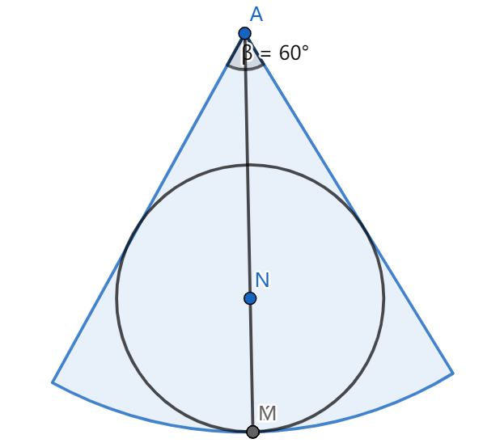

# 2023.5.15期

16. 我们知道，对一个数据进行重复测量并取平均值可以减小偶然误差，下面对这一原理进行探讨。假定存在一个测量工具可以测量准确值$x_0$为整数的一个物理量，且测多一个单位和测少一个单位的概率均为$\frac{1}{2}$。用该工具测量一个体系$n$次，得到数据$x_1、x_2、\dots、x_n$，且这些数据的均值为$\overline{X_n}$。

    (1) 求证：$a=\overline{X_n}$时$\sum_{i=1}^n(x_i-a)^2$取最小值；

    (2) 求证：随机变量$\varepsilon_n^2=(\overline{X_n}-x_0)^2$的期望随n递减；

    (3) 2次测量后，体系受到扰动，$x_0$可能发生改变，于是又进行了两次测量，发现这两次测得数据的平均值与扰动前测得数据的平均值相等，因而判断$x_0$没有发生变化，求这一判断错误的概率。

    > （1）证明：设
    > $$
    > f(a)=\sum_{i=1}^n (x_i-a)^2=na^2-2a\sum_{i=1}^n x_i+\sum_{i=1}^nx_i^2
    > $$
    > $f(a)$是关于$a$的二次函数，故$a=-\frac{-2\sum_{i=1}^nx_i}{2n}=\overline{X}$时，原式取最小值
    > （2）证明：设$n$次测量中，设测多一个单位的次数为$Y$，则
    > $$
    > n\overline{X}=\sum_{i=1}^n x_i=nx_0+Y+(-1)(n-Y)=nx_0-n+2Y
    > $$
    > 进而
    >
    > $$
    > E(n\overline{X})=nx_0-n+2E(Y)
    > $$
    >
    > $$
    > E(\overline{X}-x_0)=\frac{2E(Y)}{n}-1
    > $$
    >
    > 考虑到对任意离散型随机变量$\alpha$有
    >
    > $$
    > \begin{eqnarray}
    > D(\alpha)&=&\frac1n\sum_{i=1}^n[\alpha_i-E(\alpha)]^2\\
    > &=&\frac1n\left[\sum_{i=1}^n\alpha_i^2-2nE(\alpha)(\sum_{i=1}^n\alpha_i)+nE(\alpha)^2\right]\\
    > &=&\frac1n(\sum_{i=1}^n\alpha_i^2)-[E(\alpha)]^2\\
    > &=&E(\alpha^2)-[E(\alpha)]^2
    > \end{eqnarray}
    > $$
    > 由题意，$Y\sim B(n,\frac12)$，则
    > $$
    > E(Y)=\frac n2
    > $$
    >
    > $$
    > E(\overline{X}-x_0)=0
    > $$
    >
    > $$
    > D(Y)=\frac n4=E(Y^2)-[E(Y)]^2=E(Y)
    > $$
    >
    > 所以
    > $$
    > \begin{eqnarray}
    > D(\overline{X}-x_0)&=&D(\overline{X})\\
    > &=&\frac{1}{n^2}D(n\overline{X})\\
    > &=&\frac1{n^2}D(2Y+nx_0-n)\\
    > &=&\frac{4}{n^2}D(Y)\\
    > &=&\frac{4}{n^2}\cdot\frac{n}{4}\\
    > &=&\frac1n\\
    > &=&E[(\overline{X}-x_0)^2]-[E(\overline{X}-x_0)]\\
    > &=&E(\varepsilon_n^2)
    > \end{eqnarray}
    > $$
    > 即$E(\varepsilon_n^2)=\frac1n$
    >
    > 而
    > $$
    > E(\varepsilon_{n+1}^2)-E(\varepsilon_n^2)=\frac{1}{n+1}-\frac1n=-\frac{1}{n^2+n}<0
    > $$
    > 故$E(\varepsilon_n^2)$随$n$递减
    >
    > （3）解：由题意，扰动后$x_0$可能增加1、减少1或保持不变
    >
    > 设扰动前后$x_0$的取值分别为$m$、$n$，事件$A$：$n=m-1$，$B$：$n=m$，$C$：$n=m+1$，$D$：扰动前后测得平均值不变，扰动前测量时测多的，由题意
    >
    > 假设在扰动后的两次测量中，测量时测多一个单位的次数为$Y'$，两次测得的平均值为$\overline{X}'$，则有
    > $$
    > \overline{X}'=\frac12[2n+Y'-(2-Y')]=n+Y'-1
    > $$
    >
    > $$
    > \overline{X}=\frac12[2m+Y-(2-Y)]=m+Y-1
    > $$
    >
    > 若$\overline{X}'=\overline{X}$，则有
    > $$
    > m-n=Y'-Y
    > $$
    > 则在扰动前后测得数据的平均值相等的条件下，事件$x_0$在扰动前后的取值不变，即$m-n=0$，与事件${Y}'-Y=0$，也就是$\overline{Y}'=Y$等价。
    >
    > 由题意，$\overline{Y}'\sim B(2,\frac12)$，$\overline{Y}\sim B(2,\frac12)$，且两者的可能取值均为0、1、2
    > $$
    > P({Y}'=Y=0)=P({Y}'=0)P({Y}=0)=\frac1{16}
    > $$
    >
    > $$
    > P({Y}'=Y=1)=P({Y}'=1)P({Y}=1)=\frac14
    > $$
    >
    > $$
    > P({Y}'=Y=2)=P({Y}'=2)P({Y}=2)=\frac1{16}
    > $$
    >
    > $$
    > P(Y'=Y)=\frac{3}{8}
    > $$
    >
    > 即判断正确的概率为$\frac38$，判断错误的概率为
    > $$
    > 1-P(Y'=Y)=\frac58
    > $$

17. 如图，xOy平面内存在一个边长为m、n（$m\ge4$,$n\ge4$）的矩形网格，每个小格均为边长为1的均为边长为1的正方形。先随机选取一个小格，在其中心放置一点P，再使P分别在x、y轴方向上进行两轮游走。每轮游走中，P先后沿坐标轴正、负方向等可能地移动0至2格，则P最终仍在网格内的概率为___。

    

    > 解：

18. $f(x)=log_ax-a^x$

    (1) $a\in [e^{-e},1)\cup(1,+\infty)$，关于$x$的方程$x=a^x$、$x=log_ax$和$a^x=log_ax$的根分别组成集合A、B、C，求证：$A=B=C$；

    (2) $f(x)\lt0$，求$a$的取值范围；

    (3) $a\in(0,1)$，求$f(x)$零点个数的可能取值组成的集合。

> （1）证明：$x\le0$时，$x<0<a^x$，方程$x=a^x$无解
>
> $x>0$时，假设$x=a^x$有解$x_0$，则
> $$
> x_0=a^{x_0}
> $$
> 两端同时取以$a$为底的对数，有
> $$
> \log_a{x_0}=x_0
> $$
> 即方程$x=a^x$的根亦为方程$x=\log_ax$的根
>
> 所以$A\subseteq$B
>
> 设$x=\log_a{x}$有解$x_1$，则
> $$
> x_1=\log_a{x_1}
> $$
> 两端同时取以$a$为底的指数，有
> $$
> a^{x_1}=x^1
> $$
> 所以$B\subseteq A$
>
> 所以$A=B$
>
> 同时，对于任意$t\in A$，均有$t=a^t=\log_a{t}$，此时$t$亦为$a^x=\log_ax$的根且$t\in C$
>
> 所以$A\subseteq C$
>
> 设方程$a^x=\log_ax$有根$x_2$，则$a^{x_2}=\log_ax_2$，
>
> 1）$a\in(1,+\infty)$时，$log_ax$、$a^x$均随$x$递增
>
> i. 若$a^{x_2}<x_2$，则$a^{x_2}=\log_a{x_2}>\log_a{a^{x_2}}=x_2$，两式矛盾
>
> ii. 若$a^{x_2}>x_2$，则$a^{x_2}=\log_a{x_2}<\log_a{a^{x_2}}=x_2$，两式矛盾 
>
> 所以$a^{x_2}=x_2$，即$a^x=\log_ax$的根亦为$x=a^x$的根，$C\subseteq A$
>
> 所以$A=C$
>
> 2）$a\in [e^{-e},1)$时，
> $$
> f'(x)=\frac{1}{x\ln a}-a^x\ln a=\frac{1}{x}\left(\frac{1}{\ln a}-e^{x\ln a}x\ln a\right)
> $$
> 令$g(x)=xe^x$，$g'(x)=(x+1)e^x$，
>
> $x<-1$，$g'(x)<0$，$g(x)$单调递减
>
> $x>-1$，$g'(x)>0$，$g(x)$单调递增
>
> 所以$g(x)\ge g(-1)=-\frac1e$
>
> 所以
> $$
> \frac{1}{\ln a}-e^{x\ln a}x\ln a\le\frac1{\ln{e^{-e}}}-g(x\ln a)\le-\frac1e-g(-1)=0
> $$
> 所以$f'(x)<0$，$f(x)$单调递减，$f(x)$至多有一个根，$a^x=\log_ax$至多有一个根，$C$至多有一个元素。
>
> 这时，令$h(x)=x-a^x$，则$h(x)$单调递减，且$h(0)=-1<0$，$h(1)=1-a>0$，所以$h(x)$的唯一零点在$(0,1)$上
>
> 即$x=a^x$的唯一根在$(0,1)$上，且为$A$的唯一元素
>
> 由$A\subseteq C$知，该根亦在$C$中，但是$C$至多只能有一个元素，故$A=C$
>
> 综上，$A=B=C$
>
> （2）解：1）若$0<a<1$，则$f(a)=1-a^a>1-1^a=0$，不合题意，舍去
>
> 2）若$a>1$，由(1)知，要使$f(x)<0$，则$f(x)$不能有零点
>
> 进而$a^x=\log_ax$无解，$A=B=C=\empty$，$x=a^x$无解，$xa^{-x}=1$无解
>
> 设
> $$
> m(x)=xa^{-x}
> $$
>
> $$
> m'(x)=a^{-x}(1-x\ln a)
> $$
>
> $x<\frac1{\ln{a}}$，$m'(x)>0$，$m(x)$单调递增
>
> $x<\frac1{\ln a}$，$m'(x)<0$，$m(x)$单调递减
>
> 所以
> $$
> m(x)\le m(\frac1{\ln a})=\frac{e^{\ln a\cdot\left(-\frac1{\ln a}\right)}}{\ln a}=\frac1{e\ln a}
> $$
> i. $a>e^\frac1e$时，$m(x)\le\frac1{e\ln a}<1$，$xa^x=1$无解，$f(x)$无零点
>
> 此时假设存在$f(x_3)>0$，因为$f(1)=-a<0$，所以$f(x)$存在零点，出现矛盾，故$f(x)<0$恒成立
>
> ii. $1<a<e^{\frac1e}$时，$m(\frac1{\ln a})=\frac{1}{e\ln a}>1$，$m(0)=0<1$，故$m(x)=xa^{-x}=1$在$(0,\frac{1}{\ln a})$必有一根，不合题意
>
> iii. $a=e^{\frac1e}$时，$f(e)=0$，不合题意
>
> 综上$a\in(1,e^{\frac1e})$
>
> （3）解：【方法一】由(1)，$a\in[e^{-e},1)$时，$a^x=log_ax$有唯一根，$f(x)$有1个零点
>
> 若$a\in (0,e^{-e})$
>
> 设
> $$
> n(x)=\frac1{\ln a}-e^{x\ln a}x\ln a
> $$
>
> $$
> n'(x)=-e^{x\ln a}(x\ln a+1)\ln a
> $$
>
> $x<-\frac1{\ln a}$时，$n'(x)>0$，$n(x)$单调递增
>
> $x>-\frac{1}{\ln a}$时，$n'(x)<0$，$n(x)$单调递减
>
> 所以$n(x)$至多有两个零点，进而$f'(x)=\frac1xn (x)$至多有两个零点
>
> $$
> f'(1)=\frac1{\ln a}-e^{\ln a}\ln a<\frac{1}{-e}-g(-1)=0
> $$
>
> $$
> f'\left(\frac1{(\ln a)^2}\right)=\frac{1-e^{\frac1{\ln a}}}{\ln a}<\frac{1-e^0}{\ln a}=0
> $$
>
> $$
> f'(-\frac{1}{\ln a})=-\ln a\left[\frac{1}{\ln a}-g(-\frac1{\ln a})\right]=-1+\ln a(-\frac{\ln a}{\ln a}e^{-\ln a\cdot \frac{1}{\ln a}})=-\frac{\ln a}e-1>0
> $$
>
> 同时$\frac1{(\ln a)^2}<-\frac{1}{\ln a}<1$，所以$f'(x)$在$\left(\frac1{(\ln a)^2},-\frac1{\ln a}\right)$，$\left(-\frac1{\ln a},1\right)$有两个零点，分别记为$x_3$，$x_4$
>
> $0<x<x_3$，$f'(x)<0$，$f(x)$单调递减
>
> $x_3<x<x_4$，$f'(x)>0$，$f(x)$单调递增
>
> $x>x_4$，$f'(x)>0$，$f(x)$单调递减
>
> 所以$f(x)$至多有三个零点
>
> 同时，对$f(x)$的任意一个零点$x_5$，若$x_5\notin A$，有
>
> $$
> a^{x_5}=\log_a{x_5}=x_6\ne x_5
> $$
>
> $$
> \log_a{x_6}=log_a{a^{x_5}}=x_5=a^{\log_a{x_5}}=a^{x_6}\ne x_5
> $$
>
> 注意到$x_6\ne a^{x_6}$，则$x_6\notin A$亦成立
>
> 所以$f(x)$的零点当中不在$A$中的零点个数不可能是1个
>
> 由（1），$0<a<1$，$h(x)=x-a^x$有唯一零点，且$A\subseteq C$
>
> 所以$f(x)$有且仅有1个零点在$A$中
>
> 所以$f(x)$的零点个数不可能为0或2
>
> 令$a=e^{-e^{10}}$，则有
>
> $$
> f(e^{-e^{10}})=1-a^a>0
> $$
>
> $$
> f(e^{-20})=20e^{-10}-e^{-10e^{-10}}=e^{-10}(20-e^{10-10e^{-10}})
> $$
>
> $$
> f(12e^{-10})=(10-\ln12)e^{-10}-e^{-12}=e^{-12}[(10-\ln12)e^2-1]>0
> $$
>
> $$
> f(1)=0-a<0
> $$
>
> 而且不难判断$e^{-e^{10}}<e^{-20}<12e^{-10}<1$，从而$f(x)$有三个零点。
>
> 所以$f(x)$零点个数的集合为$\{1,3\}$。
>
> 【方法二】证明$f(x)$零点个数只能在$\{1.3\}$中的取值的过程同上一问，此处只需找到$f(x)$的零点个数为3的一个充分条件。
>
> 前边已经证明，$0<x<e^{-e}$时，$f(x)$存在两个极值点，而且我们设它们分别为$x_3$、$x_4$，且$x_3<x_4$，这里我们以一个统一的记号$x_7$表示这两个零点。将$x_7$代入$f'(x)$，我们有
> $$
> f'(x_7)=\frac1{x_7}\left(\frac1{\ln a}-e^{x_7\ln a}x_7\ln a\right)=0
> $$
> 即
> $$
> e^{x_7\ln a}x_7\ln a=\frac1{\ln a}
> $$
> 设$t=x_7\ln a$，则上式可以表示为
> $$
> te^t=\frac{1}{\ln a}
> $$
> 考虑到$\ln a<0$、$x_7>0$、$t<0$，由上式不难得到
> $$
> e^t=\frac{1}{t\ln a}
> $$
>
> $$
> t+\ln (-t)=\ln\left(-\frac{1}{\ln a}\right)=t+\ln x_7+\ln (-\ln a)
> $$
>
> $$
> \ln x_7=-2\ln(-\ln a)-t
> $$
>
> 在原函数在$x_7$处的函数值进行“隐零点代换”
> $$
> \begin{eqnarray}
> f(x_7)&=&\frac{\ln x_7}{\ln a}-e^{x_7\ln a}\\
> &=&\frac{-2\ln(-\ln a)-t}{\ln a}-\frac{1}{t\ln a}\\
> &=&\frac1{\ln a}\left[-2\ln(-\ln a)-t-\frac1t\right]\\
> &=&\frac1{\ln a}\left[2t+2\ln(-t)-t-\frac1t\right]\\
> &=&\frac1{\ln a}\left[2\ln(-t)+t-\frac1t\right]\\
> \end{eqnarray}
> $$
> 我们取
> $$
> \varphi(t)=2\ln{(-t)}+t-\frac{1}t
> $$
> 则$\varphi(t)$的定义域为$(-\infty,0)$，
> $$
> \varphi'(t)=\frac{2}{t}+1+\frac1{t^2}=\frac{t^2+2t+1}{t^2}\ge0
> $$
> 所以$\varphi(t)$单调递增。
>
> 考虑到$\varphi(-1)=0$，则$t<-1$时，$\varphi(t)<0$；$t>-1$时，$\varphi(t)>0$。
>
> 取$t_1$、$t_2$分别为$t$在$x_7$取$x_4$、$x_3$时的值，不难判断，$t_1<t_2$。因为$t_1$、$t_2$均为$te^t=\frac1{\ln a}$的根，由第（2）问对$g(x)=xe^x$单调性的讨论，$t_1$、$t_2$必然居于$g(x)$的极值点-1两侧，且$t_1<-1<t_2<0$，$\varphi(t_1)<0<\varphi(t_2)$，$f(x_3)<0<f(x_4)$。
>
> 令
> $$
> p(x)=x\ln x
> $$
> 其定义域为$(0,+\infty)$
> $$
> p'(x)=\ln x + 1
> $$
> $0<x<\frac1e$，$p'(x)<0$，$p(x)$单调递减。考虑到此情形下$0<a<e^{-e}$，$0<\sqrt a<e^{-\frac e2}<\frac1e$，则
> $$
> p(a)=\sqrt{a}\ln a>p(e^{-\frac{e}{2}})=-e^{1-\frac{e}2-\ln2}>-1
> $$
> 而
> $$
> \sqrt a-\frac{1}{\ln a}>\sqrt a>0
> $$
> 所以
> $$
> a-\frac{1}{(\ln a)^2}=\left(\sqrt a+\frac{1}{\ln a}\right)\left(\sqrt a-\frac{1}{\ln a}\right)=\left(\frac{\sqrt a\ln a+1}{\ln a}\right)\left(\sqrt a-\frac{1}{\ln a}\right)<0
> $$
> 前面我们已经证明
> $$
> \frac{1}{(\ln a)^2}<x_3
> $$
> 所以
> $$
> a<\frac{1}{(\ln a)^2}<x_3
> $$
> 结合前面我们得到的$x_4<1$，我们有
> $$
> a<x_3<x_4<1
> $$
> 而且
> $$
> f(a)=1-a^a>0
> $$
>
> $$
> f(1)=-a<0
> $$
>
> 所以$0<a<e^{-e}$时$f(x)$在$(a,x_3)$、$(x_3,x_4)$，$(x_4,1)$内各有一个零点，即$f(x)$有三个零点。

16. 为适应田间起伏的路面，农用机械有时会采用如图所示的万向轴进行传动。OA、AB、BC为三段不可变形的直杆（半径可以忽略），长度均为20。每两段杆间有一活动连接，可按一定方向转动，但限制任意两杆间夹角$\alpha、\beta$不大于$\frac{\pi}{6}$。认为OA杆始终水平，且OA杆可以以自身为轴自由转动。则A、C两点间最大高度差为___。AB杆能扫过的区域组成一个几何体，该几何体内切球体积为\_\_\_。		

    

    >（1）在竖直平面内使OA与AB及AB与BC间夹角均为最大值时，不难求得A、C两点间最大高度差为$10+10\sqrt3$。
    >
    >（2）可以得出，AB杆能扫过的区域为一个以A为球心、以20为半径的球与一个与A为顶点，母线与高限夹角为$\frac\pi6$的圆锥的交集。由对称性，那一区域相应的几何体的内接球球心在OA所在的直线上。过OA所在直线可作出切面图形如下：
    >
    >
    >
    >设所求内切圆半径为$r$由几何关系可知
    >$$
    >r=(20-r)\sin\frac\pi6
    >$$
    >解得
    >$$
    >r=\frac{20}{3}
    >$$

17. 电子计算机推广之前，很多复杂的计算时借助对数表完成的。以下是一个常用对数表的一部分：

    | x    | 2        | 3        | 7        | 11       | 13       | 17       | 19       |
    | ---- | -------- | -------- | -------- | -------- | -------- | -------- | -------- |
    | lg x | 0.301030 | 0.477121 | 0.845098 | 1.041393 | 1.113943 | 1.230449 | 1.278754 |

    以此计算$2^{2023}=$___（科学计数法表示，保留一位有效数字）。
    
    > 解：$2^{2023}=10^{\lg{2^{2023}}}=10^{2023\lg2}\approx10^{608.98369}$
    >
    > $9.5\cdot10^{608}=10^{608+\lg{19}-\lg2}=10^{608.977724}<10^{608.98369}<10^{609}$
    >
    > 进而$2^{2023}=1\times10^{609}$