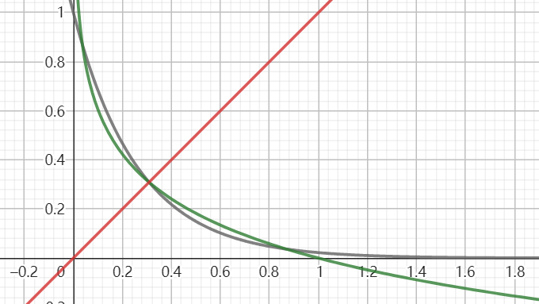
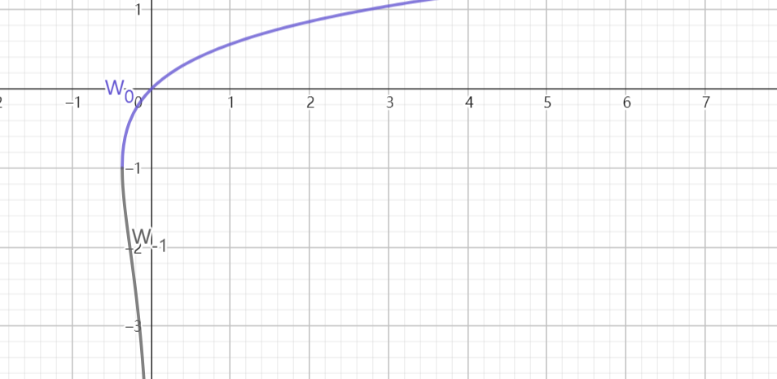

# 2023.5.15期

## 第16题

16. 我们知道，对一个数据进行重复测量并取平均值可以减小偶然误差，下面对这一原理进行探讨。假定存在一个测量工具可以测量准确值$x_0$为整数的一个物理量，且测多一个单位和测少一个单位的概率均为$\frac{1}{2}$。用该工具测量一个体系$n$次，得到数据$x_1、x_2、\dots、x_n$，且这些数据的均值为$\overline{X_n}$。

    (1) 求证：$a=\overline{X_n}$时$\sum_{i=1}^n(x_i-a)^2$取最小值；

    (2) 求证：随机变量$\varepsilon_n^2=(\overline{X_n}-x_0)^2$的期望随n递减；

    (3) 2次测量后，体系受到扰动，$x_0$可能发生改变，于是又进行了两次测量，发现这两次测得数据的平均值与扰动前测得数据的平均值相等，因而判断$x_0$没有发生变化，求这一判断错误的概率。

    ### 参考答案

    > （1）证明：设
    > $$
    > f(a)=\sum_{i=1}^n (x_i-a)^2=na^2-2a\sum_{i=1}^n x_i+\sum_{i=1}^nx_i^2
    > $$
    > $f(a)$是关于$a$的二次函数，故$a=-\frac{-2\sum_{i=1}^nx_i}{2n}=\overline{X}$时，原式取最小值
    > （2）证明：设$n$次测量中，设测多一个单位的次数为$Y$，则
    > $$
    > n\overline{X}=\sum_{i=1}^n x_i=nx_0+Y+(-1)(n-Y)=nx_0-n+2Y
    > $$
    > 进而
    >
    > $$
    > E(n\overline{X})=nx_0-n+2E(Y)
    > $$
    >
    > $$
    > E(\overline{X}-x_0)=\frac{2E(Y)}{n}-1
    > $$
    >
    > 考虑到对任意离散型随机变量$\alpha$有
    >
    > $$
    > \begin{eqnarray}
    > D(\alpha)&=&\frac1n\sum_{i=1}^n[\alpha_i-E(\alpha)]^2\\
    > &=&\frac1n\left[\sum_{i=1}^n\alpha_i^2-2nE(\alpha)(\sum_{i=1}^n\alpha_i)+nE(\alpha)^2\right]\\
    > &=&\frac1n(\sum_{i=1}^n\alpha_i^2)-[E(\alpha)]^2\\
    > &=&E(\alpha^2)-[E(\alpha)]^2
    > \end{eqnarray}
    > $$
    > 由题意，$Y\sim B(n,\frac12)$，则
    > $$
    > E(Y)=\frac n2
    > $$
    >
    > $$
    > E(\overline{X}-x_0)=0
    > $$
    >
    > $$
    > D(Y)=\frac n4=E(Y^2)-[E(Y)]^2=E(Y)
    > $$
    >
    > 所以
    > $$
    > \begin{eqnarray}
    > D(\overline{X}-x_0)&=&D(\overline{X})\\
    > &=&\frac{1}{n^2}D(n\overline{X})\\
    > &=&\frac1{n^2}D(2Y+nx_0-n)\\
    > &=&\frac{4}{n^2}D(Y)\\
    > &=&\frac{4}{n^2}\cdot\frac{n}{4}\\
    > &=&\frac1n\\
    > &=&E[(\overline{X}-x_0)^2]-[E(\overline{X}-x_0)]\\
    > &=&E(\varepsilon_n^2)
    > \end{eqnarray}
    > $$
    > 即$E(\varepsilon_n^2)=\frac1n$
    >
    > 而
    > $$
    > E(\varepsilon_{n+1}^2)-E(\varepsilon_n^2)=\frac{1}{n+1}-\frac1n=-\frac{1}{n^2+n}<0
    > $$
    > 故$E(\varepsilon_n^2)$随$n$递减
    >
    > （3）解：由题意，扰动后$x_0$可能增加1、减少1或保持不变
    >
    > 设扰动前后$x_0$的取值分别为$m$、$n$，事件$A$：$n=m-1$，$B$：$n=m$，$C$：$n=m+1$，$D$：扰动前后测得平均值不变，扰动前测量时测多的，由题意
    >
    > 假设在扰动后的两次测量中，测量时测多一个单位的次数为$Y'$，两次测得的平均值为$\overline{X}'$，则有
    > $$
    > \overline{X}'=\frac12[2n+Y'-(2-Y')]=n+Y'-1
    > $$
    >
    > $$
    > \overline{X}=\frac12[2m+Y-(2-Y)]=m+Y-1
    > $$
    >
    > 若$\overline{X}'=\overline{X}$，则有
    > $$
    > m-n=Y'-Y
    > $$
    > 则在扰动前后测得数据的平均值相等的条件下，事件$x_0$在扰动前后的取值不变，即$m-n=0$，与事件${Y}'-Y=0$，也就是$\overline{Y}'=Y$等价。
    >
    > 由题意，$\overline{Y}'\sim B(2,\frac12)$，$\overline{Y}\sim B(2,\frac12)$，且两者的可能取值均为0、1、2
    > $$
    > P({Y}'=Y=0)=P({Y}'=0)P({Y}=0)=\frac1{16}
    > $$
    >
    > $$
    > P({Y}'=Y=1)=P({Y}'=1)P({Y}=1)=\frac14
    > $$
    >
    > $$
    > P({Y}'=Y=2)=P({Y}'=2)P({Y}=2)=\frac1{16}
    > $$
    >
    > $$
    > P(Y'=Y)=\frac{3}{8}
    > $$
    >
    > 即判断正确的概率为$\frac38$，判断错误的概率为
    > $$
    > 1-P(Y'=Y)=\frac58
    > $$

    ### 解析

    > 好像也是没有太多可以解析的qwq。

    ### 命题思路与背景

    > 在全部27道题目中，这一题是推倒重做的次数最多的，而且大概也是唯一命题用时与第18题接近的题目。这里大致地介绍一下题目的几次“重构”过程。
    >
    > 实际上，自己一开始大概并没有以偶然误差随测量次数递减作为命题的中心，而是以自己在高二时曾考虑过的一个问题，即计算测量一个物理量时，物理量的测量值与实际值之间的差值在一定范围内的概率作为问题的核心：
    >
    > > 一测量工具测量某物理量所得值$X=e+x_0$，$e\sim N(0,10^{-4})$，$x_0$为准确值。某试验中，由该工具测量一个恒定量$n$次，所得平均值为$\overline{x}$，求：
    > >
    > > (1) $n=1$时，真实值$x_0\notin (\overline{x}-0.01,\overline{x}+0.01)$的概率。
    > >
    > > (2) 若$n=2$，再进行两次测量，测得的平均值为$\overline{x}'$，$|\overline{x}'-\overline{x}|<0.02$，试问，是否有不小于98%的把握判定两次测量见该值是否发生了变化。
    >
    > 其中第二问是原问题的一个延伸。因为自己曾期望增加题目情形的一般性与实际性，当时考虑的是取值连续的物理量与满足正态分布的偶然误差。但是，当时自己用随机变量的基本性质甚至当时题目上见到的误差函数$\Phi(x)$整了几次下来发现走不通，也就放弃了这种误差的建模方式。后来，自己又试着假设偶然误差满足三角分布，结果还是发现求解这一问题需要用到积分的知识，最终直接不再研究取值连续的物理量。
    >
    > 与此同时，因为一些难以考证的原因，笔者又将题目的中心转移到似乎更“有意思”的“对同一个物理量进行重复测量取平均值可以减小偶然误差”这一现象上。
    >
    > 然后自己又尝试了以下两种误差分布，但是均以计算量太大而放弃。
    >
    > - | 误差 | -1   | 0    | 1    |
    >   | ---- | ---- | ---- | ---- |
    >   | P    | 1/4  | 1/2  | 1/4  |
    >
    > - | 误差 | -1   | 0    | 1    |
    >   | ---- | ---- | ---- | ---- |
    >   | P    | 1/3  | 1/3  | 1/3  |
    >
    > 一个现存的废案如下：
    >
    > > 我们知道，对一个数据进行重复测量可减少随机误差，此处我们对这一原理进行探究。某个测量方法中，所测的数据可以表示为$X=x_0+\varepsilon$，$\varepsilon$为一随机变量，且分布列如下表所示
    > >
    > > | 误差 | -1   | 0    | 1    |
    > > | ---- | ---- | ---- | ---- |
    > > | P    | 1/4  | 1/2  | 1/4  |
    > >
    > > 现用该方法对一个数据测量$n$次，获得平均值$\overline{x}_n$。假定测量过程中$x_0$不变。
    > >
    > > (0) 直接写出$\overline{x}_2$的分布列。
    > >
    > > (1) 证明：$P(|\overline{x}_n-x_0|\ge\frac12)\ge P(|\overline{x}_{n-1}-x_0|\ge\frac12)$
    > >
    > > (2) 若2次测量后，被测系统受到扰动，可能使$x_0$发生改变。为进行验证，现对系统继续进行2次测量，测得平均值为$\overline y$。
    > >
    > > ① 若$\overline{x}_n-\overline y=\frac12$，判断是否有$\frac12$的把握判定$x_0$发生改变。
    > >
    > > ② 若$\overline{x}_n-\overline y=0$，则“$x_0$发生改变”为假命题的概率是否为以定值。说明理由。
    >
    > 记不清是不是上面那道题了，但是在当时，因为计算量太大，笔者在多次尝试推导后，除了上面的废稿当中第(2)问中与要研究的问题的关系貌似不是很明显的结论之外，只“隐约”地得到了$|\overline{x}_{n}-x_0|$在$n$为偶数时随$n$递减，但是在整体上并不递减而是有一种“震荡”的变化趋势这样的结论，而这种题目是不够“优雅”的。
    >
    > 到这时，方才考虑到可以借助我们所熟悉的二项分布来简化运算。在这一思路下，可以假设，测量误差只有两个取值，也就是$-1$和$1$，而且两个取值出现的概率是相等的。这样就可以将误差取到“1”这一取值的次数设为一个随机变量，而这个随机变量显然是满足二项分布的。
    >
    > 还有一个问题是，我们不能取随机误差的具体值$\overline X-x_0$作为度量，因为它的值不是随测量次数递增或递减的，而且，它是一个随机变量，我们无法对它的值的变化进行讨论。同时，用随机误差具体值的期望也不可取，因为这一期望无论测量次数多少都是0。这样，我们需要找到一个量，使得它可以度量随机误差的大小，而且它的值应该是仅在$[0,+\infty)$上分布的。不难发现，我们取随机误差的具体值$|\overline{X}-x_0|$即可，因为它是一个随机变量，这里可以考虑用它的期望作为一个度量。然后，我为了防止绝对值运算造成不必要的麻烦，又将绝对值替换为平方运算。
    >
    > 最后，考虑到当时不久前见到的一个结论，又给出了第一问。接着又对第三问进行了改写。
    >
    > 这样才勉强得到了最终的题目。

    ### 简析

    > 本题对测量中取均值减小误差这一原理借助一个简单的情形进行了理论分析，尽管情形较为简单，本题在概率题当中也属于偏难的题目，大约20～21题难度，有兴趣可以尝试一下。

## 第17题

17. 如图，xOy平面内存在一个边长为m、n（$m\ge4$,$n\ge4$）的矩形网格，每个小格均为边长为1的均为边长为1的正方形。先随机选取一个小格，在其中心放置一点P，再使P分别在x、y轴方向上进行两轮游走。每轮游走中，P先后沿坐标轴正、负方向等可能地移动0至2格，则P最终仍在网格内的概率为___。

    

    ### 参考答案与解析

    > 解：设一轮游走后选点在某一个坐标轴上的坐标与移动前坐标的差值为$X$，不难写出其分布列
    >
    > | $x$      | -2        | -1        | 0         | 1         | 2         |
    > | -------- | --------- | --------- | --------- | --------- | --------- |
    > | $P(X=x)$ | $\frac19$ | $\frac29$ | $\frac13$ | $\frac29$ | $\frac19$ |
    >
    > 我们将网格分为三个区域
    >
    > 
    >
    > 要使选点从中间的绿色区域移出整个网格，则它需要在任意一个坐标轴上移动2格以上的距离，但这是不可能的。
    >
    > 要使选点从蓝色区域当中较靠外的一圈移出整个网格，则选点需要向靠近边缘的方向上移动至少1格，这发生的概率是$\frac19+\frac29=\frac13$​。
    >
    > 要使选点从蓝色区域当中较靠内的一圈移出整个网格，则选点需要向靠近边缘的方向上移动至少2格，这发生的概率是$\frac19$。
    >
    > 最后计算选点从红色区域移出整个网格的概率。分别计算，网格边角处的一个方格，不与边缘相邻的一个方格与其它两个方格当中的点移出整个网格的概率分别为$1-\frac23\cdot\frac23=\frac59$、$1-\frac89\cdot\frac23=\frac{11}{27}$、$1-\frac89\cdot\frac89=\frac{17}{81}$，按照面积对三者加权平均，得到选点从红色区域移出网格的概率为$\frac14\cdot\frac59+\frac12\cdot\frac{11}{27}+\frac14\cdot\frac{17}{81}=\frac{32}{81}$。
    >
    > 对三个区域中选点移除网格的概率按面积进行加权平均（实际上是运用全概率公式），得到任意一个选点移出网格的概率为
    > $$
    > \begin{eqnarray}
    > \frac{(m-2)(n-2)}{mn}\cdot0+\frac{m-4+n-4}{mn}\cdot\frac13+\frac{m-4+n-4}{mn}\cdot\frac19+\frac{4\cdot 4}{mn}\cdot\frac{32}{81}=\frac{36m+36n+224}{81mn}
    > \end{eqnarray}
    > $$
    > 则选点未移出网格的概率为
    > $$
    > 1-\frac{36m+36n+224}{81mn}
    > $$

    ### 命题思路与背景

    > 在2020年秋天，笔者曾计算过Minecraft中，在方形刷怪平台上随机选取刷怪起始点后经过一次游走（机制与此类似，但是单次的移动格数不是0～2格而是0～5格）后选中的点仍在平台上的概率，得到公式
    > $$
    > P=1-\frac{630m+630n-1225}{324mn}
    > $$
    > 这道题即为上述问题的一个简化情形。实际上，这道题在原先还有一个第二空，要求计算选点移出网格的概率不大于某值时网格的最小面积，但是因为计算量实在太大而最终作罢。

    ### 简析

    > 本题是一道比较计算困难但是思路不算复杂的概率题，约15～16题难度。题目质量一般。

## 第18题

18. $f(x)=\log_ax-a^x$

    (1) $a\in [e^{-e},1)\cup(1,+\infty)$，关于$x$的方程$x=a^x$、$x=\log_ax$和$a^x=\log_ax$的根分别组成集合A、B、C，求证：$A=B=C$；

    (2) $f(x)\lt0$，求$a$的取值范围；

    (3) $a\in(0,1)$，求$f(x)$零点个数的可能取值组成的集合。

    ### 参考答案

    > （1）证明：$x\le0$时，$x<0<a^x$，方程$x=a^x$无解
    >
    > $x>0$时，假设$x=a^x$有解$x_0$，则
    > $$
    > x_0=a^{x_0}
    > $$
    > 两端同时取以$a$为底的对数，有
    > $$
    > \log_a{x_0}=x_0
    > $$
    > 即方程$x=a^x$的根亦为方程$x=\log_ax$的根
    >
    > 所以$A\subseteq$B
    >
    > 设$x=\log_a{x}$有解$x_1$，则
    > $$
    > x_1=\log_a{x_1}
    > $$
    > 两端同时取以$a$为底的指数，有
    > $$
    > a^{x_1}=x^1
    > $$
    > 所以$B\subseteq A$
    >
    > 所以$A=B$
    >
    > 同时，对于任意$t\in A$，均有$t=a^t=\log_a{t}$，此时$t$亦为$a^x=\log_ax$的根且$t\in C$
    >
    > 所以$A\subseteq C$
    >
    > 设方程$a^x=\log_ax$有根$x_2$，则
    > $$
    > a^{x_2}=\log_ax_2
    > $$
    > 1）$a\in(1,+\infty)$时，$\log_ax$、$a^x$均随$x$递增
    >
    > i. 若$a^{x_2}<x_2$，则$a^{x_2}=\log_a{x_2}>\log_a{a^{x_2}}=x_2$，两式矛盾
    >
    > ii. 若$a^{x_2}>x_2$，则$a^{x_2}=\log_a{x_2}<\log_a{a^{x_2}}=x_2$，两式矛盾 
    >
    > 所以$a^{x_2}=x_2$，即$a^x=\log_ax$的根亦为$x=a^x$的根，$C\subseteq A$
    >
    > 所以$A=C$
    >
    > 2）$a\in [e^{-e},1)$时，
    > $$
    > f'(x)=\frac{1}{x\ln a}-a^x\ln a=\frac{1}{x}\left(\frac{1}{\ln a}-e^{x\ln a}x\ln a\right)
    > $$
    > 令$g(x)=xe^x$，$g'(x)=(x+1)e^x$，
    >
    > $x<-1$，$g'(x)<0$，$g(x)$单调递减
    >
    > $x>-1$，$g'(x)>0$，$g(x)$单调递增
    >
    > 所以$g(x)\ge g(-1)=-\frac1e$
    >
    > 所以
    > $$
    > \frac{1}{\ln a}-e^{x\ln a}x\ln a\le\frac1{\ln{e^{-e}}}-g(x\ln a)\le-\frac1e-g(-1)=0
    > $$
    > 所以$f'(x)<0$，$f(x)$单调递减，$f(x)$至多有一个根，$a^x=\log_ax$至多有一个根，$C$至多有一个元素。
    >
    > 这时，令$h(x)=x-a^x$，则$h(x)$单调递减，且$h(0)=-1<0$，$h(1)=1-a>0$，所以$h(x)$的唯一零点在$(0,1)$上
    >
    > 即$x=a^x$的唯一根在$(0,1)$上，且为$A$的唯一元素
    >
    > 由$A\subseteq C$知，该根亦在$C$中，但是$C$至多只能有一个元素，故$A=C$
    >
    > 综上，$A=B=C$
    >
    > （2）解：1）若$0<a<1$，则$f(a)=1-a^a>1-1^a=0$，不合题意，舍去
    >
    > 2）若$a>1$，由(1)知，要使$f(x)<0$，则$f(x)$不能有零点
    >
    > 进而$a^x=\log_ax$无解，$A=B=C=\empty$，$x=a^x$无解，$xa^{-x}=1$无解
    >
    > 设
    > $$
    > m(x)=xa^{-x}
    > $$
    >
    > $$
    > m'(x)=a^{-x}(1-x\ln a)
    > $$
    >
    > $x<\frac1{\ln{a}}$，$m'(x)>0$，$m(x)$单调递增
    >
    > $x<\frac1{\ln a}$，$m'(x)<0$，$m(x)$单调递减
    >
    > 所以
    > $$
    > m(x)\le m(\frac1{\ln a})=\frac{e^{\ln a\cdot\left(-\frac1{\ln a}\right)}}{\ln a}=\frac1{e\ln a}
    > $$
    > i. $a>e^\frac1e$时，$m(x)\le\frac1{e\ln a}<1$，$xa^x=1$无解，$f(x)$无零点
    >
    > 此时假设存在$f(x_3)>0$，因为$f(1)=-a<0$，所以$f(x)$存在零点，出现矛盾，故$f(x)<0$恒成立
    >
    > ii. $1<a<e^{\frac1e}$时，$m(\frac1{\ln a})=\frac{1}{e\ln a}>1$，$m(0)=0<1$，故$m(x)=xa^{-x}=1$在$(0,\frac{1}{\ln a})$必有一根，不合题意
    >
    > iii. $a=e^{\frac1e}$时，$f(e)=0$，不合题意
    >
    > 综上$a\in(1,e^{\frac1e})$
    >
    > （3）解：【方法一】由(1)，$a\in[e^{-e},1)$时，$a^x=log_ax$有唯一根，$f(x)$有1个零点
    >
    > 若$a\in (0,e^{-e})$
    >
    > 设
    > $$
    > n(x)=\frac1{\ln a}-e^{x\ln a}x\ln a
    > $$
    >
    > $$
    > n'(x)=-e^{x\ln a}(x\ln a+1)\ln a
    > $$
    >
    > $x<-\frac1{\ln a}$时，$n'(x)>0$，$n(x)$单调递增
    >
    > $x>-\frac{1}{\ln a}$时，$n'(x)<0$，$n(x)$单调递减
    >
    > 所以$n(x)$至多有两个零点，进而$f'(x)=\frac1xn (x)$至多有两个零点
    >
    > $$
    > f'(1)=\frac1{\ln a}-e^{\ln a}\ln a<\frac{1}{-e}-g(-1)=0
    > $$
    >
    > $$
    > f'\left(\frac1{(\ln a)^2}\right)=\frac{1-e^{\frac1{\ln a}}}{\ln a}<\frac{1-e^0}{\ln a}=0
    > $$
    >
    > $$
    > f'(-\frac{1}{\ln a})=-\ln a\left[\frac{1}{\ln a}-g(-\frac1{\ln a})\right]=-1+\ln a(-\frac{\ln a}{\ln a}e^{-\ln a\cdot \frac{1}{\ln a}})=-\frac{\ln a}e-1>0
    > $$
    >
    > 同时$\frac1{(\ln a)^2}<-\frac{1}{\ln a}<1$，所以$f'(x)$在$\left(\frac1{(\ln a)^2},-\frac1{\ln a}\right)$，$\left(-\frac1{\ln a},1\right)$有两个零点，分别记为$x_3$，$x_4$
    >
    > $0<x<x_3$，$f'(x)<0$，$f(x)$单调递减
    >
    > $x_3<x<x_4$，$f'(x)>0$，$f(x)$单调递增
    >
    > $x>x_4$，$f'(x)>0$，$f(x)$单调递减
    >
    > 所以$f(x)$至多有三个零点
    >
    > 同时，对$f(x)$的任意一个零点$x_5$，若$x_5\notin A$，有
    >
    > $$
    > a^{x_5}=\log_a{x_5}=x_6\ne x_5
    > $$
    >
    > $$
    > \log_a{x_6}=\log_a{a^{x_5}}=x_5=a^{\log_a{x_5}}=a^{x_6}\ne x_5
    > $$
    >
    > 注意到$x_6\ne a^{x_6}$，则$x_6\notin A$亦成立
    >
    > 所以$f(x)$的零点当中不在$A$中的零点个数不可能是1个
    >
    > 由（1），$0<a<1$，$h(x)=x-a^x$有唯一零点，且$A\subseteq C$
    >
    > 所以$f(x)$有且仅有1个零点在$A$中
    >
    > 所以$f(x)$的零点个数不可能为0或2
    >
    > 令$a=e^{-e^{10}}$，则有
    >
    > $$
    > f(e^{-e^{10}})=1-a^a>0
    > $$
    >
    > $$
    > f(e^{-20})=20e^{-10}-e^{-10e^{-10}}=e^{-10}(20-e^{10-10e^{-10}})
    > $$
    >
    > $$
    > f(12e^{-10})=(10-\ln12)e^{-10}-e^{-12}=e^{-12}[(10-\ln12)e^2-1]>0
    > $$
    >
    > $$
    > f(1)=0-a<0
    > $$
    >
    > 而且不难判断$e^{-e^{10}}<e^{-20}<12e^{-10}<1$，从而$f(x)$有三个零点。
    >
    > 所以$f(x)$零点个数的集合为$\{1,3\}$。
    >
    > 【方法二】证明$f(x)$零点个数只能在$\{1.3\}$中的取值的过程同方法一，此处只需找到$f(x)$的零点个数为3的一个充分条件。
    >
    > 前边已经证明，$0<x<e^{-e}$时，$f(x)$存在两个极值点，而且我们设它们分别为$x_3$、$x_4$，且$x_3<x_4$，这里我们以一个统一的记号$x_7$表示这两个零点。将$x_7$代入$f'(x)$，我们有
    > $$
    > f'(x_7)=\frac1{x_7}\left(\frac1{\ln a}-e^{x_7\ln a}x_7\ln a\right)=0
    > $$
    > 即
    > $$
    > e^{x_7\ln a}x_7\ln a=\frac1{\ln a}
    > $$
    > 设$t=x_7\ln a$，则上式可以表示为
    > $$
    > te^t=\frac{1}{\ln a}
    > $$
    > 考虑到$\ln a<0$、$x_7>0$、$t<0$，由上式不难得到
    > $$
    > e^t=\frac{1}{t\ln a}
    > $$
    >
    > $$
    > t+\ln (-t)=\ln\left(-\frac{1}{\ln a}\right)=t+\ln x_7+\ln (-\ln a)
    > $$
    >
    > $$
    > \ln x_7=-2\ln(-\ln a)-t
    > $$
    >
    > 在原函数在$x_7$处的函数值进行“隐零点代换”
    > $$
    > \begin{eqnarray}
    > f(x_7)&=&\frac{\ln x_7}{\ln a}-e^{x_7\ln a}\\
    > &=&\frac{-2\ln(-\ln a)-t}{\ln a}-\frac{1}{t\ln a}\\
    > &=&\frac1{\ln a}\left[-2\ln(-\ln a)-t-\frac1t\right]\\
    > &=&\frac1{\ln a}\left[2t+2\ln(-t)-t-\frac1t\right]\\
    > &=&\frac1{\ln a}\left[2\ln(-t)+t-\frac1t\right]\\
    > \end{eqnarray}
    > $$
    > 我们取
    > $$
    > \varphi(t)=2\ln{(-t)}+t-\frac{1}t
    > $$
    > 则$\varphi(t)$的定义域为$(-\infty,0)$，
    > $$
    > \varphi'(t)=\frac{2}{t}+1+\frac1{t^2}=\frac{t^2+2t+1}{t^2}\ge0
    > $$
    > 所以$\varphi(t)$单调递增。
    >
    > 考虑到$\varphi(-1)=0$，则$t<-1$时，$\varphi(t)<0$；$t>-1$时，$\varphi(t)>0$。
    >
    > 取$t_1$、$t_2$分别为$t$在$x_7$取$x_4$、$x_3$时的值，不难判断，$t_1<t_2$。因为$t_1$、$t_2$均为$te^t=\frac1{\ln a}$的根，由第（2）问对$g(x)=xe^x$单调性的讨论，$t_1$、$t_2$必然居于$g(x)$的极值点-1两侧，且$t_1<-1<t_2<0$，$\varphi(t_1)<0<\varphi(t_2)$，$f(x_3)<0<f(x_4)$。
    >
    > 令
    > $$
    > p(x)=x\ln x
    > $$
    > 其定义域为$(0,+\infty)$
    > $$
    > p'(x)=\ln x + 1
    > $$
    > $0<x<\frac1e$，$p'(x)<0$，$p(x)$单调递减。考虑到此情形下$0<a<e^{-e}$，$0<\sqrt a<e^{-\frac e2}<\frac1e$，则
    > $$
    > p(a)=\sqrt{a}\ln a>p(e^{-\frac{e}{2}})=-e^{1-\frac{e}2-\ln2}>-1
    > $$
    > 而
    > $$
    > \sqrt a-\frac{1}{\ln a}>\sqrt a>0
    > $$
    > 所以
    > $$
    > a-\frac{1}{(\ln a)^2}=\left(\sqrt a+\frac{1}{\ln a}\right)\left(\sqrt a-\frac{1}{\ln a}\right)=\left(\frac{\sqrt a\ln a+1}{\ln a}\right)\left(\sqrt a-\frac{1}{\ln a}\right)<0
    > $$
    > 前面我们已经证明
    > $$
    > \frac{1}{(\ln a)^2}<x_3
    > $$
    > 所以
    > $$
    > a<\frac{1}{(\ln a)^2}<x_3
    > $$
    > 结合前面我们得到的$x_4<1$，我们有
    > $$
    > a<x_3<x_4<1
    > $$
    > 而且
    > $$
    > f(a)=1-a^a>0
    > $$
    >
    > $$
    > f(1)=-a<0
    > $$
    >
    > 所以$0<a<e^{-e}$时$f(x)$在$(a,x_3)$、$(x_3,x_4)$，$(x_4,1)$内各有一个零点，即$f(x)$有三个零点。

    ### 解析

    > 前两问没有其实太多可以解析的（实际上是自己也拿不准要怎样解析），第二问注意运用第一问中已有的结论即可。
    >
    > （3）此处第一问难度太大，此处不对第一问中用到的过程作出任何假设。个人认为，方法中的一个比较重要的技巧点是证明零点存在时的找点过程，以及最后对超越方程根的估值过程。
    >
    > 【方法一】题目求解的是给定函数的零点个数，我们首先应考虑对$f(x)$或其因式的单调区间个数进行讨论。因为$f(x)$无法分解出有用的因式，形式结构也比较简单，所以这里尝试对它进行求导
    > $$
    > f'(x)=\frac1{x\ln a}-a^x\ln a
    > $$
    > 像式中这种$a^x$形式的表达式，自己习惯自然地将其写成$e^x\ln a$的形式
    > $$
    > f'(x)=\frac1{x\ln a}-e^{x\ln a}\ln a
    > $$
    > 注意到后半边的$e^{x\ln a}\ln a$与$e^{x\ln a}x\ln a$只差了一个因式$x$，所以考虑配凑出这一形式以便换元。
    > $$
    > f'(x)=\frac{1}{x}\left(\frac1{\ln a}-e^{x\ln a}x\ln a\right)
    > $$
    > 因为讨论$f(x)$的单调区间个数时我们主要需要研究的是$f'(x)$零点的个数，而$\frac1x$一定不为0，此处可以将其忽略。同时，我们做出换元$t=x\ln a$，$f'(x)=0$便可整理为
    > $$
    > \frac1{\ln a}=te^t
    > $$
    > $y=xe^x$这个函数我们理应是比较熟悉的，很容易写出其最小值为$-\frac1e$。考虑到$0<a<1$，则$t=x\ln a<0$，继而不难写出$te^t$的值域为$[-\frac1e,0)$。猜测将上面的等式当中的$te^t$替换为其最小值可以得到两种情形的分界点，此时解得$a=e^{-e}$。
    >
    > 由此为界展开讨论。
    >
    > 不难证明，若$e^{-e}\le a<1$，则$f'(x)<0$恒成立，进而可以推知$f(x)$零点唯一。按方便计算、放缩与判定符号的原则找点证明零点存在即可。由此便可以组织证明过程。
    >
    > 若$0<a<e^{-e}$，由图像可以直观地推测$f'(x)$存在两个变号零点，从而得知$f(x)$有三个单调区间，至多有三个零点。
    >
    > 
    >
    > 找点证明两个变号零点存在即可。答案当中选取$-\frac1{\ln a}$与$\frac1{(\ln a)^2}$主要是为了在代值后可以出现公因式。
    >
    > 同时易知此时$x=a^x$有一唯一的根，可以证明，$x=a^x$的根也是$\log_ax=a^x$的根，同时也是$f(x)$的零点：
    > $$
    > x=a^x\Leftrightarrow \log_ax=\log_a a^x=x\Rightarrow \log_ax=x=a^x
    > $$
    > 所以$f(x)$至少有一个零点$x_0$。因为到$f(x)$还有可能有其他零点，而那些零点均不能再为$x=a^x$的零点，所以，$x_0$应该是一个“特殊的”零点。同时也不难看出，$x_0$也是$y=a^x$与$y=x$唯一交点的横坐标、$a=\log_ax$的根和$y=\log_a x$与$y=x$的唯一交点的横坐标。
    >
    > 分别作出$a^x$与$\log_ax$的大致图像与$y=x$的图像，它们的交点为$f(x)$的零点：
    >
    > 
    >
    > 图中体现了两个要素：第一，$a^x=\log_ax$存在交点；第二，$a^x$与$\log_a x$互为反函数，关于$y=x$对称，若它们在$y=x$的一侧有交点，则它们在另一侧也一定有一个与之对称的交点。所以，$f(x)$的零点个数不可能为2个。
    >
    > 到这里，我们已经获悉了$f(x)$的零点个数只可能是1或者3，组织证明即可。
    >
    > 接下来，我们还需要证明$f(x)$的零点个数的确可以为3个。
    >
    > 我们不难写出
    > $$
    > f(1)=-a<0
    > $$
    >
    > $$
    > f(a)=1-a^a>0
    > $$
    >
    > 为了证明$f(x)$可以有三个零点，我们还需要找到$f(x)$的其他两处函数值的符号。因为我们只需要证明存在一个$a$使得$f(x)$有三个零点即可，我们可以按需要假设$a$的取值。考虑到$f(x)$在$a$较大时只会出现一个零点，为了让$f(x)$有三个零点，我们可以使$a$在方便计算的前提下尽可能小。因为$f(x)=\frac{\ln x}{\ln a}-e^{x\ln a}$当中对$a$进行了对数运算，我们考虑将$a$表示为$e$的指数的形式。同样是为了让$a$足够小，我们最终令$a=e^{-e^{10}}$。
    >
    > 在研究$f(x)$的单调性时，我们了解到，用$f(x)$的增减情况大致如下图所示
    >
    > 
    >
    > 我们考虑检验两个极值点附近的函数值。
    >
    > 因为极值点有一定的共同特征，我们暂时考虑将两个极值点$x_3<x_4$统一记作$x_7$。根据之前的计算，我们了解到，两个极值点满足
    > $$
    > \frac{1}{\ln a}=te^t=e^{x_7\ln a}x_7\ln a
    > $$
    > 代入$a=e^{-e^{10}}$
    > $$
    > -e^{-10}=te^t=-e^{-e^{10}x_7}\cdot e^{10}x_7
    > $$
    >
    > > 这里也可以用Lambert W函数表示零点以增加操作上的便利性
    > > $$
    > > x_7=\frac{1}{\ln a}W\left(\frac1{\ln a}\right)
    > > $$
    >
    > 我们先尝试估计$t$的取值。由$y=xe^x$的图像判断，对应的$t$有两个，一个接近于0，一个距离0有较大的距离，分别记作$t_1$、$t_2$。由大小关系可以判定，$t_1$、$t_2$分别与$x_3$、$x_4$相对应。
    >
    > 因为$y=xe^x$在$x=0$处的导数为1，而且推知$t_1$的绝对值较小，故可以用$y=xe^x$在$x=0$处的切线$y=x$来估计$t_1$的取值。（由此可见，为了提高估值的准确性也是使$a$尽可能小的一个原因）
    > $$
    > -e^{-10}=t_1e^{t_1}\approx t_1
    > $$
    > 解得
    > $$
    > t_1\approx-e^{-10}
    > $$
    >
    > $$
    > x_3\approx e^{-20}>a=e^{-e^{-10}}
    > $$
    >
    > 接着尝试对$t_2$进行估值。我们给出初步估计
    > $$
    > t_2\approx-10
    > $$
    > 代入
    > $$
    > -e^{-10}=t_2e^{t_2}\approx-10e^{-10}\approx-e^{-10+2.3}=-e^{-8.7}
    > $$
    > 注意到我们得到的值与准确值相差大约10倍，我们考虑调整$t_2$，使得$t_2e^{t_2}$的绝对值大致缩小为原来的10倍即可，此时可以粗略地估计
    > $$
    > t_2\approx -12
    > $$
    > 从而
    > $$
    > x_4\approx 12e^{-10}
    > $$
    > 将估计得到的$x_3$、$x_4$代入判断函数符号，给出$a$、$x_3$估计值、$x_4$估计值和1的大小系即可。
    >
    > 【方法二】如是说来，这个方法是自己用Lambert W函数才发现的，可以在$a\in(0,e^{-e}]$的前提下证明$f(x)$有三个零点，但是过程似乎更为复杂。
    >
    > 这一方法的讲解中沿用上一种方法解析当中的符号。
    >
    > 上一种方法提到，
    > $$
    > \frac1{\ln a}=te^t=e^{x\ln a}x\ln a
    > $$
    > 注意到$xe^x$这一函数模型，我们考虑使用Lambert W函数求解这一超越方程。
    >
    > > Lambert W函数为$xe^x$的反函数，它的两个“分支”$W_0$、$W_{-1}$分别对应$xe^x$在$(-\infty,-1)$和$(-1,+\infty)$上的单调区间。图像如下：
    > >
    > > 
    >
    > $$
    > x_7=\frac{1}{\ln a}W\left(\frac1{\ln a}\right)
    > $$
    >
    > 因为$W$函数的自变量$\frac1{\ln a}<0$，这里需要用到$W$函数的两个分支$W_0$和$W_{-1}$。
    >
    > 考虑到这里$\frac1{\ln a}$的出现次数较多，这里做换元$u=\frac1{\ln a}$。
    > $$
    > x_7=uW(u)
    > $$
    > 我们尝试计算$f(x_7)$
    > $$
    > f(x_7)=\frac{\ln(uW(u))}{\ln a}-e^{\frac1u\cdot uW(u)}=u\ln(uW(u))-e^{W(u)}
    > $$
    > 再做换元$w=W(u)$
    > $$
    > f(x_7)=u\ln(uw)-e^w
    > $$
    > 考虑到这里$u<0$、$w<0$，不能直接运用$\ln(uw)=\ln u+\ln w$，而是应该考虑
    > $$
    > \ln(uw)=\ln((-u)(-w))=\ln(-u)+\ln(-w)
    > $$
    > 从而
    > $$
    > f(x_7)=u\ln{(uw)}-e^w=u(\ln(-u)+\ln(-w))-e^w
    > $$
    > 对$\frac1{\ln a}=te^t$应用上述换元
    > $$
    > \frac1{\ln a}=te^t\Leftrightarrow u=te^t\Leftrightarrow t=W(u)\Leftrightarrow we^w=u
    > $$
    > 从而
    > $$
    > e^w=\frac{u}{w}
    > $$
    >
    > $$
    > \ln(-we^w)=w+\ln(-w)=\ln(-u)\Rightarrow \ln(-u)+\ln (-w)=w+2\ln(-w)
    > $$
    >
    > 所以
    > $$
    > f(x_7)=u\left[\ln(u^2)-w-\frac{1}{w}\right]=u\left[\ln(u^2)-w-\frac{1}{w}\right]=u\left[2\ln(-w)+w-\frac1w\right]
    > $$
    > 因为$u<0$恒成立，所以可以抽取出函数
    > $$
    > \varphi(w)=2\ln(-w)+w-\frac1w
    > $$
    > 经求导验证，$w<-1$，$\varphi(w)<0$；$w>-1$，$\varphi(w)>0$。
    >
    > 由$W(x)$的图像，可得$w$的两个取值分居-1两侧，进而，$f(x)$在极值点处的函数值一正一负。通过大小关系将两个极值点$x_3$、$x_4$关联起来，便可以得到
    > $$
    > f(x_3)<0<f(x_4)
    > $$
    > 上述使用Lambert W函数解题的过程实际上就是隐零点代换，合理转化即可。
    >
    > 然后，我们还须证明，存在两个点$x_8$、$x_9$，使得
    > $$
    > x_8<x_3<x_4<x_9
    > $$
    >
    > $$
    > f(x_8)>0
    > $$
    >
    > $$
    > f(x_9)<0
    > $$
    >
    > 不难发现，$x_9=1$符合条件。此时，我们猜测$x_8=a$符合条件。不难证明$f(a)>0$，然后只需证明$a<x_3$即可。
    >
    > 对$f'(x)$零点存在性的验证过程中，我们已经得到
    > $$
    > \frac{1}{(\ln a)^2}<x_3
    > $$
    > 现在只需证明
    > $$
    > a<\frac{1}{(\ln a)^2}
    > $$
    >
    > > 因为不好计算，不考虑直接假设$x_8=\frac1{(\ln a)^2}$，又为了减少不必要的麻烦，也不直接比较$a$与$x_3$的大小。
    >
    > 为了消去$\ln a$的平方，我们在上式两端同时取算术平方根，获得更易证明的形式
    > $$
    > \sqrt a<-\frac1{\ln a}
    > $$
    > 考虑到常见函数模型$x\ln x$，将上式化为更简便的形式
    > $$
    > \sqrt{a}\ln a=2\sqrt{a}\ln{\sqrt{a}}>-1
    > $$
    >
    > > 向已知模型靠拢能有效简化求导运算。再举一例：
    > > $$
    > > \frac{\ln(2x)+1}{x}=2e\cdot\frac{\ln(2ex)}{2ex}
    > > $$
    > > 其用意自现。
    >
    > 此时便很容易证明要证的大小关系。从而不难得出最终的结论。

    ### 命题思路与背景

    > 大概在高二的时候，自己曾在$a>1$的前提下研究过$a^x>\log_a x$这一不等式成立时$a$的取值范围。最初曾猜想$a^x=\log_a x$成立时$a^x=x$也成立，由此得到了一个答案，但却一直没有去验证前面的猜想是否成立。
    >
    > 等到出这道题不久前，自己又考虑到这样一个颇显“大道至简”的问题，不久就找到了一个严格的证明方法（见第(1)问中对$a>1$情形的讨论与相应的解析）。紧接着，自己尝试继续对$0<a<1$的情形进行研究，而且最初曾猜想此时$a^x=\log_a x$只有一个根，而且这个根也恰好是$a^x=x$与$\log_a x=x$的根，即
    > $$
    > a^x=\log_a x\Longrightarrow a^x=x且\log_a x=x
    > $$
    > 对于$a\in[e^{-e},1)$的情况，可以很容易证明$y=\log_ax-a^x$是单调的，从而判断$a^x=\log_ax$的唯一根也是$x=a^x$和$x=\log_ax$的唯一根。到这里便可以给出第一问，并将第二问作为一个延伸顺便给出。
    >
    > 但是，对于$a\in(0,e^{-e})$的情形，自己无论怎么推导，都没有证明这一猜测。
    >
    > > 在$a>0$的情形下的证明过程中，一个关键的步骤如下：
    > >
    > > > 设方程$a^x=\log_ax$有根$x_2$，则
    > > > $$
    > > > a^{x_2}=\log_ax_2
    > > > $$
    > > > 1）$a\in(1,+\infty)$时，$\log_ax$、$a^x$均随$x$递增
    > > >
    > > > i. 若$a^{x_2}<x_2$，则$a^{x_2}=\log_a{x_2}>\log_a{a^{x_2}}=x_2$，两式矛盾
    > > >
    > > > ii. 若$a^{x_2}>x_2$，则$a^{x_2}=\log_a{x_2}<\log_a{a^{x_2}}=x_2$，两式矛盾 
    > > >
    > > > 所以$a^{x_2}=x_2$，即$a^x=\log_ax$的根亦为$x=a^x$的根，$a^x=\log_a x\Longrightarrow a^x=x$
    > >
    > > 就$a^{x_2}<x_2$这一情形来看，我们用到了与前提相矛盾的关系式
    > > $$
    > > a^{x_2}=\log_a{x_2}>\log_a{a^{x_2}}=x_2
    > > $$
    > > 这一关系式成立的前提是$a>1$，因为这样，我们才能得到中间的大于号，从而出现矛盾。如果我们假设$0<a<1$，上面的关系式就会变成
    > > $$
    > > a^{x_2}=\log_a{x_2}<\log_a{a^{x_2}}=x_2
    > > $$
    > > 这与假设是一致的，也就是说，我们无法排除$a^{x_2}=\log_a x_2$时$a^{x_2}\ne x_2$成立的可能性，继而无法推知$a^x=\log_a x$的根也是方程$a^{x}=x$的根。
    >
    > 一时间自己一直以为这只是自己还没有找对方法，直到注意到$a>0$与$0<a<1$这两种情形的一个根本区别。
    >
    > 我们当时做的模拟题当中经常出现“不动点”这一新定义，有时也会出现“$k$阶周期点”或“$k$阶不动点”这样的名词。可以这样理解，如果$f(x_0)=x_0$，则$x_0$便是$f(x)$的一个不动点，也称一阶不动点；进而，如果$f(f(x_0))=x_0$成立，则$x_0$为$f(x)$的二阶不动点；一般地，对一个数应用$k$次$f(x)$后得到的值与原来的数相同，则那个数就是$f(x)$的$k$阶不动点。
    >
    > 我们很容易便可以推知，$f(x)$的一阶不动点也是$f(x)$的二阶不动点：
    > $$
    > f(f(x_0))=f(x_0)=x_0
    > $$
    > 但是，我们不能推知$f(x)$的二阶不动点也是$f(x)$的一阶不动点。或许乍看有点反直觉，但是这一不难理解，因为对一个数连续两次应用一个函数的时候，得到的值完全可以从最初的值处“跳”到别处，再“跳”会原处。有点抽象？让我们来看一个最简单的例子：
    > $$
    > f(x)=\begin{cases}2,x=1\\1,x=2\end{cases}
    > $$
    > 可以写出
    > $$
    > f(1)=2
    > $$
    >
    > $$
    > f(f(1))=f(2)=1
    > $$
    >
    > 在两次应用函数的时候函数值先后从最初的自变量1跳到2，再从2跳到1。同时，显然地，1是$f(x)$的一个二阶不动点，但不是$f(x)$的一个一阶不动点。可能要说了，这里的$f(x)$的取值是离散的，敢不敢来一个连续的看一看？Certainly！
    > $$
    > f(x)=3-x
    > $$
    > 这个函数既连续，1、2处的函数值又与原来的函数相同，也有同样的性质。
    >
    > 需要澄清的是，我们也不能判断，函数的二阶不动点一定不是其一阶不动点，任意一个有不动点的函数及其相应的一阶不动点即可作为反例。
    >
    > 我们猜测，$f(x)$的二阶不动点不一定是$f(x)$的一阶不动点这件事可能与$f(x)$的单调递减有关。实际上，$f(x)$单调递减这一性质给了从最初的数“跳开”的函数值一个“跳回”的机会：如果$f(x_0)>x_0$，则再应用一次单调递减的$f(x)$后，我们会得到$f(f(x_0))<f(x_0)$，这表明，在$f(x)$的作用下，原来“跳偏”的函数值会向与第一次跳跃相反的方向移动，从而获得回到原位的可能性。
    >
    > 那如果我们取$f(x)$为一个单调递增的函数呢？简单来说，$f(x)$的一阶不动点只会在$f(x)$的进一步作用下与相应的函数值之间“愈行愈远”，而不会在“跳”走一次后再“跳”回原点，给出证明如下：
    >
    > 可以料到，如果$f(x)$单调递增，假设$x_0$不是$f(x)$的一阶不动点，那么在应用必有$x_0<f(x_0)$或$x_0>f(x_0)$，在上述不等关系两端应用上一个单调递增的$f(x)$以后，分别有$x_0<f(x_0)<f(f(x_0))$和$x_0>f(x_0)>f(f(x_0))$，两者均说明了$x_0$不是$f(x)$的二阶不动点。所以，不是$f(x)$一阶不动点的数均不是$f(x)$的二阶不动点，也就是说，单调递增的$f(x)$的二阶不动点必为其一阶不动点。
    >
    > 下面给出一条总结：单调递减的函数相当于负反馈调节，在它的作用下，函数值不会一味地偏离原位；单调递增的函数相当于正反馈调节，在它的作用下，函数值最终会走向一条“不归路”。
    >
    > 
    >
    > 回到原来的问题，我们给出一个$F(x)=a^x$，则$a^x=\log_ax$可化为
    > $$
    > F(F(\log_ax))=a^{a^{\log_a x}}=a^x=\log_a x
    > $$
    > 这样，我们可知，设$a^x=\log_ax$的解为$x_0$，$\log_a x_0$为$F(x)=a^x$的一个二阶不动点。
    >
    > 同理，$x=\log_ax$可化为
    > $$
    > F(\log_a x)=a^{\log_a x}=x=\log_ax
    > $$
    > 也就是说，设$x=\log_a x$的解为$x_1$，则$\log_a x_1$为$F(x)=a^x$的一个一阶不动点。
    >
    > 参考前边的探究，我们知道，在只知道$\log_ax_0$为$F(x)$的二阶不动点时，我们无法判定$\log_a x_0$亦为$F(x)$的一阶不动点。因为$\log_a x$是单调的，所以其取值与其中的$x$的取值是一一对应的，进而，我们无法判定$a^x=\log_a x$的根亦为$x=\log_a x$的根。很容易证明，$x=\log_ax$的解集与$x=a^x$的解集相同，所以我们无法判定$a^x=\log_a x$的根亦为$x=a^x$的根。
    >
    > 讲了这么多，总之就一个结论，$a^x=\log_ax$的根不一定是$x=\log_ax$或$x=a^x$的根。
    >
    > 不难证明，$x=\log_ax$或$x=a^x$的根也是$a^x=\log_a x$的根，而前两者在$0<a<1$时必有一个根。而这里，我们又判断后者的根不一定是前两者的根，而且$a\in(0,e^{-e})$时$f(x)=\log_ax-a^x$又不是单调的，这使我们不免怀疑$a^x=\log_ax$是否有不止有一个根。但是，当时由于各种原因，自己并没有在整个区间上证明这个结论（方法二是在最近才发现的），只得用特殊值找点计算。因为当时还不能确定整个区间上$f(x)=\log_a x-a^x$是否都有三个零点，由这一背景给出的第三问就只要求给出$f(x)$零点个数的各个可能取值，而不必给出相应的$a$的范围。

    ### 题目简析

    > 题目主要综合了集合与导数两个模块。
    >
    > 个人认为，这道题是27道题当中难度最大的一道，因为题目第一问当中“反套路”的过程太多，难度目测在导数压轴当中至少也算中等偏难。但是，相较于证明各种结构复杂的奇葩的不等式的那种难，这道题的难并不依赖于繁杂的运算和难以注意到的形式结构，颇有一种“大道至简”的韵味——而这恰好是自己看来大部分高考试题与常见的模拟题的区别，感兴趣的同学可以尝试一下。

## 第19题

19. 为适应田间起伏的路面，农用机械有时会采用如图所示的万向轴进行传动。OA、AB、BC为三段不可变形的直杆（半径可以忽略），长度均为20。每两段杆间有一活动连接，可按一定方向转动，但限制任意两杆间夹角$\alpha、\beta$不大于$\frac{\pi}{6}$。认为OA杆始终水平，且OA杆可以以自身为轴自由转动。则A、C两点间最大高度差为___。AB杆能扫过的区域组成一个几何体，该几何体内切球体积为\_\_\_。		

    

    ### 参考答案与解析

    >（1）在竖直平面内使OA与AB及AB与BC间夹角均为最大值时，不难求得A、C两点间最大高度差为$10+10\sqrt3$。
    >
    >（2）可以得出，AB杆能扫过的区域为一个以A为球心、以20为半径的球与一个与A为顶点，母线与高限夹角为$\frac\pi6$的圆锥的交集。由对称性，那一区域相应的几何体的内接球球心在OA所在的直线上。过OA所在直线可作出切面图形如下：
    >
    >
    >
    >设所求内切圆半径为$r$由几何关系可知
    >$$
    >r=(20-r)\sin\frac\pi6
    >$$
    >解得
    >$$
    >r=\frac{20}{3}
    >$$

    ### 命题思路与背景

    > 命题背景很离谱，看到前桌同学的意见东西上的一个商标上的大象的象鼻子，不知怎样就联想到村里常见拖拉机后边的万向轴，抽象了一下那个装置，见万向轴能扫过的区域比较特殊，就有了第二问。再往上面加了一个杆，就又成了第一问。

    ### 简析

    > 有实际背景的一道立体几何题，难度不大，13～14题难度。

## 第20题

20. 电子计算机推广之前，很多复杂的计算时借助对数表完成的。以下是一个常用对数表的一部分：

    | x    | 2        | 3        | 7        | 11       | 13       | 17       | 19       |
    | ---- | -------- | -------- | -------- | -------- | -------- | -------- | -------- |
    | lg x | 0.301030 | 0.477121 | 0.845098 | 1.041393 | 1.113943 | 1.230449 | 1.278754 |

    以此计算$2^{2023}=$___（科学计数法表示，保留一位有效数字）。
    
    ### 参考答案与解析
    
    > 解：$2^{2023}=10^{\lg{2^{2023}}}=10^{2023\lg2}\approx10^{608.98369}$
    >
    > $9.5\cdot10^{608}=10^{608+\lg{19}-\lg2}=10^{608.977724}<10^{608.98369}<10^{609}$
    >
    > 进而$2^{2023}=1\times10^{609}$
    >
    > （注意四舍五入即可）
    
    ### 命题思路与背景
    
    > 2020年研究Minecraft实体运动时忘带计算器就会用当时打印的一份1～9999的对数表计算$0.98^{80}\approx 0.19824885$一类的数字，特难用，但比硬算要方便太多。
    
    ### 简析
    
    > 考察了对数的性质及运算，难度较低，约13题水平。