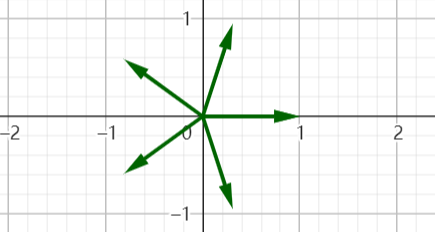

# 2023.5.21期

## 第21题

21. 我们知道，$C_{n+1}^{k+1}=C_n^k+C_n^{k+1}$，借此我们可以对高次多项式进行求和，以此，$\{n^3\}$的前n项和为___

    ### 参考答案与解析

    #### 方法一

    > 解：借助$C_{n+1}^{k+1}=C_n^k+C_n^{k+1}$可知
    > $$
    > C_{n+1}^3=C_{n}^2+C_n^3
    > $$
    > 即
    > $$
    > C_{n+1}^3-C_n^3=C_n^2
    > $$
    > 取上式中$n=3,4,5,\cdots,k-1$，累加有
    > $$
    > \begin{eqnarray}
    > C_{k}^3-C_3^3&=&C_3^2+C_4^2+C_5^2+\cdots+C_{k-1}^2\\
    > &=&\sum_{i=3}^{k-1}\frac{i(i-1)}{2}\\
    > &=&-1-\frac{k(k-1)}{2}+\sum_{i=1}^{k}\frac{i(i-1)}{2}\\
    > &=&-\frac34k^2+\frac14k-1+\frac12\sum_{i=1}^{k}i^2\\
    > &=&\frac{k(k-1)(l-2)}{6}-1
    > \end{eqnarray}
    > $$
    > 解得
    > $$
    > \sum_{i=1}^ki^2=\frac{2k^3+3k^2+k}{6}
    > $$
    > 同理可得
    > $$
    > \begin{eqnarray}
    > C_k^4-C_4^4&=&\sum_{i=4}^{k-1}C_i^3\\
    > &=&\sum_{i=4}^{k-1}\frac{i(i-1)(i-2)}{6}\\
    > &=&-1-\frac{k(k-1)(k-2)}{6}+\sum_{i=1}^{k}\frac{i(i-1)(i-2)}{6}\\
    > &=&-1-\frac{k^3-3k^2+2k}{6}+\frac16\sum_{i=1}^{k}i^3-\frac12\sum_{i=1}^{k}i^2+\frac13\sum_{i=1}^{k}i\\
    > &=&-1-\frac{k^3-3k^2+2k}{6}+\frac16\sum_{i=1}^{k}i^3-\frac{2k^3+3k+k}{12}+\frac{k(k+1)}{6}\\
    > &=&\frac{k(k-1)(k-2)(k-3)}{24}-1
    > \end{eqnarray}
    > $$ { }
    > 从而解得
    > $$
    > \sum_{i=1}^ki^4=\frac{k^4+2k^3+k^2}{4}=\frac{(k^2+k)^2}{4}
    > $$
    > 所以$\{n^4\}$的前$n$项和为$\frac{(n^2+n)^2}{4}$。

    #### 方法二

    > 推断$n^3$求和的结果为一个含有关于$n$的四次表达式，设为
    > $$
    > S(n)=an^4+bn^3+cn^2+dn+f
    > $$
    >
    > > 此处也可进一步猜测$a=\frac14$。
    >
    > 考虑到
    > $$
    > S(0)=0
    > $$
    > 所以
    > $$
    > S(n)=an^4+bn^3+cn^2+dn
    > $$
    > 进而
    > $$
    > \begin{eqnarray}
    > n^3&=&S(n)-S(n-1)\\
    > &=&a(4n^3-6n^2+4n-1)+b(3n^2-3n+1)+c(2n-1)+d\\
    > &=&4an^3+(3b-6a)n^2+(2c-3b+4a)n+d-c+b-a
    > \end{eqnarray}
    > $$
    > 令对应项系数相等
    > $$
    > \begin{cases}
    > 4a=1\\
    > 3b-6a=0\\
    > 2c-3b+4a=0\\
    > d-c+b-a=0
    > \end{cases}
    > $$
    > 解得
    > $$
    > \begin{cases}
    > a=\frac14\\
    > b=\frac12\\
    > c=\frac14\\
    > d=0
    > \end{cases}
    > $$
    > 代入原式
    > $$
    > S(n)=\frac14n^4+\frac12n^3+\frac14n^2=\frac{n^4+2n^3+n^2}{4}=\frac{n^2(n+1)^2}{4}=\frac{(n^2+n)^2}{4}
    > $$

    ### 命题思路与背景

    > 我们都听说过杨辉三角：
    > $$
    > \begin{matrix}
    > &&&&C_0^0=1&&&\\
    > &&&C_1^0=1&&C_1^1=1&&\\
    > &&C_2^0=1&&C_2^1=2&&C_2^2=1&\\
    > &C_3^0=1&&C_3^1=3&&C_3^2=3&&C_3^3=1\\
    > C_4^0=1&&C_4^1=4&&C_4^2=6&&C_4^3=4&&C_4^4=1\\
    > &&&&\vdots&&&&
    > \end{matrix}
    > $$
    > 我们从斜向的方向从上往下看，最左上方的一斜行中的数字组成常数列1、1、1、1、1、……，它右下方邻近的一斜行中的数字为等差数列1、2、3、4、……，为常数列求和的结果。然后，再向右下方看，我们注意到那一斜行的数字组成数列1、3、6、……恰好为前面的等差数列前$n$项和，以此类推，我们估计任何一斜行的数字均为上一斜行数字的求和结果。
    >
    > 这一规律自然也是不难理解的：我们知道，杨辉三角中的数字可以表示为其“两肩”上数字的和，即$C_{n+1}^{m+1}=C_n^{m+1}+C_{n}^{m}$，标记出$C_3^2$和它两肩上的数字来看
    > $$
    > \begin{matrix}
    > &&&&C_0^0=1&&&\\
    > &&&C_1^0=1&&C_1^1=1&&\\
    > &&C_2^0=1&&\color{RED}{C_2^1=2}&&\color{RED}{C_2^2=1}&\\
    > &C_3^0=1&&C_3^1=3&&\color{RED}{C_3^2=3}&&C_3^3=1\\
    > C_4^0=1&&C_4^1=4&&C_4^2=6&&C_4^3=4&&C_4^4=1\\
    > &&&&\vdots&&&&
    > \end{matrix}
    > $$
    > 我们看到，$C_3^2$实际上是表示成了同一斜行的上一个数字与上一斜行的一个对应的数字的和，以此递推便可以解释前边的规律。
    >
    > 同时，我们由组合数的公式，可以写出各个斜行的通项公式如下：
    > $$
    > C_n^0=1\\
    > C_n^1=n\\
    > C_n^2=\frac{n(n-1)}{2}\\
    > C_n^3=\frac{n(n-1)(n-2)}{6}\\
    > \vdots
    > $$
    > 因而，我们推断$C_n^3=\frac{n(n-1)(n-2)}{6}$为$C_n^2=\frac{n(n-1)}{2}$求和的结果，继而，我们可以得到$n^2$的前$n$项和。用类似的思路，我们可以得到$n^3$、$n^4$、$\cdots$、$n^k$的前$n$项和。
    >
    > 此处考虑到$n^2$前$n$项和的求和太过简单，而更高次的情形的求和计算过于复杂，所以选择了对$n^3$进行求和。
    >
    > 实际上，课本上也曾对这一原理进行了简单的提及与探究。

    ### 简析

    > 题目以一条重要的组合数公式为方法解决数列求和问题，反映了知识的灵活运用。题目思维量不多，但是计算量比较大。约15～16题难度。

## 第22题

22. 一个箱子中方有若干除编号外完全相同的小球，而且所有$x+y$个编号中，有$x$个编号当中每个编号只被标在了一个小球上，$y$个编号当中每个编号被标在了$n$个小球上，每个小球只有一个确定的编号。为统计$x$、$y$、$n$的取值，现进行多轮摸球试验，记录每轮实验中摸完第$k$个球时在本轮试验中出现的不同编号个数$m_k$，最后计算$m_k$的平均值$N_k$。每次摸球只摸一个，摸出小球后放回并摇匀，每轮实验中摸球次数足够多。则$E(N_k)$的表达式可以是：

    A. $E(N_k)=\frac{x}{x+yn}[x-x(\frac{x-1}{x})^{k+1}+y-y(\frac{y+1}{y})^k]+\frac{yn}{x+yn}[x-x(\frac{x-1}{x})^{k}+y-y(\frac{y+1}{y})^{k+1}]$

    B. $E(N_k)=\frac{x^2}{x+yn}[1-(\frac{x-1}{x})^k]+\frac{y^2n}{x+yn}[1-(\frac{y-1}{y})^k]$

    C. $E(N_k)=x[1-(1-\frac{1}{x+yn})^k]+y[1-(1-\frac{n}{x+yn})^k]$

    D. $E(N_k)=x[1-(\frac{x-1}{x})^{\frac{x}{x+yn}k}]+y[1-(\frac{y-1}{y})^{\frac{yn}{x+yn}k}]$

    ### 参考答案与解析

    #### 方法一

    > 解：由题意，球的总数为$x+yn$
    >
    > 设某一轮实验的第$k$次摸取当中，摸出只对应一个球的编号的个数为$A_k$，摸出对应$n$个球的编号的个数为$B_k$，则
    > $$
    > P(A_{k+1}=A_k)=\frac{A_k+yn}{x+yn}
    > $$
    >
    > $$
    > P(A_{k+1}=A_k+1)=\frac{x-A_k}{x+yn}
    > $$
    >
    > $$
    > E(A_{k+1})=A_k\frac{A_k+yn}{x+yn}+(A_k+1)\frac{x-A_k}{x+yn}=A_k+\frac{x-A_k}{x+yn}
    > $$
    >
    > 鉴于第$k$次摸取时$A_k$已经确定，所以
    > $$
    > E(A_k)=A_k
    > $$
    >
    > $$
    > E(A_{k+1})=E(A_k)+\frac{x-E(A_k)}{x+yn}=E(A_k)\left(1-\frac{1}{x+yn}\right)+\frac{x}{x+yn}
    > $$
    >
    > 即
    > $$
    > E(A_{k+1})-x=\left(1-\frac1{x+yn}\right)\left[E(A_k)-y\right]
    > $$
    > > 这里是尝试构造等比数列，我们一般会考虑构造递减的等比数列$\{E(A_{k})-\lim_{i\to+\infty}E(A_i)\}$来描述$E(A_k)$趋近于一个定值这种现象。
    >
    > 而
    > $$
    > E(A_0)=0
    > $$
    >
    > $$
    > E(A_0)-x=-x\ne0
    > $$
    >
    > 此时，不难证明$\{E(A_k)-x\}$为等比数列，进而可得
    > $$
    > E(A_k)-x=-x\left(1-\frac{1}{x+yn}\right)^{k}
    > $$
    >
    > $$
    > E(A_k)=x\left[1-\left(1-\frac1{x+yn}\right)^k\right]
    > $$
    >
    > 类似地计算$E(B_k)$
    > $$
    > P(B_{k+1}=B_k)=\frac{x+nB_k}{x+yn}
    > $$
    >
    > $$
    > P(B_{k+1}=B_k+1)=\frac{yn-nB_k}{x+yn}
    > $$
    >
    > $$
    > E(B_k)=B_k+\frac{yn-nB_k}{x+yn}=B_k\left(1-\frac{n}{x+yn}\right)+\frac{yn}{x+yn}=E(B_k)\left(1-\frac{n}{x+yn}\right)+\frac{yn}{x+yn}
    > $$
    >
    > $$
    > E(B_{k+1})-y=\left(1-\frac{n}{x+yn}\right)\left[E(B_k)-y\right]
    > $$
    >
    > $$
    > E(B_k)=y\left[1-\left(1-\frac{n}{x+yn}\right)^k\right]
    > $$
    >
    > 从而
    > $$
    > E(N_k)=E(A_k+B_k)=E(A_k)+E(B_k)=x\left[1-\left(1-\frac1{x+yn}\right)^k\right]+y\left[1-\left(1-\frac{n}{x+yn}\right)^k\right]
    > $$
    > 故选C

    > 为了严谨性，在这一思路之前实际上需要先证明一个引理：
    >
    > > 存在离散型随机变量$X$、$Y$、$Z$，$P(X=Y)=p$，$P(X=Z)=q$，则有$E(X)=pE(Y)+qE(Z)$。
    >
    > 证明：假设$Y$的可能取值为$y_1$、$y_2$、$y_3$、$\cdots$、$y_m$，$Y$取到那些值的概率分别为$a_1$、$a_2$、$a_3$、$\cdots$、$a_n$；$Z$的可能取值为$z_1$、$z_2$、$z_3$、$\cdots$、$z_n$，$Y$取到那些值的概率分别为$b_1$、$b_2$、$b_3$、$\cdots$、$b_n$。
    >
    > 则有
    > $$
    > \begin{eqnarray}
    > E(X)&=&\sum_{i=1}^m pa_iy_i+\sum_{i=1}^n qa_iz_i=p\sum_{i=1}^m a_iy_i+q\sum_{i=1}^n a_iz_i=pE(Y)+qE(Z)
    > \end{eqnarray}
    > $$
    > 证毕。

    #### 方法二

    > 易知
    > $$
    > E(N_1)=1
    > $$
    > A项中
    > $$
    > E(N_1)=\frac{2x}{x+yn}+\frac{2yn}{x+yn}=2
    > $$
    > 故排除A项
    >
    > 考虑到$k\to+\infin$时有
    > $$
    > E_{k}\to x+y
    > $$
    > 但是，不难发现，B项当中
    > $$
    > E(N_k)\to\frac{x^2+y^2n}{x+yn}=x+y-\frac{xyn+xy}{x+yn}\ne x+y
    > $$
    > 故排除B项
    >
    > 因为$k$次抽取后，可能出现的基本事件数目有限，可得
    > $$
    > E(N_k)\in\Q
    > $$
    > 然而，D项中若取$x=y=2$，$n=1$，则
    > $$
    > E(N_{3})=2\left[1-\left(\frac12\right)^{\frac32}\right]+2\left[1-\left(\frac12\right)^{\frac32}\right]=4-\sqrt2\notin\Q
    > $$
    > 故排除D项
    >
    > 故选C

    ### 命题思路与背景

    > 实际上，题目的命题背景是Minecraft中的紫颂树种数的测算。因为直接计算太过复杂，自己曾设想过使用这种“抽取”的办法进行测量，但是很长一段时间也都没有实际地去做。
    >
    > 当时给出的方法是，假设生成紫颂树时的RNG（随机数发生器）状态有限，总共为$N$种，而对应的RNG状态有$n_i$种的紫颂树有$x_i$种，我们不断地生成紫颂树，统计随着生成的紫颂树生成的次数增长时发现的不同紫颂树种数的变化情况，并以此估计$n_i$、$x_i$的数量，从而估计紫颂树的总数。
    >
    > 为了得到一个由变化趋势推算$n_i$、$x_i$的方法，这里先来讨论一个$i$只能取值1和2的简化情形。此时可以将上面所建立的模型重新表述如下：
    >
    > > 对应的RNG状态有$n_1$种的紫颂树有$x_1$种、对应的RNG状态有$n_2$种的紫颂树有$x_2$种。
    >
    > 将其转化为我们熟悉的摸球问题以便出题：
    >
    > > $x_1+x_2$个编号当中，前$x_1$个编号当中的每一个编号被标到$n_1$个球上，后$x_2$个编号中每一个编号被标到$n_2$个球上。
    >
    > 因为某些原因，最终又令$n_1$、$n_2$中某一个为1，然后又对符号与表述做出调整，给出大致的情景。
    >
    > > 一个箱子中方有若干除编号外完全相同的小球，而且所有$x+y$个编号中，有$x$个编号当中每个编号只被标在了一个小球上，$y$个编号当中每个编号被标在了$n$个小球上，每个小球只有一个确定的编号。
    >
    > 按照原先设想的试验方法给出测定$x$、$y$、$n$三个参数这一背景与题目要求
    >
    > > 为统计$x$、$y$、$n$的取值，现进行多轮摸球试验，记录每轮实验中摸完第$k$个球时在本轮试验中出现的不同编号个数$m_k$，最后计算$m_k$的平均值$N_k$。每次摸球只摸一个，摸出小球后放回并摇匀，每轮实验中摸球次数足够多。求$E(N_k)$。
    >
    > 接着便尝试得到题目的答案。但是，前几次尝试都是失败的，这样便得到了A、B、D三个错误选项。最后才得到正确答案。
    >
    > 因为当时只给出了正确答案的一个不一定太严谨的计算过程，而且当时已经有了三个错误选项，而且错误选项的错误原因貌似都较为典型，同时这些错项也可以通过特殊值与正确选项区分开来，可以使用“排除法”（实际上自己当时给出的答案就是用的排除法）解答，所以就将题目形式定为选择题，并把“$E(N_k)$是”这种表述改为“$E(N_k)$可以是”。

    ### 简析

    > 可以考察利用可用知识判断既有的复杂表达式正确性或者概率统计与数列结合两个技巧点，前者在物理试题中时有出现，亦不能排除在数学中出现的可能性。5～7题难度。

## 第23题

23. 除我们所熟知的欧里几得距离外，距离在不同的情境中又有着多种不同的含义。用$n(C)$表示集合$C$中元素的个数，则两个有非空交集的集合$A$、$B$间距离$d$的一种定义为$d=\frac{n(A\cup B)-n(A\cap B)}{n(A\cap B)}$。某场考试中有足够多且数目不确定的考生参加，所有考生组成全集$U$，对任意集合C，规定$\overline{C}=\complement_UC$。其中有道试题Q，会做Q的考生组成集合$A$，做对Q的考生组成集合$B$。定义Q的“SD系数”$a$为集合$A$、$\overline{B}$间的距离，“SB系数”b为集合$\overline{A}$，$B$间的距离。$\forall (X,Y)\in\{(X,Y)|X=A或\overline{A},Y=B或\overline{B}\}$，$X\cap Y\ne \emptyset$。

    (1) 写出$a$、$b$的取值范围，并解释$a=b=k$时$k$增大的现实意义；

    (2) 以频率估计概率，记$X$: 任取一考生，会做Q，$Y$：任取一考生，做对Q，求证：$a=\frac{P(\overline{X}|\overline{Y})}{P(X|\overline{Y})}+\frac{P(Y|X)}{P(\overline{Y}|X)}$；

    (3) (2)中事件$X$、$Y$是否可能独立，若可能，求$X$、$Y$独立且$P(X)=P(Y)$时$\frac{1}{a}+\frac{1}{b}$的最值，否则说明理由。

    ### 参考答案

    > （1）解：$a$、$b$的取值范围为
    > $$
    > \left\{x\in\Q|x\ge0\right\}
    > $$
    > $k$增大时，
    > $$
    > \begin{eqnarray}
    > a+1&=&\frac{n(A\cup\overline B)}{n(A\cap\overline B)}=b+1=\frac{n(\overline A\cup B)}{n(\overline A\cap B)}\\
    > &=&\frac{n(A\cup\overline B)+n(\overline A\cup B)}{n(A\cap\overline B)+n(\overline A\cap B)}\\
    > &=&\frac{n(A)+n(\overline B)-n(A\cap\overline B)+n(\overline A)+n(B)-n(\overline A\cap B)}{n(A\cap\overline B)+n(\overline A\cap B)}\\
    > &=&\frac{2n(U)}{n(A\cap\overline B)+n(\overline A\cap B)}-1
    > \end{eqnarray}
    > $$
    > 增大
    > $$
    > \frac{n(A\cap\overline B)+n(\overline A\cap B)}{n(U)}
    > $$
    > 减少
    >
    > 即会做$Q$而做错或不会做$Q$而做对的考生在考生整体当中的占比减少，$Q$更能反映学生的真实能力。
    >
    > （2）证明：由题意
    > $$
    > \begin{eqnarray}
    > 	&&\frac{P(\overline{X}|\overline{Y})}{P(X|\overline{Y})}+\frac{P(Y|X)}{P(\overline{Y}|X)}\\
    > 	&=&\frac{\frac{P(\overline{X}~\overline{Y})}{P(\overline{Y})}}{\frac{P(X~\overline{Y})}{P(\overline{Y})}}+\frac{\frac{P(XY)}{P(X)}}{\frac{P(\overline{Y}X)}{P(X)}}\\
    > 	&=&\frac{P(\overline{X}~\overline{Y})}{P(X~\overline{Y})}+\frac{P(XY)}{P(\overline{Y}X)}\\
    > 	&=&\frac{P(\overline{X}~\overline{Y})+P(XY)}{P(X\overline{Y})}\\
    > 	&=&\frac{\frac{n(\overline A\cap \overline{B})}{n(U)}+ \frac{n(A\cap {B})}{n(U)}}{\frac{n(A\cap \overline{B})}{n(U)}}\\
    > 	&=&\frac{n(\overline A\cap \overline{B})+ n(A\cap {B})}{n(A\cap \overline{B})}\\
    > 	&=&\frac{n(A\cap \overline{B})+n(A\cap B)+n(\overline A\cap \overline{B})-n(A\cap \overline{B})}{n(A\cap \overline{B})}\\
    > 	&=&\frac{n(A\cup \overline{B})-n(A\cap \overline{B})}{n(A\cap \overline{B})}\\
    > 	&=&a
    > \end{eqnarray}
    > $$
    > （3）解：$X$、$Y$可能独立。
    >
    > 此时
    > $$
    > \begin{eqnarray}
    > \frac1a&=&\frac{1}{\frac{P(\overline{X}|\overline{Y})}{P(X|\overline{Y})}+\frac{P(Y|X)}{P(\overline{Y}|X)}}=\frac{1}{\frac{P(\overline X)}{P(X)}+\frac{P(Y)}{P(\overline{Y})}}=\frac{1}{\frac{P(\overline X)}{P(X)}+\frac{P(X)}{P(\overline{X})}}\le\frac12
    > \end{eqnarray}
    > $$
    > 当且仅当$P(X)=\frac12$时等号成立。
    >
    > 借助（2）的思路，同理不难证明，$\frac{1}{b}\le12$，当且仅当$P(X)=\frac12$时等号成立。
    >
    > 所以，$\frac1a+\frac1b\le1$，当且仅当$P(X)=\frac12$时等号成立。
    >
    > 当$P(X)\to0$时，$\frac1a+\frac1b\to0$，但不能等于0。
    >
    > 即$\frac1a+\frac1b$最大值为1，无最小值。

    ### 解析

    > 算就完了？或许算了就真完了。

    ### 命题思路与背景

    > 先拿出能考证出的最早的一个版本
    >
    > > 一道试题，学生会做、做对分别记为$A$、$B$。记其“傻逼系数”$a=P(A|\overline B)$，“死爹系数”$b=P(\overline{A}|B)$，用$R=\frac ab\cdot\frac{P(B)}{P(\overline{B})}$表示该试题的得分难易。证明：$R=\frac{P(\overline A)}{P(A)}\cdot\frac{P(A\overline B)}{P(\overline AB)}$。
    >
    > 这道题的命题背景是平时做题中遇到的“会做但总是做不对”和“不会做但就是能做对”的两种坑爹试题，而且题目的形式是有意地模仿2022年新高考I卷的概统大题的。
    >
    > 后来联想到之间在某处见到的两个集合之间距离定义（应该是Jaccard距离），又尝试给这道题加上这样一个背景，以增大情景的复杂度。但是，因为当时忘记了集合间距离的定义式的具体形式，只记得定义式是有两个集合交集和并集的数量组成的，自己只能按照“集合间差异越大，距离越大”和“距离理应可以趋向无穷大”猜测出一个与Jaccard距离相似而又不同的定义。然后，自己又按照这一集合间距离的实际意义重新定义了两个系数。
    >
    > 接着，选取其中一个系数，利用条件概率的性质进行运算，得到要证明的式子：
    > $$
    > a=\frac{1}{P(A|\overline B)}+\frac1{P(\overline B|A)}-2
    > $$
    > 这也就是当时张贴到告示栏的第二问的最终版本。
    >
    > 接着给出其他两问。当时在网上见到的一套试题当中，有一道解释概率统计习题当中的数学现象的现实意义的题目，以此为灵感，添加了第一问。同时，事件独立的定义也算是一个比较冷门的知识点，但是确实在高考当中出现过（2021年新高考I卷第8题），为避免过度忽视，这里又基于此命制了第三问。
    >
    > 后来在录入试题时将题干中的不雅词汇转为拼音缩写，并对第二问当中的式子做了进一步的整理。

    ### 简析

    > 题目是一道基于新定义的概率和集合的综合题，考察了直观推测与理论计算两方面的能力，难度约在19～20题水平。可以尝试。

## 第24题

24. 下列关于方根的命题中，真命题的个数为___

    - $p:x\in N$，$x$的个位为2、3、7、8中的一个  $q:\sqrt{x}\notin Q$，p为q的既不充分也不必要条件
    - $p:x\in N, ^n\sqrt{x}\in Q,n\in N^*$且$n\ge2$  $q:^n\sqrt{x}\in N$，p为q的充要条件
    - $p\in N$，$x$末位确定为$k$，其余位数字可变，$^4\sqrt{x}\notin Q$恒成立  $q:$改变x的十位及更高位数字，可使$^{2020}\sqrt{x}\in Q$，$p$是$q$的充分条件
    - $p:x$为无限循环小数，$\sqrt{x}\in Q$  $q:\sqrt{x}$为无限循环小数，$p$是$q$的充要条件
    - 1的2023次方跟有2023个，且和为实数

    ### 参考答案与解析

    > （1）证明：假设整数$k=\sqrt{x}=\sum_{i=0}^n 10^i\cdot d_i$，则
    > $$
    > k^2=x=\left(\sum_{i=0}^n 10^i\cdot d_i\right)^2=(10^0d_0)^2+\sum_{i=1}^{2n}10^ic_i
    > $$
    > 其中$c_i$均为整数。所以，$x$的个位不受$c_i$影响，且等于$d_0^2$的个位。
    >
    > 取$k$的个位数$d_0$分别为0、1、2、3、4、5、6、7、8、9时，$x$与$d_0^2$的个位分别为0、1、4、9、6、5、6、9、4、1，注意到2、3、7、8不在其中，因此因此$\sqrt{x}$为整数时$x$的个位不能为2、3、7、8。
    >
    > 再假定$\sqrt{x}=\frac pq$，其中$\frac pq$为既约分数。此时$x=\frac{p^2}{q^2}$亦为既约分数，与$x$为自然数矛盾，故$\sqrt{x}$也不能为分数。
    >
    > 综上$\sqrt{x}$在其个位为2、3、7、8时为无理数，即$\sqrt{x}\notin\Q$，$p\implies q$成立。同时容易判定$q\implies p$不成立，所以$p$为$q$的充分不必要条件，第一项为假命题。
    >
    > （2）（不一定严谨）证明：假定$x\in\Q$但$x\notin\N$，考虑到$x\ge0$，则$^n\sqrt{x}\ge0$，可设$^n\sqrt{x}=\frac pq$，其中$\frac pq$为既约分数。此时$x=\frac{p^n}{q^n}$也为既约分数，与$x\in\N$矛盾。故$p\implies q$成立。反之，若$^n\sqrt{x}=1$，则$x=1$，$n=e$亦满足条件，但此时$p$并不成立。所以$p$为$q$的充分不必要条件，第二项为假命题。
    >
    > （3）证明：假设整数$k=^m\sqrt{x}=\sum_{i=0}^n 10^i\cdot d_i$，则
    > $$
    > k^2=x=\left(\sum_{i=0}^n 10^i\cdot d_i\right)^m=(10^0d_0)^m+\sum_{i=1}^{mn}10^ic_i
    > $$
    > 其中$c_i$均为整数。所以，$x$的个位不受$c_i$影响，且等于$d_0^m$的个位。
    >
    > 取$k$的个位数$d_0$为0～9中各值，$d_0^1$至$d_0^5$的个位取值如下表所示
    >
    > | $d_0^1$ | $d_0^2$ | $d_0^3$ | $d_0^4$ | $d_0^5$ |
    > | ------- | ------- | ------- | ------- | ------- |
    > | 0       | 0       | 0       | 0       | 0       |
    > | 1       | 1       | 1       | 1       | 1       |
    > | 2       | 4       | 8       | 6       | 2       |
    > | 3       | 9       | 7       | 1       | 3       |
    > | 4       | 6       | 4       | 6       | 4       |
    > | 5       | 5       | 5       | 5       | 5       |
    > | 6       | 6       | 6       | 6       | 6       |
    > | 7       | 9       | 3       | 1       | 7       |
    > | 8       | 4       | 2       | 6       | 8       |
    > | 9       | 1       | 9       | 1       | 9       |
    >
    > 可以注意到$d_0^5$的个位与$d_0^1$的个位相同。结合数学归纳法可证$a\in\N$时，$d_0^{4a+b}$的个位与$d_0^b$的相同。进而$d_0^{2020}$与$d_0^4$的个位相同。所以，整数的2020次方与整数的4次方的个位取值范围相同，均为$A=\{0,1,5,6\}$。不难验证，若$x$末位固定为$r$，则当$r\in A$时，高位数字均有至少一种取法使得$^4\sqrt{n}\in\N$，与$p$矛盾，所以$p$的条件下$r\notin A$，不能找到一个整数，使其2020次幂为某一个为为$r$的数，进而$q$不成立。$p$是$q$的既不充分也不必要条件，第三项为假命题。
    >
    > （4）（不一定严谨）证明：最简分数可以化为无限循环小数的充要条件为分母只有质因子2和5。有理数范围内进行平方与开方都不能消去分母的质因子。假设$p$成立，则$x$的分母上有2、5以外的质因子，$\sqrt x$的分母上也有2、5以外的质因子，$\sqrt x$为无限循环小数，$q$成立。反之亦然。所以$p$是$q$的充要条件。
    >
    > （5）【方法一】证明：设1的2023次方跟为$x=r(\cos\theta+i\sin\theta)$，其中$r\in\R$，$\theta\in[0,2\pi)$，则
    > $$
    > x^{2023}=r^{2023}(\cos\theta+i\sin\theta)^{2023}=r^{2023}[\cos{(2023\theta)+i\sin{(2023\theta)}}]=1
    > $$
    > 两边同时取模
    > $$
    > r^{2023}=1
    > $$
    > 所以
    > $$
    > \cos{(2023\theta)+i\sin{(2023\theta)}}=1=\cos(2k\pi)+i\sin{(2k\pi)},k\in\Z
    > $$
    > 所以可以取
    > $$
    > 2023\theta=2k\pi,k\in\Z
    > $$
    >
    > $$
    > \theta=\frac{2k\pi}{2023},k\in\Z
    > $$
    >
    > 考虑到$\theta\in[0,2\pi)$，则
    > $$
    > k\in\{k\in\Z|0\le k<2023\}
    > $$
    > 所以1有2023个2023次方根，这这些方根分别为$x_0$、$x_1$、$x_2$、$\cdots$、$x_{2022}$，而且
    > $$
    > x_k=\cos\frac{2k\pi}{2023}+i\sin\frac{2k\pi}{2023}
    > $$
    > 则
    > $$
    > \begin{eqnarray}
    > \sum_{i=0}^{2022}x_k&=&\sum_{i=0}^{2022}\cos\frac{2k\pi}{2023}+i\sum_{i=0}^{2022}\sin\frac{2k\pi}{2023}\\
    > &=&\sum_{i=0}^{2022}\cos\frac{2k\pi}{2023}+i\sum_{i=0}^{2023}\sin\frac{2k\pi}{2023}\\
    > &=&\sum_{i=0}^{2022}\cos\frac{2k\pi}{2023}+i\sum_{i=0}^{1011}\left[\sin\frac{(2023-2k-1)\pi}{2023}+\sin\frac{(2023+2k+1)\pi}{2023}\right]\\
    > &=&\sum_{i=0}^{2022}\cos\frac{2k\pi}{2023}+i\sum_{i=0}^{1011}\left[\sin\frac{(2k+1)\pi}{2023}-\sin\frac{(2k+1)\pi}{2023}\right]\\
    > &=&\sum_{i=0}^{2022}\cos\frac{2k\pi}{2023}
    > \end{eqnarray}
    > $$
    > 此时可得，1的2023次方根之和为实数。
    >
    > 【方法二】证明：设$x^3=1$的2023个方根分别为$z_1$、$z_2$、$z_3$、$\dots$、$z_{2023}$，则原方程$x^3-1=0$可表示为
    > $$
    > (x-z_1)(x-z_2)(x-z_3)\cdots(x-z_{2023})=0
    > $$
    > 不难得到，上述方程左端的展开式的2022次项系数为
    > $$
    > -(z_1+z_2+z_3+\dots+z_{2023})=0
    > $$
    > 从而原结论得证。
    >
    > 综上，第4、5条结论正确，故填2。
    >
    > 【方法三】（二级结论法）复平面内作出的1的2023个2023次方根对应的向量以实轴为对称轴对称分布，这表明任意一个虚根均有一个共轭的虚根与之对应，所以它们的和为实数。图为1的5个5次方根。
    >
    > 

    ### 命题思路与背景

    > 实际上最初对这道题的定位并不是一道真的要拿来做的题目，而只是用来暗含自己在高一时发现的一些在开方时会有用的结论：
    >
    > - 整数的$n$次方根要么是整数，要么是无理数。
    > - 以2、3、7、8结尾的整数的平方根以及$4k+2$次方根（$k\in\N$）一定是无理数。
    > - 不以0、1、5、6结尾的整数的四次方根以及$4k$次方根（$k\in\N^*$）一定是无理数。
    > - 以任何数字结尾的整数的三次、五次、$4k+3$、$4k+5$次方根（$k\in\N^*$）均有可能为有理数。
    >
    > 同时为了凑数又补上了4、5两条结论。接着给题目套了一个判断充分性与必要性的外壳，让题目更像是一道正经的题。

    ### 简评

    > 从刚出好这道题就开始认为，这道题实际上不像，也不应该是可以拿来做的题，有一些超纲内容，而且答案也有不严谨之处。
    >
    > 但是，题中的结论在很多时候属实有用，尤其是以2、3、7、8结尾的整数的平方根不是整数以及整数的方根不是分数这两条。
    >
    > 15～16题难度。

    