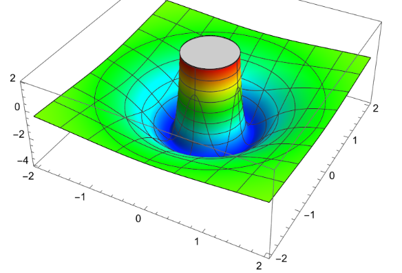

# 2023.5.29期

25. （只押题型，不押背景）Minecraft使用随机刻机制运算作物的生长。每经过1 gt（gt为一个不可细分的最小时间单位），每个区段中的4096个方块中会有3个被等可能地选中，如果被选中的方块为未成熟的作物，该作物会有一定的概率（称为生长成功概率）生长。某南瓜机中，每个区段包含64个南瓜梗（一种作物方块），其中生长成功概率为$\frac{1}{3}$和$\frac{1}{6}$的南瓜梗各占一半。南瓜梗成熟后可以在某个时间被收获，每个成熟的南瓜梗产出一个南瓜，南瓜梗在收获后需要成功生长一次才能再次成熟。各南瓜梗的生长互不影响。

    (1) 若未进行收获，求n gt后任取一个南瓜梗选中成熟的南瓜梗的概率$P_n$

    (2) 经过优化，现每个区段中64个南瓜成熟的概率均为$\frac{1}{3}$。为实现自动化收获，欲确定一个包含$T$个gt的工作周期。每个周期中前5 gt南瓜不能成功生长，每周期结束时所有成熟的南瓜梗将被全部收获，而后下一个周期立即开始。记一个周期结束后，每个区段在1 gt中平均产出的南瓜数目为随机变量$X$。

    ​	i. 求$X$的期望

    ​	ii. 用$X$的期望表示南瓜机的效率，将使得南瓜机效率最大的周期长记作$T_0$，试确定一个区间$[a,b]$，使得$T_0\in [a,b]$。要求$a\in N$，$b\in N$，$|a-b|\le100$。（只写出结果即可，过程不做要求）

    > （1）解：n gt后，设事件A：选中生长成功概率为$\frac13$的南瓜梗，B：选中生长成功概率为$\frac16$的南瓜梗，C：选中成熟的南瓜梗，则
    > $$
    > P(C)=\frac12P(C|A)+\frac12P(C|B)
    > $$
    >
    > $$
    > P(\overline{C}|A)=P(某1 gt内南瓜梗未生长)^n=\left(1-\frac3{4096}\cdot\frac13\right)^{n}
    > $$
    >
    > $$
    > P(\overline{C}|B)=\left(1-\frac3{4096}\cdot\frac16\right)^{n}
    > $$
    >
    > $$
    > P(C)=1-\frac12\left(\frac{4095}{4096}\right)^{n}-\frac12\left(\frac{8191}{8192}\right)^{n}
    > $$
    >
    > （2）解：（i）设事件M：一个周期末任选一个南瓜梗选中成熟的南瓜梗的概率，N：1gt内南瓜梗未生长。则
    > $$
    > P(M)=1-P(\overline M)=1-P(N)^{T-5}=1-\left(1-\frac{3}{4096}\cdot\frac13\right)^{T-5}=1-\left(\frac{4095}{4096}\right)^{T-5}
    > $$
    > 设周期内产出的南瓜数量为$Y$，由题意，$Y\sim B(64,P(M))$，则
    > $$
    > E(X)=\frac{E(Y)}{T}=\frac{64}{T}-\frac{64}{T}\left(\frac{4095}{4096}\right)^{T-5}
    > $$
    > （ii）包含205.75且长度不大于100的区间均可，一种思路如下：
    >
    > 令
    > $$
    > f(T)=\frac{64}{T}-\frac{64}{T}\left(\frac{4095}{4096}\right)^{T-5}
    > $$
    > 则
    > $$
    > f'(T)=-\frac{64}{T^2}-\left(\frac{4095}{4096}\right)^{T-5}\left(-\frac{64}{T^2}+\frac{64}{T}\ln\frac{4095}{4096}\right)
    > $$
    > 整理得
    > $$
    > f'(T)=\frac{64}{T^2}\left[\left(\frac{4095}{4096}\right)^{T-5}\left(1-T\ln\frac{4095}{4096}\right)-1\right]
    > $$
    > 取
    > $$
    > g(T)=\left(\frac{4095}{4096}\right)^{T-5}\left(1-T\ln\frac{4095}{4096}\right)-1
    > $$
    > 则
    > $$
    > g'(T)=\left(\frac{4095}{4096}\right)^{T-5}\left[-T\left(\ln\frac{4095}{4096}\right)^2\right]<0
    > $$
    > 故$(5,+\infty)$上$g(T)$、$f'(T)$至多有一个零点。不难证明，若该零点存在，则其必为$T_0$。
    >
    > 同时，我们可以得到
    > $$
    > \left(\frac{4095}{4096}\right)^{T-5}=e^{(T-5)\ln\frac{4095}{4096}}
    > $$
    > 我们不妨另$(T_0-5)\ln\frac{4095}{4096}$为$k$，则
    > $$
    > T_0=\frac{k}{\ln\frac{4095}{4096}}+5\approx5-4096k
    > $$
    >
    > $$
    > g(T_0)=e^k\left(1-k-5\ln\frac{4095}{4096}\right)-1=0
    > $$
    >
    > 从而
    > $$
    > e^{k-1+5\ln\frac{4095}{4096}}\left(k-1+5\ln\frac{4095}{4096}\right)=e^{-1+5\ln\frac{4095}{4096}}
    > $$
    > 设$t=k-1+5\ln\frac{4095}{4096}$，则
    > $$
    > te^t=e^{-1+5\ln\frac{4095}{4096}}
    > $$
    > 右侧提取因式$e^{-1}$后对指、对函数应用切线拟合
    > $$
    > te^t\approx1+e^{-1}\left[1+\left(-\frac{5}{4096}\right)\right]=-\frac{4091}{4096e}
    > $$
    > 在$t=-1$附近对$te^t$应用泰勒展开
    > $$
    > -\frac{4091}{4096e}\approx te^t\approx\frac1e\left(-1+\frac{(t+1)^2}{2}+\frac{(t+1)^4}{8}\right)
    > $$
    > 另$u=(t+1)^2$，则由上式整理有
    > $$
    > \frac18u^2+\frac12u-\frac{5}{4096}\approx0
    > $$
    > 解得
    > $$
    > u=\frac{-\frac12+\sqrt{\frac14+\frac{5}{8192}}}{\frac14}=\frac{\sqrt{4106}-64}{32}
    > $$
    > 借助完全平方公式试根可以估计
    > $$
    > \sqrt{4106}\approx64+\frac{10}{128}
    > $$
    > 所以
    > $$
    > u\approx\frac{10}{4096}
    > $$
    >
    > $$
    > t\approx\frac{3.16}{64}-1
    > $$
    >
    > $$
    > k\approx\frac{207.24}{4096}
    > $$
    >
    > $$
    > T_0\approx207.24
    > $$
    >
    > 断言估计值与准确值间的误差不大于50，所以可以给出所求区间
    > $$
    > [157.24,257.24]
    > $$

26. 我们称有多个自变量的函数为多元函数，记为$f(a_1,a_2,\dots,a_n)$。研究多元函数的单调性时，我们常采用“求偏导”的方法，即仅将各参数中的一个视为为一个主元，将其它的参数视作常数来对主元求导。记$f(a_1,a_2,\dots,a_n)$关于$a_1$的偏导为$\frac{\partial f(a_1,a_2,\dots,a_n)}{\partial a_1}$。另外，定义二元函数$f(x,y)$的“嵴”为平面直角坐标系$xOy$中方程$[\frac{\partial f(x,y)}{\partial x}]^2+[\frac{\partial f(x,y)}{\partial y}]^2=0$的图像。例如，函数$g(x,y)=x^2$的嵴为直线$x=0$。

    (i) $f(x,y)=\frac{1}{(x^2+y^2)^2}-\frac{4}{x^2+y^2}$的嵴围成的面积为___（如嵴不是封闭图形，填写0）；

    (ii) 多项式$\frac{1}{16}x^4-x^2y+xy^2$的取值范围为___（$x>0,y>0$）。

    > （i）【方法一】解：由题意
    > $$
    > \frac{\partial f(x,y)}{\partial x}=-\frac{-4x^3-4y^2x}{(x^2+y^2)^4}+\frac{8x}{(x^2+y^2)^2}=\frac{4x\left[2(x^2+y^2)-1\right]}{(x^2+y^2)^3}
    > $$
    >
    > $$
    > \frac{\partial f(x,y)}{\partial y}=-\frac{-4y^3-4x^2y}{(x^2+y^2)^4}+\frac{8y}{(x^2+y^2)^2}==\frac{4y\left[2(x^2+y^2)-1\right]}{(x^2+y^2)^3}
    > $$
    >
    > 令
    > $$
    > \left[\frac{\partial f(x,y)}{\partial x}\right]^2+\left[\frac{\partial f(x,y)}{\partial y}\right]^2=0
    > $$
    > 经整理得
    > $$
    > \frac{16[2(x^2+y^2)-1]}{(x^2+y^2)^5}=0
    > $$
    > 即
    > $$
    > x^2+y^2=\frac12
    > $$
    > 所得原函数的嵴为一个以原点为圆心，半径为$\frac{\sqrt2}{2}$的圆，其面积为$\frac\pi2$。
    >
    > 【方法二】解：由$f(x,y)$的解析式推知，$f(x,y)$在坐标系$Oxyz$中的图像为某一定义在$(0,+\infty)$的函数的图像绕$z$轴旋转而成，由对称性，函数值仅与$(x,y)$到原点的距离的平方$s=r^2=x^2+y^2$有关，则$f(x,y)$可改写为
    > $$
    > f(x,y)=\frac1{s^2}-\frac4{s}=g(s)
    > $$
    > 由题意易知$f(x,y)$在其嵴上关于$x$、$y$的偏导均为0，直观上可得函数图象在嵴上的图像是像一元函数的极值点那样“平坦”的（对应下图中最低处）。所以，$f(x,y)$的图像在嵴上的位置处在靠近或远离原点的方向上也是“平坦”的，我们只需求$g(s)$的极值点即可。
    >
    > 
    >
    > 不难得到，$g(s)$在正实数范围内的唯一极值点为$\frac12$，在那一极值点处有
    > $$
    > x^2+y^2=s=\frac12
    > $$
    > 以此亦能求出嵴围成的图形的面积。
    >
    > （2）解：设
    > $$
    > z=\frac{1}{16}x^4-x^2y+xy^2
    > $$
    > 由题意
    > $$
    > \frac{\partial z}{\partial y}=x(2y-x)
    > $$
    > $0<y<\frac x2$，$\frac{\partial z}{\partial y}<0$，$z$随$y$单调递减；
    >
    > $y>\frac x2$，$\frac{\partial z}{\partial y}>0$，$z$随$y$单调递增；
    >
    > 所以
    > $$
    > z\ge z||_{y=\frac x2}=\frac1{16}x^4-\frac14x^3=h(x)
    > $$
    >
    > $$
    > h'(x)=\frac14x^3-\frac34x^2=\frac14x^2(x-3)
    > $$
    >
    > $0<x<3$，$h'(x)<0$，$h(x)$单调递减；
    >
    > $x>3$，$h'(x)>0$，$h(x)$单调递增；
    >
    > 所以
    > $$
    > z\ge h(x)\ge h(3)=\frac{81}{16}-\frac{27}{4}=-\frac{27}{16}
    > $$
    > 当且仅当$x=2y=3$时等号成立。所以原多项式的最小值为$-\frac{27}{16}$。

27. 我们知道，使用二分法可以求解单调函数零点的近似值，类似地，“$k$分法”的一轮计算中，已知零点所在的区间会被等分为$k$个子区间，然后所有子区间交界处的函数值会被求出（同一位置只求一次）以确定零点所在的子区间。子区间确定后，下一轮的计算会在这个子区间上重新开始，直到确定零点所在的的区间长度（上下界差的绝对值）足够小。每轮计算均不可中途终止。现有一个在$R$上单调递增的函数$f(x)$，已知其唯一零点$x_0\in(827,828)$。记“$k$分法”的效率为附加信息量$log_2\frac{初始区间长度}{确定零点所在的最小子区间长度}$在每次对给定函数求值时的平均增量。

    (1) 用4分法将$f(x)$的零点确定在一个长度不大于$10^{-4}$的区间中，需对$f(x)$求值的次数为___；

    (2) 由于配置问题，“$k$分法“在某计算机上完成第4096轮时会因堆栈溢出而终止计算且无法输出结果。现欲确定$x_0$的第2023位小数，且使用可能有效的效率最高的“$k$分法“算法，对$f(x)$求值的次数至少为___。

    （参考数据：$lg2\approx 0.301030$，$lg3\approx0.477121$，$lg7\approx 0.845098$）

    > （1）解：设完成$n$轮计算后，确定零点所在的子区间长度为$L_n$，由题意，
    > $$
    > L_{n+1}=\frac14L_n
    > $$
    >
    > $$
    > L_0=1
    > $$
    >
    > 不难证明$\{L_n\}$为等比数列，且
    > $$
    > L_n=\frac{1}{4^n}
    > $$
    > 令
    > $$
    > L_n\le10^{-4}
    > $$
    > 两端同时取常用对数
    > $$
    > -2n\lg2\le-4
    > $$
    > 解得
    > $$
    > n\ge\frac{2}{\lg2}=\frac{2}{0.301030}\approx6.66
    > $$
    > 所以需要计算的轮数至少为7，而每轮计算需要对$f(x)$求证3次，故对$f(x)$求值的次数至少为3。
    >
    > （2）解：由题意，$k$分法的效率为
    > $$
    > f(x)=\frac{\log_2\frac{L_0}{L_0 k^{-n}}}{n(k-1)}=\frac{1}{\ln2}\cdot\frac{\ln k}{k-1}
    > $$
    >
    > $$
    > f'(x)=\frac{1}{\ln2}\cdot\frac{1-\frac{1}{k}-\ln k}{(k-1)^2}
    > $$
    >
    > 设
    > $$
    > g(x)=1-\frac1k-\ln k
    > $$
    > 则
    > $$
    > g'(x)=\frac{1-k}{k^2}
    > $$
    > 由题意$k>1$且$k\in\Z$，此时$g'(x)<0$，$g(x)$单调递减，$g(x)<g(1)=0$，所以$f'(x)<0$，$f(x)$单调递减。
    >
    > 为了能确定$x_0$的第2023位小数，则至少应能把$x_0$所在区间长度限制在$10^{-2023}$以内。所以
    > $$
    > k^{-4096}\le10^{-2023}
    > $$
    > 解得
    > $$
    > \lg k\ge\frac{2023}{4096}
    > $$
    > 而
    > $$
    > \lg3<\frac{2023}{4096}<\lg4=2\lg2
    > $$
    > 所以至少应该使用4分法计算，而这一算法又是可用算法中效率最高的。此时，需要进行的轮数
    > $$
    > N\ge\frac{2023}{\lg4}\approx3360.2
    > $$
    > 所以需要进行的轮数至少为3361次，需要对$f(x)$求值的次数为$3361\cdot3=10083$次。
    
    

