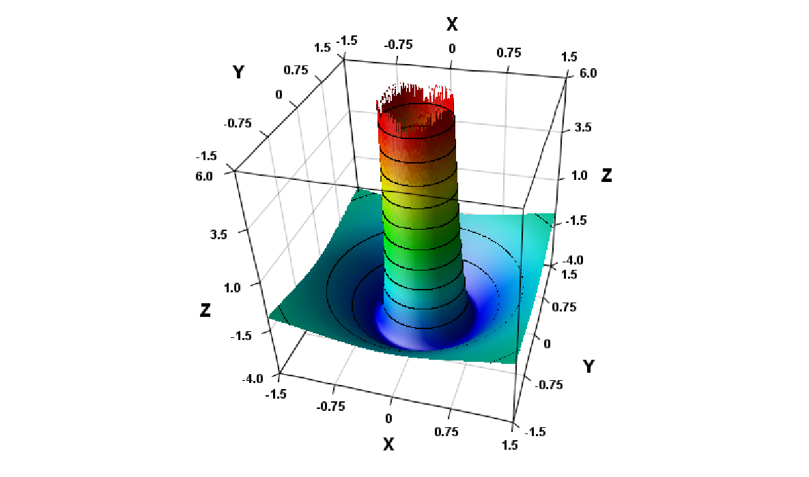
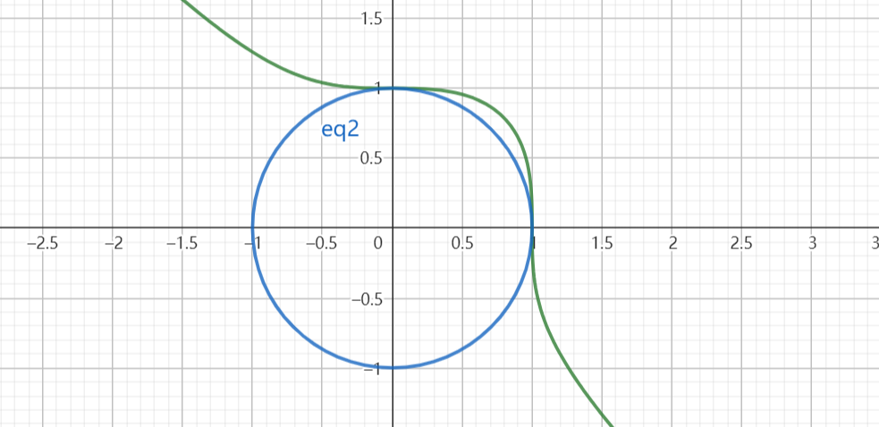
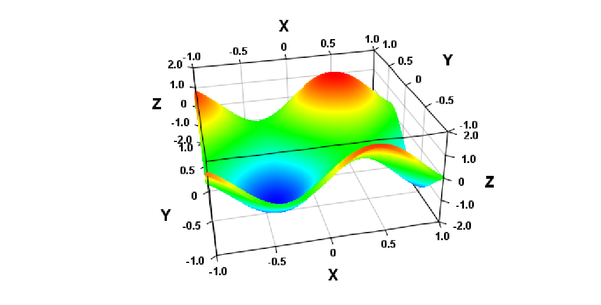

# 2023.5.29期

## 第25题

25. （只押题型，不押背景）Minecraft使用随机刻机制运算作物的生长。每经过1 gt（gt为一个不可细分的最小时间单位），每个区段中的4096个方块中会有3个被等可能地选中，如果被选中的方块为未成熟的作物，该作物会有一定的概率（称为生长成功概率）生长。某南瓜机中，每个区段包含64个南瓜梗（一种作物方块），其中生长成功概率为$\frac{1}{3}$和$\frac{1}{6}$的南瓜梗各占一半。南瓜梗成熟后可以在某个时间被收获，每个成熟的南瓜梗产出一个南瓜，南瓜梗在收获后需要成功生长一次才能再次成熟。各南瓜梗的生长互不影响。

    (1) 若未进行收获，求n gt后任取一个南瓜梗选中成熟的南瓜梗的概率$P_n$

    (2) 经过优化，现每个区段中64个南瓜成熟的概率均为$\frac{1}{3}$。为实现自动化收获，欲确定一个包含$T$个gt的工作周期。每个周期中前5 gt南瓜不能成功生长，每周期结束时所有成熟的南瓜梗将被全部收获，而后下一个周期立即开始。记一个周期结束后，每个区段在1 gt中平均产出的南瓜数目为随机变量$X$。

    ​	i. 求$X$的期望

    ​	ii. 用$X$的期望表示南瓜机的效率，将使得南瓜机效率最大的周期长记作$T_0$，试确定一个区间$[a,b]$，使得$T_0\in [a,b]$。要求$a\in N$，$b\in N$，$|a-b|\le100$。（只写出结果即可，过程不做要求）

    ### 参考答案

    > （1）解：n gt后，设事件A：选中生长成功概率为$\frac13$的南瓜梗，B：选中生长成功概率为$\frac16$的南瓜梗，C：选中成熟的南瓜梗，则
    > $$
    > P(C)=\frac12P(C|A)+\frac12P(C|B)
    > $$
    >
    > $$
    > P(\overline{C}|A)=P(某1 gt内南瓜梗未生长)^n=\left(1-\frac3{4096}\cdot\frac13\right)^{n}
    > $$
    >
    > $$
    > P(\overline{C}|B)=\left(1-\frac3{4096}\cdot\frac16\right)^{n}
    > $$
    >
    > $$
    > P(C)=1-\frac12\left(\frac{4095}{4096}\right)^{n}-\frac12\left(\frac{8191}{8192}\right)^{n}
    > $$
    >
    > （2）解：（i）设事件M：一个周期末任选一个南瓜梗选中成熟的南瓜梗的概率，N：1gt内南瓜梗未生长。则
    > $$
    > P(M)=1-P(\overline M)=1-P(N)^{T-5}=1-\left(1-\frac{3}{4096}\cdot\frac13\right)^{T-5}=1-\left(\frac{4095}{4096}\right)^{T-5}
    > $$
    > 设周期内产出的南瓜数量为$Y$，由题意，$Y\sim B(64,P(M))$，则
    > $$
    > E(X)=E\left(\frac{Y}{T}\right)=\frac{E(Y)}{T}=\frac{64}{T}-\frac{64}{T}\left(\frac{4095}{4096}\right)^{T-5}
    > $$
    > （ii）包含205.75且长度不大于100的区间均可。
    >

    ### 解析

    > （1）注意善用相对事件简化运算，并且知道分情况讨论即可。
    >
    > （2）求解变化复杂而规律明显的随机变量期望时可以考虑借助我们所熟知的二项分布或泊努利分布。
    >
    > （3）一种思路如下：
    >
    > 令
    > $$
    > f(T)=\frac{64}{T}-\frac{64}{T}\left(\frac{4095}{4096}\right)^{T-5}
    > $$
    > 则
    > $$
    > f'(T)=-\frac{64}{T^2}-\left(\frac{4095}{4096}\right)^{T-5}\left(-\frac{64}{T^2}+\frac{64}{T}\ln\frac{4095}{4096}\right)
    > $$
    > 整理得
    > $$
    > f'(T)=\frac{64}{T^2}\left[\left(\frac{4095}{4096}\right)^{T-5}\left(1-T\ln\frac{4095}{4096}\right)-1\right]
    > $$
    > 取
    > $$
    > g(T)=\left(\frac{4095}{4096}\right)^{T-5}\left(1-T\ln\frac{4095}{4096}\right)-1
    > $$
    > 则
    > $$
    > g'(T)=\left(\frac{4095}{4096}\right)^{T-5}\left[-T\left(\ln\frac{4095}{4096}\right)^2\right]<0
    > $$
    > 故$(5,+\infty)$上$g(T)$、$f'(T)$至多有一个零点。不难证明，若该零点存在，则其必为$T_0$。
    >
    > 同时，我们可以得到
    > $$
    > \left(\frac{4095}{4096}\right)^{T-5}=e^{(T-5)\ln\frac{4095}{4096}}
    > $$
    > 我们不妨另$(T_0-5)\ln\frac{4095}{4096}$为$k$，则
    > $$
    > T_0=\frac{k}{\ln\frac{4095}{4096}}+5\approx5-4096k
    > $$
    >
    > $$
    > g(T_0)=e^k\left(1-k-5\ln\frac{4095}{4096}\right)-1=0
    > $$
    >
    > 从而
    > $$
    > e^{k-1+5\ln\frac{4095}{4096}}\left(k-1+5\ln\frac{4095}{4096}\right)=e^{-1+5\ln\frac{4095}{4096}}
    > $$
    > 设$t=k-1+5\ln\frac{4095}{4096}$，则
    > $$
    > te^t=e^{-1+5\ln\frac{4095}{4096}}
    > $$
    > 右侧提取因式$e^{-1}$后对指、对函数应用切线拟合
    > $$
    > te^t\approx1+e^{-1}\left[1+\left(-\frac{5}{4096}\right)\right]=-\frac{4091}{4096e}
    > $$
    > 在$t=-1$附近对$te^t$应用泰勒展开
    > $$
    > -\frac{4091}{4096e}\approx te^t\approx\frac1e\left(-1+\frac{(t+1)^2}{2}+\frac{(t+1)^4}{8}\right)
    > $$
    > 另$u=(t+1)^2$，则由上式整理有
    > $$
    > \frac18u^2+\frac12u-\frac{5}{4096}\approx0
    > $$
    > 解得
    > $$
    > u=\frac{-\frac12+\sqrt{\frac14+\frac{5}{8192}}}{\frac14}=\frac{\sqrt{4106}-64}{32}
    > $$
    > 借助完全平方公式试根可以估计
    > $$
    > \sqrt{4106}\approx64+\frac{10}{128}
    > $$
    > 所以
    > $$
    > u\approx\frac{10}{4096}
    > $$
    >
    > $$
    > t\approx\frac{3.16}{64}-1
    > $$
    >
    > $$
    > k\approx\frac{207.24}{4096}
    > $$
    >
    > $$
    > T_0\approx207.24
    > $$
    >
    > 断言估计值与准确值间的误差不大于50，所以可以给出一个合适的区间
    > $$
    > [157.24,257.24]
    > $$

    ### 命题思路与背景

    > 在2021年底，自己曾为在生存存档当中获取足够的雪块修建像素画而研究过基于天然降雪的刷雪机，并用与本题类似的方法计算出了那种刷雪机的效率公式。因为那种计算方法比较典型，这里又以南瓜机为背景命制了一道新的试题。
    >
    > 第一问实际上是对南瓜生长成功概率全部相等那一情形的一个延伸。相较于第一问，第二问的第一小问引入了随机变量及其期望，一方面尝试考察与跳出直观判断（在成熟概率已知的前提下，直观上很容易看出来$X$的期望该是多少，但却不能直接计算）向熟悉的模型靠拢以解决问题的能力，另一方面也为最后一问做出铺垫。
    >
    > 考虑到有一种时钟式南瓜机，在使用活塞收割的5 gt内南瓜无法生长。如果周期太短，收割会占据较多的时间，降低总效率；而如果周期太长，已成熟的南瓜也会占据相当多的位置，影响效率。所以，应该存在一个最优的周期$T_0$，使得总效率最高。
    >
    > 题目的第一个版本当中，这里只要求证明$T_0$是否存在，但后来鉴于这里出现了$\frac{1}{4096}$这种数据，可以简化计算，而且自己在估值时中发现估值的操作体现了“直观推测与理性推理两方面能力的结合”，有一定的考察意义，这里最终要求给出$T_0$的估值。按照对$T_0$大致取值的估计，这里要求估值的误差不高于100。同时，因为估值过程复杂，题中决定不对这一过程做出要求。

    ### 简析

    > 题目综合了概率统计和函数与导数两大模块，并以超越方程根的估计考察了直观推测与理性推理的两方面能力。但是，题目第之后估值的精度要求太高（用切线估值得到的值在146左右，大概率会导致无法得出正确选项），这是本题的一个严重缺陷。

## 第26题

26. 我们称有多个自变量的函数为多元函数，记为$f(a_1,a_2,\dots,a_n)$。研究多元函数的单调性时，我们常采用“求偏导”的方法，即仅将各参数中的一个视为为一个主元，将其它的参数视作常数来对主元求导。记$f(a_1,a_2,\dots,a_n)$关于$a_1$的偏导为$\frac{\partial f(a_1,a_2,\dots,a_n)}{\partial a_1}$。另外，定义二元函数$f(x,y)$的“嵴”为平面直角坐标系$xOy$中方程$[\frac{\partial f(x,y)}{\partial x}]^2+[\frac{\partial f(x,y)}{\partial y}]^2=0$的图像。例如，函数$g(x,y)=x^2$的嵴为直线$x=0$。

    (i) $f(x,y)=\frac{1}{(x^2+y^2)^2}-\frac{4}{x^2+y^2}$的嵴围成的面积为___（如嵴不是封闭图形，填写0）；

    (ii) 多项式$\frac{1}{16}x^4-x^2y+xy^2$的取值范围为___（$x>0,y>0$）。

    ### 参考答案与解析

    > （i）【方法一】解：由题意
    > $$
    > \frac{\partial f(x,y)}{\partial x}=-\frac{-4x^3-4y^2x}{(x^2+y^2)^4}+\frac{8x}{(x^2+y^2)^2}=\frac{4x\left[2(x^2+y^2)-1\right]}{(x^2+y^2)^3}
    > $$
    >
    > $$
    > \frac{\partial f(x,y)}{\partial y}=-\frac{-4y^3-4x^2y}{(x^2+y^2)^4}+\frac{8y}{(x^2+y^2)^2}==\frac{4y\left[2(x^2+y^2)-1\right]}{(x^2+y^2)^3}
    > $$
    >
    > 令
    > $$
    > \left[\frac{\partial f(x,y)}{\partial x}\right]^2+\left[\frac{\partial f(x,y)}{\partial y}\right]^2=0
    > $$
    > 经整理得
    > $$
    > \frac{16[2(x^2+y^2)-1]}{(x^2+y^2)^5}=0
    > $$
    > 即
    > $$
    > x^2+y^2=\frac12
    > $$
    > 所得原函数的嵴为一个以原点为圆心，半径为$\frac{\sqrt2}{2}$的圆，其面积为$\frac\pi2$。
    >
    > 【方法二】解：由$f(x,y)$的解析式推知，$f(x,y)$在坐标系$Oxyz$中的图像为某一定义在$(0,+\infty)$的函数的图像绕$z$轴旋转而成，由对称性，函数值仅与$(x,y)$到原点的距离的平方$s=r^2=x^2+y^2$有关，则$f(x,y)$可改写为
    > $$
    > f(x,y)=\frac1{s^2}-\frac4{s}=g(s)
    > $$
    > 由题意易知$f(x,y)$在其嵴上关于$x$、$y$的偏导均为0，直观上可得函数图象在嵴上的图像是像一元函数的极值点那样“平坦”的（对应下图中最低处）。所以，$f(x,y)$的图像在嵴上的位置处在靠近或远离原点的方向上也是“平坦”的，我们只需求$g(s)$的极值点即可。
    >
    > 
    >
    > 不难得到，$g(s)$在正实数范围内的唯一极值点为$\frac12$，在那一极值点处有
    > $$
    > x^2+y^2=s=\frac12
    > $$
    > 以此亦能求出嵴围成的图形的面积。
    >
    > （2）解：设
    > $$
    > z=\frac{1}{16}x^4-x^2y+xy^2
    > $$
    > 由题意
    > $$
    > \frac{\partial z}{\partial y}=x(2y-x)
    > $$
    > $0<y<\frac x2$，$\frac{\partial z}{\partial y}<0$，$z$随$y$单调递减；
    >
    > $y>\frac x2$，$\frac{\partial z}{\partial y}>0$，$z$随$y$单调递增；
    >
    > 所以
    > $$
    > z\ge z||_{y=\frac x2}=\frac1{16}x^4-\frac14x^3=h(x)
    > $$
    >
    > $$
    > h'(x)=\frac14x^3-\frac34x^2=\frac14x^2(x-3)
    > $$
    >
    > $0<x<3$，$h'(x)<0$，$h(x)$单调递减；
    >
    > $x>3$，$h'(x)>0$，$h(x)$单调递增；
    >
    > 所以
    > $$
    > z\ge h(x)\ge h(3)=\frac{81}{16}-\frac{27}{4}=-\frac{27}{16}
    > $$
    > 当且仅当$x=2y=3$时等号成立。所以原多项式的最小值为$-\frac{27}{16}$。

    ### 命题思路与背景

    > 在做导数大题时，我们有时会用到一种被称为“主元法”的方法，也就是把函数中出现的一个变量作为自变量作为主元，对其求导，从而得知函数值相对主元的增减情况。举一个简单的例子
    > $$
    > f(x)=ae^x-x\ln a,(x>0,a>0)
    > $$
    > 将函数的解析式分别以$x$、$a$为主元进行求导
    > $$
    > ae^x-\ln a>a-\ln a>0
    > $$
    >
    > $$
    > e^x-\frac xa>e^x-\frac x1>0
    > $$
    >
    > 继而得知$f(x)$随$x$、$a$均递增。
    >
    > 这一方法恰好对应于高等数学当中“偏导数”的概念。考虑到当时也经常做带有高等数学背景的习题所以就试着出了这么一道题。
    >
    > 最初，因为要考察的点太多，自己打算将该题命制为多项选择题。
    >
    > 第一个考虑的命题点是，利用函数值的唯一性考察“偏导数”所依赖的“多元函数”的概念。因为高中范围内实际上存在大量的由多个自变量对应一个因变量的情景，所以这里就会尽可能地涉及一些其他的模块以提高题目的综合性。
    >
    > 当时给出的一个选项与圆锥曲线有关：
    >
    > > 椭圆$E:\frac{x^2}{a^2}+\frac{y^2}{b^2}=1$的右焦点为$F$、$P(x_0,y_0)\in E$，则$|PF|$为$x_0$、$a$、$b$的多元函数
    >
    > 这个选项的背景实际上是椭圆的一个焦半径公式，也可以由第二定义得到
    > $$
    > |PF|=a+ex_0
    > $$
    > 但因为命题失误，这一选项也可以由对称性得到。
    >
    > 同时，考虑到一个一般形式如下的经典题型（答案略）：
    >
    > > 过点$(x_0,t)$做三次函数$f(x)=ax^3+bx^2+cx+d$图像的切线，讨论可以做出的切线条数不同时，$t$的取值范围。
    >
    > 这里也给出了一个相对应的选项
    >
    > > $f(x)=\frac13 x^3-ax$、若$f(x)$图像过$(3,t)$的切线斜率$k$为关于$a$、$t$的多元函数，$t$的取值范围为$(9-3a,+\infty)$
    >
    > 联想到初三时曾做过的一道含参数的二次函数最值题（本质上是求解二元函数最值），这里也打算添加一个类似的选项。
    >
    > 首先，我们要选择一个合适的二元函数$f(x)$，使得：
    >
    > - $f(x)$至少在某容易表示的范围上存在由“极值”决定的最值，而且不至于太难求出；
    > - $f(x)$的最值在仅用一元函数导数等常规工具的情况下很难或不可能求出；
    > - $f(x)$的解析式应尽可能不失美观性与简单性。
    >
    > 最初考虑过的几种函数如下
    > $$
    > f(x,y)=x^3+y^3-x^2y-y^2x\tag{1}
    > $$
    >
    > $$
    > f(x,y)=x^2+y^2-xy\tag{2}
    > $$
    >
    > $$
    > f(x,y)=\frac{x}{y^3}+\frac{x^3}{y}\tag{3}
    > $$
    >
    > $$
    > f(x,y)=xe^{xy}\tag{4}
    > $$
    >
    > $$
    > f(x,y)=(x+y)e^x\tag{5}
    > $$
    >
    > $$
    > f(x,y)=\frac14x^4+\frac14y^4-\frac13 x^3y-\frac13xy^3\tag{6}
    > $$
    >
    > $$
    > f(x,y)=(x+y)\left(\frac1x+\frac1y\right)\tag{7}
    > $$
    >
    > $$
    > f(x,y)=(x+y)^2\left(\frac1x+\frac1y\right)\tag{8}
    > $$
    >
    > 然而，经验证，这些函数中前六个和最后一个都不存在由“极值”决定的最值。
    >
    > > 实际上，看那时的草稿，自己在得出最终的方程后好像还曾误以为过(6)式是符合条件的。
    >
    > 后来也发现，(1)、(2)、(6)、(7)的实际上可以借助基本不等式进行一些变换，尽管除(7)之外其他函数大多都不能求出最值，但这确实也不大符合预期的。以(1)在$x>0$、$y>0$时的情形为例：
    > $$
    > f(x,y)\le x^3+y^3-2\sqrt{x^2y\cdot y^2x}=x^3+y^3-2\sqrt{x^3y^3}=\frac{x^3}{y^3}-2\sqrt{\frac{x^3}{y^3}}+1
    > $$
    > 为了简洁性，这里还是考虑的多项式函数。痛定思痛，为使得到的函数符合预期性质，所以估计它们还应该满足以下特性：
    >
    > - 多项式次数不低于三次，以便使其不能由基本不等式与其他二次的均值不等式处理；
    > - 多项式含$x$、$y$的项的次数应该不全部相同，以增大其存在最值的可能性，并使其无法由基本不等式一类方法处理；
    > - 多项式$x$、$y$的分布应有一定对称性，以使得到的函数更具美感。
    >
    > 这样，对前边得到的(6)式进行改造，得到
    > $$
    > f(x,y)=\frac14x^4+\frac14y^4-\frac12 x^2y-\frac12xy^2
    > $$
    > 然后，为了简化计算，最终选取：
    > $$
    > f(x,y)=\frac{1}{16}x^4-x^2y+xy^2
    > $$
    > 与此同时，自己还考虑过应用偏导求多元函数最值以解决其他领域问题这种考法。当时想到的是研究一个形式与圆的方程相似的方程$x^3+y^3=1$在第一象限的图像的性质。
    >
    > 
    >
    > 最初给出的相关选项如下：
    >
    > > 曲线$x^3+y^3=1$在第一象限中的部分在以原点为圆心的单位圆外。
    >
    > 但是这种问题实际上很容易便可以以不涉及二元函数的方法解决：
    >
    > > 设$P(x_0,y_0)$在原曲线上，则
    > > $$
    > > x_0^3+y_0^3-(x_0^2+y_0^2)=1-(x_0^2+y_0^2)_=x_0^2(x_0-1)+y_0^2(y_0-1)<0
    > > $$
    > > 所以
    > > $$
    > > x_0^2+y_0^2>0
    > > $$
    > > 原选项正确
    >
    > 后来把那一选项又改成了
    >
    > > 曲线$x^3+y^3=1$在第一象限中的部分上的点距原点的距离的取值范围为$\left(1,\frac{\sqrt{19}}3\right]$
    >
    > > 但是现在也没有考究出其中的$\frac{\sqrt{19}}3$是怎样来的。
    >
    > 
    >
    > 写出一个初步的草稿以后又想到了一个新的出题角度。观察的二元函数的图像，我们经常可以在上面发现一些类似于一元函数的极值点的“峰”和“谷”，我们认为那样的位置处函数的偏导数为0。因为函数有多个偏导数，这里我们认为那种位置的处函数关于各个变量的偏导数均等于0，对于二元函数的情形是
    > $$
    > \left[\frac{\partial f(x,y)}{\partial x}\right]^2+\left[\frac{\partial f(x,y)}{\partial y}\right]^2=0
    > $$
    > 我们按照其几何意义赋予其一个具有辨识度的名字“嵴”。接着开始考虑考察“嵴”的性质。注意到这种“嵴”可能连成一某种图形，我们尝试构建这样一个函数以便对“嵴”的集合特征展开考察。最容易想到的一种函数形式是
    > $$
    > f(x,y)=g(\sqrt{x^2+y^2})
    > $$
    > 也就是函数值仅与自变量组合对应的点的坐标到原点的距离相同的点，这个函数在以原点为中心的同一个圆上的性质理应是相同的。试着找到一个具有可以求出极值点，但又不至于太过简单的函数
    > $$
    > g(x)=\frac1{x^2}-\frac4{x}
    > $$
    > 取$f(x)=g((\sqrt{x^2+y^2})^2)$即得到第一问当中的函数。
    >
    > 因为这里的图形面积包含$\pi$，给出相应的选项很难不造成暗示。所以，为了保留着一个角度，最终只能将题目改为填空题，同时（忍痛）去掉了一些与多元函数本身关系的较弱的选项，得到最终的题目。

    ### 简析

    > 题目以“偏导数”这一在高等数学中较为重要的概念为定义为背景考察了导数的运算以及使用导数求解函数最值这两个考点。按照原命题思路，这道题本来可以是一道综合性较强的题目，但限于填空题的形式限制，只能给出一部分与情景关联较为密切的角度，是这道题的一个遗憾。
    >
    > 题目思维量与计算量不算太大，但鉴于情景较为复杂，还是认为其整体难度在15～16题水平。

## 第27题

27. 我们知道，使用二分法可以求解单调函数零点的近似值，类似地，“$k$分法”的一轮计算中，已知零点所在的区间会被等分为$k$个子区间，然后所有子区间交界处的函数值会被求出（同一位置只求一次）以确定零点所在的子区间。子区间确定后，下一轮的计算会在这个子区间上重新开始，直到确定零点所在的的区间长度（上下界差的绝对值）足够小。每轮计算均不可中途终止。现有一个在$R$上单调递增的函数$f(x)$，已知其唯一零点$x_0\in(827,828)$。记“$k$分法”的效率为附加信息量$log_2\frac{初始区间长度}{确定零点所在的最小子区间长度}$在每次对给定函数求值时的平均增量。

    (1) 用4分法将$f(x)$的零点确定在一个长度不大于$10^{-4}$的区间中，需对$f(x)$求值的次数为___；

    (2) 由于配置问题，“$k$分法“在某计算机上完成第4096轮时会因堆栈溢出而终止计算且无法输出结果。现欲确定$x_0$的第2023位小数，且使用可能有效的效率最高的“$k$分法“算法，对$f(x)$求值的次数至少为___。

    （参考数据：$lg2\approx 0.301030$，$lg3\approx0.477121$，$lg7\approx 0.845098$）

    ### 参考答案与解析
    
    > （1）解：设完成$n$轮计算后，确定零点所在的子区间长度为$L_n$，由题意，每轮计算区间长度都会缩短到上一轮的$\frac14$，所以
    > $$
    > L_{n+1}=\frac14L_n
    > $$
    >
    > $$
    > L_0=1
    > $$
    >
    > 不难证明$\{L_n\}$为等比数列，继而
    > $$
    > L_n=\frac{1}{4^n}
    > $$
    > 令
    > $$
    > L_n\le10^{-4}
    > $$
    > 两端同时取常用对数
    > $$
    > -2n\lg2\le-4
    > $$
    > 解得
    > $$
    > n\ge\frac{2}{\lg2}=\frac{2}{0.301030}\approx6.66
    > $$
    > 所以需要计算的轮数至少为7，而每轮计算需要对$f(x)$求证3次，故对$f(x)$求值的次数至少为21。
    >
    > （2）解：由题意，$k$分法的效率为
    > $$
    > f(x)=\frac{\log_2\frac{L_0}{L_0 k^{-n}}}{n(k-1)}=\frac{1}{\ln2}\cdot\frac{\ln k}{k-1}
    > $$
    >
    > $$
    > f'(x)=\frac{1}{\ln2}\cdot\frac{1-\frac{1}{k}-\ln k}{(k-1)^2}
    > $$
    >
    > 设
    > $$
    > g(x)=1-\frac1k-\ln k
    > $$
    > 则
    > $$
    > g'(x)=\frac{1-k}{k^2}
    > $$
    > 由题意$k>1$且$k\in\Z$，此时$g'(x)<0$，$g(x)$单调递减，$g(x)<g(1)=0$，所以$f'(x)<0$，$f(x)$单调递减。
    >
    > 为了能确定$x_0$的第2023位小数，则至少应能把$x_0$所在区间长度限制在$10^{-2023}$以内。所以
    > $$
    > k^{-4096}<10^{-2023}
    > $$
    > 解得
    > $$
    > \lg k<\frac{2023}{4096}
    > $$
    > 而
    > $$
    > \lg3<\frac{2023}{4096}<\lg4=2\lg2
    > $$
    > 所以至少应该使用4分法计算，而这一算法又是可用算法中效率最高的。此时，需要进行的轮数
    > $$
    > N>\frac{2023}{\lg4}\approx3360.2
    > $$
    > 所以需要进行的轮数至少为3361次，需要对$f(x)$求值的次数为$3361\cdot3=10083$次。
    
    ### 命题思路与背景
    
    > > 这道题其实是在原来的“对勾函数为双曲线”一题被某次模拟考抢占后现搓的。
    >
    > 在高一，我们学习过利用二分法求解函数零点这一问题，那么，对于一般的“$k$分法”情况又如何呢？
    >
    > 在考虑到这样一个情景时，自己首先想到的是计算$k$分法计算函数零点所需要进行的轮数，以及研究$k$取不同值时算法效率的变化情况。
    >
    > 因为自己在此前还未对这种更一般的算法有足够的了解，当时只能按照推测编制出了一系列的定义。
    >
    > 第一问是“计算$k$分法计算函数零点所需要进行的轮数”这一问题的一个直接体现，此处不再过多讨论。
    >
    > 当时一个比较意外的情况是，按照自己给出的定义，$k$分法的效率实际上是一直随$k$递减的，而不是印象中的“在$e$处取得极值”。所以，以研究效率变化的一个重要问题“效率何时最大”也不便再专门地去考察。
    >
    > 接下来，就只能把接下来的命题点放在$k$分法存在的意义上。显然，$k$越大，求解一定精度的零点所需进行的计算轮数就会越少，如果某懒人用递归实现了$k$分法，那么进行高精度运算的时候就有可能导致堆栈溢出。以此便给出了第二问。
    >
    > 但是，也有一个问题，那就是我们无法判断$k$分法到底能否在给定轮数内计算出函数零点的第2023位。具体来说，如果函数的零点的第2023位之后是大量连续的0或9，也就是说它十分接近于它在第2023位处截短得到的数值，我们就可能需要更多轮的计算才能确定其第2023位。在尝试修正未果后，只能将“对$f(x)$求值的次数为”改成了“对$f(x)$求值的次数至少为”。
    
    ### 简评
    
    > 题目以二分法的一般化为背景，考察了函数模型与用导数求函数的单调性两方面的知识。题目实际上也是对课本中二分法这一冷门知识的扩展，这也是当时自己所预期的一个出题方向。
    >
    > 因为时间仓促，题目质量欠佳，部分步骤计算量较大。15～16题难度。

