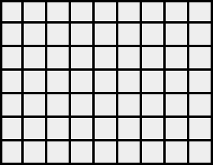
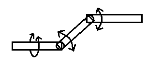

# Weekly-Quizes-2023

鄄城一中2023年每周押题（只是个人押题，高考后6月13日补充其它内容）

> 背景：高三三模那些天在学校告示栏出了六期每周押题，从4月25断断续续出到5月29。虽然在高考中只押中了一道题的题型，但出题的过程，一来是莫名其妙地过瘾，二来也从试着从命题人的角度了解了一下考试。
>
> 过了大半年以后，现在因为怀念高中的那些日子，就重做了这些题目，并附上当时的命题过程以及一些简单的评价，

这里总共有27道数学题，除第1题和第10题改编自当时的模拟题以外，其余题目为原创题，背景与思路多较为新颖。但同时，如实来讲，限于笔者水平，里面也有个别题目或多或少地存在一些质量问题，正文注解中会给出说明，还望见谅。

这里每道习题分为原题、参考答案、解析、命题思路与简析四个部分。其中，解析部分着重讲解我们是怎样得到题目的解答思路的，而命题思路与简析则分别给出了题目的命制过程以及对题目所覆盖的知识点、题目质量与题目难度的评价。

个人感觉，除去第1和第10两道改编题以外（其实也都还不错啦），25道原创题中，题型较新且质量还算可以的题目如下：

| 题号 | 命题背景                                                     | 难度 |
| ---- | ------------------------------------------------------------ | ---- |
| 2    | $(An^2+Bn+C)\cdot q^n$形式数列的求和                         | 3    |
| 4    | 由做对的题推测会做的题的数量                                 | 3    |
| 5    | 复数大题                                                     | 4    |
| 11   | 含三角函数与多项式函数的导数证明题                           | 2    |
| 13   | 立体几何与解析几何的简单结合                                 | 3    |
| 15   | 理论建模+回归分析                                            | 3    |
| 16   | 多次测量取平均值减小误差的原理探究                           | 4    |
| 18   | 方程$\log_ax=a^x$的解的个数以及与方程$x=a^x$和$x=\log_ax$的关系 | 5    |
| 22   | 由抽球实验估计球的种数与公式的合理性推断                     | 3    |
| 23   | 定量刻画试题的坑爹程度                                       | 4    |
| 25   | 偏导数与多元函数最值                                         | 3    |

当然，其他试题，除了个别质量实在差、太偏太怪或有超纲嫌疑的题目外，如有兴趣也可以尝试一下。

参考答案或题目如有错误或不严谨、不妥当之处，欢迎在Issue区或B站私信反馈讨论。

这里补上当时在5月29“最后一押”上面写的的一个后记：

> emmm...新题写不开了估计。
>
> 下周高考，时间不多了，就不再出题了。这几次命题，收获还是不小的，一来对既有的部分技巧有了更进一步的认识，二来也从命题人的角度重新了解了“考试”的流程。高一高二的同学们如有兴趣，我会在高考后吧题目发到Github上（https://github.com/Weekly-Quizes-2023），6月13之后可以看看。以下是FAQ：
>
> 1. Q：为什么那么多材料题，谝能？A：大概真有这个原因吧，不过确也有些材料题材料内容比题更有用，“复杂情景”嘛。
> 2. Q：那么多概统，导数，为什么解析几何却那么少呢？A：（因为不会解几）高二下才好好学，只剩导数和概统了。
> 3. Q：Minecraft题材为什么会出现在这里呢？A：因为自己就是MC玩家且出过MC试题。另外MC确有深度。
> 4. Q：为什么不命常规一些的试题呢？A：常规题其他地方有太多了，命制意义不大。
> 5. Q：这些题，究竟押了些什么呢？A：个人感觉，高考题可能会考一些“大道至简”的（21、22年压轴）或服务于实际的内容。以导数为例，考$7x^3+e^{\frac12x}-2$这样的函数不如考$a^x-\log_a x$的可能性大，数列也有可能出成应用题，另外可能还会有一些让证明一些一看就理解却不知所以然的命题（如多次测量取平均值减小误差），复数大题也不好排除。
> 6. Q：出题人是谁呢？A：807。

# 2023.4.25期

## 第1题

1. 证明：$n\in N^*$，$0<1+\frac12+\frac13+\dots+\frac1n-\ln{(n+1)}<e^{-\frac18}$。

   ### 参考答案

   > 证明：先证左半部分
   >
   > 要证
   > $$
   > 0<1+\frac12+\frac13+\dots+\frac1n-\ln{(n+1)}
   > $$
   > 即证
   > $$
   > \ln{(n+1)}=\ln{\frac21+\ln\frac32+\ln\frac43+\dots+\ln\frac{n+1}{n}<\frac11+\frac12+\frac13+\dots+\frac1n}
   > $$
   > 此时只需证明
   > $$
   > \ln\frac{k+1}{k}<\frac1k
   > $$
   > 设$f(x)=\ln(x+1)-x$，$f(x)$定义域为$(-1,+\infin)$
   >
   > $$
   > f'(x)=\frac1{x+1}-1=-\frac{x}{x+1}
   > $$
   > $x<0$，$f'(x)>0$，$f(x)$单调递增
   >
   > $x>0$，$f'(x)<0$，$f(x)$单调递减
   >
   > 所以
   > $$
   > f(x)\le f(0)=0
   > $$
   > 所以
   > $$
   > f(\frac1k)=\ln\frac{k+1}k-\frac1k<0
   > $$
   > 即
   > $$
   > \ln\frac{k+1}k<\frac1k
   > $$
   > 左半部分得证。
   >
   > 再证右半部分
   >
   > 设$g(x)=\ln{(x+1)}-x+\frac{x^2}{2}$，$g(x)$的定义域为$(-1,+\infin)$
   >
   > $g'(x)=\frac1{x+1}-1+x=\frac{x^2}{x+1}>0$，$g(x)$单调递增
   >
   > 所以，$k\in N$，$g(\frac1k)>g(0)=0$，即
   > $$
   > \frac1k-\ln{\frac{k+1}{k}}<\frac{1}{2k^2}
   > $$
   > 所以
   > $$
   > \begin{eqnarray}
   > 1+\frac12+\frac13+\dots+\frac1n-\ln{(n+1)}&=&\frac11-\ln\frac21+\frac12-\ln\frac32+\frac13-\ln\frac43+\frac1n-\ln\frac{n+1}{n}\\
   > &<&\frac12\left(\frac1{1^2}+\frac{1}{2^2}+\frac1{3^2}+\dots+\frac1{n^2}\right)\\
   > &<&\frac12\left[1+\frac14+\frac{1}{2\cdot3}+\frac{1}{3\cdot4}+\dots+\frac{1}{n(n-1)}\right]\\
   > &=&\frac58+\frac12\left(\frac12-\frac13+\frac13-\frac14+\dots+\frac1{n-1}-\frac1n\right)\\
   > &=&\frac78-\frac1{2n}\\
   > &<&\frac78
   > \end{eqnarray}
   > $$
   > 同时，
   > $$
   > f(e^{-\frac18}-1)=\frac78-e^{-\frac18}<0
   > $$
   > 所以$\frac78<e^{-\frac18}$，故右半部分亦得证。
   >
   > 综上，原不等式得证。

   ### 解析

   > 因为不等式中间位置包含$n$个数的求和，我们不妨将其改写为
   > $$
   > \ln{(n+1)}<1+\frac12+\frac13+\dots+\frac1n
   > $$
   > 因为得到的新不等式右侧有$n$项，我们会尝试将左侧也分解为$n$项，而且左侧的对应项均小于右侧的对应项。我们不难写出
   > $$
   > \ln(n+1)=\ln 2-\ln 1+\ln3-\ln2+\ln4-\ln3+\cdots+\ln(n+1)-\ln n
   > $$
   > 化简后即得到
   > $$
   > \ln(n+1)=\ln\frac21+\ln\frac32+\ln\frac43+\dots+\ln\frac{n+1}{n}
   > $$
   > 我们考虑到
   > $$
   > \ln (x+1)<x
   > $$
   > 将$x=\frac1k$代入，我们有
   > $$
   > \ln\frac{k+1}{k}<\frac1k
   > $$
   > 这时我们便可以用累加法或数学归纳法证明原不等式的左半部分。
   >
   > 至于右半部分，先将其改写为
   > $$
   > 1+\frac12+\frac13+\dots+\frac1n<\ln{(n+1)}+e^{-\frac18}
   > $$
   > 因为$\ln{(n+1)}$位于较大的一端，我们考虑找到一个函数$f(x)$，使得$f(x)<\ln x$，经验较为丰富或对泰勒公式有所了解的同学不难注意到，$x>0$时
   > $$
   > \ln(x+1)>x-\frac{x^2}{2}
   > $$
   > 再次将$x=\frac1k$代入
   > $$
   > \ln\frac{k+1}{k}>\frac1k-\frac{1}{2k^2}
   > $$
   > 即
   > $$
   > \frac1k-\ln\frac{k+1}{k}<\frac{1}{2k^2}
   > $$
   > 累加有
   > $$
   > 1+\frac12+\frac13+\dots+\frac1n-\ln{(n+1)}<\frac12\left(\frac1{1^2}+\frac{1}{2^2}+\frac1{3^2}+\dots+\frac1{n^2}\right)
   > $$
   > 我们只需证明上面的不等式的右半边小于一个$e^{-\frac18}$即可。联想到数列习题中证明$\frac{1}{n^2}$的累加和恒小于给定常数的题型，我们考虑对右侧的每一项先进行一次放缩。将形如$k^2$的分母中的一个因子放缩，使分母为两个连续自然数的乘积后，我们可以容易地对放缩后的式子进行裂项求和，所以，在明确放缩的方向后，我们给出如下操作
   > $$
   > \frac12\left(\frac1{1^2}+\frac{1}{2^2}+\frac1{3^2}+\dots+\frac1{n^2}\right)<\frac12\left[1+\frac{1}{1\cdot2}+\frac{1}{2\cdot3}+\frac{1}{3\cdot4}+\dots+\frac{1}{n(n-1)}\right]
   > $$
   > 裂项求和后有
   > $$
   > \frac12\left(\frac1{1^2}+\frac{1}{2^2}+\frac1{3^2}+\dots+\frac1{n^2}\right)<1>e^{-\frac18}
   > $$
   > 这里我们发现，直接放缩会导致放缩过度，故我们考虑保留前两项后继续放缩
   > $$
   > \frac12\left(\frac1{1^2}+\frac{1}{2^2}+\frac1{3^2}+\dots+\frac1{n^2}\right)<\frac12\left[1+\frac14+\frac{1}{2\cdot3}+\frac{1}{3\cdot4}+\dots+\frac{1}{n(n-1)}\right]<\frac78
   > $$
   > 我们注意到，原不等式的最右侧为一个含$e$的指数的常数，不妨考虑含$e^x$的函数。注意到
   > $$
   > \frac78=1-\frac18<e^{-\frac18}
   > $$
   > 与
   > $$
   > 1+x<e^x
   > $$
   > 有形似，证明$e^x>x+1$后即可证明上述关系。进而原不等式得证。

   ### 命题思路与背景

   > 题目的左半侧是一个非常经典的导数题型，笔者第一次看到这种题是在高二那年3月27号的月考。此题目的命制部分是受其启发，故此处给出注明。
   >
   > 此处题目的命制背景是欧拉常数
   > $$
   > \gamma=-\ln n +\lim_{n\to\infty}\sum_{i=1}^n\frac{1}{n}\approx0.5772
   > $$
   > 为了提升题目的可操作性，我们不去证明
   > $$
   > -\ln n +\lim_{n\to\infty}\sum_{i=1}^n\frac{1}{n}=常数
   > $$
   > 而是考虑证明
   > $$
   > 0<-\ln n +\lim_{n\to\infty}\sum_{i=1}^n\frac{1}{n}<1
   > $$
   > 即证明中间的式子会局限于一个范围，而不会无限地增大或减小。因为高中还没有接触严谨的极限与级数求和，这里将上面的式子改写为：
   > $$
   > 0<\frac11+\frac12+\frac13+\dots+\frac1n-\ln n<1
   > $$
   > 为了方便对$\ln n$分解为$n$项后进行放缩（见上文中的解析），再将上式改写为
   > $$
   > 0<\frac11+\frac12+\frac13+\dots+\frac1n-\ln{(n+1)}<1
   > $$
   > 使用解析中给出的步骤对右侧进行证明的过程中，出现了这一步骤
   > $$
   > \frac12\left(\frac1{1^2}+\frac{1}{2^2}+\frac1{3^2}+\dots+\frac1{n^2}\right)<\frac12\left[1+\frac{1}{1\cdot2}+\frac{1}{2\cdot3}+\frac{1}{3\cdot4}+\dots+\frac{1}{n(n-1)}\right]<1
   > $$
   > 为使当地提高题目难度，我们不对第二项进行放缩，使放缩的精度要求更高
   > $$
   > \frac12\left(\frac1{1^2}+\frac{1}{2^2}+\frac1{3^2}+\dots+\frac1{n^2}\right)<\frac12\left[1+\frac{1}{2^2}+\frac{1}{2\cdot3}+\frac{1}{3\cdot4}+\dots+\frac{1}{n(n-1)}\right]<\frac78
   > $$
   > 这样，我们便得出
   > $$
   > 0<\frac11+\frac12+\frac13+\dots+\frac1n-\ln{(n+1)}<\frac78
   > $$
   > 为增强题目的综合性，考虑对$\frac78$应用关系$e^x>x+1$，得到$\frac78<e^{-\frac18}$，同时，我们将$\frac11$写作1，得到最终要证明的不等式
   > $$
   > 0<1+\frac12+\frac13+\dots+\frac1n-\ln{(n+1)}
   > $$
   
   ### 简析

   > 题目主要用证明数列和与函数的大小关系的情景综合了用导数研究函数的单调性、用导数研究不等式、数列和形式的不等式证明中的放缩操作、数列的裂项求和以及数学归纳法五个知识点或技巧点，综合性较高。在导数压轴题中难度估计为中等偏易。

## 第2题

2. 已知$\{\sqrt{a_n}\}$为公差$d=\sqrt{a_1}$的等差数列，$S_n$为$\{a_n\cdot2^n\}$的前n项和，$b_n=\frac{S_n}{a_1^2}$，求$\{b_n\}$的通项公式。

   ### 参考答案

   > 解：因为$\{\sqrt{a_n}\}$为公差$d=\sqrt{a_1}$的等差数列
   >
   > 所以
   > $$
   > \sqrt{a_n}=(n-1)\sqrt{a_1}+\sqrt{a_1}=\sqrt{a_1}\cdot n
   > $$
   > 所以$a_n=a_1^2n^2$
   >
   > $$
   > b_n=\frac{S_n}{a_1^2}=\frac{1^2\cdot a_1^2\cdot2^1+2^2\cdot a_1^2\cdot2^2+\dots+n^2\cdot a_1^2\cdot2^n}{a_1^2}=1^2\cdot2^1+2^2\cdot2^2+\dots+n^2\cdot2^n
   > $$
   >
   > $$
   > 2b_n=0^2\cdot2^1+1^2\cdot2^2+2^2\cdot2^3+\dots+n^2\cdot2^{n+1}
   > $$
   >
   > 两式相减有
   > $$
   > \begin{eqnarray}
   > 	b_n&=&2b_n-b_n
   > 	\\&=&(0^2-1^2)2^1+(1^2-2^2)2^2+(2^2-3^2)2^3+\dots+\left[(n-1)^2-n^2\right]2^n+n^2\cdot2^{n+1}
   > 	\\&=&n^2\cdot2^{n+1}-\left[1\cdot2^1+3\cdot2^2+5\cdot2^3+\dots+(2n-1)\cdot2^n\right]
   > \end{eqnarray}
   > $$
   > 设
   > $$
   > c_n=1\cdot2^1+3\cdot2^2+5\cdot2^3+\dots+(2n-1)\cdot2^n
   > $$
   > 则有
   > $$
   > 2c_n=1\cdot2^2+3\cdot2^3+5\cdot2^4+\dots+(2n-1)\cdot2^{n+1}
   > $$
   >
   > $$
   > c_n=2c_n-c_n=(2n-1)\cdot2^{n+1}-2(2^2+2^3+2^4+\dots+2^n)-1\cdot2^1=(2n-3)\cdot2^{n+1}+6
   > $$
   >
   > $$
   > b_n=(n^2-2n+3)\cdot2^{n+1}-6
   > $$

   ### 解析

   > $\{a_n\}$通项公式的求解思路此处从略。
   >
   > 不难得到，求解$\{b_n\}$的通项公式的过程实质上是求解数列$\{n^2\cdot2^n\}$的前$n$项。我们注意到，需要$n^2\cdot2^n$形式类似于$(An+B)\cdot q^n$，即它们都是等比数列与多项式的乘积的形式。对于后者，我们常用“错位相减法”进行求和，例如，对于数列$(2n+1)\cdot2^n$，我们可以这样给出求和过程
   > $$
   > S_n=3\cdot2^1+5\cdot2^2+7\cdot2^3+\cdots+(2n+1)\cdot2^n
   > $$
   >
   > $$
   > 2S_n=0\cdot2^1+3\cdot2^2+5\cdot2^3+\cdots+(2n-1)\cdot2^{n+1}
   > $$
   >
   > 两式相减
   > $$
   > 2S_n-S_n=(2n-1)\cdot2^{n+1}+(3-5)\cdot2^2+(5-7)\cdot2^3+[(2n+1)-(2n-1)]\cdot2^n-3\cdot2^1
   > $$
   > 即
   > $$
   > S_n=(2n-1)\cdot2^{n+1}-2(2^2+2^3+\cdots+2^n)-6
   > $$
   > 这样便不难对原数列进行求和。本质上，这种过程的关键是将$S_n$中出现的大部分形如$(2k+1)\cdot2^k$的项转化为形如$[(2k+1)-(2k-1)]\cdot2^k=-2\cdot2^k$的项，也就是将$2k+1$转换为其两相邻项之间的差值，从而使原数列的求和成为可能。
   >
   > 类似地，我们对$\{n^2\cdot2^n\}$应用错位相减求和，可以把$k^2\cdot2^k$形式的项转化为形如$[(k-1)^2-k^2]\cdot2^k=(1-2n)\cdot 2^k$的项，从而将问题转化为我们熟悉的$\{(An+B)\cdot q^n\}$型数列求和问题。具体过程见参考答案。

   ### 命题思路与背景

   > （命题思路其实解析里面就已经讲得差不多了）

   ### 简析

   > 这道题是错位相减法的一个延伸，通过这道习题，我们得知，方法的运用不能太过死板化，而应该理解方法的本质，从而学会灵活运用。题目本身较为新颖，但$\{a_n\}$通项公式的求解部分做得略有些草率，以前的22题式试卷难度分别来看，本题难度约为19～20题水平。

## 第3题

3. 空间直角坐标系中，双圆锥$C:x^2+y^2=4z^2$，平面$\alpha:z=kx-1$，若$C$、$\alpha$的交线为抛物线，则该$k=$___，抛物线的焦点到准线的距离为\_\_\_。

   ### 参考答案与解析

   #### 方法一

   > 解：联立$C$、$\alpha$整理得
   > $$
   > (1-4k^2)x^2+8kx+y^2-4=0
   > $$
   > 由对称性，若截线为抛物线$P$，则$P$的对称轴应在$xOz$平面内。
   >
   > 以$z$轴与平面$\alpha$的交点为原点，以$\alpha$与$xOz$平面的交线为$u$轴，以$\alpha$与$yOz$的交线为$v$轴，正方向与$x$、$y$轴指向分别一致。不难验证其为平面直角坐标系。
   >
   > 在平面$z=kx-1$上任取一点$(x_0, y_0, z_0)$，则该点在坐标系$uOv$内的坐标为$(u_0,v_0)$满足：
   > $$
   > v_0=y_0
   > $$
   >
   > $$
   > u_0=x_0\sqrt{1+k^2}
   > $$
   >
   > 设平面内有一抛物线在坐标系$uOv$中的方程为$v^2=2p(u-v_0)$，则其在坐标系$Oxyz$内$x$、$y$坐标满足的方程为
   > $$
   > v^2=y^2=2p(u-u_0)=2p(x\sqrt{1+k^2}-u_0)
   > $$
   > 即
   > $$
   > y^2=2p\sqrt{1+k^2}x-2pu_0
   > $$
   > 注意到上面的方程中没有含$x^2$的项，令联立$C$、$\alpha$的所得方程与此形式相似，则$x^2$的系数应为0，即：
   > $$
   > 1-4k^2=0
   > $$
   > 即
   > $$
   > k=\pm\frac12
   > $$
   > 此时截线方程有下面两种形式
   > $$
   > y^2=2p\frac{\sqrt5}{2}\left(x-2p\frac{2}{\sqrt5}\right)
   > $$
   >
   > $$
   > y^2=\pm2(\mp2)
   > $$
   >
   > 另两者对应项系数相等解得
   > $$
   > p=\pm\frac{2\sqrt5}{5}
   > $$
   > 即截得抛物线焦点到准线的距离为$\frac{2\sqrt5}{5}$。

   #### 方法二

   > 解：$\alpha$与$C$的一条母线平行时，两者的交线为抛物线，此时
   > $$
   > k=\pm\sqrt\frac14=\pm\frac12
   > $$
   > 第二空思路与上面基本一致。

   #### 方法三

   > 由对称性也可知，交线在$xOy$平面内的投影实际上是其沿对称轴、平移伸缩得到的，投影方程的形式与实际的交线方程形式理应一致，即下列由双圆锥与平面联立消去$z$之后得到的投影方程的形式应与抛物线方程相似
   > $$
   > (1-4k^2)x^2+8kx+y^2-4=0
   > $$
   > 令$x^2$一项的系数$1-4k^2$等于0即可。

   ### 命题思路与背景

   > 我们知道，圆柱曲线是由平面截圆锥（实际上为两个共顶点、朝向相反的两个圆锥的组合体）得到的截线，在平面与圆锥高线的夹角不同时，解得的曲线一般可以为椭圆、双曲线或抛物线，其中，抛物线是平面与圆锥母线恰好平行时截得的。以此为背景，给出了第一问。另外，为进一步考察空间想象能力，题目又命制了第二问。

   ### 简析

   > 但是，尽管本题在直观上是不算困难的，但是要给出相对严格的证明却不容易，故命制为填空题。因为缺乏严谨性，题目整体质量可能欠佳。难度约为14～15题水平（22题试卷）。

## 第4题

4. 某考生做八道单选，每道题如果会做有80%的可能答对，不会做有20%的可能答对。该考生共答对6道题，问该考生实际会做的题目道数最可能是___。

   ### 参考答案与解析

   > 解：对于其中任意一道试题，设事件$A$：该考生会做该题，$B$：该考生作对该题，由题意
   > $$
   > P(B|A)=0.8\\
   > P(B|\overline A)=0.2\\
   > P(B)=\frac68=0.75
   > $$
   > 由全概率公式
   > $$
   > P(B)=P(A)P(B|A)+P(\overline{A})P(B|\overline{A})=0.8P(A)+0.2[1-P(A)]=0.75
   > $$
   > 解得
   > $$
   > P(A)=\frac{11}{12}
   > $$
   > 由题意考生会做的题目数量$X\sim B(8,\frac{11}{12})$
   >
   > 设$k$满足
   > $$
   > \cases{
   > P(X=k)\ge P(X=k+1)\\
   > P(X=k)\ge P(X=k-1)
   > \\
   > }
   > $$
   > 即
   > $$
   > \cases{
   > \frac{8!}{k!(8-k)!}\left(\frac{11}{12}\right)^k\left(\frac{1}{12}\right)^{8-k}\ge \frac{8!}{(k+1)!(7-k)!}\left(\frac{11}{12}\right)^{k+1}\left(\frac{1}{12}\right)^{7-k}\\
   > \frac{8!}{k!(8-k)!}\left(\frac{11}{12}\right)^k\left(\frac{1}{12}\right)^{8-k}\ge \frac{8!}{(k+1)!(7-k)!}\left(\frac{11}{12}\right)^{k+1}\left(\frac{1}{12}\right)^{7-k}
   > }
   > $$
   > 解得
   > $$
   > \frac{87}{12}\le k\le\frac{33}{4}
   > $$
   > 因为$k\in N$所以$k=8$
   >
   > 故该考生会做的题目数量最可能是8。

   ### 命题思路与背景

   > 学生在会做大部分题目时，仍然经常会有很多的错题，背后的逻辑是什么呢？这一题目就数学单选题这一情形对这种现象进行了数学建模，让我们自己进行探究。
   >
   > 实际上，原始的题目可能是让求解考生会做的题目数量的期望，但是因为原件丢失，录入时最终给出这样一个题目。

   ### 简析

   > 题目背景与形式新颖，主要综合了条件概率、全概率公式、二项分布与求解二项分布中出现概率最大的值四个知识点，综合性较强，难度约为14～15题水平。
   >
   > 同时这一题目也启发我们，在知识与能力到达顶峰时，我们要考虑向“细节”“再要二十分”。

---

# 2023.4.28期

## 第5题

5. 复数列$\{a_n\}$中，$\frac{a_{n+1}}{a_n}=k$，$k$为关于$x$的方程$x^2-2i=0$的一个复数根且实部为非负数，$a_1=1$. 记$a_n$的实部与虚部分别为$Re_n$和$Im_n$.

   (1) 求$Re_n$、$Im_n$和$|a_n|$

   (2) $a_n$在复平面内对应向量为$\overrightarrow{OP_n}$，选择一问作答：

   (i) $\triangle OP_nP_{n+1}$的内切圆与外接圆半径分别为$b_n$、$d_n$，$\{b_n\}$、$\{d_n\}$的前$n$项和分别为$B_n$、$D_n$，求$\frac{B_n}{D_n}$

   (ii) 若$Q_1$与原点重合，$\overrightarrow{Q_nQ_{n+1}}=\overrightarrow{OP_n}$，求$|\overrightarrow{OQ_{4n+1}}|$（$n\in N^*$）

   ### 参考答案

   > （1）解：不妨设$k=m+ni$，由题意
   >
   > $$
   > (m+ni)^2-2i=m^2+2mni-n^2-2i=0
   > $$
   > 所以
   > $$
   > \begin{cases}m^2-n^2=0\\2mn-2=0\end{cases}
   > $$
   > 解得
   > $$
   > m=n=\pm 1
   > $$
   > 因为$k$的实部非负，$m>0$，所以$k=1+i$
   >
   > 所以
   > $$
   > a_n=\frac{a_n}{a_{n-1}}\cdot\frac{a_{n-1}}{a_{n-2}}\cdot\dots\cdot\frac{a_2}{a_1}\cdot a_1=k^{n-1}=(1+i)^{n-1}
   > $$
   > 又因为$\arg{k}=\frac\pi4$，$|k|=\sqrt2$，所以
   > $$
   > a_n=(\sqrt2)^{n-1}\left[\cos{\left(\frac{n\pi}4-\frac\pi4\right)}+i\sin{\left(\frac{n\pi}4-\frac\pi4\right)}\right]
   > $$
   > 所以
   > $$
   > Re_n=(\sqrt2)^{n-1}\cos{\left(\frac{n\pi}4-\frac\pi4\right)}
   > $$
   >
   > $$
   > Im _n=(\sqrt2)^{n-1}\sin{\left(\frac{n\pi}4-\frac\pi4\right)}
   > $$
   >
   > $$
   > |a_n|=\sqrt{Re_n^2+Im_n^2}=(\sqrt2)^{n-1}
   > $$
   >
   > （2）解：（i）
   > $$
   > |OP_n|=|a_n|=(\sqrt2)^{n-1}
   > $$
   >
   > $$
   > |OP_{n+1}|=|a_n|=(\sqrt2)^{n}
   > $$
   >
   > $$
   > \begin{eqnarray}
   > 	|P_nP_{n+1}|&=&\left|\overrightarrow{OP_{n+1}}-\overrightarrow{OP_n}\right|=|a_{n+1}-a_n|\\
   > 	&=&(\sqrt2)^n\left|\cos{\frac{n\pi}4}+i\sin{\frac{n\pi}4}-\frac{\sqrt2}2\cos{\left(\frac{n\pi}4-\frac\pi4\right)}-\frac{\sqrt2}2i\sin{\left(\frac{n\pi}4-\frac\pi4\right)}\right|\\
   > 	&=&(\sqrt2)^n\left|\cos{\frac{n\pi}4}+i\sin{\frac{n\pi}4}-\frac12\left(\cos{\frac{n\pi}4}+\sin{\frac{n\pi}4}+i\sin{\frac{n\pi}4}-i\cos{\frac{n\pi}4}\right)\right|\\
   > 	&=&(\sqrt2)^{n-2}\left|\cos{\frac{n\pi}4}-\sin{\frac{n\pi}4}+i\left(\cos{\frac{n\pi}4}+\sin{\frac{n\pi}4}\right)\right|\\
   > 	&=&(\sqrt2)^{n-1}\left|\cos{\left(\frac{n\pi}4+\frac\pi4\right)}+i\sin{\left(\frac{n\pi}4+\frac\pi4\right)}\right|\\
   > 	&=&(\sqrt2)^{n-1}
   > \end{eqnarray}
   > $$
   >
   > 注意到
   > $$
   > |OP_n|^2+|P_nP_{n+1}|^2=|OP_{n+1}|^2
   > $$
   > 所以
   > $$
   > \angle{OP_nP_{n+1}}=\frac\pi2
   > $$
   > 所以
   > $$
   > \tan{\angle{P_nOP_{n+1}}=\frac{|P_nP_{n+1}|}{|OP_n|}}=1
   > $$
   > 因为
   > $$
   > \angle{P_nOP_{n+1}}\in(0,\pi)
   > $$
   >
   >
   > 所以
   > $$
   > \angle{P_nOP_{n+1}}=\frac\pi4
   > $$
   >
   > $$
   > \angle{P_nP_{n+1}O}=\frac\pi4
   > $$
   >
   > 由正弦定理
   > $$
   > \frac{|P_nP_{n+1}|}{\sin\angle{OP_nP_{n+1}}}={|P_nP_{n+1}|}=2d_n
   > $$
   > 所以
   > $$
   > d_n=(\sqrt2)^{n-3}
   > $$
   > 同时
   > $$
   > S_{\triangle{OP_nP_{n+1}}}=\frac12|P_nP_{n+1}||P_nO|=2^{n-2}=\frac12b_n(|OP_n|+|P_nP_{n+1}|+|OP_{n+1}|)=({\sqrt2+1})(\sqrt2)^{n-2}
   > $$
   > 所以$b_n=(\sqrt2-1)(\sqrt2)^{n-2}=(2-\sqrt2)d_n$
   >
   > 所以
   > $$
   > \frac{B_n}{D_n}=\frac{b_1+b_2+\dots+b_n}{d_1+d_2+\dots+d_n}=\frac{(2-\sqrt2)(d_1+d_2+\dots+d_n))}{d_1+d_2+\dots+d_n}=2-\sqrt2
   > $$
   > （ii）因为
   > $$
   > \overrightarrow{Q_nQ_{n+1}}=\overrightarrow{OP_n}=\overrightarrow{OQ_{n+1}}-\overrightarrow{OQ_n}
   > $$
   > 所以
   > $$
   > \overrightarrow{OQ_n}=OP_1+OP_2+\dots+OP_{n-1}
   > $$
   > 设 
   > $$
   > \begin{eqnarray}
   > R_n&=&Re_{4n+1}+Re_{4n+2}+Re_{4n+3}+Re_{4n+4}\\
   > &=&(\sqrt2)^{4n}\left[\cos{\left(n\pi\right)}+\sqrt2\cos{\left(n\pi+\frac{\pi}{4}\right)}+2\cos{\left(n\pi+\frac{\pi}{2}\right)}+2\sqrt2\cos{\left(n\pi+\frac{3\pi}{4}\right)}\right]\\
   > &=&(\sqrt2)^{4n}\left[\cos{\left(n\pi\right)}+\cos{\left(n\pi\right)}-\sin{\left(n\pi\right)}-2\sin{\left(n\pi\right)}-2\cos{\left(n\pi\right)}+2\sin{\left(n\pi\right)}\right]\\
   > &=&-4^n\sin{(n\pi)}
   > \end{eqnarray}
   > $$
   >
   > $$
   > \begin{eqnarray}
   > I_n&=&Im_{4n+1}+Im_{4n+2}+Im_{4n+3}+Im_{4n+4}\\
   > &=&(\sqrt2)^{4n}\left[\sin{\left(n\pi\right)}+\sqrt2\sin{\left(n\pi+\frac{\pi}{4}\right)}+2\sin{\left(n\pi+\frac{\pi}{2}\right)}+2\sqrt2\sin{\left(n\pi+\frac{3\pi}{4}\right)}\right]\\
   > &=&(\sqrt2)^{4n}\left[\sin{\left(n\pi\right)}+\sin{\left(n\pi\right)}+\cos{\left(n\pi\right)}+2\cos{\left(n\pi\right)}-2\sin{\left(n\pi\right)}+2\cos{\left(n\pi\right)}\right]\\
   > &=&5\cdot4^n\cos{\left(n\pi\right)}
   > \end{eqnarray}
   > $$
   >
   > 则
   > $$
   > \overrightarrow{OQ_{4n+1}}=\sum_{i=1}^{4n}OP_i=\left(\sum_{i=1}^{4n}Re_i,\sum_{i=1}^{4n}Im_i\right)=\left(\sum_{i=0}^{n-1}R_n,\sum_{i=0}^{n-1}I_i\right)
   > $$
   > 因为
   > $$
   > R_0=0\\
   > R_{n+1}=-4^{n+1}\sin(n\pi+\pi)=4R_n
   > $$
   > 所以$\forall n\in N$，$R_n=0$
   >
   > 类似地
   > $$
   > I_0=5\\
   > I_{n+1}=20\cdot4^n\cos{n\pi+\pi}=-4I_n
   > $$
   > 所以$\forall n\in N$，$I_n=5\cdot(-4)^n$
   >
   > 所以
   > $$
   > \overrightarrow{OQ_{4n+1}}=\left(0,5\sum_{i=0}^{n-1}(-4)^n\right)=\left(0,1-(-4)^n\right)
   > $$
   > 所以
   > $$
   > \overrightarrow{OQ_{4n+1}}=\left|1-(-4)^n\right|
   > $$

   ### 解析

   > 看了答案就会发现，其实这里没有什么可以解析的qwq。

   ### 命题思路与背景

   > 多年以来，复数在高中教学中都是一个被高度边缘化的模块，我们对复数的掌握多也停留在其基本定义与四则运算上，对于它的实际应用甚至只是它的向三角形式则知之甚少。所以笔者试着以复数为一个核心知识点，命制一道综合性的大题。
   >
   > 也记不清当时是如何考虑的了，自己是选择了以复数的三角形式展开命题。因为复数的三角形式下有著名的棣莫弗公式：
   > $$
   > (\cos x+i\sin x)^n=\cos(nx)+i\sin(nx)
   > $$
   > 其中出现了$(\cos x+i\sin x)^n$这一指数项，所以，这里又考虑与等比数列进行结合。等比数列必有公比，但这里的公比显然不适合直接给出，故我们又加上一个对复数的四则运算和基本概念的考察
   >
   > > 公比$k$为关于$x$的方程$x^2-2i=0$的一个复数根且实部为非负数
   >
   > 因为这里的数列是复数列，相对于实数列的通项求解，这里基于复数的三角定义给出了复数列实部、虚部与模的通项的求解这一问题，也就是第一问。
   >
   > 然后，因为复数有明显的几何意义，所以，我们又给出了关于其几何性质的考察。这里考虑了复数列各项对应的向量共起点放置与首尾相接放置两种情况。分别绘制前7项和前12项的图像如下：
   >
   > 
   >
   > 
   >
   > 我们注意到两点：
   >
   > - 共起点放置时，相邻复数列中两项对应的向量均构成等腰直角三角形的邻边；
   > - 首尾相接时，相邻序数为4的倍数的向量的终点在$y$轴上。
   >
   > 根据这两点，我们分别命制了第二问的两小问。因为这些问题的运算量均较大，故此处给出仅选做一题即可的要求。

   ### 简析

   > 本题主要综合了复数、数列以及向量与解三角形三个模块的知识，尽管情景略显冷门，但在学有余力的前提下也值得一做。19～21题难度（22题卷面）。

## 第6题

6. 现研究英语七选五的简化情形五选三. 某考生从5个备选项中选取n项随机填入3个给定空格，所选选项全部用到，所有空格均没有留空. 各题目只有一个正确答案且不重复，每题2.5分，记该考生得分为$X_n$.

   (1)求n的可能取值及$E(X_3)$

   (2)从期望的角度，判断n为何值时考生得分更多

   ### 参考答案

   > （1）解：$n$的可能取值有1、2、3；$X_3$的可能取值有0、2.5、5、7.5
   > $$
   > P(X_3=0)=\frac{C_2^0C_3^3C_2^1+C_2^1C_3^2(1+C_2^1)+C_2^2C_3^1C_2^1A_2^2}{A_5^3}=\frac{32}{60}=\frac{8}{15}
   > $$
   >
   > $$
   > P(X_3=2.5)=\frac{C_2^0C_3^3C_3^1+C_2^1C_3^2C_2^1+C_2^2C_3^1A_2^2}{A_5^3}=\frac{21}{60}=\frac{7}{20}
   > $$
   >
   > $$
   > P(X_3=5)=\frac{C_2^0C_3^3\cdot0+C_2^1C_3^2}{A_5^3}=\frac{6}{60}=\frac1{10}
   > $$
   >
   > $$
   > P(X_3=7.5)=\frac{C_2^0C_3^3}{A_5^3}=\frac{1}{60}
   > $$
   >
   > 进而
   > $$
   > E(X_3)=0\cdot\frac{8}{15}+2.5\cdot\frac{7}{20}+5\cdot\frac{1}{10}+7.5\cdot\frac{1}{60}=\frac32
   > $$
   > （2）解：$X_1$的可能取值有0、2.5
   >
   > $$
   > P(X_1=0)=\frac{C_3^0C_2^1}{C_5^1}=\frac25
   > $$
   >
   > $$
   > P(X_1=2.5)=\frac{C_3^1C_2^0}{C_5^1}=\frac35
   > $$
   >
   > 所以
   > $$
   > E(X_1)=0\cdot\frac25+2.5\cdot\frac35=\frac32
   > $$
   > $X_2$的可能取值有0、2.5、5
   > $$
   > P(X_2=0)=\frac{C_2^0C_3^2C_2^1+C_2^1C_3^1(1+A_2^2)+C_2^2C_3^0(2^3-C_2^2\cdot1^2)}{C_5^2(2^3-C_2^2\cdot1^2)}=\frac{30}{60}=\frac12
   > $$
   >
   > $$
   > P(X_2=2.5)=\frac{C_2^0C_3^2C_2^1+C_2^1C_3^1(1+A_2^2)}{C_5^2(2^3-C_2^2\cdot1^2)}=\frac{24}{60}=\frac25
   > $$
   >
   > $$
   > P(X_2=5)=\frac{C_2^0C_3^2C_2^1}{C_5^2(2^3-C_2^2\cdot1^2)}=\frac{6}{60}=\frac{1}{10}
   > $$
   >
   > 所以
   > $$
   > E(X_2)=0\cdot\frac12+2.5\cdot\frac25+5\cdot\frac{1}{10}=\frac32
   > $$
   > 综上$E(X_1)=E(X_2)=E(X_3)=\frac32$，无论n取1，2，3中何值，$E(X_n)$均为最大值$\frac32$。

   ### 解析

   > 由题意，我们可以将作答“五选三”的过程视为“选择选项”和“填空”两个过程，也就是从五个选项当中选取$n$个选项，以及将原选中的$n$个选项可重复但不可遗漏地填入给出的三个空格当中两步。很容易得到，只有当$n\le3$时才有可能在第二步当中填充空格时不发生遗漏，而且$n\ge1$必须成立，所以$n$的可能取值为1、2、3。同时易知，$n$给定时，前一步共有$C_5^n$种情况。
   >
   > 首先来看第一问当中$n=3$的情形。容易得到，填空情况共有$A_5^3=C_5^3A_3^3=60$种。其中，我们发现，我们在从五个选项当中选出三个选项时可能选中的错项（不对应任何空白的选项）个数分别为0、1、2，我们需要对这些情况分别展开讨论。
   >
   > 先计算$X_3=0$，即没有做对任何一题时的情形数量。
   >
   > 若我们没有选中错项，则我们选择的选项应该是三个正确的选项，我们应该使我们选中的选项全部不被填在正确的位置，我们选择我们选中的选项中字母顺序靠前的一个，填在错误的位置，这样，其他两个选项的填写位置就是唯一确定的，每种选项的组合对应的情形有2种，总情形数为$C_2^0C_3^3C_2^1=2$。
   >
   > 若我们选中了一个错项，则其他两个选项是正确选项，空白中有且只有一个不对应任何选中的正确选项，而且其它两个空白是“对称”的。这时，我们可以以我们选中的错项是否填在那一个特殊的空白处展开讨论。当我们将错项填在那一位置时，其它两项的填写顺序明显是唯一确定的，只有1种情形；而当我们将错项填在其余的两个位置时，会留下一个对应着我们选中的正确选择的空白，我们只需用那个与之不对应的正确选项将其占用即可，接下来的填空方式又是唯一的，故有两种情形。所以，在选择的选项确定且选中一个错项时，共有$1+C_2^1=3$种情形。考虑到“选择选项的”一步中可能出现的情形有$C_2^1C_3^2=6$种，总情形数有18种。
   >
   > 若我们选择了两个错项，则我们还选中了一个正确选项，我们只需将正确选项填写到它所不对应的空白当中即可，共有两种选择。然后，两个错项的填写可以是任意的，共有$A_2^2=2$中选择。所以，在选择的选项组合确定时的情形数为$C_2^1A_2^2=4$种，总情形数为$C_2^2C_3^1C_2^1A_2^2=12$种。
   >
   > 至此我们写出
   > $$
   > P(X_3=0)=\frac{C_2^0C_3^3C_2^1+C_2^1C_3^2(1+C_2^1)+C_2^2C_3^1C_2^1A_2^2}{A_5^3}=\frac{32}{60}=\frac{8}{15}
   > $$
   > 再来计算$X_3=2.5$，即做对一题时的情形数量。
   >
   > 若我们没有选择错项，只选择了3个正确的选项，则可以将其中一个正确选项填写在正确的位置，共有3种选择，然后，我们将其它两项以颠倒的顺序填写即可，填写方式唯一。所以，每个选项组合有$C_3^1=3$种情形，共有$C_2^0C_3^3C_3^1=3$种情形。
   >
   > 若我们选中了一个错项，则其他两个选项是正确选项，这时，我们可以先选择一个正确选项正确填写，有两种情形，然后，再颠倒填写余下两项，方式唯一确定，故每种选项组合下的填写方法有$A_2^2=2$种，总填写方法有$C_2^1C_3^2A_2^2=12$种。
   >
   > 若我们选择了两个错项，则我们只选择了一个正确选项，然后，只需要，将正确选项填在正确的位置，错误选项任意填写即可，每种选项组合对应$C_1^1A_2^2=2$种情形，总情形数为$C_2^2C_3^1C_1^1A_2^2=6$。
   >
   > 所以
   > $$
   > P(X_3=2.5)=\frac{C_2^0C_3^3C_3^1+C_2^1C_3^2C_2^1+C_2^2C_3^1A_2^2}{A_5^3}=\frac{21}{60}=\frac{7}{20}
   > $$
   > 接着计算$X_3=5$，即做对两题时的情形数量。
   >
   > 若我们没有选择错项，则我们选择的三个选项都是正确的。但是，不管选择哪两个选项先正确填写，其余一个选项必然只能填在剩下的一个位置，而那个位置恰是它的正确位置，这样我们就做对了3道题，故不可能只做对两题，情形数为0。
   >
   > 若我们选择了一个错项，则我们也选择了两个正确的选项。这两个选项正确填写，其余一个错项填补余下的空白即可。故每种选项组合共有1种对应的情形，总情形数为$C_2^1C_3^2=6$。
   >
   > 若我们选择了两个错项，则我们只选择了一个正确选择，这是不足够的，故没有对应的情形。
   >
   > 所以
   > $$
   > P(X_3=5)=\frac{C_2^0C_3^3\cdot0+C_2^1C_3^2}{A_5^3}=\frac{6}{60}=\frac1{10}
   > $$
   > $X_3=7.5$的情形太过简单，此处从略。
   > $$
   > P(X_3=7.5)=\frac{C_2^0C_3^3}{A_5^3}=\frac{1}{60}
   > $$
   > 同理，此处亦不讲解$n=1$的情形。
   >
   > 再来看$n=2$的情形。此时，我们需要计算出一种任意的选项组合下可能出现的填写情形数。我们可以将该问题计算视为由有且仅有1、2组成三位数的数量的问题。仅有1、2，我们可以得到$2^3=8$种不同的三位数，排除仅有1、2中某一个组成的三位数的数量$C_2^2(2-1)^3=2$，我们可以得到的不同三位数有$2^3-C_2^2(2-1)^3=6$种，每种选项组合下对应的情形数为6。
   >
   > 类似地，我们也可以对选择错项数量进行讨论。
   >
   > 先来看$X_2=0$，即没有做对任意一题的情形。
   >
   > 若我们选中了两个错项，则我们没有选中任何正确选项，我们必然是不能做对任意一题的，故每种选项组合下的情形数为$2^3-C_2^2\cdot1^2=6$，总情形数为$C_2^2C_3^0(2^3-C_2^2\cdot1^2)$。
   >
   > 若我们选择了一个错项，则我们选中的正确选项也有一个。显然，正确选项对应的位置必须由错项占据，余下两个位置中必须出现正确选项。若正确选项出现1次，只有1种情形；若两个选项均出现，有$A_2^2=2$种情形，每种选项组合下的情形数为$1+A_2^2=3$，总情形数为$C_2^1C_3^1(1+A_2^2)=18$。
   >
   > > 这里给出一种错误的解法：
   > >
   > > 我们将错误选项先填写至正确选项对应的位置，共有1种情形；再将正确选项填写在其余任意一个位置，又有两种情形；最后将两项中任意一项填写在余下的一个空格，又有2种情形。故每种选项组合下的填写方式有$C_1^1C_2^1C_2^1=4$种，总情形数为$C_2^1C_3^1C_1^1C_2^1C_2^1=24$。
   > >
   > > 这种思路中重复计数了正确选项出现两次的情形。
   >
   > 若我们没有选择错项，则我们选中的两个选项全为正确选择，空白当中有一项不对应任何正确选项。我们先将两个选项“颠倒位置”进行填写，方式唯一；再将不对应正确选择的空白用任意一个选项填写，有两种方式。故每种选项组合对应的填写方式有$C_2^1=2$种，总情形数为$C_2^0C_3^2C_2^1=6$。
   >
   > 所以
   > $$
   > P(X_2=0)=\frac{C_2^0C_3^2C_2^1+C_2^1C_3^1(1+A_2^2)+C_2^2C_3^0(2^3-C_2^2\cdot1^2)}{C_5^2(2^3-C_2^2\cdot1^2)}=\frac{30}{60}=\frac12
   > $$
   > 接着来看$X_2=2.5$，即做对一道题的情形。
   >
   > 若我们选择了两个错项，则我们没有选择正确选项，明显是不合适的。
   >
   > 若我们选择了一个错项，则我们选择了一个正确选项。将正确选项正确填写，余下两个空白中必须出现错误选项。若错误选项出现两次，只有一种对应的情形；若正误两项均出现，则有$A_2^2=2$种情形，每种选项组合下的情形数为$1+A_2^2=3$，总情形数为$C_2^1C_3^1(1+A_2^2)=18$。
   >
   > 若我们没有选择错项，则我们选取的两个选项都是正确的。我们先则一个正确选项正确填写，再用正确填写的那个选项占用另一个正确选项对应的位置，余下位置填写另一个选项，每种选项组合下的情形数为$C_2^1=2$，总情形数为$C_2^0C_3^2C_2^1=6$。
   >
   > 所以
   > $$
   > P(X_2=2.5)=\frac{C_2^0C_3^2C_2^1+C_2^1C_3^1(1+A_2^2)}{C_5^2(2^3-C_2^2\cdot1^2)}=\frac{24}{60}=\frac25
   > $$
   > 最后看$X_2=5$，即选中两项的情形。这时，我们不能选择错项，而且选取的两个选项都是正确的，我们正确填写两个选项，并用某一选项填上最后一个空格即可，每种选项组合下的情形数为$C_2^1=2$，总情形数为$C_2^0C_3^2C_2^1=6$。所以
   > $$
   > P(X_2=5)=\frac{C_2^0C_3^2C_2^1}{C_5^2(2^3-C_2^2\cdot1^2)}=\frac{6}{60}=\frac{1}{10}
   > $$
   > 至此我们可以求出$X_1$、$X_2$、$X_3$的期望，进行比较即可。
   >
   > 显然，这里我们需要进行的推理与计算比较复杂，很容易出错，而且错误原因因为情形数太多不易查找，我们还需要一个高效的纠错方法。
   >
   > 前面我们提到了，我们在解题时按照了选择的错误选项的个数进行分类讨论，那么，同时，我们也知道，在“选择选项”一步当中我们选出的选项给定时，我们的填写方式种数也是确定的。
   >
   > 例如，假设我们选择了三个选项，且均为正确选项，则通过前面我们写出的分析可知，在选出选项后填写的情形数为$C_2^1+C_3^1+0+1=6$种，也为$A_3^3=6$种。其中前一种表达式是我们考虑正确填写的空白的个数取不同值时情形数的总和，而后者则是我们在任意填写三个所选选项时的总情形数，两者理应相等。
   >
   > 一般地，我们有
   > $$
   > 任意填写时的情形数=正确作答的题目数量取各可能值时的情形数之和
   > $$
   > 就上面的例子来看，我们可以写出正确的表达式如下
   > $$
   > C_2^1+C_3^1+0+1=A_3^3=6
   > $$
   > 如果我们错误地将$C_2^1$写作$C_2^1C_2^1$则上面的式子就成了
   > $$
   > C_2^1C_2^1+C_3^1+0+1=8\ne A_3^3=6
   > $$
   > 这样，我们可以大幅度地缩窄检查范围，从而更快地找出错误。

   ### 命题思路与背景

   > 原本打算对英语七选五进行建模，但是由于情况过于复杂，计算量太大而最终改为五选三。又因为第一遍计算中出现错误而误以为$E(X_2)$大于其他期望，故又命制了第二问。考虑到答题者可能因为习惯或大意而想当然地认为$X_n$的取值为1、2、3这样的整数，这也是自己曾踩过的一个坑点，所以这里将考生的得分而不是作对的题数作为$X_n$的取值。

   ### 简析

   > 题目技巧性较强，情形较多，推理较为复杂，在排列组合以及分布列的计算综合题当中算是相对困难的，尽管这种题目在实际的考试当中不大可能出现，但是还是值得一做，以熟悉相关的思想方法。19～20题难度。
   >
   > 顺带一提，解析的最后给出的那种纠错方法大概也是在自己尝试解答此题时开始尝试使用的。

## 第7题

7. $x\in (0,\frac{\pi}{2})$，求证：$1+(\frac{1}{\sin x}-\frac{1}{\tan x})^2<\frac{x^2}{\sin^2 x}<\frac{\pi^2}{4}$

   ### 参考答案与解析

   #### 方法一

   > 证明：先证左半部分
   >
   > 要证
   > $$
   > 1+\left(\frac{1}{\sin x}-\frac{1}{\tan x}\right)^2<\frac{x^2}{\sin^2 x}
   > $$
   > 即证
   > $$
   > \sin^2{x}\left[1+\left(\frac{1}{\sin x}-\frac{1}{\tan x}\right)^2\right]=\sin^2{x}+(1-\cos{x})^2
   > $$
   > 考虑到$x>0$且上述不等式两端均非负，亦即证
   > $$
   > \sqrt{\sin^2{x}+(1-\cos{x})^2}
   > $$
   > 构造如下图形
   >
   > 
   >
   > 其中圆A的半径$AC=1$，点B在圆A上，$BD\bot AC$，$\angle{BAC}=x$，则$AD=\cos{x}$，$BD=\sin{x}$，$BC=\sqrt{DB^2+DC^2}=\sqrt{\sin^2{x}+(1-\cos{x})^2}$，劣弧$\overset\frown{BC}=x$
   >
   > 考虑到BC之间，线段BC最短，故
   > $$
   > \sqrt{\sin^2{x}+(1-\cos{x})^2}<x
   > $$
   > 再证右半部分
   >
   > 要证
   > $$
   > \frac{x^2}{\sin^2 x}<\frac{\pi^2}{4}
   > $$
   > 即证
   > $$
   > x^2<\frac{\pi^2}{4}{\sin^2{x}}
   > $$
   > 即证
   > $$
   > x<\frac{\pi}{2}\sin{x}
   > $$
   > 设
   > $$
   > f(x)=x-\frac{\pi}2\sin{x}
   > $$
   >
   > $$
   > f'(x)=1-\frac{\pi}2\cos{x}
   > $$
   >
   > $$
   > f''(x)=\frac{\pi}{2}\sin{x}
   > $$
   >
   > $(0,\frac{\pi}{2})$上，$f''(x)>0$，$f'(x)$单调递增，而
   > $$
   > f'(0)=1-\frac\pi2<0
   > $$
   >
   > $$
   > f'(\frac\pi2)=1>0
   > $$
   >
   > 故存在$x_0\in(0,\frac\pi2)$，使得$f'(x_0)=0$，且：
   >
   > $0<x\le x_0$，$f'(x)<0$，$f(x)$单调递减,，$f(x)<f(0)=0$
   >
   > $x_0\le x<\frac\pi2$，$f'(x)>0$，$f(x)$单调递增，$f(x)<f(\frac\pi2)=0$
   >
   > 所以，$(0,\frac\pi2)$上$f(x)<0$，$x<\frac\pi2\sin{x}$
   >
   > 综上，原不等式得证

   #### 方法二

   > 证明：先证左半部分
   >
   > 要证
   > $$
   > 1+\left(\frac{1}{\sin x}-\frac{1}{\tan x}\right)^2<\frac{x^2}{\sin^2 x}
   > $$
   > 即证
   > $$
   > \begin{eqnarray}
   > \sin^2{x}\left[1+\left(\frac{1}{\sin x}-\frac{1}{\tan x}\right)^2\right]=\sin^2{x}+(1-\cos{x})^2=\sin^2{x}+\cos^2{x}+1-2\cos{x}=2-2\cos{x}
   > \end{eqnarray}
   > $$
   > 即证
   > $$
   > \cos{x}>1-\frac{x^2}2
   > $$
   > 设
   > $$
   > g(x)=\cos{x}-1+\frac{x^2}{2}
   > $$
   >
   > $$
   > g'(x)=-\sin{x}+x
   > $$
   >
   > $$
   > g''(x)=1-\cos{x}
   > $$
   >
   > $(0,\frac\pi2)$上，$g''(x)>0$，$g'(x)$单调递增，$g'(x)>g'(0)=0$，$g(x)$单调递增，$g(x)>g(0)=0$
   >
   > 故
   > $$
   > \cos{x}>1-\frac{x^2}2
   > $$
   > 右半部分的证明同方法一。
   >
   > 综上，原不等式得证。

   ### 命题思路与背景

   > 对于高考当中含超越函数的不等式的证明，我们多采用求导的思路，但是三角函数有其特殊的几何意义，能否构建一种用几何的思路就可以给出证明的不等式呢？联想到三角函数的几何定义，我们可以将三角函数的自变量与单位圆上的弧长挂钩，将其函数值与一个与那个弧相关的直线的长度相联系。构造如下图形：
   >
   > 
   >
   > 其中$BC$线段是在后来为了使题目不致过于简单（否则只能证明$\sin<x$这种众所周知的结论）而添加的。由两点之间线段最短
   > $$
   > |BC|<\overset{\frown}{BC}
   > $$
   > 设$\angle BAC=x$，圆为单位圆（半径为1），则上述关系可化为
   > $$
   > |BC|=\sqrt{|BD|^2+|CD|^2}=\sqrt{\sin^2x+(1-\cos x)^2}<\overset{\frown}{BC}=x
   > $$
   > 即
   > $$
   > \sqrt{\sin^2x+(1-\cos x)^2}<x
   > $$
   > 为了减少分类讨论，这里假定$x\in\left(0,\frac\pi2\right)$。这时，对上式平方，减少明显的结构特征
   > $$
   > \sin^2x+(1-\cos x)^2<x^2
   > $$
   > 两边同时除以$\sin^2x$，进一步较少结构特征，并增加不等式的对称性
   > $$
   > 1+\left(\frac{1}{\sin x}-\frac{1}{\tan x}\right)^2<\frac{x^2}{\sin^2 x}
   > $$
   > 这样就得到了要证不等式的左半部分。
   >
   > 右半部分实际上是基于由正弦函数以及其在$(0,\frac\pi2)$上的割线组成的图形，如下
   >
   > 
   >
   > 我们注意到$(0,\frac\pi2)$上有
   > $$
   > \frac{2}{\pi}x<\sin x
   > $$
   > 整理即得右半部分。

   ### 简析

   > 这种相对于含有指数、对数的不等式，三角函数与多项式函数共同组成的不等式在考试当中出现的频次较低。另外，第二问当中以割线而非切线为背景的不等式在考试中也是较少出现，我们给出也可以达到“反套路”的目的。题目本身不是很难，约18题至20题难度（22题卷面）。
   >
   > 方法二的解答告诉我们，在处理复杂的三角函数时，我们可以先尝试对其进行化简，而不一定直接计算。

## 第8题

8. （多选）$A(-\sqrt{3}, 0)$，A、B关于原点对称，平面xOy内有一动点P满足$\angle APB=\frac{\pi}{3}$，记P的轨迹为C，下列说法正确的有

   A. C为一个封闭图形

   B. |AP|+|BP|的最大值为$4\sqrt{3}$

   C. P到直线$\sqrt{3}x-y-7=0$的最短距离为2

   D. $\vec{OP}\cdot\vec{AP}$的取值范围为$(0, 5+2\sqrt{7}]$

   ### 参考答案与解析

   #### 方法一

   > 解：设P$(x,y)$，由题意有
   > $$
   > |PA|=\sqrt{(x+\sqrt3)^2+y^2}
   > $$
   >
   > $$
   > |PB|=\sqrt{(x-\sqrt3)^2+y^2}
   > $$
   >
   > $$
   > |AB|=2\sqrt3
   > $$
   >
   > 由余弦定理
   > $$
   > |PA|^2+|PB|^2-2|PA||PB|\cos\angle{APB}=|AB|^2
   > $$
   > 即
   > $$
   > (x+\sqrt3)^2+(x-\sqrt3)^2+2y^2-\sqrt{(x+\sqrt3)^2+y^2}\sqrt{(x-\sqrt3)^2+y^2}=12
   > $$
   > 即
   > $$
   > 2x^2+2y^2-6=\sqrt{x^2+y^2+3+2\sqrt3x}\sqrt{x^2+y^2+3-2\sqrt3x}
   > $$
   > 即
   > $$
   > (2x^2+2y^3-6)^2=(x^2+y^2+3+2\sqrt3x)(x^2+y^2+3-2\sqrt3x)
   > $$
   > 即
   > $$
   > (2x^2+2y^3-6)^2=(x^2+y^2+3)^2-12x^2
   > $$
   > 即
   > $$
   > \begin{eqnarray}
   > 	4(x^2+y^3-3)^2&=&(x^2+y^2+3)^2-12x^2\\
   > 	&=&x^4+y^4+9+6x^2+6y^2+2x^2y^2-12x^2\\
   > 	&=&x^4+y^4+9-6x^2-6y^2+2x^2y^2+12y^2\\
   > 	&=&(x^2+y^2+3)^2+12y^2
   > \end{eqnarray}
   > $$
   > 即
   > $$
   > (x^2+y^2-3)^2=4y^2
   > $$
   > 1）若$x^2+y^2-3<0$，P在以O为圆心，半径为$\sqrt3$的圆内，且AB为该圆的直径，此时$\angle APB$为钝角，大小不为$\frac\pi3$
   >
   > 2）若$x^2+y^2-3\ge0$
   >
   > i. 若$y>0$，上述方程可化为
   > $$
   > x^2+y^2-3=2y
   > $$
   > 即
   > $$
   > x^2+(y-1)^2=4
   > $$
   > 故P的轨迹在x轴上方的部分为以(0, 1)为圆心，半径为2的圆在x轴上方的部分
   >
   > ii. 若$y<0$，上述方程可化为
   > $$
   > x^2+(y+1)^2=4
   > $$
   > 故P的轨迹在x轴下方的部分为以(0, -1)为圆心，半径为2的圆在x轴下方的部分
   >
   > iii. 若$y=0$，在原方程$(x^2+y^2-3)^2=4y^2$中解得$x=\pm\sqrt3$，此时P与A或B重合，不合题意
   >
   > 故P的轨迹如下图所示
   >
   > 
   >
   > 因为曲线C在A、B两处有缺口，C不为封闭图形，A错误。
   >
   > 设$|AQ|+|BQ|=2d$，则$2d>2\sqrt3$时，$Q$的轨迹为椭圆
   > $$
   > E:\frac{x^2}{d^2}+\frac{y^2}{d^2-3}=1
   > $$
   > 设$N(0,3)$，则$N$为曲线$C$上离远点最远的点。
   >
   > 当$2d>4\sqrt3$时，$E$上到原点最近的点为$(0,\pm\sqrt{d^2-3})$，到原点的距离为$\sqrt{d^2-3}>\sqrt{12-3}=3$，大于$C$上的点到原点距离的最大值，故$C$，$E$无交点，$d$取这些值时，$Q$点不能落到$C$上，所以$|AP|+|BP|\le4\sqrt3$。
   >
   > 当$P$、$N$重合时，$|AP|+|BP|=4\sqrt3$。
   >
   > 故$|AP|+|BP|$的最大值为$4\sqrt3$。B正确。
   >
   > 对于$C$的上半部分$x^2+(y-1)^2=4$，可求得圆心(0,1)到直线$\sqrt3x-y-7=0$的距离为$\frac{|-1-7|}{2}=4$，进而$P$到该直线的距离为$4-2=2$。过圆心(0,1)做直线$\sqrt3x-y-7=0$的垂线，交圆$x^2+(y-1)^2=4$于B，交点不在$C$上，故舍去此情形。
   >
   > 对于$C$的下半部分$x^2+(y+1)^2=4$，可求得圆心(0,-1)到直线$\sqrt3x-y-7=0$的距离为$\frac{|1-7|}{2}=3$，进而$P$到此直线的距离为$3-2=1$。过圆心(0,-1)做直线$\sqrt3x-y-7=0$的垂线，交圆$x^2+(y+1)^2=4$于点$M$，由交点的纵坐标符号易验证交点$M\in C$。
   >
   > 综上，$P$到直线$\sqrt3y-x-7=0$的距离的最小值为1。C错误。
   >
   > 取OA的中点K，有
   > $$
   > \overrightarrow{OP}\cdot\overrightarrow{AP}=\frac14[(\overrightarrow{OP}+\overrightarrow{AP})^2-(\overrightarrow{OP}-\overrightarrow{AP})^2]=|KP|^2-|OK|^2=|KP|^2-\frac34
   > $$
   > 对于$C$的上半部分$x^2+(y-1)^2=4$，可求得K到圆心(0,1)的距离为$\frac{\sqrt{7}}{2}$，圆上的点到K的距离的最大值为$\frac{\sqrt7}{2}+2$，最小值为$2-\frac{\sqrt7}{2}$，经验证分别在P位于$x$轴上、下方时取到，所以此处舍去最小值。
   >
   > 进而，P在C的上半部分运动时，$\overrightarrow{OP}\cdot\overrightarrow{AP}$的最大值为$5+2\sqrt7$。同时，可以注意到，$|KP|$的下限可以在P位于A点附近时取到，但是$P$不能与$A$重合，且若$P$、$A$重合$\overrightarrow{OP}\cdot\overrightarrow{AP}=0$，故$\overrightarrow{OP}\cdot\overrightarrow{AP}\in (0,5+2\sqrt7]$。
   >
   > 由对称性，$P$在$C$的下半部分运动时亦有同样的结论，D正确。
   >
   > 故选BD。

   #### 方法二

   > 取点C(0,1)、D(0,-1)，因为$\angle{ACB}=\angle{ADB}=\frac{2\pi}{3}=2\angle{APB}$，由圆周角定理逆定理可确定$P$的轨迹为两段圆弧。余下部分同理。

   ### 命题思路与背景

   > 我们知道，到两点的距离和、差与比值为定值的动点轨迹是什么，但是，如果让动点与定点所成的夹角为定值呢？这是自己在2022年7月在校自习的一天中第一次考虑到的，当时尝试计算了动点的轨迹方程，但因为解析几何基础薄弱而没有成功。后来，在网络上查找到自己当时所求的轨迹方程就是两个相对的圆弧，但是也很长时间没有深究。等到次年4月底，才在出题时又考虑到了这一模型，用解析几何给出了证明。
   >
   > 在证明结论时，因为曲线是由两段独立的圆弧组成的，且分居与$x$轴两侧，猜测，整个方程应与如下形式有一定关系：
   > $$
   > [x^2+(y-y_0)^2-r^2][x^2+(y+y_0)^2-r^2]=0
   > $$
   >
   > 但是一定不能完全等价。
   >
   > 在根据顶点确定具体方程的大致情形后，由这一导向考虑证明思路即可。
   >
   > 在确定结论可以证明后，尝试命制各个选项。
   >
   > 因为得到的轨迹方程不包括$A$、$B$两点，而这是容易忽略的，故此处让给出判断轨迹是否为封闭图形这一选项。
   >
   > 余下选项考虑结合平面几何与向量。
   >
   > B项由椭圆的定义为起点命制。
   >
   > C项考察圆上点与之间的距离的取值范围这一技巧点。因为题中动点轨迹包括两端圆弧，这里还需要对它们分别进行讨论。考虑到做题者作答是可能会因为将圆弧错误地视为一整个圆等原因忽略实际上不能取到的最短距离，这里本来来打算让选项中给出的取值实际上不能被取到，但是因为时间紧张命题失误，实际上并没有实现这一预期。
   >
   > D项的命题背景为极化恒等式（$M$为$AB$的中点）
   > $$
   > \overrightarrow{AB}\cdot\overrightarrow{AC}=\frac14\left[\left(\overrightarrow{AB}+\overrightarrow{AC}\right)^2-\left(\overrightarrow{AB}-\overrightarrow{AC}\right)^2\right]=|AM|^2-\frac14|BC|^2
   > $$
   > 同时也结合了圆上点到圆内点最值的求解这一技巧点。

   ### 简析

   > 题目综合了用解析几何研究圆与直线这一模块当中的数条技巧点，可作为一道情景新颖的练习题。不过本题在命制时确实犯了两个错误，第一个，题中给出了判断曲线封闭性的选项，而教材中似乎并没有相关的严格定义；第二个，如上面所说，C项的一个坑点在答案当中并没有体现出来。但是，考虑到题目牵扯的模型的重要性，这道题还是值得一做的。
   >
   > 这道题的计算量在解析几何当中不算特别大，但是轨迹方程的推导过程不易想到，目测约11～12题难度。

## 第9题

9. （多选）在计算机中，实数通常以浮点数的形式近似储存，一套浮点数定义下能被准确表示的数字的集合为一个浮点数集，记为F(E, S)，其中E、S为参数，且满足$E\ge2$且$E\in N^*$、$S\in N^*$，而且有

   $$F(E,S)=\{0\}\cup(\bigcup^{2^{E-1}}_{i=-2^{E-1}+2}\{f|f=m\cdot2^{i-S},|m|\lt2^S,m\in Z\})$$

   其中$\bigcup_{i=m}^{n}A_i=A_m\cup A_{m+1}\cup A_{m+2}\cup\cdots\cup A_n$.

   对于任意实数r，可按照以下步骤得出其在浮点数集F(E, S)中的对应值R

   1. 若F(E, S)中元素均大于或小于r，分别记R为$-\infin$和$+\infin$
   2. 否则，如果F(E, S)中存在唯一值$R_0$使得$|R_0-r|$最小，$R=R_0$
   3. F(E, S)中若存在多个$R_0$使得$|R_0-r|$最小，R为其中绝对值最小的一个

   国际上规定，单、双精度浮点数集分别为F(8, 23)和F(11, 52).

   按照题目信息，下列说法正确的有（参考数据：$\lg5\approx 0.698970$）：

   A. 单精度浮点数集为双精度浮点数集的真子集

   B. $\forall n\in N^*$，$3^{-n}\notin F(E,S)$

   C. 已知$f_{n+1}(x)=f_1(f_n(X))$，$f_1(x)=R(x+1)$，R(x)为x在单精度浮点数集中对应的值，则$n\to+\infin$时，$f_n(0)$有最大值$2^{23}$

   D. 十进制表示下，单精度浮点数集中绝对值最小的非零元素的绝对值的小数部分的第一个和最后一个非零数位间（含两端）共有104位数字

   ### 参考答案与解析

   > A. 设集合
   > $$
   > S_i=\{f|f=m\cdot2^{i-23},|m|<2^{23},m\in Z\}
   > $$
   >
   > $$
   > D_i=\{f|f=m\cdot2^{i-52},|m|<2^{52},m\in Z\}
   > $$
   >
   > 这样
   > $$
   > D_{i+29}=\{f|f=m\cdot2^{i-23},|m|<2^{52},m\in Z\}
   > $$
   > 不难得出$D_{i+29}\supsetneq S_i$。
   >
   > 同时，
   > $$
   > F(8,23)=\{0\}\cup(\bigcup_{i=-126}^{127}S_i)
   > $$
   >
   > $$
   > F(11,52)=\{0\}\cup(\bigcup_{i=-1022}^{1023}D_i)=\{0\}\cup(\bigcup_{i=-1051}^{994}D_{i+29})\subsetneq\{0\}\cup(\bigcup_{i=-126}^{127}D_{i+29})\subsetneq\{0\}\cup(\bigcup_{i=-126}^{127}S_i)=F(8,23)
   > $$
   >
   > 所以单精度浮点数集为双精度浮点数集的真子集，A正确。
   >
   > B. 假设$\exist n\in N^*$，$3^{-n}\notin F(E,S)$，则$\exist m\in Z,k\in Z$，$3^{-n}=m\cdot2^k$，即$m=\frac{2^{-k}}{3^n}\in Z$。
   >
   > 若$k\ge-n$，$0<\frac{2^{-k}}{3^n}\le\left(\frac23\right)^n<1$，此时$\frac{2^{-k}}{3^n}\in N$显然不成立，假设亦不成立。
   >
   > 若$k<-n<0$，则$2^{-k}$应可以被$3^n$整除，继而应可以被3整除，但是，因为2的质因子当中只包含2，不包含3，而这一质因子分解是唯一的。故$2^{-k}$不可能能被3整除，也出现矛盾，原假设不成立，进而B正确。
   >
   > C. 在$r<2^{23}$且$r\in N$时，则存在整数使得
   > $$
   > r\in\{f|f=m,|m|<2^{23},m\in Z\}=S_{23}\subsetneq F(8,23)
   > $$
   > 即
   > $$
   > r\in F(8,23)
   > $$
   > 所以
   > $$
   > R(r)=r
   > $$
   > 同时
   > $$
   > 2^{23}\in\{f|f=m\cdot2,|m|<2^{23},m\in Z\}=S_{24}\subsetneq F(8,23)
   > $$
   >
   > $$
   > R(2^{23})=2^{23}
   > $$
   >
   > 进而$f_n(0)\le2^{23}-1$且$f_n(0)\in N$时
   > $$
   > f_{n+1}(0)=f_1(f_n(0))=R(f_n(0)+1)=f_n(0)+1
   > $$
   > 不难得出，$f_n(0)\le2^{23}$时，$\{f_n(0)\}$为公差为1的等差数列。
   >
   > 考虑到
   > $$
   > f_1(0)=R(0)+1=1
   > $$
   > 所以$n\le2^{23}$时，$f_n(0)=n$。
   >
   > 容易得到
   > $$
   > \max{S_i}=(2^{23}-1)\cdot 2^{i-23}=2^i-2^{i-23}
   > $$
   > 进而，当$i\le23$时
   > $$
   > \max{S_i}=(2^{23}-1)\cdot 2^{i-23}\le2^{23}-1
   > $$
   > 所以$i\le23$，$2^{23}+1\notin S_i$。
   >
   > $i\ge24$时
   > $$
   > S_i=\{f|f=2\cdot 2^{i-24}m,|m|<2^{23},m\in Z\}
   > $$
   > 这时，$S_i$中全为偶数，$2^{23}+1\notin S_i$。所以$2^{23}+1\notin F(8,23)$。
   >
   > 类似地，对于所有$2^{23}<r_1<2^{23}+2$，均有$r_1\notin F(8,23)$。
   >
   > 同时不难验证$2^{23}+2\in F(8,23)$，这样，通过题干中的舍入规则，$R(2^{23}+1)=2^{23}$。
   >
   > 所以$f_n(0)=2^{23}$时
   > $$
   > f_{n+1}(0)=R(2^{23}+1)=2^{23}=f_n(0)
   > $$
   > 又$f_{2^{23}}(0)=2^{23}$，所以$n\ge2^{23}$，$f_n(0)=2^{23}$。
   >
   > 综上可得
   > $$
   > f_n(0)=\cases{n,n\le 2^{23}\\2^{23},n>2^{23}}
   > $$
   > 所以，$f_n(0)$的最大值为$2^{23}$，C正确。
   >
   > D. 不难得出，$S_i$中绝对值最小的元素的绝对值$a=1\cdot2^{i-23}$，当保证$S_i\subseteq F(8,23)$的前提下$i$取最小值$-126$时，$a$取到$F(8,23)$中绝对值最小的非零元素的绝对值$a_m=2^{-149}$。
   > $$
   > \lg{a_m}=-149\lg2=-149(\lg{10}-\lg5)\approx-149\cdot0.301030=-44.85347
   > $$
   >
   > $$
   > a_m\approx10^{-44.85347}=10^{0.14653}\cdot10^{45}
   > $$
   >
   > 这样，$a_m$的小数部分当中第一个非零数字位于第$45$位。假设一个小数以5结尾，可被记作
   > $$
   > f=0.d_1d_2d_3\dots d_{n-1}5=5\cdot 10^{-n}+\sum_{i=1}^{n-1}d_i\cdot10^{-i}
   > $$
   > 则
   > $$
   > \begin{eqnarray}
   > \frac f2&=&\frac{5\cdot 10^{-n}+\sum_{i=1}^{n-1}d_i\cdot10^{-i}}{2}\\
   > &=&2\cdot10^{-n}+5\cdot10^{n+1}+\sum_{i=1}^{n-1}\frac{d_i}{2}\cdot 10^{-i}\\
   > &=&2\cdot10^{-n}+5\cdot10^{n+1}+\sum_{i=2}^{n}5d_i\cdot 10^{-i}\\
   > &=&0.e_1e_2\dots e_n5
   > \end{eqnarray}
   > $$
   > 即以5结尾的小数乘以$\frac12$后会多出一位，最后一位还是5。
   >
   > 考虑到$2^{-1}=0.5$以5作结，有1位小数，不难得出，$2^{-n}$有$n$位小数。所以，$a_m=2^{-149}$的小数部分共有149位。
   >
   > 所以，$a_m$小数部分的第一个和最后一个非零数位间共有$149-45+1=105$位数字，D错误。
   >
   > 故选ABC。

   ### 命题思路与背景

   > 笔者在高一时曾为研究Minecraft实体运动而阅读过IEEE-754浮点数标准，最初的IEEE-754 1985标准尽管仅有寥寥十几页，但却在现代计算机当中占据了极其重要的地位。考虑到当时曾传言数学试题可能会加强对“复杂情形”的考察，而浮点数集又是一个复杂度足够而又不至于太过难于理解的情景，况且当时还没有在别处见过以此为背景命制的高中习题，同时2020年新高考I卷曾引入了信息熵这一信息学概念，而且可以预测这种与当下热门的计算机科学领域相关的概念在高考中可能还会继续出现，故命制了此题。
   >
   > A、B两项自己之前注意到且认为较为重要的关于浮点数集的结论，故此处直接给出。
   >
   > C项的背景是Minecraft中实体在恒定加速度影响下由浮点精度决定的速度上限：因为浮点数集当中相邻元素的间距随元素的绝对值呈增大的趋势，会存在一个上限，实体在进一步加速会因为舍入而无法完成。
   >
   > D项顺带考察了小数位数的计算，其中，小数部分最前边“0”的个数的计算实际上是考察了套用函数模型这一能力，后半部分可以认为是对数学归纳法的考察。

   ### 简析

   > 题目主要考察了集合、函数模型、建模分析、数学归纳法与整数相关的性质研究等内容，在当时看来题目偏怪偏难，而且B项有超出教材范围之嫌，但在2024九省联考之后新定义压轴“百家争鸣”的背景下，这种题目的合理性却还值得商榷。目测12题小压轴难度。

---

# 2023.5.7期

## 第10题

10. 在调查的人群A、B中，分别有$\frac{1}{4}$、$\frac{1}{6}$不支持某方案，且A、B人群各有n人。若有99.9%的把握（$K^2$临界值为10.828）认为是否支持该方案与人群有关，n的最小值为___

    ### 参考答案

    >解：设$H_0$：是否支持该方案与人群有关
    >
    >可列出列联表如下
    >
    >|       | 支持方案         | 不支持方案    |      |
    >| ----- | ---------------- | ------------- | ---- |
    >| 人群A | $\frac34n$       | $\frac14n$    | $n$  |
    >| 人群B | $\frac56n$       | $\frac16n$    | $n$  |
    >|       | $\frac{19}{12}n$ | $\frac5{12}n$ | $2n$ |
    >
    >$$
    >\chi^2=\frac{2n\left(\frac34\frac16n^2-\frac14\frac56n^2\right)^2}{n\cdot n\cdot\frac{19}{12}n\cdot\frac{5}{12}n}=\frac{2n}{95}
    >$$
    >
    >若$H_0$成立，则$\chi^2\ge10.828$
    >
    >解得$n\ge514.33$
    >
    >考虑到$\frac14n$与$\frac16n$均为整数，$n$的最小值为516。

    ### 解析

    > 直接套用公式计算$\chi^2$即可，估计容易出错的一个点是没有注意到不支持者人数$\frac14n$与$\frac16n$均为整数。

    ### 命题思路与背景

    > 题目改编自笔者曾考过的2023年菏泽高三二模考试单选第6题：
    >
    > > 【2022·菏泽二模】足球是一种大众喜爱的运动，为了解喜爱足球是否与性别有关，随机抽取了若干人进行调查，调查女性人数是男性的2倍，男性喜爱足球的人数占男性人数的$\frac56$，女性喜爱足球的人数占人数的$\frac13$，若本次调查得出“在犯错误概率不超过0.005的前提下认为喜爱足球与性别有关”的结论，则被调查的男性至少有多少人。
    > >
    > > A.10	B. 11	C. 12	D. 13
    > > $$
    > > \chi^2=\frac{n(ad-bc)^2}{(a+b)(c+d)(a+c)(b+d)}
    > > $$
    > >
    > > | $\alpha$   | 0.10  | 0.05  | 0.01  | 0.005 | 0.001  |
    > > | ---------- | ----- | ----- | ----- | ----- | ------ |
    > > | $x_\alpha$ | 2.706 | 3.841 | 6.653 | 7.879 | 10.828 |
    >
    > 原题当中没有为任意人群数量一定为整数这一事实设坑；而且，给出的选项中，使得男、女性喜爱足球的人数均为整数的$n$实际上只有C项，也就是12，这样可能也会导致题目达不到考察度独立性检验的目的（不过确还是考察了应试的灵活性）。
    >
    > 因为题目有如上缺陷，加上自己也在早前考虑过这种问题（尽管当时到底是懒得算），命制了这一习题。为了规避性别刻板印象等群体刻板印象，加之纸面空间紧张，题目中没有给出具体的问题背景。

    ### 简析

    > 难度上实际上并不大（13题～14题难度），但是情景较新鲜，值得一做。

## 第11题

11. $x\in(0,\frac{\pi}{2})$，若不等式$a\tan{x}+\sin{x}>(a+1)x$恒成立，$a$的取值范围为___

    ### 参考答案

    > 解：不难证明，$x\in (0,\frac\pi2)，$$\tan x>x$，$\sin{x}<x$
    >
    > 1）若$a<0$，$a\tan{x}<ax$，与$\sin{x}<x$相加，有$a\tan{x}+\sin{x}<(a+1)x$，不符合题意
    >
    > 2）若$a=0$，原不等式可化为$\sin{x}>x$，在$x\in(0,\frac{\pi}{2})$时不可能成立
    >
    > 3）若$a>0$
    >
    > 设
    > $$
    > f(x)=a\tan{x}+\sin{x}-(a+1)x
    > $$
    >
    > $$
    > f'(x)=\frac{a}{\cos^2{x}}+\cos{x}-a-1=\frac{\cos^3{x}-(a+1)\cos^2{x+a}}{\cos^2{x}}
    > $$
    >
    > 设
    > $$
    > g(x)=x^3-(a+1)x^2+a
    > $$
    >
    > $$
    > g'(x)=3x^2-2(a+1)x
    > $$
    >
    > $0<x<\frac{2a+2}{3}$，$g'(x)<0$，$g(x)$单调递减
    >
    > $x>\frac{2a+2}{3}$，$g'(x)>0$，$g(x)$单调递增
    >
    > 所以$(0,+\infin)$上
    > $$
    > g(x)\ge g(\frac{2a+2}{3})=a-\frac{4}{27}(a+1)^3
    > $$
    > 1）若$0<a<\frac12$，则$\frac23<\frac{2a+2}{3}<1$，进而存在$x_0\in (0,\frac\pi2)$，使得$\cos{x_0}=\frac{2a+2}{3}$
    >
    > 对于$x\in(0,x_0)$，有
    > $$
    > f'(x)=\frac{g(\cos{x})}{\cos^2x}<\frac{g(1)}{\cos^2x}=0
    > $$
    > $f(x)$单调递减
    >
    > 则对于任意$x_1\in(0,x_0)$，均有$f(x)<f(0)=0$，原不等式不成立
    >
    > 2）若$a\ge\frac12$，则$\frac{2a+2}{3}\ge1>\cos x>0$
    >
    > $$
    > f'(x)=\frac{g(\cos x)}{\cos^2x}>\frac{g(1)}{\cos^2x}=\frac{0}{\cos^2x}=0
    > $$
    > $f(x)$单调递增，$f(x)>f(x)=0$，原不等式成立
    >
    > 综上，$a\in(\frac12,+\infin)$

    ### 解析

    > （好像没有什么可以解析的）其实在对$f(x)$求导后知道对$\cos x$进行换元，然后再注意还原前后函数单调性的差异就好了。另外，这道题告诉我们，记住一些常用函数的导数是很有用的（此处为$(\tan x)'=\frac{1}{\cos^2x}$）。

    ### 命题思路与背景

    > 我们都知道
    > $$
    > x>\sin x
    > $$
    >
    > $$
    > x<\tan x
    > $$
    >
    > 如果将它们按一定比例“混合”呢？
    > $$
    > x+ax\overset{?}{=}\sin x+a\tan x
    > $$
    > 中间的那个“$\overset{?}{=}$”的含义是我们还不知道这里要放什么表示大小关系的符号，我们需要将其替换为大于号或小于号。因为$\tan x$的增长变化更为“放肆张扬”，这里考虑
    > $$
    > (a+1)x<\sin x+a\tan x
    > $$
    > 也就是，在$\tan x$的“领导”下，三角函数一边占据了优势。
    >
    > 为了减少分类讨论，防止被骂，同时考虑到$x<\tan x$的适用范围，我们将$x$限制在$(0,\frac\pi2)$当中。此时试着求解上述不等式成立时$a$的取值范围，发现是可以求解的，所以就得到了这道题。

    ### 简析

    > 题目还是一个自己当时预测会考到的证明由三角函数与多项式函数组成的不等式的题型，思路清晰后不算太难，14～15题难度。本题综合了三角函数的求导、换元思想与三次函数三个考点，也是值得一试的。

## 第12题

12. 正方体$ABCD-A_1B_1C_1D_1$，$AB=\sqrt{2}$，P为空间内一点

    i. $DP=2$，四面体$D-ABP$体积最大时，四面体$D-ABP$的外接球表面积为___

    ii. $AP$的长度与四面体$D-B_1D_1P$的体积相等，四面体$D-ABP$体积的取值范围为___

    ### 参考答案与解析

    > （i）解：设$P$到平面$ABD$的距离为$d$，则$V_{D-ABP}=\frac13d\cdot S_{\triangle{ABD}}=\frac13d$
    >
    > 不难得出，$PD$垂直平面$ABD$时$d$取最大值$DP=2$
    >
    > 由正弦定理，$\triangle{ABD}$的外接圆半径$r$满足
    > $$
    > \frac{BD}{\sin{\angle{BAD}}}=2=2r
    > $$
    > 不难验证，$BD$的中点$M$为$\triangle{ABD}$的外接圆圆心
    >
    > 设三棱锥$D-ABP$的外接圆半径为$R$，由几何关系有
    > $$
    > R^2=r^2+\left(\frac{PD}{2}\right)^2
    > $$
    > 解得$R=\sqrt2$
    >
    > 进而可求得所求外接球表面积为$\frac{8\sqrt2}{3}\pi$
    >
    > （ii）解：以$D$为原点，$\overrightarrow{DB}$、$\overrightarrow{DD_1}$分别为$x$、$z$轴正方向，建立右手空间直角坐标系如图。则不难写出$A(1,-1,0)$，同时可以设$P(x,y,z)$
    >
    > 设$P$到平面$DB_1P$的距离为$d$，则
    > $$
    > V_{D-B_1D_1P}=\frac13d\cdot S_{\triangle DB_1D_1}=\frac13d=\frac13|y|
    > $$
    > 同时
    > $$
    > AP=\sqrt{(x-1)^2+(y+1)^2+z^2}=V_{D-B_1D_1P}=\frac13|y|
    > $$
    > 即
    > $$
    > \frac{(x-1)^2+z^2}{\frac18}+\frac{\left(y+\frac{9}{8}\right)^2}{\frac{9}{64}}=1
    > $$
    > 上面的轨迹方程实际上是一个“椭球面”，也就是将椭圆绕其长轴旋转得到的一个空间图形，或者说是一个被“拉长”的球面。（当然，这里不理解其实也无妨）
    >
    > 而
    > $$
    > V_{D-ABP}=\frac13|z|S_{\triangle DAB}=\frac13|z|
    > $$
    > 所以
    > $$
    > V_{D-ABP}^2=\frac{1}{24}-\frac{(x-1)^2}{3}-\frac{(y+\frac98)^2}{\frac{27}{8}}
    > $$
    > 不难得到，当且仅当$x=1$、$y=-\frac{9}{8}$时，$V_{D-ABP}$取得最大值，此时
    > $$
    > V_{D-ABP}=\sqrt{\frac1{24}}=\frac{\sqrt6}{12}
    > $$
    > 不然验证，$|z|$无限接近于0是可能的，从而$V_{D-ABP}$可以趋近于0，所以，其体积的取值范围为$\left(0,\frac{\sqrt6}{12}\right]$。

    ### 命题思路与背景

    > 人教版选择性必修第一册第二章最后的101页最上方曾提到，平面的解析几何的一个推广是空间解析几何，既然课本上出现了，而且自己也在之前的模拟题当中见过数次类似的体现，这里就试着出了一道相关的习题。这里当初的具体命题思路已不好考证，故此处仅凭印象简单给出一点说明。
    >
    > 第一问是常规的外接球半径求解问题，但是这里为了增加题目的复杂性，又引入了一个求解动点在球面上运动时某一四面体的体积最大值的取值时机的问题，并改变四面体的记号，考察做题者是否知道重新选择四面体的底面以简化运算。
    >
    > 第二问的命制基于椭圆的第二定义：
    >
    > > 到焦点的距离与到准线的距离的比值为定值$e$的动点轨迹为例离心率为$e$的椭圆。
    >
    > 这里，我们将“准线”换为一个平面以符合三维的情形。在确定$P$的轨迹后，即可进一步用$P$轨迹的几何意义考虑下一步要求解的内容，这里选取了与椭球的“顶点”直接挂钩的$P$到平面的距离的取值范围，并将距离的取值范围转换为以距离对应的线段为高的四面体的体积的取值范围。

    ### 简析

    > 这道题综合了立体几何与解析几何，题型较为稀有，难度不至于太大，约14～16题水平，可以尝试一下。

## 第13题

13. 曲线$C:x^2+y^2-axy=1$，$P(x_1,y_1)$在C上，

    i. 若$x^2_1+y^2_1$存在最大值，$a$的取值范围为___

    ii. $Q(x_2,y_2)$也在C上，且$|PQ|$存在最大值，该最大值为___

    ### 参考答案与解析

    #### 方法一

    > （i）解：由题意
    > $$
    > x_1^2+y_1^2-ax_1y_1=1
    > $$
    > a. 若$a>0$
    > $$
    > x_1^2+y_1^2-ax_1y_1=1\ge(1-\frac a2)(x_1^2+y_1^2)
    > $$
    > 当且仅当$x_1=y_1$时等号成立。
    >
    > 若$0<a<2$，$1-\frac a2>0$，可求得$x_1^2+y_1^2$的最大值
    > $$
    > x_1^2+y_1^2\le\frac{2}{2-a}
    > $$
    > 若$a\ge2$，由$x_1^2+y_1^2-ax_1y_1=1$可解得
    > $$
    > y_1=\frac{ax_1\pm\sqrt{(ax_1)^2+4-4x_1^2}}{2}
    > $$
    > 其中
    > $$
    > \Delta=(ax_1)^2+4-4x^2\ge4x_1^2+4-4x_1^2=4
    > $$
    >
    > 故无论$x_1$取何值，一定有对应的$y_1$存在，故可以取
    > $$
    > y_1=\frac{ax_1+\sqrt{(ax_1)^2+4-4x_1^2}}{2}\ge \frac a2x+1
    > $$
    > 当$x_1\to+\infin$时，$y_1\to+\infin$，$x_1^2+y_1^2\to+\infin$，故$x_1^2+y_1^2$无最大值。
    >
    > b. 若$a<0$
    > $$
    > x_1^2+y_1^2-ax_1y_1=1\le(1+\frac a2)(x_1^2+y_1^2)
    > $$
    > 当且仅当$x_1=y_1$时等号成立。
    >
    > 若$-2<a<0$，$1+\frac a2>0$，可求得$x_1^2+y_1^2$的最大值
    > $$
    > x_1^2+y_1^2\le\frac{2}{2+a}
    > $$
    > 若$a\le-2$，由$x_1^2+y_1^2-ax_1y_1=1$可解得
    > $$
    > y_1=\frac{ax_1\pm\sqrt{(ax_1)^2+4-4x_1^2}}{2}
    > $$
    > 其中
    > $$
    > \Delta=(ax_1)^2+4-4x^2\ge4x_1^2+4-4x_1^2=4
    > $$
    >
    > 故无论$x_1$取何值，一定有对应的$y_1$存在，故可以取
    > $$
    > y_1=\frac{ax_1-\sqrt{(ax_1)^2+4-4x_1^2}}{2}\le \frac a2x-1
    > $$
    > 当$x_1\to+\infin$时，$y_1\to-\infin$，$x_1^2+y_1^2\to+\infin$，故$x_1^2+y_1^2$无最大值。
    >
    > c. 若$a=0$，$x_1^2+y_1^2=1$，显然有最大值。
    >
    > 综上，$a$的取值范围为$(-2,2)$
    >
    > （ii）解：$\overrightarrow{PQ}=\overrightarrow{OQ}-\overrightarrow{OP}$，$|\overrightarrow{PQ}|\le|\overrightarrow{OQ}|+|\overrightarrow{OP}|$
    >
    > 由(i)，$|\overrightarrow{OQ}|\le\frac{2}{2-|a|}$，当且仅当$x_1=y_1$时等号成立；$|\overrightarrow{OP}|\le\frac{2}{2-|a|}$，当且仅当$x_2=y_2$时等号成立。
    >
    > $(x_1,y_1)$，$(x_2,y_2)$在直线$y=x$上时，分居两个不同象限时，两处等号同时成立，$|PQ|$取最大值：
    > $$
    > |PQ|\le|OP|+|OQ|\le\frac{4}{2-|a|}
    > $$
    > 可以验证，题设条件下，$y=x$与$C$必有两个相异交点，且位于两不同象限。
    >
    > 故$|PQ|$的最大值为$\frac{4}{2-|a|}$。

    #### 方法二

    >（i）解：套用二次曲线旋转公式，绕原点逆时针旋转$\frac\pi4$后，$C$可以被变换为
    >$$
    >C':\left(1-\frac a2\right)x^2+\left(1+\frac a2\right)y^2=1
    >$$
    >若$\left(1-\frac a2\right)\left(1+\frac a2\right)>0$，即$-2<a<2$，$C'$为一个椭圆。因为旋转不改变图形上点到原点的距离，故$\sqrt{x_1^2+y_1^2}$存在最大值，$x_1^2+y_1^2$存在最大值。
    >
    >若$\left(1-\frac a2\right)\left(1+\frac a2\right)<0$，即$a<-2$或$a>2$，$C'$为一个双曲线。故$x_1^2+y_1^2$不存在最大值。
    >
    >若$\left(1-\frac a2\right)\left(1+\frac a2\right)=0$，则$C':x^2=t$或$C':y^2=t$，其中$t$为非零常数。$C':x^2=t$时，$P$可以沿$y$轴方向移向无穷远，$x_1^2+y_1^2$不存在最大值。$C':y^2=t$时亦然。
    >
    >故$a\in(-2,2)$
    >
    >（ii）解：由椭圆$C'$的性质，可求得$|OP|$、$|OQ|$的最值，且这些最值均在$P$、$Q$分别在同一条直线上时取到。其余步骤同方法一。

    #### 方法三

    > （i）解：设
    > $$
    > C:m(x+y)^2+n(x-y)^2=1
    > $$
    > 则有
    > $$
    > \cases{
    > m+n=1\\
    > 2m-2n=a
    > }
    > $$
    > 解得$m=\frac{2+a}{4}$，$n=\frac{2-a}{4}$。
    >
    > 以原点为原点，以直线$y=-x$与$y=x$向$x$坐标增加的方向分别为$u$，$v$轴的正方向建立新的平面直角坐标系，则原坐标系中点$(x,y)$在新坐标系中的坐标$(u,v)$可以被表示为$(\sqrt2(x+y),\sqrt2(x-y))$。所以，新坐标系中
    > $$
    > C:2mu^2+2nv^2=1
    > $$
    > 讨论$mn$的符号即可确定$m$的形状，余下步骤同方法二。

    #### 方法四

    > （i）解：不妨设
    > $$
    > x=r\cos\theta
    > $$
    >
    > $$
    > y=r\sin\theta
    > $$
    >
    > 其中
    > $$
    > r=\sqrt{x^2+y^2}
    > $$
    > 这样原曲线方程可写作
    > $$
    > r^2\sin^2\theta+r^2\cos^2\theta-a\cdot r^2\sin\theta\cos\theta=1
    > $$
    > 即
    > $$
    > r^2\left[1-\frac a2\sin(2\theta)\right]=1
    > $$
    > 在$1-\frac12\sin(2\theta)\ne0$时亦即
    > $$
    > r^2=\frac{1}{1-\frac a2\sin(2\theta)}=x^2+y^2
    > $$
    > 不难得到，只有当$1-\frac a2\sin(2\theta)$趋近于0时，$x^2+y^2$才会趋近于无穷。我们只需让$1-\frac a2\sin(2\theta)$的值域不包含0即可。不难得到，上面的表达式的值域为$[1-\frac a2,1+\frac a2]$，令0不包含在其中，则
    > $$
    > \begin{matrix}
    > \begin{cases}
    > a>0\\
    > 1-\frac a2>0\\
    > \end{cases}
    > &&或&&
    > \begin{cases}
    > a<0\\
    > 1+\frac a2>0\\
    > \end{cases}
    > \end{matrix}
    > $$
    > 解得$-2<a<2$。
    >
    > （ii）同方法二。

    ### 命题思路与背景

    > 本题的命题背景是圆锥曲线的旋转变换，这是笔者在高二上学期与寒假时曾研究过的一个问题，当时得到了任意二次曲线在旋转任意角后得到的曲线的方程
    > $$
    > \begin{eqnarray}
    > \left( \frac{a + b}{2} + \frac{a - b}{2}\cos2\theta + \frac{1}{2}d\sin2\theta \right)x^{2} &+& \left( \frac{a + b}{2} - \frac{a - b}{2}\cos2\theta - \frac{1}{2}d\sin2\theta \right)y^{2} \\
    > &+& \left\lbrack d\cos2\theta - (a - b)\sin2\theta \right\rbrack xy\\
    > &+& (e\cos\theta + f\sin\theta)x + (f\cos\theta - e\sin\theta)y + g = 0\\
    > \end{eqnarray}
    > $$
    > 并且推断，任意形如$ax^2+by^2+dxy+ex+fy+g=0$的二次曲线一般都可以被简化为圆锥曲线或由一两条直线组成的简单图形。后来也发现，这一性质也可以用于研究二元二次不等式，直观地解释一些由基本不等式及相关的均值不等式链求解不等式问题时的背后原理，所以就尝试以此为背景命制一道试题。
    >
    > 命题前给出的要求是，一定要对命题背景有所体现。
    >
    > 为了简化运算，我们只考虑方程不带一次项，且$x^2$项、$y^2$项系数均为1，常数项为-1的二次曲线
    > $$
    > x^2+y^2-axy=1
    > $$
    > 实际上，通过二次曲线旋转方程可以验证，该二次曲线实际上是可以表示除抛物线外各种离心率不同的圆锥曲线的。验证的同时，我们也知道，上述二次曲线可以表示以原点为中心的椭圆、以原点为中心的双曲线和两条平行直线，注意到椭圆上点到原点的距离是存在上限的，而后两者上点到原点的距离却可以无限增大。所以，这里给出了利用曲线上点$(x,y)$到原点的距离$\sqrt{x^2+y^2}$是否有界判断图形的形状这一考察点，也就是第一问。为了使题干更加美观，此处又将$\sqrt{x^2+y^2}$改写为$x^2+y^2$。
    >
    > 第二问是第一问的一个延伸，考察了做题者对曲线对称性的认知。在确认题中最大值是可以借助对称性求解之后，便给出了这一问。
    >
    > 因为两问的侧重点各有不同，很难说可以舍弃某一个，所以这里就全部保留。

    ### 简析

    > 这道题综合了均值不等式、解析几何、向量不等式三个考点，有深刻的数形结合的背景，而且在2022年新高考II卷11题处也曾出现了相似的模型，值得一做。题目难度大约在15～16题水平。

## 第14题

14. 为研究电磁感应单杆模型中杆的运动，我们可以将一个较长的时间段分解为若干足够短的等长时间片$t_0$（单位s），并由自然变化的连续性和平滑性认为一个时间片内杆的速度不变。由物理分析可知，杆在第n个$t_0$内的加速度为$\frac{v_n-v_{n-1}}{t_0}=a_0-fv_{n-1}$，其中$v_n$为物体在n个$t_0$时的速度，$v_0$为杆的初速度，$a_0$与$f$均为常数。记$\{v_nt_0\}$的前n-1项和为$S_n-v_nt_0$。

    (1) 若$t_0=1$（s），$f=0.5$（$s^{-1}$），$v_0=1$（m/s），$a_0=-1$（$m/s^2$），求$\{v_n\}$、$\{S_n\}$的通项公式，

    (2) (1)的条件下，若$t_0\to0$，设经过时间t后物体的位移大小为$x(t)$，求$x(t)$的解析式与值域。

    参考公式：$\lim_{x\to0}(1+x)^\frac{1}{x}=e$

    ### 参考答案

    > （1）解：由题意，对$n\in N$有
    > $$
    > v_n-v_{n-1}=-1-\frac12v_{n-1}
    > $$
    > 即
    > $$
    > v_n+2=\frac12\left(v_{n-1}+2\right)
    > $$
    > 因为$v_0+2=-1>0$，可以证明$v_{n-1}+2\ne0$，所以
    > $$
    > \frac{v_n+2}{v_{n-1}+2}=\frac12
    > $$
    > 即数列$\{v_n+2\}$为公比为$\frac12$的等比数列，所以
    > $$
    > v_n+2=3\cdot\left(\frac12\right)^n
    > $$
    > 即
    > $$
    > v_n=3\cdot\left(\frac12\right)^n-2
    > $$
    > 所以
    > $$
    > v_nt_0=3\cdot\left(\frac12\right)^n-2
    > $$
    > 若$n\ge2$
    > $$
    > S_n-v_nt_0=S_{n-1}=-2n+2+3\cdot\left[1-\left(\frac12\right)^{n-1}\right]=2n+3\cdot\left(\frac12\right)^{n-1}+5
    > $$
    >
    > $$
    > S_n=3-3\cdot\left(\frac12\right)^n-2n
    > $$
    >
    > 同时
    > $$
    > S_1-v_1t_0=0=S_1+\frac12
    > $$
    > 解得$S_1=-\frac32$亦满足$n\ge2$时的通式
    >
    > 所以
    > $$
    > S_n=3-3\cdot\left(\frac12\right)^n-2n
    > $$
    > （2）由题意
    > $$
    > \frac{v_n-v_{n-1}}{t_0}=-1-\frac12v_{n-1}
    > $$
    > 即
    > $$
    > v_n+2=\left(1-\frac{t_0}2\right)\left(v_{n-1}+2\right)
    > $$
    > 与(1)同理可得
    > $$
    > v_n=3\cdot\left(1-\frac{t_0}2\right)^n-2
    > $$
    >
    > $$
    > S_n=6-3t_0-6\cdot\left(1-\frac{t_0}2\right)^{n+1}-2nt_0
    > $$
    >
    > 考虑到$t$时刻
    > $$
    > t=nt_0
    > $$
    > 有
    > $$
    > \begin{eqnarray}
    > x(t)&=&\lim_{t_0\to0}S_{\frac t{t_0}}\\
    > &=&\lim_{t_0\to0}6-3t_0-6\cdot\left(1-\frac{t_0}2\right)^{n+1}-2nt_0\\
    > &=&6-2t-6\lim_{t_0\to0}\left(1-\frac{t_0}2\right)^{\frac{t}{t_0}}
    > \end{eqnarray}
    > $$
    > 令
    > $$
    > a=-\frac{t_0}{2}
    > $$
    > 则有
    > $$
    > \lim_{t_0\to0}\left(1-\frac{t_0}2\right)^{\frac{t}{t_0}}=\lim_{a\to0}\left(1+a\right)^{-\frac t2\cdot\frac{1}{a}}=\left[\lim_{a\to0}\left(1+a\right)^{\frac{1}{a}}\right]^{-\frac t2}=e^{-\frac t2}
    > $$
    > 所以
    > $$
    > x(t)=6-2t-6e^{-\frac t2}
    > $$
    >
    > $$
    > x'(t)=-2+3e^{-\frac t2}\\
    > $$
    >
    > $t<\ln\frac94$，$x'(t)>0$，$x(t)$单调递增
    >
    > $t>\ln\frac94$，$x'(t)<0$，$x(t)$单调递减
    >
    > 所以
    > $$
    > x(t)\le x\left(\ln\frac94\right)=2-\ln\frac{81}{16}
    > $$
    > 当且仅当$x=\ln\frac94$时等号成立
    >
    > 同时，对于任意$x_0<0$，均有
    > $$
    > f(-\frac12x_0+3)=x_0-6e^{-\frac{x_0}2}<x_0
    > $$
    > 结合$x(t)$的连续性，可知$x(t)$值域为$\left(-\infin,2-\ln\frac{81}{16}\right]$。

    ### 解析

    > 其实没有什么可以解析的，此处从略。

    ### 命题思路与背景

    > 题目的实际命题背景是Minecraft实体运动公式的推导，以及公式向时间变化连续的现实世界的推广。笔者在2021年底前后研究过这一问题。但是，考虑到引入Minecraft实体运动的理论体系需要相当大的篇幅，这里最终采用了运动规律与之相似而受众可能更为了解的电磁感应单杆模型（考虑到没有选物理的同学，这里直接给出了速度变化的表达式）作为情景。
    >
    > 这里实际上是用数列这一工具求解一个简单的微分方程
    > $$
    > v'(t)=a-f\cdot v(t)
    > $$
    > 其解的一般形式是
    > $$
    > v(t)=\left(v_0-\frac af\right)e^{-ft}+\frac af
    > $$
    > 这在物理当中会时常地被用到（如果习惯这样用的话）。
    >
    > 这道题其实是在高考前最后一次出题时才命制的，用来替换自己当时没有做出来的原14题。

    ### 简析

    > 题目综合了数列与导数两大模块，主要考察了构造等比数列求解数列通项与用导数研究函数的单调性两个考点，顺带着也考察了对陌生公式（$e$的极限形式）的运用。但是，题目的第二问当中对极限的操作是否有超纲的嫌疑还有待讨论。题目情景新颖，思路较为常规，整体上计算量较大，19～21题难度。

## 第15题

15. （一定不是这么一个载体但也许真会这么考）游戏Minecraft中，当多个位置重合的TNT同时爆炸时，每个TNT的运算可认为包含两个阶段：第一阶段包括TNT实体自身的运动和爆炸对地形的破坏运算，每个TNT平均耗时恒为$t_0$（单位ms）；第二阶段，TNT会与附近的每个实体（包括其他TNT但不包括自身）进行交互，每个实体耗时$t_1$（单位ms）。TNT运算完毕后会被立即移除，假定周围除TNT外不存在其他实体，每个TNT提供且只提供一次爆炸。多个位置重合且同时爆炸的TNT产生的爆炸称为一组爆炸。

    (1) 某组爆炸中共用到n个TNT ,试预计TNT运算总耗时$T_n$

    (2) 记x个TNT组成的一组爆炸中TNT运算耗时为y（ms），现统计了几组x、y。试依据(1)中的模型建立y关于x的回归方程，并估计$t_0$、$t_1$的值。已知数据满足下式：

    $\sum_{i=1}^5y_i=9700$、$\sum_{i=1}^5x_i=1500$、$\sum_{i=1}^5x_i^2=550000$、$\sum_{i=1}^5\frac{y_i}{x_i}=27$、$\sum_{i=1}^5x_iy_i=387500$

    (3) 某次爆炸推进中，将所需的爆炸等分为若干组，每组$N_0$（$N_0$为10的倍数）个TNT，每两组爆炸间隔1.6s。试借助(2)中的回归关系确定$N_0$取何值时，平均每次爆炸耗时最小。

    ### 参考答案

    > （1）解：设期间第$n$个TNT爆炸的耗时为$u_n$，由题意
    > $$
    > u_n=t_0+(n-1)t_1
    > $$
    > 且
    > $$
    > T_n=u_1+u_2+\dots+u_n=nt_0+\frac{n(n-1)}{2}t_1=\frac{t_1}{2}n^2+\left(t_0-\frac{t_1}{2}\right)n
    > $$
    > （2）解：设$\hat{y}=\hat{b}x^2+\hat{a}x$
    >
    > 则有$k=\frac{\hat{y}}{x}=\hat bx+\hat a$
    >
    > 其中
    > $$
    > \overline x=\frac15\sum_{i=1}^5x_i=300
    > $$
    >
    > $$
    > \overline k=\frac15\sum_{i=1}^5\frac{y_i}{x_i}=\frac{27}{5}
    > $$
    >
    >
    > $$
    > \hat b=\frac{\sum_{i=1}^5 x_i\frac {y_i}{x_i}-5\overline x\overline k}{\sum_{i=1}^5x_i^2-5\overline x^2}
    > =\frac{\sum_{i=1}^5 y_i-5\overline x\overline k}{\sum_{i=1}^5x_i^2-5\overline x^2}=\frac{9700-8100}{550000-450000}=0.016
    > $$
    >
    > $$
    > \hat a=\overline k-\hat b\overline x=0.6
    > $$
    >
    > 所以
    > $$
    > \hat y=0.016x^2+0.6x
    > $$
    > 此时可以估计
    > $$
    > \cases{
    > \frac{t_1}{2}=0.016\\
    > t_0-\frac{t_1}{2}=0.6
    > }
    > $$
    > 解得
    > $$
    > \cases{
    > t_1=0.032\\
    > t_0=0.616
    > }
    > $$
    > （3）解：设每个爆炸的平均耗时为$T~ms$，爆炸个数为$N$，由题意
    > $$
    > T=\frac{\frac{N}{N_0}\left(0.016N_0^2+0.6N_0+1600\right)}{N}=0.016N_0+0.6+\frac{1600}{N_0}\ge0.6+\sqrt{0.016N_0\cdot\frac{1600}{N_0}}=0.6+16\sqrt{0.1}
    > $$
    > 当且仅当$0.016N_0=\frac{1600}{N_0}$时，即$N_0=100\sqrt{10}\approx316$时等号成立。
    >
    > $N_0=310$时，$T=4.96+0.6+\frac{160}{31}\approx10.78$
    >
    > $N_0=320$时，$T=10.72<10.78$
    >
    > 故$N_0=320$时，平均每次爆炸耗时最少。

    ### 解析

    > 见答案。

    ### 命题思路与背景

    > 题目的背景是自己在2021年7月与2022年6月前后两次分别用理论预计和实验测量的方式对Minecraft中TNT爆炸卡顿进行的研究。本题的三小问都是自己当时研究过的原始问题。
    >
    > 试题命制当中耗时最长的应该是第二问，因为题中给出的数据应在保持准确性的同时使得题目当中的计算尽可能简单。这里先是依照2022年夏在找到的公式
    > $$
    > y=0.016x^2+0.6x
    > $$
    > 写出了五组取值，然后，保证回归方程不变的前提下对$y$的取值进行了微调，然后计算出所需的数据。考虑到考生可能忘记将题中非线性的回归模型$\hat y=\hat{b}x^2+\hat a$变换为线性回归模型$\frac{\hat y}{x}=\hat b x+\hat a$而直接套用公式计算，这里又给出了直接计算时所需要的$\sum_{i=1}^5x_iy_i=387500$这组数据。因为这种调整中需要反复进行计算，整个过程用了将近一整个晚自习（注意当时是三轮复习）。

    ### 简析

    > 这道试题综合了数列建模、等差数列求和、非线性回归关系到线性回归关系的转换、线性回归方程与基本不等式五个考点，综合性较强。当时给出答案时写的简评是“以理论分析确定数学模型，再以实验确定模型中参数，最终指导实践”，由此来看，这种题型有重要的实际意义，尽管当时还没有见过兼备这三个环节的试题，也不能否认这种题目在考试中出现的可能性，值得一做。
    >
    > 题目难度不是太大，18～19题难度。

---

# 2023.5.15期

## 第16题

16. 我们知道，对一个数据进行重复测量并取平均值可以减小偶然误差，下面对这一原理进行探讨。假定存在一个测量工具可以测量准确值$x_0$为整数的一个物理量，且测多一个单位和测少一个单位的概率均为$\frac{1}{2}$。用该工具测量一个体系$n$次，得到数据$x_1、x_2、\dots、x_n$，且这些数据的均值为$\overline{X_n}$。

    (1) 求证：$a=\overline{X_n}$时$\sum_{i=1}^n(x_i-a)^2$取最小值；

    (2) 求证：随机变量$\varepsilon_n^2=(\overline{X_n}-x_0)^2$的期望随n递减；

    (3) 2次测量后，体系受到扰动，$x_0$可能发生改变，于是又进行了两次测量，发现这两次测得数据的平均值与扰动前测得数据的平均值相等，因而判断$x_0$没有发生变化，求这一判断错误的概率。

    ### 参考答案

    > （1）证明：设
    > $$
    > f(a)=\sum_{i=1}^n (x_i-a)^2=na^2-2a\sum_{i=1}^n x_i+\sum_{i=1}^nx_i^2
    > $$
    > $f(a)$是关于$a$的二次函数，故$a=-\frac{-2\sum_{i=1}^nx_i}{2n}=\overline{X}$时，原式取最小值
    > （2）证明：设$n$次测量中，设测多一个单位的次数为$Y$，则
    > $$
    > n\overline{X}=\sum_{i=1}^n x_i=nx_0+Y+(-1)(n-Y)=nx_0-n+2Y
    > $$
    > 进而
    >
    > $$
    > E(n\overline{X})=nx_0-n+2E(Y)
    > $$
    >
    > $$
    > E(\overline{X}-x_0)=\frac{2E(Y)}{n}-1
    > $$
    >
    > 考虑到对任意离散型随机变量$\alpha$有
    >
    > $$
    > \begin{eqnarray}
    > D(\alpha)&=&\frac1n\sum_{i=1}^n[\alpha_i-E(\alpha)]^2\\
    > &=&\frac1n\left[\sum_{i=1}^n\alpha_i^2-2nE(\alpha)(\sum_{i=1}^n\alpha_i)+nE(\alpha)^2\right]\\
    > &=&\frac1n(\sum_{i=1}^n\alpha_i^2)-[E(\alpha)]^2\\
    > &=&E(\alpha^2)-[E(\alpha)]^2
    > \end{eqnarray}
    > $$
    > 由题意，$Y\sim B(n,\frac12)$，则
    > $$
    > E(Y)=\frac n2
    > $$
    >
    > $$
    > E(\overline{X}-x_0)=0
    > $$
    >
    > $$
    > D(Y)=\frac n4=E(Y^2)-[E(Y)]^2=E(Y)
    > $$
    >
    > 所以
    > $$
    > \begin{eqnarray}
    > D(\overline{X}-x_0)&=&D(\overline{X})\\
    > &=&\frac{1}{n^2}D(n\overline{X})\\
    > &=&\frac1{n^2}D(2Y+nx_0-n)\\
    > &=&\frac{4}{n^2}D(Y)\\
    > &=&\frac{4}{n^2}\cdot\frac{n}{4}\\
    > &=&\frac1n\\
    > &=&E[(\overline{X}-x_0)^2]-[E(\overline{X}-x_0)]\\
    > &=&E(\varepsilon_n^2)
    > \end{eqnarray}
    > $$
    > 即$E(\varepsilon_n^2)=\frac1n$
    >
    > 而
    > $$
    > E(\varepsilon_{n+1}^2)-E(\varepsilon_n^2)=\frac{1}{n+1}-\frac1n=-\frac{1}{n^2+n}<0
    > $$
    > 故$E(\varepsilon_n^2)$随$n$递减
    >
    > （3）解：由题意，扰动后$x_0$可能增加1、减少1或保持不变
    >
    > 设扰动前后$x_0$的取值分别为$m$、$n$，事件$A$：$n=m-1$，$B$：$n=m$，$C$：$n=m+1$，$D$：扰动前后测得平均值不变，扰动前测量时测多的，由题意
    >
    > 假设在扰动后的两次测量中，测量时测多一个单位的次数为$Y'$，两次测得的平均值为$\overline{X}'$，则有
    > $$
    > \overline{X}'=\frac12[2n+Y'-(2-Y')]=n+Y'-1
    > $$
    >
    > $$
    > \overline{X}=\frac12[2m+Y-(2-Y)]=m+Y-1
    > $$
    >
    > 若$\overline{X}'=\overline{X}$，则有
    > $$
    > m-n=Y'-Y
    > $$
    > 则在扰动前后测得数据的平均值相等的条件下，事件$x_0$在扰动前后的取值不变，即$m-n=0$，与事件${Y}'-Y=0$，也就是$\overline{Y}'=Y$等价。
    >
    > 由题意，$\overline{Y}'\sim B(2,\frac12)$，$\overline{Y}\sim B(2,\frac12)$，且两者的可能取值均为0、1、2
    > $$
    > P({Y}'=Y=0)=P({Y}'=0)P({Y}=0)=\frac1{16}
    > $$
    >
    > $$
    > P({Y}'=Y=1)=P({Y}'=1)P({Y}=1)=\frac14
    > $$
    >
    > $$
    > P({Y}'=Y=2)=P({Y}'=2)P({Y}=2)=\frac1{16}
    > $$
    >
    > $$
    > P(Y'=Y)=\frac{3}{8}
    > $$
    >
    > 即判断正确的概率为$\frac38$，判断错误的概率为
    > $$
    > 1-P(Y'=Y)=\frac58
    > $$

    ### 解析

    > 好像也是没有太多可以解析的qwq。

    ### 命题思路与背景

    > 在全部27道题目中，这一题是推倒重做的次数最多的，而且大概也是唯一命题用时与第18题接近的题目。这里大致地介绍一下题目的几次“重构”过程。
    >
    > 实际上，自己一开始大概并没有以偶然误差随测量次数递减作为命题的中心，而是以自己在高二时曾考虑过的一个问题，即计算测量一个物理量时，物理量的测量值与实际值之间的差值在一定范围内的概率作为问题的核心：
    >
    > > 一测量工具测量某物理量所得值$X=e+x_0$，$e\sim N(0,10^{-4})$，$x_0$为准确值。某试验中，由该工具测量一个恒定量$n$次，所得平均值为$\overline{x}$，求：
    > >
    > > (1) $n=1$时，真实值$x_0\notin (\overline{x}-0.01,\overline{x}+0.01)$的概率。
    > >
    > > (2) 若$n=2$，再进行两次测量，测得的平均值为$\overline{x}'$，$|\overline{x}'-\overline{x}|<0.02$，试问，是否有不小于98%的把握判定两次测量见该值是否发生了变化。
    >
    > 其中第二问是原问题的一个延伸。因为自己曾期望增加题目情形的一般性与实际相，当时考虑的是取值连续的物理量与满足正态分布的偶然误差。但是，当时自己用随机变量的基本性质甚至当时题目上见到的误差函数$\Phi(x)$整了几次下来发现走不通，也就放弃了这种误差的建模方式。后来，自己又试着假设偶然误差满足三角分布，结果还是发现求解这一问题需要用到积分的知识，最终直接不再研究取值连续的物理量。
    >
    > 与此同时，因为一些难以考证的原因，笔者又将题目的中心转移到似乎更“有意思”的“对同一个物理量进行重复测量取平均值可以减小偶然误差”这一现象上。
    >
    > 然后自己又尝试了以下两种误差分布，但是均以计算量太大而放弃。
    >
    > - | 误差 | -1   | 0    | 1    |
    >   | ---- | ---- | ---- | ---- |
    >   | P    | 1/4  | 1/2  | 1/4  |
    >
    > - | 误差 | -1   | 0    | 1    |
    >   | ---- | ---- | ---- | ---- |
    >   | P    | 1/3  | 1/3  | 1/3  |
    >
    > 一个现存的废案如下：
    >
    > > 我们知道，对一个数据进行重复测量可减少随机误差，此处我们对这一原理进行探究。某个测量方法中，所测的数据可以表示为$X=x_0+\varepsilon$，$\varepsilon$为一随机变量，且分布列如下表所示
    > >
    > > | 误差 | -1   | 0    | 1    |
    > > | ---- | ---- | ---- | ---- |
    > > | P    | 1/4  | 1/2  | 1/4  |
    > >
    > > 现用该方法对一个数据测量$n$次，获得平均值$\overline{x}_n$。假定测量过程中$x_0$不变。
    > >
    > > (0) 直接写出$\overline{x}_2$的分布列。
    > >
    > > (1) 证明：$P(|\overline{x}_n-x_0|\ge\frac12)\ge P(|\overline{x}_{n-1}-x_0|\ge\frac12)$
    > >
    > > (2) 若2次测量后，被测系统受到扰动，可能使$x_0$发生改变。为进行验证，现对系统继续进行2次测量，测得平均值为$\overline y$。
    > >
    > > ① 若$\overline{x}_n-\overline y=\frac12$，判断是否有$\frac12$的把握判定$x_0$发生改变。
    > >
    > > ② 若$\overline{x}_n-\overline y=0$，则“$x_0$发生改变”为假命题的概率是否为以定值。说明理由。
    >
    > 记不清是不是上面那道题了，但是在当时，因为计算量太大，笔者在多次尝试推导后，除了上面的废稿当中第(2)问中与要研究的问题的关系貌似不是很明显的结论之外，只“隐约”地得到了$|\overline{x}_{n}-x_0|$在$n$为偶数时随$n$递减，但是在整体上并不递减而是有一种“震荡”的变化趋势这样的结论，而这种题目是不够“优雅”的。
    >
    > 到这时，方才考虑到可以借助我们所熟悉的二项分布来简化运算。在这一思路下，可以假设，测量误差只有两个取值，也就是$-1$和$1$，而且两个取值出现的概率是相等的。这样就可以将误差取到“1”这一取值的次数设为一个随机变量，而这个随机变量显然是满足二项分布的。
    >
    > 还有一个问题是，我们不能取随机误差的具体值$\overline X-x_0$作为度量，因为它的值不是随测量次数递增或递减的，而且，它是一个随机变量，我们无法对它的值的变化进行讨论。同时，用随机误差具体值的期望也不可取，因为这一期望无论测量次数多少都是0。这样，我们需要找到一个量，使得它可以度量随机误差的大小，而且它的值应该是仅在$[0,+\infty)$上分布的。不难发现，我们取随机误差的具体值$|\overline{X}-x_0|$即可，因为它是一个随机变量，这里可以考虑用它的期望作为一个度量。然后，我为了防止绝对值运算造成不必要的麻烦，又将绝对值替换为平方运算。
    >
    > 最后，考虑到当时不久前见到的一个结论，又给出了第一问。接着又对第三问进行了改写。
    >
    > 这样才勉强得到了最终的题目。

    ### 简析

    > 本题对测量中取均值减小误差这一原理借助一个简单的情形进行了理论分析，尽管情形较为简单，本题在概率题当中也属于偏难的题目，大约20～21题难度，有兴趣可以尝试一下。

## 第17题

17. 如图，xOy平面内存在一个边长为m、n（$m\ge4$,$n\ge4$）的矩形网格，每个小格均为边长为1的均为边长为1的正方形。先随机选取一个小格，在其中心放置一点P，再使P分别在x、y轴方向上进行两轮游走。每轮游走中，P先后沿坐标轴正、负方向等可能地移动0至2格，则P最终仍在网格内的概率为___。

    

    ### 参考答案与解析

    > 解：设一轮游走后选点在某一个坐标轴上的坐标与移动前坐标的差值为$X$，不难写出其分布列
    >
    > | $x$      | -2        | -1        | 0         | 1         | 2         |
    > | -------- | --------- | --------- | --------- | --------- | --------- |
    > | $P(X=x)$ | $\frac19$ | $\frac29$ | $\frac13$ | $\frac29$ | $\frac19$ |
    >
    > 我们将网格分为三个区域
    >
    > 
    >
    > 要使选点从中间的绿色区域移出整个网格，则它需要在任意一个坐标轴上移动2格以上的距离，但这是不可能的。
    >
    > 要使选点从蓝色区域当中较靠外的一圈移出整个网格，则选点需要向靠近边缘的方向上移动至少1格，这发生的概率是$\frac19+\frac29=\frac13$​。
    >
    > 要使选点从蓝色区域当中较靠内的一圈移出整个网格，则选点需要向靠近边缘的方向上移动至少2格，这发生的概率是$\frac19$。
    >
    > 最后计算选点从红色区域移出整个网格的概率。分别计算，网格边角处的一个方格，不与边缘相邻的一个方格与其它两个方格当中的点移出整个网格的概率分别为$1-\frac23\cdot\frac23=\frac59$、$1-\frac89\cdot\frac23=\frac{11}{27}$、$1-\frac89\cdot\frac89=\frac{17}{81}$，按照面积对三者加权平均，得到选点从红色区域移出网格的概率为$\frac14\cdot\frac59+\frac12\cdot\frac{11}{27}+\frac14\cdot\frac{17}{81}=\frac{32}{81}$。
    >
    > 对三个区域中选点移除网格的概率按面积进行加权平均（实际上是运用全概率公式），得到任意一个选点移出网格的概率为
    > $$
    > \begin{eqnarray}
    > \frac{(m-2)(n-2)}{mn}\cdot0+\frac{m-4+n-4}{mn}\cdot\frac13+\frac{m-4+n-4}{mn}\cdot\frac19+\frac{4\cdot 4}{mn}\cdot\frac{32}{81}=\frac{36m+36n+224}{81mn}
    > \end{eqnarray}
    > $$
    > 则选点未移出网格的概率为
    > $$
    > 1-\frac{36m+36n+224}{81mn}
    > $$

    ### 命题思路与背景

    > 在2020年秋天，笔者曾计算过Minecraft中，在方形刷怪平台上随机选取刷怪起始点后经过一次游走（机制与此类似，但是单次的移动格数不是0～2格而是0～5格）后选中的点仍在平台上的概率，得到公式
    > $$
    > P=1-\frac{630m+630n-1225}{324mn}
    > $$
    > 这道题即为上述问题的一个简化情形。实际上，这道题在原先还有一个第二空，要求计算选点移出网格的概率不大于某值时网格的最小面积，但是因为计算量是在太大而最终作罢。

    ### 简析

    > 本题是一道比较计算困难但是思路不算复杂的概率题，约15～16题难度。题目质量一般。

## 第18题

18. $f(x)=\log_ax-a^x$

    (1) $a\in [e^{-e},1)\cup(1,+\infty)$，关于$x$的方程$x=a^x$、$x=\log_ax$和$a^x=\log_ax$的根分别组成集合A、B、C，求证：$A=B=C$；

    (2) $f(x)\lt0$，求$a$的取值范围；

    (3) $a\in(0,1)$，求$f(x)$零点个数的可能取值组成的集合。

    ### 参考答案

    > （1）证明：$x\le0$时，$x<0<a^x$，方程$x=a^x$无解
    >
    > $x>0$时，假设$x=a^x$有解$x_0$，则
    > $$
    > x_0=a^{x_0}
    > $$
    > 两端同时取以$a$为底的对数，有
    > $$
    > \log_a{x_0}=x_0
    > $$
    > 即方程$x=a^x$的根亦为方程$x=\log_ax$的根
    >
    > 所以$A\subseteq$B
    >
    > 设$x=\log_a{x}$有解$x_1$，则
    > $$
    > x_1=\log_a{x_1}
    > $$
    > 两端同时取以$a$为底的指数，有
    > $$
    > a^{x_1}=x^1
    > $$
    > 所以$B\subseteq A$
    >
    > 所以$A=B$
    >
    > 同时，对于任意$t\in A$，均有$t=a^t=\log_a{t}$，此时$t$亦为$a^x=\log_ax$的根且$t\in C$
    >
    > 所以$A\subseteq C$
    >
    > 设方程$a^x=\log_ax$有根$x_2$，则
    > $$
    > a^{x_2}=\log_ax_2
    > $$
    > 1）$a\in(1,+\infty)$时，$\log_ax$、$a^x$均随$x$递增
    >
    > i. 若$a^{x_2}<x_2$，则$a^{x_2}=\log_a{x_2}>\log_a{a^{x_2}}=x_2$，两式矛盾
    >
    > ii. 若$a^{x_2}>x_2$，则$a^{x_2}=\log_a{x_2}<\log_a{a^{x_2}}=x_2$，两式矛盾 
    >
    > 所以$a^{x_2}=x_2$，即$a^x=\log_ax$的根亦为$x=a^x$的根，$C\subseteq A$
    >
    > 所以$A=C$
    >
    > 2）$a\in [e^{-e},1)$时，
    > $$
    > f'(x)=\frac{1}{x\ln a}-a^x\ln a=\frac{1}{x}\left(\frac{1}{\ln a}-e^{x\ln a}x\ln a\right)
    > $$
    > 令$g(x)=xe^x$，$g'(x)=(x+1)e^x$，
    >
    > $x<-1$，$g'(x)<0$，$g(x)$单调递减
    >
    > $x>-1$，$g'(x)>0$，$g(x)$单调递增
    >
    > 所以$g(x)\ge g(-1)=-\frac1e$
    >
    > 所以
    > $$
    > \frac{1}{\ln a}-e^{x\ln a}x\ln a\le\frac1{\ln{e^{-e}}}-g(x\ln a)\le-\frac1e-g(-1)=0
    > $$
    > 所以$f'(x)<0$，$f(x)$单调递减，$f(x)$至多有一个根，$a^x=\log_ax$至多有一个根，$C$至多有一个元素。
    >
    > 这时，令$h(x)=x-a^x$，则$h(x)$单调递减，且$h(0)=-1<0$，$h(1)=1-a>0$，所以$h(x)$的唯一零点在$(0,1)$上
    >
    > 即$x=a^x$的唯一根在$(0,1)$上，且为$A$的唯一元素
    >
    > 由$A\subseteq C$知，该根亦在$C$中，但是$C$至多只能有一个元素，故$A=C$
    >
    > 综上，$A=B=C$
    >
    > （2）解：1）若$0<a<1$，则$f(a)=1-a^a>1-1^a=0$，不合题意，舍去
    >
    > 2）若$a>1$，由(1)知，要使$f(x)<0$，则$f(x)$不能有零点
    >
    > 进而$a^x=\log_ax$无解，$A=B=C=\empty$，$x=a^x$无解，$xa^{-x}=1$无解
    >
    > 设
    > $$
    > m(x)=xa^{-x}
    > $$
    >
    > $$
    > m'(x)=a^{-x}(1-x\ln a)
    > $$
    >
    > $x<\frac1{\ln{a}}$，$m'(x)>0$，$m(x)$单调递增
    >
    > $x<\frac1{\ln a}$，$m'(x)<0$，$m(x)$单调递减
    >
    > 所以
    > $$
    > m(x)\le m(\frac1{\ln a})=\frac{e^{\ln a\cdot\left(-\frac1{\ln a}\right)}}{\ln a}=\frac1{e\ln a}
    > $$
    > i. $a>e^\frac1e$时，$m(x)\le\frac1{e\ln a}<1$，$xa^x=1$无解，$f(x)$无零点
    >
    > 此时假设存在$f(x_3)>0$，因为$f(1)=-a<0$，所以$f(x)$存在零点，出现矛盾，故$f(x)<0$恒成立
    >
    > ii. $1<a<e^{\frac1e}$时，$m(\frac1{\ln a})=\frac{1}{e\ln a}>1$，$m(0)=0<1$，故$m(x)=xa^{-x}=1$在$(0,\frac{1}{\ln a})$必有一根，不合题意
    >
    > iii. $a=e^{\frac1e}$时，$f(e)=0$，不合题意
    >
    > 综上$a\in(1,e^{\frac1e})$
    >
    > （3）解：【方法一】由(1)，$a\in[e^{-e},1)$时，$a^x=log_ax$有唯一根，$f(x)$有1个零点
    >
    > 若$a\in (0,e^{-e})$
    >
    > 设
    > $$
    > n(x)=\frac1{\ln a}-e^{x\ln a}x\ln a
    > $$
    >
    > $$
    > n'(x)=-e^{x\ln a}(x\ln a+1)\ln a
    > $$
    >
    > $x<-\frac1{\ln a}$时，$n'(x)>0$，$n(x)$单调递增
    >
    > $x>-\frac{1}{\ln a}$时，$n'(x)<0$，$n(x)$单调递减
    >
    > 所以$n(x)$至多有两个零点，进而$f'(x)=\frac1xn (x)$至多有两个零点
    >
    > $$
    > f'(1)=\frac1{\ln a}-e^{\ln a}\ln a<\frac{1}{-e}-g(-1)=0
    > $$
    >
    > $$
    > f'\left(\frac1{(\ln a)^2}\right)=\frac{1-e^{\frac1{\ln a}}}{\ln a}<\frac{1-e^0}{\ln a}=0
    > $$
    >
    > $$
    > f'(-\frac{1}{\ln a})=-\ln a\left[\frac{1}{\ln a}-g(-\frac1{\ln a})\right]=-1+\ln a(-\frac{\ln a}{\ln a}e^{-\ln a\cdot \frac{1}{\ln a}})=-\frac{\ln a}e-1>0
    > $$
    >
    > 同时$\frac1{(\ln a)^2}<-\frac{1}{\ln a}<1$，所以$f'(x)$在$\left(\frac1{(\ln a)^2},-\frac1{\ln a}\right)$，$\left(-\frac1{\ln a},1\right)$有两个零点，分别记为$x_3$，$x_4$
    >
    > $0<x<x_3$，$f'(x)<0$，$f(x)$单调递减
    >
    > $x_3<x<x_4$，$f'(x)>0$，$f(x)$单调递增
    >
    > $x>x_4$，$f'(x)>0$，$f(x)$单调递减
    >
    > 所以$f(x)$至多有三个零点
    >
    > 同时，对$f(x)$的任意一个零点$x_5$，若$x_5\notin A$，有
    >
    > $$
    > a^{x_5}=\log_a{x_5}=x_6\ne x_5
    > $$
    >
    > $$
    > \log_a{x_6}=\log_a{a^{x_5}}=x_5=a^{\log_a{x_5}}=a^{x_6}\ne x_5
    > $$
    >
    > 注意到$x_6\ne a^{x_6}$，则$x_6\notin A$亦成立
    >
    > 所以$f(x)$的零点当中不在$A$中的零点个数不可能是1个
    >
    > 由（1），$0<a<1$，$h(x)=x-a^x$有唯一零点，且$A\subseteq C$
    >
    > 所以$f(x)$有且仅有1个零点在$A$中
    >
    > 所以$f(x)$的零点个数不可能为0或2
    >
    > 令$a=e^{-e^{10}}$，则有
    >
    > $$
    > f(e^{-e^{10}})=1-a^a>0
    > $$
    >
    > $$
    > f(e^{-20})=20e^{-10}-e^{-10e^{-10}}=e^{-10}(20-e^{10-10e^{-10}})
    > $$
    >
    > $$
    > f(12e^{-10})=(10-\ln12)e^{-10}-e^{-12}=e^{-12}[(10-\ln12)e^2-1]>0
    > $$
    >
    > $$
    > f(1)=0-a<0
    > $$
    >
    > 而且不难判断$e^{-e^{10}}<e^{-20}<12e^{-10}<1$，从而$f(x)$有三个零点。
    >
    > 所以$f(x)$零点个数的集合为$\{1,3\}$。
    >
    > 【方法二】证明$f(x)$零点个数只能在$\{1.3\}$中的取值的过程同方法一，此处只需找到$f(x)$的零点个数为3的一个充分条件。
    >
    > 前边已经证明，$0<x<e^{-e}$时，$f(x)$存在两个极值点，而且我们设它们分别为$x_3$、$x_4$，且$x_3<x_4$，这里我们以一个统一的记号$x_7$表示这两个零点。将$x_7$代入$f'(x)$，我们有
    > $$
    > f'(x_7)=\frac1{x_7}\left(\frac1{\ln a}-e^{x_7\ln a}x_7\ln a\right)=0
    > $$
    > 即
    > $$
    > e^{x_7\ln a}x_7\ln a=\frac1{\ln a}
    > $$
    > 设$t=x_7\ln a$，则上式可以表示为
    > $$
    > te^t=\frac{1}{\ln a}
    > $$
    > 考虑到$\ln a<0$、$x_7>0$、$t<0$，由上式不难得到
    > $$
    > e^t=\frac{1}{t\ln a}
    > $$
    >
    > $$
    > t+\ln (-t)=\ln\left(-\frac{1}{\ln a}\right)=t+\ln x_7+\ln (-\ln a)
    > $$
    >
    > $$
    > \ln x_7=-2\ln(-\ln a)-t
    > $$
    >
    > 在原函数在$x_7$处的函数值进行“隐零点代换”
    > $$
    > \begin{eqnarray}
    > f(x_7)&=&\frac{\ln x_7}{\ln a}-e^{x_7\ln a}\\
    > &=&\frac{-2\ln(-\ln a)-t}{\ln a}-\frac{1}{t\ln a}\\
    > &=&\frac1{\ln a}\left[-2\ln(-\ln a)-t-\frac1t\right]\\
    > &=&\frac1{\ln a}\left[2t+2\ln(-t)-t-\frac1t\right]\\
    > &=&\frac1{\ln a}\left[2\ln(-t)+t-\frac1t\right]\\
    > \end{eqnarray}
    > $$
    > 我们取
    > $$
    > \varphi(t)=2\ln{(-t)}+t-\frac{1}t
    > $$
    > 则$\varphi(t)$的定义域为$(-\infty,0)$，
    > $$
    > \varphi'(t)=\frac{2}{t}+1+\frac1{t^2}=\frac{t^2+2t+1}{t^2}\ge0
    > $$
    > 所以$\varphi(t)$单调递增。
    >
    > 考虑到$\varphi(-1)=0$，则$t<-1$时，$\varphi(t)<0$；$t>-1$时，$\varphi(t)>0$。
    >
    > 取$t_1$、$t_2$分别为$t$在$x_7$取$x_4$、$x_3$时的值，不难判断，$t_1<t_2$。因为$t_1$、$t_2$均为$te^t=\frac1{\ln a}$的根，由第（2）问对$g(x)=xe^x$单调性的讨论，$t_1$、$t_2$必然居于$g(x)$的极值点-1两侧，且$t_1<-1<t_2<0$，$\varphi(t_1)<0<\varphi(t_2)$，$f(x_3)<0<f(x_4)$。
    >
    > 令
    > $$
    > p(x)=x\ln x
    > $$
    > 其定义域为$(0,+\infty)$
    > $$
    > p'(x)=\ln x + 1
    > $$
    > $0<x<\frac1e$，$p'(x)<0$，$p(x)$单调递减。考虑到此情形下$0<a<e^{-e}$，$0<\sqrt a<e^{-\frac e2}<\frac1e$，则
    > $$
    > p(a)=\sqrt{a}\ln a>p(e^{-\frac{e}{2}})=-e^{1-\frac{e}2-\ln2}>-1
    > $$
    > 而
    > $$
    > \sqrt a-\frac{1}{\ln a}>\sqrt a>0
    > $$
    > 所以
    > $$
    > a-\frac{1}{(\ln a)^2}=\left(\sqrt a+\frac{1}{\ln a}\right)\left(\sqrt a-\frac{1}{\ln a}\right)=\left(\frac{\sqrt a\ln a+1}{\ln a}\right)\left(\sqrt a-\frac{1}{\ln a}\right)<0
    > $$
    > 前面我们已经证明
    > $$
    > \frac{1}{(\ln a)^2}<x_3
    > $$
    > 所以
    > $$
    > a<\frac{1}{(\ln a)^2}<x_3
    > $$
    > 结合前面我们得到的$x_4<1$，我们有
    > $$
    > a<x_3<x_4<1
    > $$
    > 而且
    > $$
    > f(a)=1-a^a>0
    > $$
    >
    > $$
    > f(1)=-a<0
    > $$
    >
    > 所以$0<a<e^{-e}$时$f(x)$在$(a,x_3)$、$(x_3,x_4)$，$(x_4,1)$内各有一个零点，即$f(x)$有三个零点。

    ### 解析

    > 前两问没有其实太多可以解析的（实际上是自己也拿不准要怎样解析），第二问注意运用第一问中已有的结论即可。
    >
    > （3）此处第一问难度太大，此处不对第一问中用到的过程作出任何假设。个人认为，方法中的一个比较重要的技巧点是证明零点存在时的找点过程，以及最后对超越方程根的估值过程。
    >
    > 【方法一】题目求解的是给定函数的零点个数，我们首先应考虑对$f(x)$或其因式的单调区间个数进行讨论。因为$f(x)$无法分解出有用的因式，形式结构也比较简单，所以这里尝试对它进行求导
    > $$
    > f'(x)=\frac1{x\ln a}-a^x\ln a
    > $$
    > 像式中这种$a^x$形式的表达式，自己习惯自然地将其写成$e^x\ln a$的形式
    > $$
    > f'(x)=\frac1{x\ln a}-e^{x\ln a}\ln a
    > $$
    > 注意到后半边的$e^{x\ln a}\ln a$与$e^{x\ln a}x\ln a$只差了一个因式$x$，所以考虑配凑出这一形式以便换元。
    > $$
    > f'(x)=\frac{1}{x}\left(\frac1{\ln a}-e^{x\ln a}x\ln a\right)
    > $$
    > 因为讨论$f(x)$的单调区间个数时我们主要需要研究的是$f'(x)$零点的个数，而$\frac1x$一定不为0，此处可以将其忽略。同时，我们做出换元$t=x\ln a$，$f'(x)=0$便可整理为
    > $$
    > \frac1{\ln a}=te^t
    > $$
    > $y=xe^x$这个函数我们理应是比较熟悉的，很容易写出其最小值为$-\frac1e$。考虑到$0<a<1$，则$t=x\ln a<0$，继而不难写出$te^t$的值域为$[-\frac1e,0)$。猜测将上面的等式当中的$te^t$替换为其最小值可以得到两种情形的分界点，此时解得$a=e^{-e}$。
    >
    > 由此为界展开讨论。
    >
    > 不难证明，若$e^{-e}\le a<1$，则$f'(x)<0$恒成立，进而可以推知$f(x)$零点唯一。按方便计算、放缩与判定符号的原则找点证明零点存在即可。由此便可以组织证明过程。
    >
    > 若$0<a<e^{-e}$，由图像可以直观地推测$f'(x)$存在两个变号零点，从而得知$f(x)$有三个单调区间，至多有三个零点。
    >
    > 
    >
    > 找点证明两个变号零点存在即可。答案当中选取$-\frac1{\ln a}$与$\frac1{(\ln a)^2}$主要是为了在代值后可以出现公因式。
    >
    > 同时易知此时$x=a^x$有一唯一的根，可以证明，$x=a^x$的根也是$\log_ax=a^x$的根，同时也是$f(x)$的零点：
    > $$
    > x=a^x\Leftrightarrow \log_ax=\log_a a^x=x\Rightarrow \log_ax=x=a^x
    > $$
    > 所以$f(x)$至少有一个零点$x_0$。因为到$f(x)$还有可能有其他零点，而那些零点均不能再为$x=a^x$的零点，所以，$x_0$应该是一个“特殊的”零点。同时也不难看出，$x_0$也是$y=a^x$与$y=x$唯一交点的横坐标、$a=\log_ax$的根和$y=\log_a x$与$y=x$的唯一交点的横坐标。
    >
    > 分别作出$a^x$与$\log_ax$的大致图像与$y=x$的图像，它们的交点为$f(x)$的零点：
    >
    > 
    >
    > 图中体现了两个要素：第一，$a^x=\log_ax$存在交点；第二，$a^x$与$\log_a x$互为反函数，关于$y=x$对称，若它们在$y=x$的一侧有交点，则它们在另一侧也一定有一个与之对称的交点。所以，$f(x)$的零点个数不可能为2个。
    >
    > 到这里，我们已经获悉了$f(x)$的零点个数只可能是1或者3，组织证明即可。
    >
    > 接下来，我们还需要证明$f(x)$的零点个数的确可以为3个。
    >
    > 我们不难写出
    > $$
    > f(1)=-a<0
    > $$
    >
    > $$
    > f(a)=1-a^a>0
    > $$
    >
    > 为了证明$f(x)$可以有三个零点，我们还需要找到$f(x)$的其他两处函数值的符号。因为我们只需要证明存在一个$a$使得$f(x)$有三个零点即可，我们可以按需要假设$a$的取值。考虑到$f(x)$在$a$较大时只会出现一个零点，为了让$f(x)$有三个零点，我们可以使$a$在方便计算的前提下尽可能小。因为$f(x)=\frac{\ln x}{\ln a}-e^{x\ln a}$当中对$a$进行了对数运算，我们考虑将$a$表示为$e$的指数的形式。同样是为了让$a$足够小，我们最终令$a=e^{-e^{10}}$。
    >
    > 在研究$f(x)$的单调性时，我们了解到，用$f(x)$的增减情况大致如下图所示
    >
    > 
    >
    > 我们考虑检验两个极值点附近的函数值。
    >
    > 因为极值点有一定的共同特征，我们暂时考虑将两个极值点$x_3<x_4$统一记作$x_7$。根据之前的计算，我们了解到，两个极值点满足
    > $$
    > \frac{1}{\ln a}=te^t=e^{x_7\ln a}x_7\ln a
    > $$
    > 代入$a=e^{-e^{10}}$
    > $$
    > -e^{-10}=te^t=-e^{-e^{10}x_7}\cdot e^{10}x_7
    > $$
    >
    > > 这里也可以用Lambert W函数表示零点以增加操作上的便利性
    > > $$
    > > x_7=\frac{1}{\ln a}W\left(\frac1{\ln a}\right)
    > > $$
    >
    > 我们先尝试估计$t$的取值。由$y=xe^x$的图像判断，对应的$t$有两个，一个接近于0，一个距离0有较大的距离，分别记作$t_1$、$t_2$。由大小关系可以判定，$t_1$、$t_2$分别与$x_3$、$x_4$相对应。
    >
    > 因为$y=xe^x$在$x=0$处的导数为1，而且推知$t_1$的绝对值较小，故可以用$y=xe^x$在$x=0$处的切线$y=x$来估计$t_1$的取值。（由此可见，为了提高估值的准确性也是使$a$尽可能小的一个原因）
    > $$
    > -e^{-10}=t_1e^{t_1}\approx t_1
    > $$
    > 解得
    > $$
    > t_1\approx-e^{-10}
    > $$
    >
    > $$
    > x_3\approx e^{-20}>a=e^{-e^{-10}}
    > $$
    >
    > 接着尝试对$t_2$进行估值。我们给出初步估计
    > $$
    > t_2\approx-10
    > $$
    > 代入
    > $$
    > -e^{-10}=t_2e^{t_2}\approx-10e^{-10}\approx-e^{-10+2.3}=-e^{-8.7}
    > $$
    > 注意到我们得到的值与准确值相差大约10倍，我们考虑调整$t_2$，使得$t_2e^{t_2}$的绝对值大致缩小为原来的10倍即可，此时可以粗略地估计
    > $$
    > t_2\approx -12
    > $$
    > 从而
    > $$
    > x_4\approx 12e^{-10}
    > $$
    > 将估计得到的$x_3$、$x_4$代入判断函数符号，给出$a$、$x_3$估计值、$x_4$估计值和1的大小系即可。
    >
    > 【方法二】如是说来，这个方法是自己用Lambert W函数才发现的，可以在$a\in(0,e^{-e}]$的前提下证明$f(x)$有三个零点，但是过程似乎更为复杂。
    >
    > 这一方法的讲解中沿用上一种方法解析当中的符号。
    >
    > 上一种方法提到，
    > $$
    > \frac1{\ln a}=te^t=e^{x\ln a}x\ln a
    > $$
    > 注意到$xe^x$这一函数模型，我们考虑使用Lambert W函数求解这一超越方程。
    >
    > > Lambert W函数为$xe^x$的反函数，它的两个“分支”$W_0$、$W_{-1}$分别对应$xe^x$在$(-\infty,-1)$和$(-1,+\infty)$上的单调区间。图像如下：
    > >
    > > 
    >
    > $$
    > x_7=\frac{1}{\ln a}W\left(\frac1{\ln a}\right)
    > $$
    >
    > 因为$W$函数的自变量$\frac1{\ln a}<0$，这里需要用到$W$函数的两个分支$W_0$和$W_{-1}$。
    >
    > 考虑到这里$\frac1{\ln a}$的出现次数较多，这里做换元$u=\frac1{\ln a}$。
    > $$
    > x_7=uW(u)
    > $$
    > 我们尝试计算$f(x_7)$
    > $$
    > f(x_7)=\frac{\ln(uW(u))}{\ln a}-e^{\frac1u\cdot uW(u)}=u\ln(uW(u))-e^{W(u)}
    > $$
    > 再做换元$w=W(u)$
    > $$
    > f(x_7)=u\ln(uw)-e^w
    > $$
    > 考虑到这里$u<0$、$w<0$，不能直接运用$\ln(uw)=\ln u+\ln w$，而是应该考虑
    > $$
    > \ln(uw)=\ln((-u)(-w))=\ln(-u)+\ln(-w)
    > $$
    > 从而
    > $$
    > f(x_7)=u\ln{(uw)}-e^w=u(\ln(-u)+\ln(-w))-e^w
    > $$
    > 对$\frac1{\ln a}=te^t$应用上述换元
    > $$
    > \frac1{\ln a}=te^t\Leftrightarrow u=te^t\Leftrightarrow t=W(u)\Leftrightarrow we^w=u
    > $$
    > 从而
    > $$
    > e^w=\frac{u}{w}
    > $$
    >
    > $$
    > \ln(-we^w)=w+\ln(-w)=\ln(-u)\Rightarrow \ln(-u)+\ln (-w)=w+2\ln(-w)
    > $$
    >
    > 所以
    > $$
    > f(x_7)=u\left[\ln(u^2)-w-\frac{1}{w}\right]=u\left[\ln(u^2)-w-\frac{1}{w}\right]=u\left[2\ln(-w)+w-\frac1w\right]
    > $$
    > 因为$u<0$恒成立，所以可以抽取出函数
    > $$
    > \varphi(w)=2\ln(-w)+w-\frac1w
    > $$
    > 经求导验证，$w<-1$，$\varphi(w)<0$；$w>-1$，$\varphi(w)>0$。
    >
    > 由$W(x)$的图像，可得$w$的两个取值分居-1两侧，进而，$f(x)$在极值点处的函数值一正一负。通过大小关系将两个极值点$x_3$、$x_4$关联起来，便可以得到
    > $$
    > f(x_3)<0<f(x_4)
    > $$
    > 上述使用Lambert W函数解题的过程实际上就是隐零点代换，合理转化即可。
    >
    > 然后，我们还须证明，存在两个点$x_8$、$x_9$，使得
    > $$
    > x_8<x_3<x_4<x_9
    > $$
    >
    > $$
    > f(x_8)>0
    > $$
    >
    > $$
    > f(x_9)<0
    > $$
    >
    > 不难发现，$x_9=1$符合条件。此时，我们猜测$x_8=a$符合条件。不难证明$f(a)>0$，然后只需证明$a<x_3$即可。
    >
    > 对$f'(x)$零点存在性的验证过程中，我们已经得到
    > $$
    > \frac{1}{(\ln a)^2}<x_3
    > $$
    > 现在只需证明
    > $$
    > a<\frac{1}{(\ln a)^2}
    > $$
    >
    > > 因为不好计算，不考虑直接假设$x_8=\frac1{(\ln a)^2}$，又为了减少不必要的麻烦，也不直接比较$a$与$x_3$的大小。
    >
    > 为了消去$\ln a$的平方，我们在上式两端同时取算术平方根，获得更易证明的形式
    > $$
    > \sqrt a<-\frac1{\ln a}
    > $$
    > 考虑到常见函数模型$x\ln x$，将上式化为更简便的形式
    > $$
    > \sqrt{a}\ln a=2\sqrt{a}\ln{\sqrt{a}}>-1
    > $$
    >
    > > 向已知模型靠拢能有效简化求导运算。再举一例：
    > > $$
    > > \frac{\ln(2x)+1}{x}=2e\cdot\frac{\ln(2ex)}{2ex}
    > > $$
    > > 其用意自现。
    >
    > 此时便很容易证明要证的大小关系。从而不难得出最终的结论。

    ### 命题思路与背景

    > 大概在高二的时候，自己曾在$a>1$的前提下研究过$a^x>\log_a x$这一不等式成立时$a$的取值范围。最初曾猜想$a^x=\log_a x$成立时$a^x=x$也成立，由此得到了一个答案，但却一直没有去验证前面的猜想是否成立。
    >
    > 等到出这道题不久前，自己又考虑到这样一个颇显“大道至简”的问题，不久就找到了一个严格的证明方法（见第(1)问中对$a>1$情形的讨论与相应的解析）。紧接着，自己尝试继续对$0<a<1$的情形进行研究，而且最初曾猜想此时$a^x=\log_a x$只有一个根，而且这个根也恰好是$a^x=x$与$\log_a x=x$的根，即
    > $$
    > a^x=\log_a x\Longrightarrow a^x=x且\log_a x=x
    > $$
    > 对于$a\in[e^{-e},1)$的情况，可以很容易证明$y=\log_ax-a^x$是单调的，从而判断$a^x=\log_ax$的唯一根也是$x=a^x$和$x=\log_ax$的唯一根。到这里便可以给出第一问，并将第二问作为一个眼神顺便给出。
    >
    > 但是，对于$a\in(0,e^{-e})$的情形，自己无论怎么推导，都没有证明这一猜测。
    >
    > > 在$a>0$的情形下的证明过程中，一个关键的步骤如下：
    > >
    > > > 设方程$a^x=\log_ax$有根$x_2$，则
    > > > $$
    > > > a^{x_2}=\log_ax_2
    > > > $$
    > > > 1）$a\in(1,+\infty)$时，$\log_ax$、$a^x$均随$x$递增
    > > >
    > > > i. 若$a^{x_2}<x_2$，则$a^{x_2}=\log_a{x_2}>\log_a{a^{x_2}}=x_2$，两式矛盾
    > > >
    > > > ii. 若$a^{x_2}>x_2$，则$a^{x_2}=\log_a{x_2}<\log_a{a^{x_2}}=x_2$，两式矛盾 
    > > >
    > > > 所以$a^{x_2}=x_2$，即$a^x=\log_ax$的根亦为$x=a^x$的根，$a^x=\log_a x\Longrightarrow a^x=x$
    > >
    > > 就$a^{x_2}<x_2$这一情形来看，我们用到了与前提相矛盾的关系式
    > > $$
    > > a^{x_2}=\log_a{x_2}>\log_a{a^{x_2}}=x_2
    > > $$
    > > 这一关系式成立的前提是$a>1$，因为这样，我们才能得到中间的大于号，从而出现矛盾。如果我们假设$0<a<1$，上面的关系式就会变成
    > > $$
    > > a^{x_2}=\log_a{x_2}<\log_a{a^{x_2}}=x_2
    > > $$
    > > 这与假设是一致的，也就是说，我们无法排除$a^{x_2}=\log_a x_2$时$a^{x_2}\ne x_2$成立的可能性，继而无法推知$a^x=\log_a x$的根也是方程$a^{x}=x$的根。
    >
    > 一时间自己一直以为这只是自己还没有找对方法，直到注意到$a>0$与$0<a<1$这两种情形的一个根本区别。
    >
    > 我们当时做的模拟题当中经常出现“不动点”这一新定义，有时也会出现“$k$阶周期点”或“$k$阶不动点”这样的名词。可以这样理解，如果$f(x_0)=x_0$，则$x_0$便是$f(x)$的一个不动点，也称一阶不动点；进而，如果$f(f(x_0))=x_0$成立，则$x_0$为$f(x)$的二阶不动点；一般地，对一个数应用$k$次$f(x)$后得到的值与原来的数相同，则那个数就是$f(x)$的$k$阶不动点。
    >
    > 我们很容易便可以推知，$f(x)$的一阶不动点也是$f(x)$的二阶不动点：
    > $$
    > f(f(x_0))=f(x_0)=x_0
    > $$
    > 但是，我们不能推知$f(x)$的二阶不动点也是$f(x)$的一阶不动点。或许乍看有点反直觉，但是这一不难理解，因为对一个数连续两次应用一个函数的时候，得到的值完全可以从最初的值处“跳”到别处，再“跳”会原处。有点抽象？让我们来看一个最简单的例子：
    > $$
    > f(x)=\begin{cases}2,x=1\\1,x=2\end{cases}
    > $$
    > 可以写出
    > $$
    > f(1)=2
    > $$
    >
    > $$
    > f(f(1))=f(2)=1
    > $$
    >
    > 在两次应用函数的时候函数值先后从最初的自变量1跳到2，再从2跳到1。同时，显然地，1是$f(x)$的一个二阶不动点，但不是$f(x)$的一个一阶不动点。可能要说了，这里的$f(x)$的取值是离散的，敢不敢来一个连续的看一看？Certainly！
    > $$
    > f(x)=3-x
    > $$
    > 这个函数既连续，1、2处的函数值又与原来的函数相同，也有同样的性质。
    >
    > 需要澄清的是，我们也不能判断，函数的二阶不动点一定不是其一阶不动点，任意一个函数及其相应的一阶不动点即可作为反例。
    >
    > 我们猜测，$f(x)$的二阶不动点不一定是$f(x)$的一阶不动点这件事可能与$f(x)$的单调递减有关。实际上，$f(x)$单调递减这一性质给了从最初的数“跳开”的函数值一个“跳回”的机会：如果$f(x_0)>x_0$，则再应用一次单调递减的$f(x)$后，我们会得到$f(f(x_0))<f(x_0)$，这表明，在$f(x)$的作用下，原来“跳偏”的函数值会向与第一次跳跃相反的方向移动，从而获得回到原位的可能性。
    >
    > 那如果我们取$f(x)$为一个单调递增的函数呢？简单来说，$f(x)$的一阶不动点只会在$f(x)$的进一步作用下与相应的函数值之间“愈行愈远”，而不会在“跳”走一次后再“跳”回原点，给出证明如下：
    >
    > 可以料到，如果$f(x)$单调递增，假设$x_0$不是$f(x)$的一阶不动点，那么在应用必有$x_0<f(x_0)$或$x_0>f(x_0)$，在上述不等关系两端应用上一个单调递增的$f(x)$以后，分别有$x_0<f(x_0)<f(f(x_0))$和$x_0>f(x_0)>f(f(x_0))$，两者均说明了$x_0$不是$f(x)$的二阶不动点。所以，不是$f(x)$一阶不动点的数均不是$f(x)$的二阶不动点，也就是说，单调递增的$f(x)$的二阶不动点必为其一阶不动点。
    >
    > 下面给出一条总结：单调递减的函数相当于负反馈调节，在它的作用下，函数值不会一味地偏离原位；单调递增的函数相当于正反馈调节，在它的作用下，函数值最终会走向一条“不归路”。
    >
    > 
    >
    > 回到原来的问题，我们给出一个$F(x)=a^x$，则$a^x=\log_ax$可化为
    > $$
    > F(F(\log_ax))=a^{a^{\log_a x}}=a^x=\log_a x
    > $$
    > 这样，我们可知，设$a^x=\log_ax$的解为$x_0$，$\log_a x_0$为$F(x)=a^x$的一个二阶不动点。
    >
    > 同理，$x=\log_ax$可化为
    > $$
    > F(\log_a x)=a^{\log_a x}=x=\log_ax
    > $$
    > 也就是说，设$x=\log_a x$的解为$x_1$，则$\log_a x_1$为$F(x)=a^x$的一个一阶不动点。
    >
    > 参考前边的探究，我们知道，在只知道$\log_ax_0$为$F(x)$的二阶不动点时，我们无法判定$\log_a x_0$亦为$F(x)$的一阶不动点。因为$\log_a x$是单调的，所以其取值与其中的$x$的取值是一一对应的，进而，我们无法判定$a^x=\log_a x$的根亦为$x=\log_a x$的根。很容易证明，$x=\log_ax$的解集与$x=a^x$的解集相同，所以我们无法判定$a^x=\log_a x$的根亦为$x=a^x$的根。
    >
    > 讲了这么多，总之就一个结论，$a^x=\log_ax$的根不一定是$x=\log_ax$或$x=a^x$的根。
    >
    > 不难证明，$x=\log_ax$或$x=a^x$的根也是$a^x=\log_a x$的根，而前两者在$0<a<1$时必有一个根。而这里，我们又判断后者的根不一定是前两者的根，而且$a\in(0,e^{-e})$时$f(x)=\log_ax-a^x$又不是单调的，这使我们不免怀疑$a^x=\log_ax$是否有不止有一个根。但是，当时由于各种原因，自己并没有在整个区间上证明这个结论（方法二是在最近才发现的），只得用特殊值找点计算。因为当时还不能确定整个区间上$f(x)=\log_a x-a^x$是否都有三个零点，由这一背景给出的第三问就只要求给出$f(x)$零点个数的各个可能取值，而不必给出相应的$a$的范围。

    ### 题目简析

    > 题目主要综合了集合与导数两个模块。
    >
    > 个人认为，这道题是27道题当中难度最大的一道，因为题目第一问当中“反套路”的过程太多，难度目测在导数压轴当中至少也算中等偏难。但是，相较于证明各种结构复杂的奇葩的不等式的那种难，这道题的难并不依赖于繁杂的运算和难以注意到的形式结构，颇有一种“大道至简”的韵味——而这恰好是自己看来大部分高考试题与常见的模拟题的区别，感兴趣的同学可以尝试一下。

## 第19题

19. 为适应田间起伏的路面，农用机械有时会采用如图所示的万向轴进行传动。OA、AB、BC为三段不可变形的直杆（半径可以忽略），长度均为20。每两段杆间有一活动连接，可按一定方向转动，但限制任意两杆间夹角$\alpha、\beta$不大于$\frac{\pi}{6}$。认为OA杆始终水平，且OA杆可以以自身为轴自由转动。则A、C两点间最大高度差为___。AB杆能扫过的区域组成一个几何体，该几何体内切球体积为\_\_\_。		

    

    ### 参考答案与解析

    >（1）在竖直平面内使OA与AB及AB与BC间夹角均为最大值时，不难求得A、C两点间最大高度差为$10+10\sqrt3$。
    >
    >（2）可以得出，AB杆能扫过的区域为一个以A为球心、以20为半径的球与一个与A为顶点，母线与高限夹角为$\frac\pi6$的圆锥的交集。由对称性，那一区域相应的几何体的内接球球心在OA所在的直线上。过OA所在直线可作出切面图形如下：
    >
    >
    >
    >设所求内切圆半径为$r$由几何关系可知
    >$$
    >r=(20-r)\sin\frac\pi6
    >$$
    >解得
    >$$
    >r=\frac{20}{3}
    >$$

    ### 命题思路与背景

    > 命题背景很离谱，看到前桌同学的意见东西上的一个商标上的大象的象鼻子，不知怎样就联想到村里常见拖拉机后边的万向轴，抽象了一下那个装置，见万向轴能扫过的区域比较特殊，就有了第二问。再往上面加了一个杆，就又成了第一问。

    ### 简析

    > 有实际背景的一道立体几何题，难度不大，13～14题难度。

---

## 第20题

20. 电子计算机推广之前，很多复杂的计算时借助对数表完成的。以下是一个常用对数表的一部分：

    | x    | 2        | 3        | 7        | 11       | 13       | 17       | 19       |
    | ---- | -------- | -------- | -------- | -------- | -------- | -------- | -------- |
    | lg x | 0.301030 | 0.477121 | 0.845098 | 1.041393 | 1.113943 | 1.230449 | 1.278754 |

    以此计算$2^{2023}=$___（科学计数法表示，保留一位有效数字）。
    
    ### 参考答案与解析
    
    > 解：$2^{2023}=10^{\lg{2^{2023}}}=10^{2023\lg2}\approx10^{608.98369}$
    >
    > $9.5\cdot10^{608}=10^{608+\lg{19}-\lg2}=10^{608.977724}<10^{608.98369}<10^{609}$
    >
    > 进而$2^{2023}=1\times10^{609}$
    >
    > （注意四舍五入即可）
    
    ### 命题思路与背景
    
    > 2020年研究Minecraft实体运动时忘带计算器就会用当时打印的一份1～9999的对数表计算$0.98^{80}\approx 0.19824885$一类的数字，特难用，但比硬算要方便太多。
    
    ### 简析
    
    > 考察了对数的性质及运算，难度较低，约13题水平。

---

# 2023.5.21期

## 第21题

21. 我们知道，$C_{n+1}^{k+1}=C_n^k+C_n^{k+1}$，借此我们可以对高次多项式进行求和，以此，$\{n^3\}$的前n项和为___

    ### 参考答案与解析

    #### 方法一

    > 解：借助$C_{n+1}^{k+1}=C_n^k+C_n^{k+1}$可知
    > $$
    > C_{n+1}^3=C_{n}^2+C_n^3
    > $$
    > 即
    > $$
    > C_{n+1}^3-C_n^3=C_n^2
    > $$
    > 取上式中$n=3,4,5,\cdots,k-1$，累加有
    > $$
    > \begin{eqnarray}
    > C_{k}^3-C_3^3&=&C_3^2+C_4^2+C_5^2+\cdots+C_{k-1}^2\\
    > &=&\sum_{i=3}^{k-1}\frac{i(i-1)}{2}\\
    > &=&-1-\frac{k(k-1)}{2}+\sum_{i=1}^{k}\frac{i(i-1)}{2}\\
    > &=&-\frac34k^2+\frac14k-1+\frac12\sum_{i=1}^{k}i^2\\
    > &=&\frac{k(k-1)(l-2)}{6}-1
    > \end{eqnarray}
    > $$
    > 解得
    > $$
    > \sum_{i=1}^ki^2=\frac{2k^3+3k^2+k}{6}
    > $$
    > 同理可得
    > $$
    > \begin{eqnarray}
    > C_k^4-C_4^4&=&\sum_{i=4}^{k-1}C_i^3\\
    > &=&\sum_{i=4}^{k-1}\frac{i(i-1)(i-2)}{6}\\
    > &=&-1-\frac{k(k-1)(k-2)}{6}+\sum_{i=1}^{k}\frac{i(i-1)(i-2)}{6}\\
    > &=&-1-\frac{k^3-3k^2+2k}{6}+\frac16\sum_{i=1}^{k}i^3-\frac12\sum_{i=1}^{k}i^2+\frac13\sum_{i=1}^{k}i\\
    > &=&-1-\frac{k^3-3k^2+2k}{6}+\frac16\sum_{i=1}^{k}i^3-\frac{2k^3+3k+k}{12}+\frac{k(k+1)}{6}\\
    > &=&\frac{k(k-1)(k-2)(k-3)}{24}-1
    > \end{eqnarray}
    > $$
    > 从而解得
    > $$
    > \sum_{i=1}^ki^4=\frac{k^4+2k^3+k^2}{4}=\frac{(k^2+k)^2}{4}
    > $$
    > 所以$\{n^4\}$的前$n$项和为$\frac{(n^2+n)^2}{4}$。

    #### 方法二

    > 推断$n^3$求和的结果为一个含有关于$n$的四次表达式，设为
    > $$
    > S(n)=an^4+bn^3+cn^2+dn+f
    > $$
    >
    > > 此处也可进一步猜测$a=\frac14$。
    >
    > 考虑到
    > $$
    > S(0)=0
    > $$
    > 所以
    > $$
    > S(n)=an^4+bn^3+cn^2+dn
    > $$
    > 进而
    > $$
    > \begin{eqnarray}
    > n^3&=&S(n)-S(n-1)\\
    > &=&a(4n^3-6n^2+4n-1)+b(3n^2-3n+1)+c(2n-1)+d\\
    > &=&4an^3+(3b-6a)n^2+(2c-3b+4a)n+d-c+b-a
    > \end{eqnarray}
    > $$
    > 令对应项系数相等
    > $$
    > \begin{cases}
    > 4a=1\\
    > 3b-6a=0\\
    > 2c-3b+4a=0\\
    > d-c+b-a=0
    > \end{cases}
    > $$
    > 解得
    > $$
    > \begin{cases}
    > a=\frac14\\
    > b=\frac12\\
    > c=\frac14\\
    > d=0
    > \end{cases}
    > $$
    > 代入原式
    > $$
    > S(n)=\frac14n^4+\frac12n^3+\frac14n^2=\frac{n^4+2n^3+n^2}{4}=\frac{n^2(n+1)^2}{4}=\frac{(n^2+n)^2}{4}
    > $$

    ### 命题思路与背景

    > 我们都听说过杨辉三角：
    > $$
    > \begin{matrix}
    > &&&&C_0^0=1&&&\\
    > &&&C_1^0=1&&C_1^1=1&&\\
    > &&C_2^0=1&&C_2^1=2&&C_2^2=1&\\
    > &C_3^0=1&&C_3^1=3&&C_3^2=3&&C_3^3=1\\
    > C_4^0=1&&C_4^1=4&&C_4^2=6&&C_4^3=4&&C_4^4=1\\
    > &&&&\vdots&&&&
    > \end{matrix}
    > $$
    > 我们从斜向的方向从上往下看，最左上方的一斜行中的数字组成常数列1、1、1、1、1、……，它右下方邻近的一斜行中的数字为等差数列1、2、3、4、……，为常数列求和的结果。然后，再向右下方看，我们注意到那一斜行的数字组成数列1、3、6、……恰好为前面的等差数列前$n$项和，以此类推，我们估计任何一斜行的数字均为上一斜行数字的求和结果。
    >
    > 这一规律自然也是不难理解的：我们知道，杨辉三角中的数字可以表示为其“两肩”上数字的和，即$C_{n+1}^{m+1}=C_n^{m+1}+C_{n}^{m}$，标记出$C_3^2$和它两肩上的数字来看
    > $$
    > \begin{matrix}
    > &&&&C_0^0=1&&&\\
    > &&&C_1^0=1&&C_1^1=1&&\\
    > &&C_2^0=1&&\color{RED}{C_2^1=2}&&\color{RED}{C_2^2=1}&\\
    > &C_3^0=1&&C_3^1=3&&\color{RED}{C_3^2=3}&&C_3^3=1\\
    > C_4^0=1&&C_4^1=4&&C_4^2=6&&C_4^3=4&&C_4^4=1\\
    > &&&&\vdots&&&&
    > \end{matrix}
    > $$
    > 我们看到，$C_3^2$实际上是表示成了同一斜行的上一个数字与上一斜行的一个对应的数字的和，以此递推便可以解释前边的规律。
    >
    > 同时，我们由组合数的公式，可以写出各个斜行的通项公式如下：
    > $$
    > C_n^0=1\\
    > C_n^1=n\\
    > C_n^2=\frac{n(n-1)}{2}\\
    > C_n^3=\frac{n(n-1)(n-2)}{6}\\
    > \vdots
    > $$
    > 因而，我们推断$C_n^3=\frac{n(n-1)(n-2)}{6}$为$C_n^2=\frac{n(n-1)}{2}$求和的结果，继而，我们可以得到$n^2$的前$n$项和。用类似的思路，我们可以得到$n^3$、$n^4$、$\cdots$、$n^k$的前$n$项和。
    >
    > 此处考虑到$n^2$前$n$项和的求和太过简单，而更高次的情形的求和计算过于复杂，所以选择了对$n^3$进行求和。
    >
    > 实际上，课本上也曾对这一原理进行了简单的提及与探究。

    ### 简析

    > 题目以一条重要的组合数公式为方法解决数列求和问题，反映了知识的灵活运用。题目思维量不多，但是计算量比较大。约15～16题难度。

## 第22题

22. 一个箱子中方有若干除编号外完全相同的小球，而且所有$x+y$个编号中，有$x$个编号当中每个编号只被标在了一个小球上，$y$个编号当中每个编号被标在了$n$个小球上，每个小球只有一个确定的编号。为统计$x$、$y$、$n$的取值，现进行多轮摸球试验，记录每轮实验中摸完第$k$个球时在本轮试验中出现的不同编号个数$m_k$，最后计算$m_k$的平均值$N_k$。每次摸球只摸一个，摸出小球后放回并摇匀，每轮实验中摸球次数足够多。则$E(N_k)$的表达式可以是：

    A. $E(N_k)=\frac{x}{x+yn}[x-x(\frac{x-1}{x})^{k+1}+y-y(\frac{y+1}{y})^k]+\frac{yn}{x+yn}[x-x(\frac{x-1}{x})^{k}+y-y(\frac{y+1}{y})^{k+1}]$

    B. $E(N_k)=\frac{x^2}{x+yn}[1-(\frac{x-1}{x})^k]+\frac{y^2n}{x+yn}[1-(\frac{y-1}{y})^k]$

    C. $E(N_k)=x[1-(1-\frac{1}{x+yn})^k]+y[1-(1-\frac{n}{x+yn})^k]$

    D. $E(N_k)=x[1-(\frac{x-1}{x})^{\frac{x}{x+yn}k}]+y[1-(\frac{y-1}{y})^{\frac{yn}{x+yn}k}]$

    ### 参考答案与解析

    #### 方法一

    > 解：由题意，球的总数为$x+yn$
    >
    > 设某一轮实验的第$k$次摸取当中，摸出只对应一个球的编号的个数为$A_k$，摸出对应$n$个球的编号的个数为$B_k$，则
    > $$
    > P(A_{k+1}=A_k)=\frac{A_k+yn}{x+yn}
    > $$
    >
    > $$
    > P(A_{k+1}=A_k+1)=\frac{x-A_k}{x+yn}
    > $$
    >
    > $$
    > E(A_{k+1})=A_k\frac{A_k+yn}{x+yn}+(A_k+1)\frac{x-A_k}{x+yn}=A_k+\frac{x-A_k}{x+yn}
    > $$
    >
    > 鉴于第$k$次摸取时$A_k$已经确定，所以
    > $$
    > E(A_k)=A_k
    > $$
    >
    > $$
    > E(A_{k+1})=E(A_k)+\frac{x-E(A_k)}{x+yn}=E(A_k)\left(1-\frac{1}{x+yn}\right)+\frac{x}{x+yn}
    > $$
    >
    > 即
    > $$
    > E(A_{k+1})-x=\left(1-\frac1{x+yn}\right)\left[E(A_k)-y\right]
    > $$
    >
    > > 这里是尝试构造等比数列，我们一般会考虑构造递减的等比数列$\{E(A_{k})-\lim_{i\to+\infty}E(A_i)\}$来描述$E(A_k)$趋近于一个定值这种现象。
    >
    > 而
    > $$
    > E(A_0)=0
    > $$
    >
    > $$
    > E(A_0)-x=-x\ne0
    > $$
    >
    > 此时，不难证明$\{E(A_k)-x\}$为等比数列，进而可得
    > $$
    > E(A_k)-x=-x\left(1-\frac{1}{x+yn}\right)^{k}
    > $$
    >
    > $$
    > E(A_k)=x\left[1-\left(1-\frac1{x+yn}\right)^k\right]
    > $$
    >
    > 类似地计算$E(B_k)$
    > $$
    > P(B_{k+1}=B_k)=\frac{x+nB_k}{x+yn}
    > $$
    >
    > $$
    > P(B_{k+1}=B_k+1)=\frac{yn-nB_k}{x+yn}
    > $$
    >
    > $$
    > E(B_k)=B_k+\frac{yn-nB_k}{x+yn}=B_k\left(1-\frac{n}{x+yn}\right)+\frac{yn}{x+yn}=E(B_k)\left(1-\frac{n}{x+yn}\right)+\frac{yn}{x+yn}
    > $$
    >
    > $$
    > E(B_{k+1})-y=\left(1-\frac{n}{x+yn}\right)\left[E(B_k)-y\right]
    > $$
    >
    > $$
    > E(B_k)=y\left[1-\left(1-\frac{n}{x+yn}\right)^k\right]
    > $$
    >
    > 从而
    > $$
    > E(N_k)=E(A_k+B_k)=E(A_k)+E(B_k)=x\left[1-\left(1-\frac1{x+yn}\right)^k\right]+y\left[1-\left(1-\frac{n}{x+yn}\right)^k\right]
    > $$
    > 故选C

    > 为了严谨性，在这一思路之前实际上需要先证明一个引理：
    >
    > > 存在离散型随机变量$X$、$Y$、$Z$，$P(X=Y)=p$，$P(X=Z)=q$，则有$E(X)=pE(Y)+qE(Z)$。
    >
    > 证明：假设$Y$的可能取值为$y_1$、$y_2$、$y_3$、$\cdots$、$y_m$，$Y$取到那些值的概率分别为$a_1$、$a_2$、$a_3$、$\cdots$、$a_n$；$Z$的可能取值为$z_1$、$z_2$、$z_3$、$\cdots$、$z_n$，$Y$取到那些值的概率分别为$b_1$、$b_2$、$b_3$、$\cdots$、$b_n$。
    >
    > 则有
    > $$
    > \begin{eqnarray}
    > E(X)&=&\sum_{i=1}^m pa_iy_i+\sum_{i=1}^n qa_iz_i=p\sum_{i=1}^m a_iy_i+q\sum_{i=1}^n a_iz_i=pE(Y)+qE(Z)
    > \end{eqnarray}
    > $$
    > 证毕。

    #### 方法二

    > 易知
    > $$
    > E(N_1)=1
    > $$
    > A项中
    > $$
    > E(N_1)=\frac{2x}{x+yn}+\frac{2yn}{x+yn}=2
    > $$
    > 故排除A项
    >
    > 考虑到$k\to+\infin$时有
    > $$
    > E_{k}\to x+y
    > $$
    > 但是，不难发现，B项当中
    > $$
    > E(N_k)\to\frac{x^2+y^2n}{x+yn}=x+y-\frac{xyn+xy}{x+yn}\ne x+y
    > $$
    > 故排除B项
    >
    > 因为$k$次抽取后，可能出现的基本事件数目有限，可得
    > $$
    > E(N_k)\in\Q
    > $$
    > 然而，D项中若取$x=y=2$，$n=1$，则
    > $$
    > E(N_{3})=2\left[1-\left(\frac12\right)^{\frac32}\right]+2\left[1-\left(\frac12\right)^{\frac32}\right]=4-\sqrt2\notin\Q
    > $$
    > 故排除D项
    >
    > 故选C

    ### 命题思路与背景

    > 实际上，题目的命题背景是Minecraft中的紫颂树种数的测算。因为直接计算太过复杂，自己曾设想过使用这种“抽取”的办法进行测量，但是很长一段时间也都没有实际地去做。
    >
    > 当时给出的方法是，假设生成紫颂树时的RNG（随机数发生器）状态有限，总共为$N$种，而对应的RNG状态有$n_i$种的紫颂树有$x_i$种，我们不断地生成紫颂树，统计随着生成的紫颂树生成的次数增长时发现的不同紫颂树种数的变化情况，并以此估计$n_i$、$x_i$的数量，从而估计紫颂树的总数。
    >
    > 为了得到一个由变化趋势推算$n_i$、$x_i$的方法，这里先来讨论一个$i$只能取值1和2的简化情形。此时可以将上面所建立的模型重新表述如下：
    >
    > > 对应的RNG状态有$n_1$种的紫颂树有$x_1$种、对应的RNG状态有$n_2$种的紫颂树有$x_2$种。
    >
    > 将其转化为我们熟悉的摸球问题以便出题：
    >
    > > $x_1+x_2$个编号当中，前$x_1$个编号当中的每一个编号被标到$n_1$个球上，后$x_2$个编号中每一个编号被标到$n_2$个球上。
    >
    > 因为某些原因，最终又令$n_1$、$n_2$中某一个为1，然后又对符号与表述做出调整，给出大致的情景。
    >
    > > 一个箱子中方有若干除编号外完全相同的小球，而且所有$x+y$个编号中，有$x$个编号当中每个编号只被标在了一个小球上，$y$个编号当中每个编号被标在了$n$个小球上，每个小球只有一个确定的编号。
    >
    > 按照原先设想的试验方法给出测定$x$、$y$、$n$三个参数这一背景与题目要求
    >
    > > 为统计$x$、$y$、$n$的取值，现进行多轮摸球试验，记录每轮实验中摸完第$k$个球时在本轮试验中出现的不同编号个数$m_k$，最后计算$m_k$的平均值$N_k$。每次摸球只摸一个，摸出小球后放回并摇匀，每轮实验中摸球次数足够多。求$E(N_k)$。
    >
    > 接着便尝试得到题目的答案。但是，前几次尝试都是失败的，这样便得到了A、B、D三个错误选项。最后才得到正确答案。
    >
    > 因为当时只给出了正确答案的一个不一定太严谨的计算过程，而且当时已经有了三个错误选项，而且错误选项的错误原因貌似都较为典型，同时这些错项也可以通过特殊值与正确选项区分开来，可以使用“排除法”（实际上自己当时给出的答案就是用的排除法）解答，所以就将题目形式定为选择题，并把“$E(N_k)$是”这种表述改为“$E(N_k)$可以是”。

    ### 简析

    > 可以考察利用可用知识判断既有的复杂表达式正确性或者概率统计与数列结合两个技巧点，前者在物理试题中时有出现，亦不能排除在数学中出现的可能性。5～7题难度。

## 第23题

23. 除我们所熟知的欧里几得距离外，距离在不同的情境中又有着多种不同的含义。用$n(C)$表示集合$C$中元素的个数，则两个有非空交集的集合$A$、$B$间距离$d$的一种定义为$d=\frac{n(A\cup B)-n(A\cap B)}{n(A\cap B)}$。某场考试中有足够多且数目不确定的考生参加，所有考生组成全集$U$，对任意集合C，规定$\overline{C}=\complement_UC$。其中有道试题Q，会做Q的考生组成集合$A$，做对Q的考生组成集合$B$。定义Q的“SD系数”$a$为集合$A$、$\overline{B}$间的距离，“SB系数”b为集合$\overline{A}$，$B$间的距离。$\forall (X,Y)\in\{(X,Y)|X=A或\overline{A},Y=B或\overline{B}\}$，$X\cap Y\ne \emptyset$。

    (1) 写出$a$、$b$的取值范围，并解释$a=b=k$时$k$增大的现实意义；

    (2) 以频率估计概率，记$X$: 任取一考生，会做Q，$Y$：任取一考生，做对Q，求证：$a=\frac{P(\overline{X}|\overline{Y})}{P(X|\overline{Y})}+\frac{P(Y|X)}{P(\overline{Y}|X)}$；

    (3) (2)中事件$X$、$Y$是否可能独立，若可能，求$X$、$Y$独立且$P(X)=P(Y)$时$\frac{1}{a}+\frac{1}{b}$的最值，否则说明理由。

    ### 参考答案

    > （1）解：$a$、$b$的取值范围为
    > $$
    > \left\{x\in\Q|x\ge0\right\}
    > $$
    > $k$增大时，
    > $$
    > \begin{eqnarray}
    > a+1&=&\frac{n(A\cup\overline B)}{n(A\cap\overline B)}=b+1=\frac{n(\overline A\cup B)}{n(\overline A\cap B)}\\
    > &=&\frac{n(A\cup\overline B)+n(\overline A\cup B)}{n(A\cap\overline B)+n(\overline A\cap B)}\\
    > &=&\frac{n(A)+n(\overline B)-n(A\cap\overline B)+n(\overline A)+n(B)-n(\overline A\cap B)}{n(A\cap\overline B)+n(\overline A\cap B)}\\
    > &=&\frac{2n(U)}{n(A\cap\overline B)+n(\overline A\cap B)}-1
    > \end{eqnarray}
    > $$
    > 增大
    > $$
    > \frac{n(A\cap\overline B)+n(\overline A\cap B)}{n(U)}
    > $$
    > 减少
    >
    > 即会做$Q$而做错或不会做$Q$而做对的考生在考生整体当中的占比减少，$Q$更能反映学生的真实能力。
    >
    > （2）证明：由题意
    > $$
    > \begin{eqnarray}
    > 	&&\frac{P(\overline{X}|\overline{Y})}{P(X|\overline{Y})}+\frac{P(Y|X)}{P(\overline{Y}|X)}\\
    > 	&=&\frac{\frac{P(\overline{X}~\overline{Y})}{P(\overline{Y})}}{\frac{P(X~\overline{Y})}{P(\overline{Y})}}+\frac{\frac{P(XY)}{P(X)}}{\frac{P(\overline{Y}X)}{P(X)}}\\
    > 	&=&\frac{P(\overline{X}~\overline{Y})}{P(X~\overline{Y})}+\frac{P(XY)}{P(\overline{Y}X)}\\
    > 	&=&\frac{P(\overline{X}~\overline{Y})+P(XY)}{P(X\overline{Y})}\\
    > 	&=&\frac{\frac{n(\overline A\cap \overline{B})}{n(U)}+ \frac{n(A\cap {B})}{n(U)}}{\frac{n(A\cap \overline{B})}{n(U)}}\\
    > 	&=&\frac{n(\overline A\cap \overline{B})+ n(A\cap {B})}{n(A\cap \overline{B})}\\
    > 	&=&\frac{n(A\cap \overline{B})+n(A\cap B)+n(\overline A\cap \overline{B})-n(A\cap \overline{B})}{n(A\cap \overline{B})}\\
    > 	&=&\frac{n(A\cup \overline{B})-n(A\cap \overline{B})}{n(A\cap \overline{B})}\\
    > 	&=&a
    > \end{eqnarray}
    > $$
    > （3）解：$X$、$Y$可能独立。
    >
    > 此时
    > $$
    > \begin{eqnarray}
    > \frac1a&=&\frac{1}{\frac{P(\overline{X}|\overline{Y})}{P(X|\overline{Y})}+\frac{P(Y|X)}{P(\overline{Y}|X)}}=\frac{1}{\frac{P(\overline X)}{P(X)}+\frac{P(Y)}{P(\overline{Y})}}=\frac{1}{\frac{P(\overline X)}{P(X)}+\frac{P(X)}{P(\overline{X})}}\le\frac12
    > \end{eqnarray}
    > $$
    > 当且仅当$P(X)=\frac12$时等号成立。
    >
    > 借助（2）的思路，同理不难证明，$\frac{1}{b}\le12$，当且仅当$P(X)=\frac12$时等号成立。
    >
    > 所以，$\frac1a+\frac1b\le1$，当且仅当$P(X)=\frac12$时等号成立。
    >
    > 当$P(X)\to0$时，$\frac1a+\frac1b\to0$，但不能等于0。
    >
    > 即$\frac1a+\frac1b$最大值为1，无最小值。

    ### 解析

    > 算就完了？或许算了就真完了。

    ### 命题思路与背景

    > 先拿出能考证出的最早的一个版本
    >
    > > 一道试题，学生会做、做对分别记为$A$、$B$。记其“傻逼系数”$a=P(A|\overline B)$，“死爹系数”$b=P(\overline{A}|B)$，用$R=\frac ab\cdot\frac{P(B)}{P(\overline{B})}$表示该试题的得分难易。证明：$R=\frac{P(\overline A)}{P(A)}\cdot\frac{P(A\overline B)}{P(\overline AB)}$。
    >
    > 这道题的命题背景是平时做题中遇到的“会做但总是做不对”和“不会做但就是能做对”的两种坑爹试题，而且题目的形式是有意地模仿2022年新高考I卷的概统大题的。
    >
    > 后来联想到之间在某处见到的两个集合之间距离定义（应该是Jaccard距离），又尝试给这道题加上这样一个背景，以增大情景的复杂度。但是，因为当时忘记了集合间距离的定义式的具体形式，只记得定义式是有两个集合交集和并集的数量组成的，自己只能按照“集合间差异越大，距离越大”和“距离理应可以趋向无穷大”猜测出一个与Jaccard距离相似而又不同的定义。然后，自己又按照这一集合间距离的实际意义重新定义了两个系数。
    >
    > 接着，选取其中一个系数，利用条件概率的性质进行运算，得到要证明的式子：
    > $$
    > a=\frac{1}{P(A|\overline B)}+\frac1{P(\overline B|A)}-2
    > $$
    > 这也就是当时张贴到告示栏的第二问的最终版本。
    >
    > 接着给出其他两问。当时在网上见到的一套试题当中，有一道解释概率统计习题当中的数学现象的现实意义的题目，以此为灵感，添加了第一问。同时，事件独立的定义也算是一个比较冷门的知识点，但是确实在高考当中出现过（2021年新高考I卷第8题），为避免过度忽视，这里又基于此命制了第三问。
    >
    > 后来在录入试题时将题干中的不雅词汇转为拼音缩写，并对第二问当中的式子做了进一步的整理。

    ### 简析

    > 题目是一道基于新定义的概率和集合的综合题，考察了直观推测与理论计算两方面的能力，难度约在19～20题水平。可以尝试。

## 第24题

24. 下列关于方根的命题中，真命题的个数为___

    - $p:x\in N$，$x$的个位为2、3、7、8中的一个  $q:\sqrt{x}\notin Q$，p为q的既不充分也不必要条件
    - $p:x\in N, ^n\sqrt{x}\in Q,n\in N^*$且$n\ge2$  $q:^n\sqrt{x}\in N$，p为q的充要条件
    - $p\in N$，$x$末位确定为$k$，其余位数字可变，$^4\sqrt{x}\notin Q$恒成立  $q:$改变x的十位及更高位数字，可使$^{2020}\sqrt{x}\in Q$，$p$是$q$的充分条件
    - $p:x$为无限循环小数，$\sqrt{x}\in Q$  $q:\sqrt{x}$为无限循环小数，$p$是$q$的充要条件
    - 1的2023次方跟有2023个，且和为实数

    ### 参考答案与解析

    > （1）证明：假设整数$k=\sqrt{x}=\sum_{i=0}^n 10^i\cdot d_i$，则
    > $$
    > k^2=x=\left(\sum_{i=0}^n 10^i\cdot d_i\right)^2=(10^0d_0)^2+\sum_{i=1}^{2n}10^ic_i
    > $$
    > 其中$c_i$均为整数。所以，$x$的个位不受$c_i$影响，且等于$d_0^2$的个位。
    >
    > 取$k$的个位数$d_0$分别为0、1、2、3、4、5、6、7、8、9时，$x$与$d_0^2$的个位分别为0、1、4、9、6、5、6、9、4、1，注意到2、3、7、8不在其中，因此因此$\sqrt{x}$为整数时$x$的个位不能为2、3、7、8。
    >
    > 再假定$\sqrt{x}=\frac pq$，其中$\frac pq$为既约分数。此时$x=\frac{p^2}{q^2}$亦为既约分数，与$x$为自然数矛盾，故$\sqrt{x}$也不能为分数。
    >
    > 综上$\sqrt{x}$在其个位为2、3、7、8时为无理数，即$\sqrt{x}\notin\Q$，$p\implies q$成立。同时容易判定$q\implies p$不成立，所以$p$为$q$的充分不必要条件，第一项为假命题。
    >
    > （2）（不一定严谨）证明：假定$x\in\Q$但$x\notin\N$，考虑到$x\ge0$，则$^n\sqrt{x}\ge0$，可设$^n\sqrt{x}=\frac pq$，其中$\frac pq$为既约分数。此时$x=\frac{p^n}{q^n}$也为既约分数，与$x\in\N$矛盾。故$p\implies q$成立。反之，若$^n\sqrt{x}=1$，则$x=1$，$n=e$亦满足条件，但此时$p$并不成立。所以$p$为$q$的充分不必要条件，第二项为假命题。
    >
    > （3）证明：假设整数$k=^m\sqrt{x}=\sum_{i=0}^n 10^i\cdot d_i$，则
    > $$
    > k^2=x=\left(\sum_{i=0}^n 10^i\cdot d_i\right)^m=(10^0d_0)^m+\sum_{i=1}^{mn}10^ic_i
    > $$
    > 其中$c_i$均为整数。所以，$x$的个位不受$c_i$影响，且等于$d_0^m$的个位。
    >
    > 取$k$的个位数$d_0$为0～9中各值，$d_0^1$至$d_0^5$的个位取值如下表所示
    >
    > | $d_0^1$ | $d_0^2$ | $d_0^3$ | $d_0^4$ | $d_0^5$ |
    > | ------- | ------- | ------- | ------- | ------- |
    > | 0       | 0       | 0       | 0       | 0       |
    > | 1       | 1       | 1       | 1       | 1       |
    > | 2       | 4       | 8       | 6       | 2       |
    > | 3       | 9       | 7       | 1       | 3       |
    > | 4       | 6       | 4       | 6       | 4       |
    > | 5       | 5       | 5       | 5       | 5       |
    > | 6       | 6       | 6       | 6       | 6       |
    > | 7       | 9       | 3       | 1       | 7       |
    > | 8       | 4       | 2       | 6       | 8       |
    > | 9       | 1       | 9       | 1       | 9       |
    >
    > 可以注意到$d_0^5$的个位与$d_0^1$的个位相同。结合数学归纳法可证$a\in\N$时，$d_0^{4a+b}$的个位与$d_0^b$的相同。进而$d_0^{2020}$与$d_0^4$的个位相同。所以，整数的2020次方与整数的4次方的个位取值范围相同，均为$A=\{0,1,5,6\}$。不难验证，若$x$末位固定为$r$，则当$r\in A$时，高位数字均有至少一种取法使得$^4\sqrt{n}\in\N$，与$p$矛盾，所以$p$的条件下$r\notin A$，不能找到一个整数，使其2020次幂为某一个为为$r$的数，进而$q$不成立。$p$是$q$的既不充分也不必要条件，第三项为假命题。
    >
    > （4）（不一定严谨）证明：最简分数可以化为无限循环小数的充要条件为分母只有质因子2和5。有理数范围内进行平方与开方都不能消去分母的质因子。假设$p$成立，则$x$的分母上有2、5以外的质因子，$\sqrt x$的分母上也有2、5以外的质因子，$\sqrt x$为无限循环小数，$q$成立。反之亦然。所以$p$是$q$的充要条件。
    >
    > （5）【方法一】证明：设1的2023次方跟为$x=r(\cos\theta+i\sin\theta)$，其中$r\in\R$，$\theta\in[0,2\pi)$，则
    > $$
    > x^{2023}=r^{2023}(\cos\theta+i\sin\theta)^{2023}=r^{2023}[\cos{(2023\theta)+i\sin{(2023\theta)}}]=1
    > $$
    > 两边同时取模
    > $$
    > r^{2023}=1
    > $$
    > 所以
    > $$
    > \cos{(2023\theta)+i\sin{(2023\theta)}}=1=\cos(2k\pi)+i\sin{(2k\pi)},k\in\Z
    > $$
    > 所以可以取
    > $$
    > 2023\theta=2k\pi,k\in\Z
    > $$
    >
    > $$
    > \theta=\frac{2k\pi}{2023},k\in\Z
    > $$
    >
    > 考虑到$\theta\in[0,2\pi)$，则
    > $$
    > k\in\{k\in\Z|0\le k<2023\}
    > $$
    > 所以1有2023个2023次方根，这这些方根分别为$x_0$、$x_1$、$x_2$、$\cdots$、$x_{2022}$，而且
    > $$
    > x_k=\cos\frac{2k\pi}{2023}+i\sin\frac{2k\pi}{2023}
    > $$
    > 则
    > $$
    > \begin{eqnarray}
    > \sum_{i=0}^{2022}x_k&=&\sum_{i=0}^{2022}\cos\frac{2k\pi}{2023}+i\sum_{i=0}^{2022}\sin\frac{2k\pi}{2023}\\
    > &=&\sum_{i=0}^{2022}\cos\frac{2k\pi}{2023}+i\sum_{i=0}^{2023}\sin\frac{2k\pi}{2023}\\
    > &=&\sum_{i=0}^{2022}\cos\frac{2k\pi}{2023}+i\sum_{i=0}^{1011}\left[\sin\frac{(2023-2k-1)\pi}{2023}+\sin\frac{(2023+2k+1)\pi}{2023}\right]\\
    > &=&\sum_{i=0}^{2022}\cos\frac{2k\pi}{2023}+i\sum_{i=0}^{1011}\left[\sin\frac{(2k+1)\pi}{2023}-\sin\frac{(2k+1)\pi}{2023}\right]\\
    > &=&\sum_{i=0}^{2022}\cos\frac{2k\pi}{2023}
    > \end{eqnarray}
    > $$
    > 此时可得，1的2023次方根之和为实数。
    >
    > 【方法二】证明：设$x^3=1$的2023个方根分别为$z_1$、$z_2$、$z_3$、$\dots$、$z_{2023}$，则原方程$x^3-1=0$可表示为
    > $$
    > (x-z_1)(x-z_2)(x-z_3)\cdots(x-z_{2023})=0
    > $$
    > 不难得到，上述方程左端的展开式的2022次项系数为
    > $$
    > -(z_1+z_2+z_3+\dots+z_{2023})=0
    > $$
    > 从而原结论得证。
    >
    > 综上，第4、5条结论正确，故填2。
    >
    > 【方法三】（二级结论法）复平面内作出的1的2023个2023次方根对应的向量以实轴为对称轴对称分布，这表明任意一个虚根均有一个共轭的虚根与之对应，所以它们的和为实数。图为1的5个5次方根。
    >
    > 

    ### 命题思路与背景

    > 实际上最初对这道题的定位并不是一道真的要拿来做的题目，而只是用来暗含自己在高一时发现的一些在开方时会有用的结论：
    >
    > - 整数的$n$次方根要么是整数，要么是无理数。
    > - 以2、3、7、8结尾的整数的平方根以及$4k+2$次方根（$k\in\N$）一定是无理数。
    > - 不以0、1、5、6结尾的整数的四次方根以及$4k$次方根（$k\in\N^*$）一定是无理数。
    > - 以任何数字结尾的整数的三次、五次、$4k+3$、$4k+5$次方根（$k\in\N^*$）均有可能为有理数。
    >
    > 同时为了凑数又补上了4、5两条结论。接着给题目套了一个判断充分性与必要性的外壳，让题目更像是一道正经的题。

    ### 简评

    > 从刚出好这道题就开始认为，这道题实际上不像，也不应该是可以拿来做的题，有一些超纲内容，而且答案也有不严谨之处。
    >
    > 但是，题中的结论在很多时候属实有用，尤其是以2、3、7、8结尾的整数的平方根不是整数以及整数的方根不是分数这两条。
    >
    > 15～16题难度。

---

# 2023.5.29期

## 第25题

25. （只押题型，不押背景）Minecraft使用随机刻机制运算作物的生长。每经过1 gt（gt为一个不可细分的最小时间单位），每个区段中的4096个方块中会有3个被等可能地选中，如果被选中的方块为未成熟的作物，该作物会有一定的概率（称为生长成功概率）生长。某南瓜机中，每个区段包含64个南瓜梗（一种作物方块），其中生长成功概率为$\frac{1}{3}$和$\frac{1}{6}$的南瓜梗各占一半。南瓜梗成熟后可以在某个时间被收获，每个成熟的南瓜梗产出一个南瓜，南瓜梗在收获后需要成功生长一次才能再次成熟。各南瓜梗的生长互不影响。

    (1) 若未进行收获，求n gt后任取一个南瓜梗选中成熟的南瓜梗的概率$P_n$

    (2) 经过优化，现每个区段中64个南瓜成熟的概率均为$\frac{1}{3}$。为实现自动化收获，欲确定一个包含$T$个gt的工作周期。每个周期中前5 gt南瓜不能成功生长，每周期结束时所有成熟的南瓜梗将被全部收获，而后下一个周期立即开始。记一个周期结束后，每个区段在1 gt中平均产出的南瓜数目为随机变量$X$。

    ​	i. 求$X$的期望

    ​	ii. 用$X$的期望表示南瓜机的效率，将使得南瓜机效率最大的周期长记作$T_0$，试确定一个区间$[a,b]$，使得$T_0\in [a,b]$。要求$a\in N$，$b\in N$，$|a-b|\le100$。（只写出结果即可，过程不做要求）

    ### 参考答案

    > （1）解：n gt后，设事件A：选中生长成功概率为$\frac13$的南瓜梗，B：选中生长成功概率为$\frac16$的南瓜梗，C：选中成熟的南瓜梗，则
    > $$
    > P(C)=\frac12P(C|A)+\frac12P(C|B)
    > $$
    >
    > $$
    > P(\overline{C}|A)=P(某1 gt内南瓜梗未生长)^n=\left(1-\frac3{4096}\cdot\frac13\right)^{n}
    > $$
    >
    > $$
    > P(\overline{C}|B)=\left(1-\frac3{4096}\cdot\frac16\right)^{n}
    > $$
    >
    > $$
    > P(C)=1-\frac12\left(\frac{4095}{4096}\right)^{n}-\frac12\left(\frac{8191}{8192}\right)^{n}
    > $$
    >
    > （2）解：（i）设事件M：一个周期末任选一个南瓜梗选中成熟的南瓜梗的概率，N：1gt内南瓜梗未生长。则
    > $$
    > P(M)=1-P(\overline M)=1-P(N)^{T-5}=1-\left(1-\frac{3}{4096}\cdot\frac13\right)^{T-5}=1-\left(\frac{4095}{4096}\right)^{T-5}
    > $$
    > 设周期内产出的南瓜数量为$Y$，由题意，$Y\sim B(64,P(M))$，则
    > $$
    > E(X)=E\left(\frac{Y}{T}\right)=\frac{E(Y)}{T}=\frac{64}{T}-\frac{64}{T}\left(\frac{4095}{4096}\right)^{T-5}
    > $$
    > （ii）包含205.75且长度不大于100的区间均可。

    ### 解析

    > （1）注意善用相对事件简化运算，并且知道分情况讨论即可。
    >
    > （2）求解变化复杂而规律明显的随机变量期望时可以考虑借助我们所熟知的二项分布或泊努利分布。
    >
    > （3）一种思路如下：
    >
    > 令
    > $$
    > f(T)=\frac{64}{T}-\frac{64}{T}\left(\frac{4095}{4096}\right)^{T-5}
    > $$
    > 则
    > $$
    > f'(T)=-\frac{64}{T^2}-\left(\frac{4095}{4096}\right)^{T-5}\left(-\frac{64}{T^2}+\frac{64}{T}\ln\frac{4095}{4096}\right)
    > $$
    > 整理得
    > $$
    > f'(T)=\frac{64}{T^2}\left[\left(\frac{4095}{4096}\right)^{T-5}\left(1-T\ln\frac{4095}{4096}\right)-1\right]
    > $$
    > 取
    > $$
    > g(T)=\left(\frac{4095}{4096}\right)^{T-5}\left(1-T\ln\frac{4095}{4096}\right)-1
    > $$
    > 则
    > $$
    > g'(T)=\left(\frac{4095}{4096}\right)^{T-5}\left[-T\left(\ln\frac{4095}{4096}\right)^2\right]<0
    > $$
    > 故$(5,+\infty)$上$g(T)$、$f'(T)$至多有一个零点。不难证明，若该零点存在，则其必为$T_0$。
    >
    > 同时，我们可以得到
    > $$
    > \left(\frac{4095}{4096}\right)^{T-5}=e^{(T-5)\ln\frac{4095}{4096}}
    > $$
    > 我们不妨另$(T_0-5)\ln\frac{4095}{4096}$为$k$，则
    > $$
    > T_0=\frac{k}{\ln\frac{4095}{4096}}+5\approx5-4096k
    > $$
    >
    > $$
    > g(T_0)=e^k\left(1-k-5\ln\frac{4095}{4096}\right)-1=0
    > $$
    >
    > 从而
    > $$
    > e^{k-1+5\ln\frac{4095}{4096}}\left(k-1+5\ln\frac{4095}{4096}\right)=e^{-1+5\ln\frac{4095}{4096}}
    > $$
    > 设$t=k-1+5\ln\frac{4095}{4096}$，则
    > $$
    > te^t=e^{-1+5\ln\frac{4095}{4096}}
    > $$
    > 右侧提取因式$e^{-1}$后对指、对函数应用切线拟合
    > $$
    > te^t\approx1+e^{-1}\left[1+\left(-\frac{5}{4096}\right)\right]=-\frac{4091}{4096e}
    > $$
    > 在$t=-1$附近对$te^t$应用泰勒展开
    > $$
    > -\frac{4091}{4096e}\approx te^t\approx\frac1e\left(-1+\frac{(t+1)^2}{2}+\frac{(t+1)^4}{8}\right)
    > $$
    > 另$u=(t+1)^2$，则由上式整理有
    > $$
    > \frac18u^2+\frac12u-\frac{5}{4096}\approx0
    > $$
    > 解得
    > $$
    > u=\frac{-\frac12+\sqrt{\frac14+\frac{5}{8192}}}{\frac14}=\frac{\sqrt{4106}-64}{32}
    > $$
    > 借助完全平方公式试根可以估计
    > $$
    > \sqrt{4106}\approx64+\frac{10}{128}
    > $$
    > 所以
    > $$
    > u\approx\frac{10}{4096}
    > $$
    >
    > $$
    > t\approx\frac{3.16}{64}-1
    > $$
    >
    > $$
    > k\approx\frac{207.24}{4096}
    > $$
    >
    > $$
    > T_0\approx207.24
    > $$
    >
    > 断言估计值与准确值间的误差不大于50，所以可以给出一个合适的区间
    > $$
    > [157.24,257.24]
    > $$

    ### 命题思路与背景

    > 在2021年底，自己曾为在生存存档当中获取足够的雪块修建像素画而研究过基于天然降雪的刷雪机，并用与本题类似的方法计算出了那种刷雪机的效率公式。因为那种计算方法比较典型，这里又以南瓜机为背景命制了一道新的试题。
    >
    > 第一问实际上是对南瓜生长成功概率全部相等那一情形的一个延伸。相较于第一问，第二问的第一小问引入了随机变量及其期望，一方面尝试考察与跳出直观判断（在成熟概率已知的前提下，直观上很容易看出来$X$的期望该是多少，但却不能直接计算）向熟悉的模型靠拢以解决问题的能力，另一方面也为最后一问做出铺垫。
    >
    > 考虑到有一种时钟式南瓜机，在使用活塞收割的5 gt内南瓜无法生长。如果周期太短，收割会占据较多的时间，降低总效率；而如果周期太长，已成熟的南瓜也会占据相当多的位置，影响效率。所以，应该存在一个最优的周期$T_0$，使得总效率最高。
    >
    > 题目的第一个版本当中，这里只要求证明$T_0$是否存在，但后来鉴于这里出现了$\frac{1}{4096}$这种数据，可以简化计算，而且自己在估值时中发现估值的操作体现了“直观推测与理性推理两方面能力的结合”，有一定的考察意义，这里最终要求给出$T_0$的估值。按照对$T_0$大致取值的估计，这里要求估值的误差不高于100。同时，因为估值过程复杂，题中决定不对这一过程做出要求。

    ### 简析

    > 题目综合了概率统计和函数与导数两大模块，并以超越方程根的估计考察了直观推测与理性推理的两方面能力。但是，题目第之后估值的精度要求太高（用切线估值得到的值在146左右，大概率会导致无法得出正确选项），这是本题的一个严重缺陷。

## 第26题

26. 我们称有多个自变量的函数为多元函数，记为$f(a_1,a_2,\dots,a_n)$。研究多元函数的单调性时，我们常采用“求偏导”的方法，即仅将各参数中的一个视为为一个主元，将其它的参数视作常数来对主元求导。记$f(a_1,a_2,\dots,a_n)$关于$a_1$的偏导为$\frac{\partial f(a_1,a_2,\dots,a_n)}{\partial a_1}$。另外，定义二元函数$f(x,y)$的“嵴”为平面直角坐标系$xOy$中方程$[\frac{\partial f(x,y)}{\partial x}]^2+[\frac{\partial f(x,y)}{\partial y}]^2=0$的图像。例如，函数$g(x,y)=x^2$的嵴为直线$x=0$。

    (i) $f(x,y)=\frac{1}{(x^2+y^2)^2}-\frac{4}{x^2+y^2}$的嵴围成的面积为___（如嵴不是封闭图形，填写0）；

    (ii) 多项式$\frac{1}{16}x^4-x^2y+xy^2$的取值范围为___（$x>0,y>0$）。

    ### 参考答案与解析

    > （i）【方法一】解：由题意
    > $$
    > \frac{\partial f(x,y)}{\partial x}=-\frac{-4x^3-4y^2x}{(x^2+y^2)^4}+\frac{8x}{(x^2+y^2)^2}=\frac{4x\left[2(x^2+y^2)-1\right]}{(x^2+y^2)^3}
    > $$
    >
    > $$
    > \frac{\partial f(x,y)}{\partial y}=-\frac{-4y^3-4x^2y}{(x^2+y^2)^4}+\frac{8y}{(x^2+y^2)^2}==\frac{4y\left[2(x^2+y^2)-1\right]}{(x^2+y^2)^3}
    > $$
    >
    > 令
    > $$
    > \left[\frac{\partial f(x,y)}{\partial x}\right]^2+\left[\frac{\partial f(x,y)}{\partial y}\right]^2=0
    > $$
    > 经整理得
    > $$
    > \frac{16[2(x^2+y^2)-1]}{(x^2+y^2)^5}=0
    > $$
    > 即
    > $$
    > x^2+y^2=\frac12
    > $$
    > 所得原函数的嵴为一个以原点为圆心，半径为$\frac{\sqrt2}{2}$的圆，其面积为$\frac\pi2$。
    >
    > 【方法二】解：由$f(x,y)$的解析式推知，$f(x,y)$在坐标系$Oxyz$中的图像为某一定义在$(0,+\infty)$的函数的图像绕$z$轴旋转而成，由对称性，函数值仅与$(x,y)$到原点的距离的平方$s=r^2=x^2+y^2$有关，则$f(x,y)$可改写为
    > $$
    > f(x,y)=\frac1{s^2}-\frac4{s}=g(s)
    > $$
    > 由题意易知$f(x,y)$在其嵴上关于$x$、$y$的偏导均为0，直观上可得函数图象在嵴上的图像是像一元函数的极值点那样“平坦”的（对应下图中最低处）。所以，$f(x,y)$的图像在嵴上的位置处在靠近或远离原点的方向上也是“平坦”的，我们只需求$g(s)$的极值点即可。
    >
    > 
    >
    > 不难得到，$g(s)$在正实数范围内的唯一极值点为$\frac12$，在那一极值点处有
    > $$
    > x^2+y^2=s=\frac12
    > $$
    > 以此亦能求出嵴围成的图形的面积。
    >
    > （2）解：设
    > $$
    > z=\frac{1}{16}x^4-x^2y+xy^2
    > $$
    > 由题意
    > $$
    > \frac{\partial z}{\partial y}=x(2y-x)
    > $$
    > $0<y<\frac x2$，$\frac{\partial z}{\partial y}<0$，$z$随$y$单调递减；
    >
    > $y>\frac x2$，$\frac{\partial z}{\partial y}>0$，$z$随$y$单调递增；
    >
    > 所以
    > $$
    > z\ge z||_{y=\frac x2}=\frac1{16}x^4-\frac14x^3=h(x)
    > $$
    >
    > $$
    > h'(x)=\frac14x^3-\frac34x^2=\frac14x^2(x-3)
    > $$
    >
    > $0<x<3$，$h'(x)<0$，$h(x)$单调递减；
    >
    > $x>3$，$h'(x)>0$，$h(x)$单调递增；
    >
    > 所以
    > $$
    > z\ge h(x)\ge h(3)=\frac{81}{16}-\frac{27}{4}=-\frac{27}{16}
    > $$
    > 当且仅当$x=2y=3$时等号成立。所以原多项式的最小值为$-\frac{27}{16}$。

    ### 命题思路与背景

    > 在做导数大题时，我们有时会用到一种被称为“主元法”的方法，也就是把函数中出现的一个变量作为自变量作为主元，对其求导，从而得知函数值相对主元的增减情况。举一个简单的例子
    > $$
    > f(x)=ae^x-x\ln a,(x>0,a>0)
    > $$
    > 将函数的解析式分别以$x$、$a$为主元进行求导
    > $$
    > ae^x-\ln a>a-\ln a>0
    > $$
    >
    > $$
    > e^x-\frac xa>e^x-\frac x1>0
    > $$
    >
    > 继而得知$f(x)$随$x$、$a$均递增。
    >
    > 这一方法恰好对应于高等数学当中“偏导数”的概念。考虑到当时也经常做带有高等数学背景的习题所以就试着出了这么一道题。
    >
    > 最初，因为要考察的点太多，自己打算将该题命制为多项选择题。
    >
    > 第一个考虑的命题点是，利用函数值的唯一性考察“偏导数”所依赖的“多元函数”的概念。因为高中范围内实际上存在大量的由多个自变量对应一个因变量的情景，所以这里就会尽可能地涉及一些其他的模块以提高题目的综合性。
    >
    > 当时给出的一个选项与圆锥曲线有关：
    >
    > > 椭圆$E:\frac{x^2}{a^2}+\frac{y^2}{b^2}=1$的右焦点为$F$、$P(x_0,y_0)\in E$，则$|PF|$为$x_0$、$a$、$b$的多元函数
    >
    > 这个选项的背景实际上是椭圆的一个焦半径公式，也可以由第二定义得到
    > $$
    > |PF|=a+ex_0
    > $$
    > 但因为命题失误，这一选项也可以由对称性得到。
    >
    > 同时，考虑到一个一般形式如下的经典题型（答案略）：
    >
    > > 过点$(x_0,t)$做三次函数$f(x)=ax^3+bx^2+cx+d$图像的切线，讨论可以做出的切线条数不同时，$t$的取值范围。
    >
    > 这里也给出了一个相对应的选项
    >
    > > $f(x)=\frac13 x^3-ax$、若$f(x)$图像过$(3,t)$的切线斜率$k$为关于$a$、$t$的多元函数，$t$的取值范围为$(9-3a,+\infty)$
    >
    > 联想到初三时曾做过的一道含参数的二次函数最值题（本质上是求解二元函数最值），这里也打算添加一个类似的选项。
    >
    > 首先，我们要选择一个合适的二元函数$f(x)$，使得：
    >
    > - $f(x)$至少在某容易表示的范围上存在由“极值”决定的最值，而且不至于太难求出；
    > - $f(x)$的最值在仅用一元函数导数等常规工具的情况下很难或不可能求出；
    > - $f(x)$的解析式应尽可能不失美观性与简单性。
    >
    > 最初考虑过的几种函数如下
    > $$
    > f(x,y)=x^3+y^3-x^2y-y^2x\tag{1}
    > $$
    >
    > $$
    > f(x,y)=x^2+y^2-xy\tag{2}
    > $$
    >
    > $$
    > f(x,y)=\frac{x}{y^3}+\frac{x^3}{y}\tag{3}
    > $$
    >
    > $$
    > f(x,y)=xe^{xy}\tag{4}
    > $$
    >
    > $$
    > f(x,y)=(x+y)e^x\tag{5}
    > $$
    >
    > $$
    > f(x,y)=\frac14x^4+\frac14y^4-\frac13 x^3y-\frac13xy^3\tag{6}
    > $$
    >
    > $$
    > f(x,y)=(x+y)\left(\frac1x+\frac1y\right)\tag{7}
    > $$
    >
    > $$
    > f(x,y)=(x+y)^2\left(\frac1x+\frac1y\right)\tag{8}
    > $$
    >
    > 然而，经验证，这些函数中前六个和最后一个都不存在由“极值”决定的最值。
    >
    > > 实际上，看那时的草稿，自己在得出最终的方程后好像还曾误以为过(6)式是符合条件的。
    >
    > 后来也发现，(1)、(2)、(6)、(7)的实际上可以借助基本不等式进行一些变换，尽管除(7)之外其他函数大多都不能求出最值，但这确实也不大符合预期的。以(1)在$x>0$、$y>0$时的情形为例：
    > $$
    > f(x,y)\le x^3+y^3-2\sqrt{x^2y\cdot y^2x}=x^3+y^3-2\sqrt{x^3y^3}=\frac{x^3}{y^3}-2\sqrt{\frac{x^3}{y^3}}+1
    > $$
    > 为了简洁性，这里还是考虑的多项式函数。痛定思痛，为使得到的函数符合预期性质，所以估计它们还应该满足以下特性：
    >
    > - 多项式次数不低于三次，以便使其不能由基本不等式与其他二次的均值不等式处理；
    > - 多项式含$x$、$y$的项的次数应该不全部相同，以增大其存在最值的可能性，并使其无法由基本不等式一类方法处理；
    > - 多项式$x$、$y$的分布应有一定对称性，以使得到的函数更具美感。
    >
    > 这样，对前边得到的(6)式进行改造，得到
    > $$
    > f(x,y)=\frac14x^4+\frac14y^4-\frac12 x^2y-\frac12xy^2
    > $$
    > 然后，为了简化计算，最终选取：
    > $$
    > f(x,y)=\frac{1}{16}x^4-x^2y+xy^2
    > $$
    > 与此同时，自己还考虑过应用偏导求多元函数最值以解决其他领域问题这种考法。当时想到的是研究一个形式与圆的方程相似的方程$x^3+y^3=1$在第一象限的图像的性质。
    >
    > 
    >
    > 最初给出的相关选项如下：
    >
    > > 曲线$x^3+y^3=1$在第一象限中的部分在以原点为圆心的单位圆外。
    >
    > 但是这种问题实际上很容易便可以以不涉及二元函数的方法解决：
    >
    > > 设$P(x_0,y_0)$在原曲线上，则
    > > $$
    > > x_0^3+y_0^3-(x_0^2+y_0^2)=1-(x_0^2+y_0^2)_=x_0^2(x_0-1)+y_0^2(y_0-1)<0
    > > $$
    > > 所以
    > > $$
    > > x_0^2+y_0^2>0
    > > $$
    > > 原选项正确
    >
    > 后来把那一选项又改成了
    >
    > > 曲线$x^3+y^3=1$在第一象限中的部分上的点距原点的距离的取值范围为$\left(1,\frac{\sqrt{19}}3\right]$
    >
    > > 但是现在也没有考究出其中的$\frac{\sqrt{19}}3$是怎样来的。
    >
    > 
    >
    > 写出一个初步的草稿以后又想到了一个新的出题角度。观察的二元函数的图像，我们经常可以在上面发现一些类似于一元函数的极值点的“峰”和“谷”，我们认为那样的位置处函数的偏导数为0。因为函数有多个偏导数，这里我们认为那种位置的处函数关于各个变量的偏导数均等于0，对于二元函数的情形是
    > $$
    > \left[\frac{\partial f(x,y)}{\partial x}\right]^2+\left[\frac{\partial f(x,y)}{\partial y}\right]^2=0
    > $$
    > 我们按照其几何意义赋予其一个具有辨识度的名字“嵴”。接着开始考虑考察“嵴”的性质。注意到这种“嵴”可能连成一某种图形，我们尝试构建这样一个函数以便对“嵴”的集合特征展开考察。最容易想到的一种函数形式是
    > $$
    > f(x,y)=g(\sqrt{x^2+y^2})
    > $$
    > 也就是函数值仅与自变量组合对应的点的坐标到原点的距离相同的点，这个函数在以原点为中心的同一个圆上的性质理应是相同的。试着找到一个具有可以求出极值点，但又不至于太过简单的函数
    > $$
    > g(x)=\frac1{x^2}-\frac4{x}
    > $$
    > 取$f(x)=g((\sqrt{x^2+y^2})^2)$即得到第一问当中的函数。
    >
    > 为了防止误解“嵴”和“偏导数”这两个关键概念，题中又给出了“函数$g(x,y)=x^2$的嵴为直线$x=0$”这一条信息作为补充。
    >
    > 因为这里“嵴”的图形面积包含$\pi$，给出相应的选项很难不造成暗示。所以，为了保留着一个角度，最终只能将题目改为填空题，同时（忍痛）去掉了一些与多元函数本身关系的较弱的选项，得到最终的题目。

    ### 简析
    
    > 题目以“偏导数”这一在高等数学中较为重要的概念为定义为背景考察了导数的运算以及使用导数求解函数最值这两个考点。按照原命题思路，这道题本来可以是一道综合性较强的题目，但限于填空题的形式限制，只能给出一部分与情景关联较为密切的角度，是这道题的一个遗憾。
    >
    > 题目思维量与计算量不算太大，但鉴于情景较为复杂，还是认为其整体难度在15～16题水平。

## 第27题

27. 我们知道，使用二分法可以求解单调函数零点的近似值，类似地，“$k$分法”的一轮计算中，已知零点所在的区间会被等分为$k$个子区间，然后所有子区间交界处的函数值会被求出（同一位置只求一次）以确定零点所在的子区间。子区间确定后，下一轮的计算会在这个子区间上重新开始，直到确定零点所在的的区间长度（上下界差的绝对值）足够小。每轮计算均不可中途终止。现有一个在$R$上单调递增的函数$f(x)$，已知其唯一零点$x_0\in(827,828)$。记“$k$分法”的效率为附加信息量$log_2\frac{初始区间长度}{确定零点所在的最小子区间长度}$在每次对给定函数求值时的平均增量。

    (1) 用4分法将$f(x)$的零点确定在一个长度不大于$10^{-4}$的区间中，需对$f(x)$求值的次数为___；

    (2) 由于配置问题，“$k$分法“在某计算机上完成第4096轮时会因堆栈溢出而终止计算且无法输出结果。现欲确定$x_0$的第2023位小数，且使用可能有效的效率最高的“$k$分法“算法，对$f(x)$求值的次数至少为___。

    （参考数据：$lg2\approx 0.301030$，$lg3\approx0.477121$，$lg7\approx 0.845098$）

    ### 参考答案与解析

    > （1）解：设完成$n$轮计算后，确定零点所在的子区间长度为$L_n$，由题意，每轮计算区间长度都会缩短到上一轮的$\frac14$，所以
    > $$
    > L_{n+1}=\frac14L_n
    > $$
    >
    > $$
    > L_0=1
    > $$
    >
    > 不难证明$\{L_n\}$为等比数列，继而
    > $$
    > L_n=\frac{1}{4^n}
    > $$
    > 令
    > $$
    > L_n\le10^{-4}
    > $$
    > 两端同时取常用对数
    > $$
    > -2n\lg2\le-4
    > $$
    > 解得
    > $$
    > n\ge\frac{2}{\lg2}=\frac{2}{0.301030}\approx6.66
    > $$
    > 所以需要计算的轮数至少为7，而每轮计算需要对$f(x)$求证3次，故对$f(x)$求值的次数至少为21。
    >
    > （2）解：由题意，$k$分法的效率为
    > $$
    > f(x)=\frac{\log_2\frac{L_0}{L_0 k^{-n}}}{n(k-1)}=\frac{1}{\ln2}\cdot\frac{\ln k}{k-1}
    > $$
    >
    > $$
    > f'(x)=\frac{1}{\ln2}\cdot\frac{1-\frac{1}{k}-\ln k}{(k-1)^2}
    > $$
    >
    > 设
    > $$
    > g(x)=1-\frac1k-\ln k
    > $$
    > 则
    > $$
    > g'(x)=\frac{1-k}{k^2}
    > $$
    > 由题意$k>1$且$k\in\Z$，此时$g'(x)<0$，$g(x)$单调递减，$g(x)<g(1)=0$，所以$f'(x)<0$，$f(x)$单调递减。
    >
    > 为了能确定$x_0$的第2023位小数，则至少应能把$x_0$所在区间长度限制在$10^{-2023}$以内。所以
    > $$
    > k^{-4096}<10^{-2023}
    > $$
    > 解得
    > $$
    > \lg k<\frac{2023}{4096}
    > $$
    > 而
    > $$
    > \lg3<\frac{2023}{4096}<\lg4=2\lg2
    > $$
    > 所以至少应该使用4分法计算，而这一算法又是可用算法中效率最高的。此时，需要进行的轮数
    > $$
    > N>\frac{2023}{\lg4}\approx3360.2
    > $$
    > 所以需要进行的轮数至少为3361次，需要对$f(x)$求值的次数为$3361\cdot3=10083$次。

    ### 命题思路与背景

    > > 这道题其实是在原来的“对勾函数为双曲线”一题被某次模拟考抢占后现搓的。
    >
    > 在高一，我们学习过利用二分法求解函数零点这一问题，那么，对于一般的“$k$分法”情况又如何呢？
    >
    > 在考虑到这样一个情景时，自己首先想到的是计算$k$分法计算函数零点所需要进行的轮数，以及研究$k$取不同值时算法效率的变化情况。
    >
    > 因为自己在此前还未对这种更一般的算法有足够的了解，当时只能按照推测编制出了一系列的定义。
    >
    > 第一问是“计算$k$分法计算函数零点所需要进行的轮数”这一问题的一个直接体现，此处不再过多讨论。
    >
    > 当时一个比较意外的情况是，按照自己给出的定义，$k$分法的效率实际上是一直随$k$递减的，而不是印象中的“在$e$处取得极值”。所以，以研究效率变化的一个重要问题“效率何时最大”也不便再专门地去考察。
    >
    > 接下来，就只能把接下来的命题点放在$k$分法存在的意义上。显然，$k$越大，求解一定精度的零点所需进行的计算轮数就会越少，如果某懒人用递归实现了$k$分法，那么进行高精度运算的时候就有可能导致堆栈溢出。以此便给出了第二问。
    >
    > 但是，也有一个问题，那就是我们无法判断$k$分法到底能否在给定轮数内计算出函数零点的第2023位。具体来说，如果函数的零点的第2023位之后是大量连续的0或9，也就是说它十分接近于它在第2023位处截短得到的数值，我们就可能需要更多轮的计算才能确定其第2023位。在尝试修正未果后，只能将“对$f(x)$求值的次数为”改成了“对$f(x)$求值的次数至少为”。

    ### 简评

    > 题目以二分法的一般化为背景，考察了函数模型与用导数求函数的单调性两方面的知识。题目实际上也是对课本中二分法这一冷门知识的扩展，这也是当时自己所预期的一个出题方向。
    >
    > 因为时间仓促，题目质量欠佳，部分步骤计算量较大。15～16题难度。

