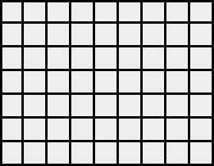
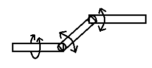

# Weekly-Quizes-2023

鄄城一中2023年每周押题（只是个人押题，高考后6月13日补充其它内容）

> 背景：高三三模那些天在学校告示栏出了六期每周押题，从4月25断断续续出到5月29。虽然在高考中只押中了一道题的题型，但出题的过程，一来是莫名其妙地过瘾，二来也从试着从命题人的角度了解了一下考试。
>
> 过了大半年以后，现在因为怀念高中的那些日子，就重做了这些题目，并附上当时的命题过程以及一些简单的评价，

这里总共有27道数学题，除第1题和第10题改编自当时的模拟题以外，其余题目为原创题，背景与思路多较为新颖。但同时，如实来讲，限于笔者水平，里面也有个别题目或多或少地存在一些质量问题，正文注解中会给出说明，还望见谅。

这里每道习题分为原题、参考答案、解析、命题思路与简析四个部分。其中，解析部分着重讲解我们是怎样得到题目的解答思路的，而命题思路与简析则分别给出了题目的命制过程以及对题目所覆盖的知识点、题目质量与题目难度的评价。

个人感觉，除去第1和第10两道改编题以外（其实也都还不错啦），25道原创题中，题型较新且质量还算可以的题目如下：

| 题号 | 命题背景                                                     | 难度 |
| ---- | ------------------------------------------------------------ | ---- |
| 2    | $(An^2+Bn+C)\cdot q^n$形式数列的求和                         | 3    |
| 4    | 由做对的题推测会做的题的数量                                 | 3    |
| 5    | 复数大题                                                     | 4    |
| 11   | 含三角函数与多项式函数的导数证明题                           | 2    |
| 13   | 立体几何与解析几何的简单结合                                 | 3    |
| 15   | 理论建模+回归分析                                            | 3    |
| 16   | 多次测量取平均值减小误差的原理探究                           | 4    |
| 18   | 方程$\log_ax=a^x$的解的个数以及与方程$x=a^x$和$x=\log_ax$的关系 | 5    |
| 22   | 由抽球实验估计球的种数与公式的合理性推断                     | 3    |
| 23   | 定量刻画试题的坑爹程度                                       | 4    |
| 25   | 偏导数与多元函数最值                                         | 3    |

当然，其他试题，除了个别质量实在差、太偏太怪或有超纲嫌疑的题目外，如有兴趣也可以尝试一下。

参考答案或题目如有错误或不严谨、不妥当之处，欢迎在Issue区或B站私信反馈讨论。

这里补上当时在5月29“最后一押”上面写的的一个后记：

> emmm...新题写不开了估计。
>
> 下周高考，时间不多了，就不再出题了。这几次命题，收获还是不小的，一来对既有的部分技巧有了更进一步的认识，二来也从命题人的角度重新了解了“考试”的流程。高一高二的同学们如有兴趣，我会在高考后吧题目发到Github上（https://github.com/Weekly-Quizes-2023），6月13之后可以看看。以下是FAQ：
>
> 1. Q：为什么那么多材料题，谝能？A：大概真有这个原因吧，不过确也有些材料题材料内容比题更有用，“复杂情景”嘛。
> 2. Q：那么多概统，导数，为什么解析几何却那么少呢？A：（因为不会解几）高二下才好好学，只剩导数和概统了。
> 3. Q：Minecraft题材为什么会出现在这里呢？A：因为自己就是MC玩家且出过MC试题。另外MC确有深度。
> 4. Q：为什么不命常规一些的试题呢？A：常规题其他地方有太多了，命制意义不大。
> 5. Q：这些题，究竟押了些什么呢？A：个人感觉，高考题可能会考一些“大道至简”的（21、22年压轴）或服务于实际的内容。以导数为例，考$7x^3+e^{\frac12x}-2$这样的函数不如考$a^x-\log_a x$的可能性大，数列也有可能出成应用题，另外可能还会有一些让证明一些一看就理解却不知所以然的命题（如多次测量取平均值减小误差），复数大题也不好排除。
> 6. Q：出题人是谁呢？A：807。

---

# 2023.4.25期

1. 证明：$n\in N^*$，$0<1+\frac12+\frac13+\dots+\frac1n-\ln{(n+1)}<e^{-\frac18}$。

2. 已知$\{\sqrt{a_n}\}$为公差$d=\sqrt{a_1}$的等差数列，$S_n$为$\{a_n\cdot2^n\}$的前n项和，$b_n=\frac{S_n}{a_1^2}$，求$\{b_n\}$的通项公式。

3. 空间直角坐标系中，双圆锥$C:x^2+y^2=4z^2$，平面$\alpha:z=kx-1$，若$C$、$\alpha$的交线为抛物线，则该$k=$___，抛物线的焦点到准线的距离为\_\_\_。

4. 某考生做八道单选，每道题如果会做有80%的可能答对，不会做有20%的可能答对。该考生共答对6道题，问该考生实际会做的题目道数最可能是___。

---

# 2023.4.28期

5. 复数列$\{a_n\}$中，$\frac{a_{n+1}}{a_n}=k$，$k$为关于$x$的方程$x^2-2i=0$的一个复数根且实部为非负数，$a_1=1$. 记$a_n$的实部与虚部分别为$Re_n$和$Im_n$.

   (1) 求$Re_n$、$Im_n$和$|a_n|$

   (2) $a_n$在复平面内对应向量为$\overrightarrow{OP_n}$，选择一问作答：

   (i) $\triangle OP_nP_{n+1}$的内切圆与外接圆半径分别为$b_n$、$d_n$，$\{b_n\}$、$\{d_n\}$的前$n$项和分别为$B_n$、$D_n$，求$\frac{B_n}{D_n}$

   (ii) 若$Q_1$与原点重合，$\overrightarrow{Q_nQ_{n+1}}=\overrightarrow{OP_n}$，求$|\overrightarrow{OQ_{4n+1}}|$（$n\in N^*$）

6. 现研究英语七选五的简化情形五选三. 某考生从5个备选项中选取n项随机填入3个给定空格，所选选项全部用到，所有空格均没有留空. 各题目只有一个正确答案且不重复，每题2.5分，记该考生得分为$X_n$.

   (1)求n的可能取值及$E(X_3)$

   (2)从期望的角度，判断n为何值时考生得分更多

7. $x\in (0,\frac{\pi}{2})$，求证：$1+(\frac{1}{\sin x}-\frac{1}{\tan x})^2<\frac{x^2}{\sin^2 x}<\frac{\pi^2}{4}$

8. （多选）$A(-\sqrt{3}, 0)$，A、B关于原点对称，平面xOy内有一动点P满足$\angle APB=\frac{\pi}{3}$，记P的轨迹为C，下列说法正确的有

   A. C为一个封闭图形

   B. |AP|+|BP|的最大值为$4\sqrt{3}$

   C. P到直线$\sqrt{3}x-y-7=0$的最短距离为2

   D. $\vec{OP}\cdot\vec{AP}$的取值范围为$(0, 5+2\sqrt{7}]$

9. （多选）在计算机中，实数通常以浮点数的形式近似储存，一套浮点数定义下能被准确表示的数字的集合为一个浮点数集，记为F(E, S)，其中E、S为参数，且满足$E\ge2$且$E\in N^*$、$S\in N^*$，而且有

   $$F(E,S)=\{0\}\cup(\bigcup^{2^{E-1}}_{i=-2^{E-1}+2}\{f|f=m\cdot2^{i-S},|m|\lt2^S,m\in Z\})$$

   其中$\bigcup_{i=m}^{n}A_i=A_m\cup A_{m+1}\cup A_{m+2}\cup\cdots\cup A_n$.

   对于任意实数r，可按照以下步骤得出其在浮点数集F(E, S)中的对应值R

   1. 若F(E, S)中元素均大于或小于r，分别记R为$-\infin$和$+\infin$
   2. 否则，如果F(E, S)中存在唯一值$R_0$使得$|R_0-r|$最小，$R=R_0$
   3. F(E, S)中若存在多个$R_0$使得$|R_0-r|$最小，R为其中绝对值最小的一个

   国际上规定，单、双精度浮点数集分别为F(8, 23)和F(11, 52).

   按照题目信息，下列说法正确的有（参考数据：$\lg5\approx 0.698970$）：

   A. 单精度浮点数集为双精度浮点数集的真子集

   B. $\forall n\in N^*$，$3^{-n}\notin F(E,S)$

   C. 已知$f_{n+1}(x)=f_1(f_n(X))$，$f_1(x)=R(x+1)$，R(x)为x在单精度浮点数集中对应的值，则$n\to+\infin$时，$f_n(0)$有最大值$2^{23}$

   D. 十进制表示下，单精度浮点数集中绝对值最小的非零元素的绝对值的小数部分的第一个和最后一个非零数位间（含两端）共有104位数字

---

# 2023.5.7期

## 第10题

10. 在调查的人群A、B中，分别有$\frac{1}{4}$、$\frac{1}{6}$不支持某方案，且A、B人群各有n人。若有99.9%的把握（$K^2$临界值为10.828）认为是否支持该方案与人群有关，n的最小值为___

11. $x\in(0,\frac{\pi}{2})$，若不等式$a\tan{x}+\sin{x}>(a+1)x$恒成立，$a$的取值范围为___

12. 正方体$ABCD-A_1B_1C_1D_1$，$AB=\sqrt{2}$，P为空间内一点

    i. $DP=2$，四面体$D-ABP$体积最大时，四面体$D-ABP$的外接球表面积为___

    ii. $AP$的长度与四面体$D-B_1D_1P$的体积相等，四面体$D-ABP$体积的取值范围为___

13. 曲线$C:x^2+y^2-axy=1$，$P(x_1,y_1)$在C上，

    i. 若$x^2_1+y^2_1$存在最大值，$a$的取值范围为___

    ii. $Q(x_2,y_2)$也在C上，且$|PQ|$存在最大值，该最大值为___

14. 为研究电磁感应单杆模型中杆的运动，我们可以将一个较长的时间段分解为若干足够短的等长时间片$t_0$（单位s），并由自然变化的连续性和平滑性认为一个时间片内杆的速度不变。由物理分析可知，杆在第n个$t_0$内的加速度为$\frac{v_n-v_{n-1}}{t_0}=a_0-fv_{n-1}$，其中$v_n$为物体在n个$t_0$时的速度，$v_0$为杆的初速度，$a_0$与$f$均为常数。记$\{v_nt_0\}$的前n-1项和为$S_n-v_nt_0$。

    (1) 若$t_0=1$（s），$f=0.5$（$s^{-1}$），$v_0=1$（m/s），$a_0=-1$（$m/s^2$），求$\{v_n\}$、$\{S_n\}$的通项公式，

    (2) (1)的条件下，若$t_0\to0$，设经过时间t后物体的位移大小为$x(t)$，求$x(t)$的解析式与值域。

    参考公式：$\lim_{x\to0}(1+x)^\frac{1}{x}=e$

15. （一定不是这么一个载体但也许真会这么考）游戏Minecraft中，当多个位置重合的TNT同时爆炸时，每个TNT的运算可认为包含两个阶段：第一阶段包括TNT实体自身的运动和爆炸对地形的破坏运算，每个TNT平均耗时恒为$t_0$（单位ms）；第二阶段，TNT会与附近的每个实体（包括其他TNT但不包括自身）进行交互，每个实体耗时$t_1$（单位ms）。TNT运算完毕后会被立即移除，假定周围除TNT外不存在其他实体，每个TNT提供且只提供一次爆炸。多个位置重合且同时爆炸的TNT产生的爆炸称为一组爆炸。

    (1) 某组爆炸中共用到n个TNT ,试预计TNT运算总耗时$T_n$

    (2) 记x个TNT组成的一组爆炸中TNT运算耗时为y（ms），现统计了几组x、y。试依据(1)中的模型建立y关于x的回归方程，并估计$t_0$、$t_1$的值。已知数据满足下式：

    $\sum_{i=1}^5y_i=9700$、$\sum_{i=1}^5x_i=1500$、$\sum_{i=1}^5x_i^2=550000$、$\sum_{i=1}^5\frac{y_i}{x_i}=27$、$\sum_{i=1}^5x_iy_i=387500$

    (3) 某次爆炸推进中，将所需的爆炸等分为若干组，每组$N_0$（$N_0$为10的倍数）个TNT，每两组爆炸间隔1.6s。试借助(2)中的回归关系确定$N_0$取何值时，平均每次爆炸耗时最小。

---

# 2023.5.15期

16. 我们知道，对一个数据进行重复测量并取平均值可以减小偶然误差，下面对这一原理进行探讨。假定存在一个测量工具可以测量准确值$x_0$为整数的一个物理量，且测多一个单位和测少一个单位的概率均为$\frac{1}{2}$。用该工具测量一个体系$n$次，得到数据$x_1、x_2、\dots、x_n$，且这些数据的均值为$\overline{X_n}$。

    (1) 求证：$a=\overline{X_n}$时$\sum_{i=1}^n(x_i-a)^2$取最小值；

    (2) 求证：随机变量$\varepsilon_n^2=(\overline{X_n}-x_0)^2$的期望随n递减；

    (3) 2次测量后，体系受到扰动，$x_0$可能发生改变，于是又进行了两次测量，发现这两次测得数据的平均值与扰动前测得数据的平均值相等，因而判断$x_0$没有发生变化，求这一判断错误的概率。

17. 如图，xOy平面内存在一个边长为m、n（$m\ge4$,$n\ge4$）的矩形网格，每个小格均为边长为1的均为边长为1的正方形。先随机选取一个小格，在其中心放置一点P，再使P分别在x、y轴方向上进行两轮游走。每轮游走中，P先后沿坐标轴正、负方向等可能地移动0至2格，则P最终仍在网格内的概率为___。

    

18. $f(x)=\log_ax-a^x$

    (1) $a\in [e^{-e},1)\cup(1,+\infty)$，关于$x$的方程$x=a^x$、$x=\log_ax$和$a^x=\log_ax$的根分别组成集合A、B、C，求证：$A=B=C$；

    (2) $f(x)\lt0$，求$a$的取值范围；

    (3) $a\in(0,1)$，求$f(x)$零点个数的可能取值组成的集合。

19. 为适应田间起伏的路面，农用机械有时会采用如图所示的万向轴进行传动。OA、AB、BC为三段不可变形的直杆（半径可以忽略），长度均为20。每两段杆间有一活动连接，可按一定方向转动，但限制任意两杆间夹角$\alpha、\beta$不大于$\frac{\pi}{6}$。认为OA杆始终水平，且OA杆可以以自身为轴自由转动。则A、C两点间最大高度差为___。AB杆能扫过的区域组成一个几何体，该几何体内切球体积为\_\_\_。		

    

20. 电子计算机推广之前，很多复杂的计算时借助对数表完成的。以下是一个常用对数表的一部分：

    | x    | 2        | 3        | 7        | 11       | 13       | 17       | 19       |
    | ---- | -------- | -------- | -------- | -------- | -------- | -------- | -------- |
    | lg x | 0.301030 | 0.477121 | 0.845098 | 1.041393 | 1.113943 | 1.230449 | 1.278754 |

    以此计算$2^{2023}=$___（科学计数法表示，保留一位有效数字）。

---

# 2023.5.21期

21. 我们知道，$C_{n+1}^{k+1}=C_n^k+C_n^{k+1}$，借此我们可以对高次多项式进行求和，以此，$\{n^3\}$的前n项和为___

22. 一个箱子中方有若干除编号外完全相同的小球，而且所有$x+y$个编号中，有$x$个编号当中每个编号只被标在了一个小球上，$y$个编号当中每个编号被标在了$n$个小球上，每个小球只有一个确定的编号。为统计$x$、$y$、$n$的取值，现进行多轮摸球试验，记录每轮实验中摸完第$k$个球时在本轮试验中出现的不同编号个数$m_k$，最后计算$m_k$的平均值$N_k$。每次摸球只摸一个，摸出小球后放回并摇匀，每轮实验中摸球次数足够多。则$E(N_k)$的表达式可以是：

    A. $E(N_k)=\frac{x}{x+yn}[x-x(\frac{x-1}{x})^{k+1}+y-y(\frac{y+1}{y})^k]+\frac{yn}{x+yn}[x-x(\frac{x-1}{x})^{k}+y-y(\frac{y+1}{y})^{k+1}]$

    B. $E(N_k)=\frac{x^2}{x+yn}[1-(\frac{x-1}{x})^k]+\frac{y^2n}{x+yn}[1-(\frac{y-1}{y})^k]$

    C. $E(N_k)=x[1-(1-\frac{1}{x+yn})^k]+y[1-(1-\frac{n}{x+yn})^k]$

    D. $E(N_k)=x[1-(\frac{x-1}{x})^{\frac{x}{x+yn}k}]+y[1-(\frac{y-1}{y})^{\frac{yn}{x+yn}k}]$

23. 除我们所熟知的欧里几得距离外，距离在不同的情境中又有着多种不同的含义。用$n(C)$表示集合$C$中元素的个数，则两个有非空交集的集合$A$、$B$间距离$d$的一种定义为$d=\frac{n(A\cup B)-n(A\cap B)}{n(A\cap B)}$。某场考试中有足够多且数目不确定的考生参加，所有考生组成全集$U$，对任意集合C，规定$\overline{C}=\complement_UC$。其中有道试题Q，会做Q的考生组成集合$A$，做对Q的考生组成集合$B$。定义Q的“SD系数”$a$为集合$A$、$\overline{B}$间的距离，“SB系数”b为集合$\overline{A}$，$B$间的距离。$\forall (X,Y)\in\{(X,Y)|X=A或\overline{A},Y=B或\overline{B}\}$，$X\cap Y\ne \emptyset$。

    (1) 写出$a$、$b$的取值范围，并解释$a=b=k$时$k$增大的现实意义；

    (2) 以频率估计概率，记$X$: 任取一考生，会做Q，$Y$：任取一考生，做对Q，求证：$a=\frac{P(\overline{X}|\overline{Y})}{P(X|\overline{Y})}+\frac{P(Y|X)}{P(\overline{Y}|X)}$；

    (3) (2)中事件$X$、$Y$是否可能独立，若可能，求$X$、$Y$独立且$P(X)=P(Y)$时$\frac{1}{a}+\frac{1}{b}$的最值，否则说明理由。

24. 下列关于方根的命题中，真命题的个数为___

    - $p:x\in N$，$x$的个位为2、3、7、8中的一个  $q:\sqrt{x}\notin Q$，p为q的既不充分也不必要条件
    - $p:x\in N, ^n\sqrt{x}\in Q,n\in N^*$且$n\ge2$  $q:^n\sqrt{x}\in N$，p为q的充要条件
    - $p\in N$，$x$末位确定为$k$，其余位数字可变，$^4\sqrt{x}\notin Q$恒成立  $q:$改变x的十位及更高位数字，可使$^{2020}\sqrt{x}\in Q$，$p$是$q$的充分条件
    - $p:x$为无限循环小数，$\sqrt{x}\in Q$  $q:\sqrt{x}$为无限循环小数，$p$是$q$的充要条件
    - 1的2023次方跟有2023个，且和为实数

---

# 2023.5.29期

25. （只押题型，不押背景）Minecraft使用随机刻机制运算作物的生长。每经过1 gt（gt为一个不可细分的最小时间单位），每个区段中的4096个方块中会有3个被等可能地选中，如果被选中的方块为未成熟的作物，该作物会有一定的概率（称为生长成功概率）生长。某南瓜机中，每个区段包含64个南瓜梗（一种作物方块），其中生长成功概率为$\frac{1}{3}$和$\frac{1}{6}$的南瓜梗各占一半。南瓜梗成熟后可以在某个时间被收获，每个成熟的南瓜梗产出一个南瓜，南瓜梗在收获后需要成功生长一次才能再次成熟。各南瓜梗的生长互不影响。

    (1) 若未进行收获，求n gt后任取一个南瓜梗选中成熟的南瓜梗的概率$P_n$

    (2) 经过优化，现每个区段中64个南瓜成熟的概率均为$\frac{1}{3}$。为实现自动化收获，欲确定一个包含$T$个gt的工作周期。每个周期中前5 gt南瓜不能成功生长，每周期结束时所有成熟的南瓜梗将被全部收获，而后下一个周期立即开始。记一个周期结束后，每个区段在1 gt中平均产出的南瓜数目为随机变量$X$。

    ​	i. 求$X$的期望

    ​	ii. 用$X$的期望表示南瓜机的效率，将使得南瓜机效率最大的周期长记作$T_0$，试确定一个区间$[a,b]$，使得$T_0\in [a,b]$。要求$a\in N$，$b\in N$，$|a-b|\le100$。（只写出结果即可，过程不做要求）

26. 我们称有多个自变量的函数为多元函数，记为$f(a_1,a_2,\dots,a_n)$。研究多元函数的单调性时，我们常采用“求偏导”的方法，即仅将各参数中的一个视为为一个主元，将其它的参数视作常数来对主元求导。记$f(a_1,a_2,\dots,a_n)$关于$a_1$的偏导为$\frac{\partial f(a_1,a_2,\dots,a_n)}{\partial a_1}$。另外，定义二元函数$f(x,y)$的“嵴”为平面直角坐标系$xOy$中方程$[\frac{\partial f(x,y)}{\partial x}]^2+[\frac{\partial f(x,y)}{\partial y}]^2=0$的图像。例如，函数$g(x,y)=x^2$的嵴为直线$x=0$。

    (i) $f(x,y)=\frac{1}{(x^2+y^2)^2}-\frac{4}{x^2+y^2}$的嵴围成的面积为___（如嵴不是封闭图形，填写0）；

    (ii) 多项式$\frac{1}{16}x^4-x^2y+xy^2$的取值范围为___（$x>0,y>0$）。

27. 我们知道，使用二分法可以求解单调函数零点的近似值，类似地，“$k$分法”的一轮计算中，已知零点所在的区间会被等分为$k$个子区间，然后所有子区间交界处的函数值会被求出（同一位置只求一次）以确定零点所在的子区间。子区间确定后，下一轮的计算会在这个子区间上重新开始，直到确定零点所在的的区间长度（上下界差的绝对值）足够小。每轮计算均不可中途终止。现有一个在$R$上单调递增的函数$f(x)$，已知其唯一零点$x_0\in(827,828)$。记“$k$分法”的效率为附加信息量$log_2\frac{初始区间长度}{确定零点所在的最小子区间长度}$在每次对给定函数求值时的平均增量。

    (1) 用4分法将$f(x)$的零点确定在一个长度不大于$10^{-4}$的区间中，需对$f(x)$求值的次数为___；

    (2) 由于配置问题，“$k$分法“在某计算机上完成第4096轮时会因堆栈溢出而终止计算且无法输出结果。现欲确定$x_0$的第2023位小数，且使用可能有效的效率最高的“$k$分法“算法，对$f(x)$求值的次数至少为___。

    （参考数据：$lg2\approx 0.301030$，$lg3\approx0.477121$，$lg7\approx 0.845098$）

