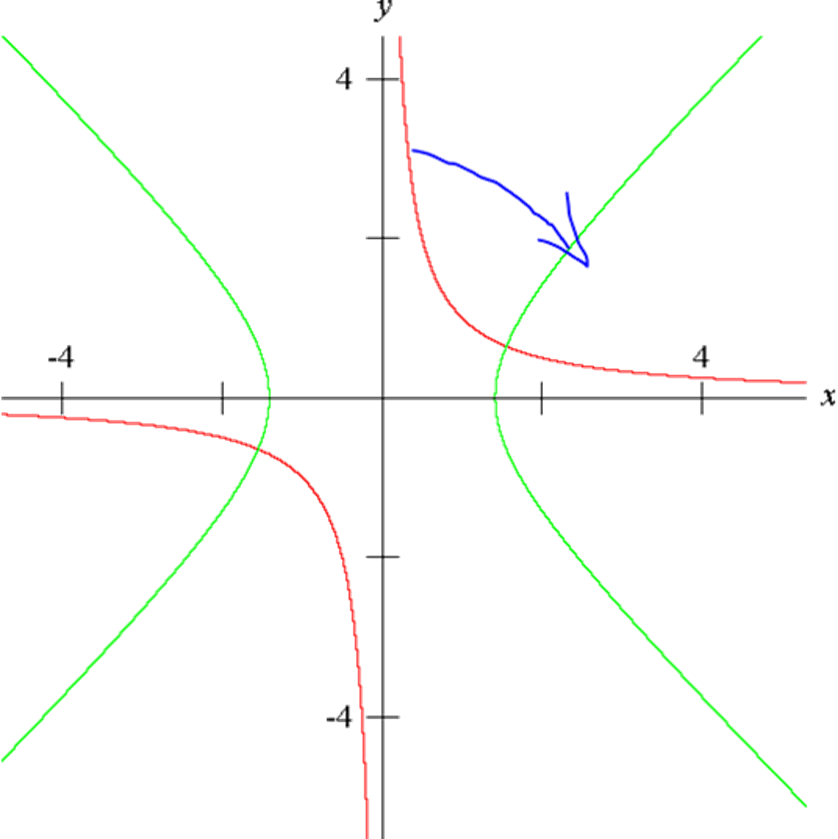
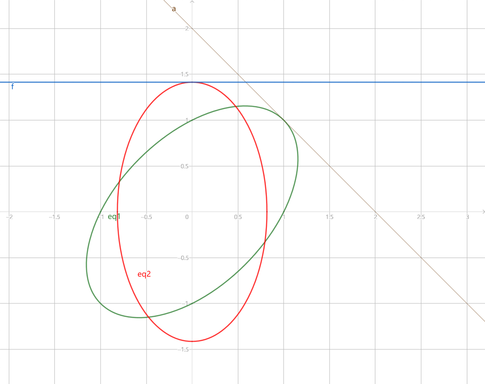
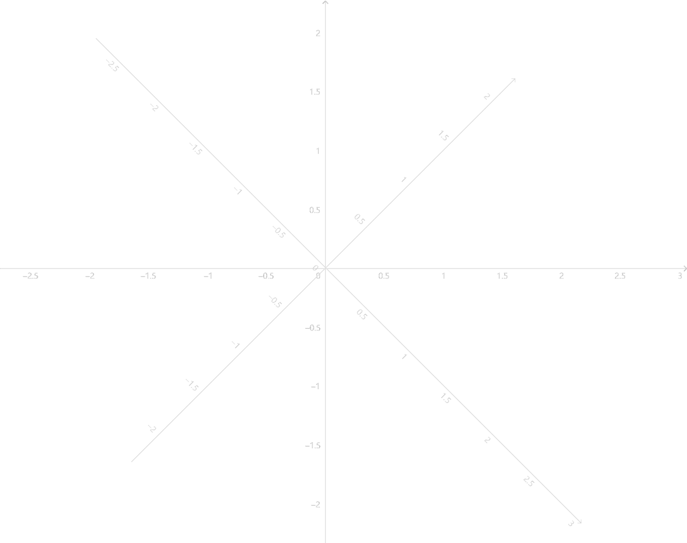

# 【高二囤货】从圆锥曲线的旋转到不等式的可视化

对应的视频版本：https://www.bilibili.com/video/BV14p4y1M7JD/?spm_id_from=333.999.0.0

2022年2月没写完的草稿：[https://lovexyn0827.lanzouo.com/i8hHU1chl03a](https://lovexyn0827.lanzouo.com/i8hHU1chl03a)密码:8sce

> 初三：
>
> 反比例函数的图像是双曲线
>
> 高二：
>
> 到两定点距离之差为定值的点的轨迹是双曲线
>

But, why?

如何将这两个看似毫不相干的定义联系在一起呢？

绘制出反比例函数的图像，容易看出X、Y轴是该曲线的两条渐近线，这两条渐近线相互垂直，由此联想到了双曲线中的等轴双曲线。等轴双曲线渐近线与坐标轴夹角为45°，所以这里尝试将原图像旋转这一角度。

设图像上存在一点$P(x_{0},y_{0})$，设$|OP| = r = \sqrt{x_{0}^{2} + y_{0}^{2}}$，$\alpha$为$\overrightarrow{OP}$相对X轴逆时针偏转的角度，则$x_{0} = rcos\alpha$，$y_{0} = rsin\alpha$。将P绕原点逆时针旋转$\theta$得到点$Q(x_{1},y_{1})$,则

$$
\begin{array}{r}
\left\{ \begin{array}{r}
x_{1} = r\cos(\alpha + \theta) = r\cos\alpha \cos\theta - \sin\alpha \sin\theta = x_{0}\cos\theta - y_{0}\sin\theta \\
y_{1} = r\sin(\alpha + \theta) = r\sin\alpha \cos\theta + r\sin\alpha \cos\theta = x_{0}\sin\theta + y_{0}\cos\theta
\end{array} \right.\tag{1}
\end{array}
$$
将$\theta = 45{^\circ}$带入其中，得

$$
\begin{array}{r}
\left\{ \begin{array}{r}
x_{1} = \frac{\sqrt{2}}{2}(x_{0} - y_{0}) \\
y_{1} = \frac{\sqrt{2}}{2}(x_{0} + y_{0})
\end{array} \right.\tag{2}
\end{array}
$$
由(2)可得

$$
x_{1}y_{1} = \frac{1}{2}(x_{0}^{2} - y_{0}^{2})\tag{3}
$$
设反比例函数表达式为

$$
y=\frac kx\tag{4}
$$
易知其另一种等价表达式为

$$
xy-k=0\tag{5}
$$
在(5)中取$一点(x_{0},y_{0})代入$方程中，然后将(3)代入其中并化简，得

$$
\frac{x_{0}^{2}}{2k} - \frac{y_{0}^{2}}{2k} = 1\tag{6}
$$
即可经由逆时针旋转$\frac{\pi}{4}$得到$(5)$的曲线方程为

$$
\frac{x^{2}}{2k} - \frac{y^{2}}{2k} = 1\tag{7}
$$
曲线(5)上的每个点都由曲线(7)上的对应点绕原点逆时针旋转$\frac{\pi}{4}$得到，曲线(5)是由曲线(7)绕原点逆时针旋转$\frac{\pi}{4}$得到的，反过来曲线(7)是由曲线(5)绕原点顺时针旋转$\frac{\pi}{4}$得到的，所以旋转后的曲线方程为(7)。

$k \neq 0$时(7)符合双曲线的标准方程。因为旋转前后的图形相互全等，所以旋转前的图形也为双曲线，即反比例函数$y = \frac{k}{x}(k \neq 0)$的图像为实轴长$2\sqrt{2}k$，焦距$4k$的等轴双曲线。

------

这就完了吗？

还没有。其实稍微延伸一下，就可以得到任意二次曲线绕原点旋转任意角度后所得曲线方程的通式。

由(1)可得

$$
x_{1} + y_{1} = x_{0}(\cos\theta + \sin\theta) + y_{0}(\cos\theta - \sin\theta)\tag{8}
$$

$$
x_{1} - y_{1} = x_{0}(\cos\theta - \sin\theta) - y_{0}(\cos\theta + \sin\theta)\tag{9}
$$

$$
x_{1}^{2} + y_{1}^{2} = x_{0}^{2} + y_{0}^{2}\tag{10}
$$

$$
x_{1}^{2} - y_{1}^{2} = x_{0}^{2}\left( \cos^{2}\theta - \sin^{2}\theta \right) - y_{0}^{2}\left( \cos^{2}\theta - \sin^{2}\theta \right) - 4x_{0}y_{0}\cos\theta \sin\theta\tag{11}
$$

$$
x_{1}y_{1} = x_{0}^{2}\cos\theta \sin\theta - y_{0}^{2}\cos\theta \sin\theta + x_{0}y_{0}\left( \cos^{2}\theta - \sin^{2}\theta \right)\tag{12}
$$

设

$$
A = x_{1}^{2} + y_{1}^{2} = x_{0}^{2} + y_{0}^{2}\tag{13}
$$

$$
B = x_{1}^{2} - y_{1}^{2} = x_{0}^{2}\left( \cos^{2}\theta - \sin^{2}\theta \right) - y_{0}^{2}\left( \cos^{2}\theta - \sin^{2}\theta \right) - 4x_{0}y_{0}\cos\theta \sin\theta\tag{14}
$$

$$
{C = x}_{1}y_{1} = x_{0}^{2}\cos\theta \sin\theta - y_{0}^{2}\cos\theta \sin\theta + x_{0}y_{0}\left( \cos^{2}\theta - \sin^{2}\theta \right)\tag{15}
$$

$$
D = x_{1} + y_{1} = x_{0}(\cos\theta + \sin\theta) + y_{0}(\cos\theta - \sin\theta)\tag{16}
$$

$$
E = x_{1} - y_{1} = x_{0}(\cos\theta - \sin\theta) - y_{0}(\cos\theta + \sin\theta)\tag{17}
$$

则

$$
\begin{eqnarray}
&&mA + nB + pC + qD + rE + s \\
 &=& m\left( x_{1}^{2} + y_{1}^{2} \right) + n\left( x_{1}^{2} - y_{1}^{2} \right) + px_{1}y_{1} + q\left( x_{1} + y_{1} \right) + r\left( x_{1} - y_{1} \right) + s &\\
 &=& (m + n)x_{1}^{2} + (m - n)y_{1}^{2} + px_{1}y_{1} + (q + r)x_{1} + (q - r)y_{1} + s
\end{eqnarray}\tag{18}
$$
设要旋转的二次曲线方程为

$$
ax^{2} + by^{2} + dxy + ex + fy + g = 0\tag{19}
$$
曲线上取一点$(x_{1},y_{1})$代入原方程，得

$$
ax_{1}^{2} + by_{1}^{2} + dx_{1}y_{1} + ex_{1} + fy_{1} + g = 0\tag{20}
$$
令(18)式等于0以与式(19)的形式对应，得

$$
(m + n)x_{1}^{2} + (m - n)y_{1}^{2} + px_{1}y_{1} + (q + r)x_{1} + (q - r)y_{1} + s = 0\tag{21}
$$
令(20)，(21)指定的$(x_{1},y_{1})的$轨迹相同$，$有

$$
\left\{ \begin{array}{r}
m + n = a \\
m - n = b \\
p = d \\
q + r = e \\
q - r = f \\
s = g
\end{array} \right.\tag{22}
$$
解得

$$
\left\{ \begin{array}{r}
\begin{array}{r}
m = \frac{a + b}{2} \\
n = \frac{a - b}{2} \\
p = d
\end{array} \\
q = \frac{e + f}{2} \\
r = \frac{e - f}{2} \\
s = g
\end{array} \right.\tag{23}
$$
将(13)-(17)以及(23)代入(18)化简并使之等于$0，$得

$$
\begin{eqnarray}
\left( \frac{a + b}{2} + \frac{a - b}{2}\cos2\theta + \frac{1}{2}d\sin2\theta \right)x_{0}^{2} &+& \left( \frac{a + b}{2} - \frac{a - b}{2}\cos2\theta - \frac{1}{2}d\sin2\theta \right)y_{0}^{2} \\
&+& \left\lbrack d\cos2\theta - (a - b)\sin2\theta \right\rbrack x_{0}y_{0} \\
&+& (e\cos\theta + f\sin\theta)x_{0} + (f\cos\theta - e\sin\theta)y_{0} + g = 0
\end{eqnarray}\tag{24}
$$
则能通过逆时针旋转$\theta$得到(19)的曲线方程为

$$
\begin{eqnarray}
\left( \frac{a + b}{2} + \frac{a - b}{2}\cos2\theta + \frac{1}{2}d\sin2\theta \right)x^{2} &+& \left( \frac{a + b}{2} - \frac{a - b}{2}\cos2\theta - \frac{1}{2}d\sin2\theta \right)y^{2} \\
&+& \left\lbrack d\cos2\theta - (a - b)\sin2\theta \right\rbrack xy\\
&+& (e\cos\theta + f\sin\theta)x + (f\cos\theta - e\sin\theta)y + g = 0\\
\end{eqnarray}\tag{25}
$$
亦为曲线(19) 绕原点顺时针旋转$\theta$得到的曲线方程。

---

还没完，得到这样一个方程，那么能用它做些什么呢？

> **证明：形如**$y = tx +\frac{k}{x}(k \neq 0)$**的关于**$x$**的函数图像均为双曲线**

可以证明，原函数为奇函数，图像关于原点对称，欲证其图像为双曲线，不妨尝试对其进行旋转。

将原方程写成式(19)的形式为

$$
tx^{2} - xy + k = 0
$$
则$a = t$，$d = - 1$，$g = k$，$b = e = f = 0$，代入(25)得原点顺时针旋转$θ$得到的曲线方程为

$$
\left\lbrack \frac{t}{2}(1 + \cos2\theta) - \frac{1}{2}\sin2\theta \right\rbrack x^{2} + \left\lbrack \frac{t}{2}(1 - \cos2\theta) + \frac{1}{2}\sin2\theta \right\rbrack y^{2} - \lbrack \cos2\theta + t\sin2\theta\rbrack xy + k = 0
$$
当$t≠0$时，令其$xy$项系数为0，解得

$$
\tan2\theta = - \frac{1}{t}
$$
所以

$$
\cos^{2}2\theta = \frac{t^{2}}{t^{2} + 1}
$$

$$
\sin^{2}2\theta = \frac{1}{t^{2} + 1}
$$

令$\theta \in ( - \frac{\pi}{2},\frac{\pi}{2})$，易证此时$\tan2\theta$值域为$\R$，必然包含了$\frac{1}{t}$的所有取值。且此时

$$
\cos2\theta > 0
$$
所以

$$
\cos2\theta = \sqrt{\frac{t^{2}}{t^{2} + 1}}
$$
当$- \frac{\pi}{2} < \theta < 0$时

$$
t>0
$$

$$
\sin2\theta < 0
$$

所以

$$
\sin2\theta = - \sqrt{\frac{1}{t^{2} + 1}}
$$
代入旋转后的曲线方程中，得

$$
\left\lbrack \frac{t}{2}\left( 1 + \sqrt{\frac{t^{2}}{t^{2} + 1}} \right) + \frac{1}{2}\sqrt{\frac{1}{t^{2} + 1}} \right\rbrack x^{2} + \left\lbrack \frac{t}{2}\left( 1 - \sqrt{\frac{t^{2}}{t^{2} + 1}} \right) - \frac{1}{2}\sqrt{\frac{1}{t^{2} + 1}} \right\rbrack y^{2} + k = 0
$$
易知在$t > 0$时$x^{2}$项系数

$$
\left\lbrack \frac{t}{2}\left( 1 + \sqrt{\frac{t^{2}}{t^{2} + 1}} \right) + \frac{1}{2}\sqrt{\frac{1}{t^{2} + 1}} \right\rbrack > 0
$$
假设$y^{2}$项系数也不小于零，有

$$
t\left( 1 - \sqrt{\frac{t^{2}}{t^{2} + 1}} \right) \geq \sqrt{\frac{1}{t^{2} + 1}}
$$
整理得

$$
t\sqrt{t^{2} + 1} \geq t^{2} + 1
$$
同除以$\sqrt{t^{2} + 1}$得

$$
t \geq \sqrt{t^{2} + 1}
$$
两边同时平方，得

$$
t^{2} \geq t^{2} + 1
$$
但是这是不可能的，所以

$$
\left\lbrack \frac{t}{2}\left( 1 - \sqrt{\frac{t^{2}}{t^{2} + 1}} \right) - \frac{1}{2}\sqrt{\frac{1}{t^{2} + 1}} \right\rbrack < 0
$$
此时容易看出旋转后的曲线方程是双曲线的标准方程的形式。

当$\theta > 0$时

$$
t < 0
$$

$$
\sin2\theta > 0
$$

所以

$$
\sin2\theta = - \sqrt{\frac{1}{t^{2} + 1}}
$$
代入旋转后的曲线方程中，得

$$
\left\lbrack \frac{t}{2}\left( 1 + \sqrt{\frac{t^{2}}{t^{2} + 1}} \right) - \frac{1}{2}\sqrt{\frac{1}{t^{2} + 1}} \right\rbrack x^{2} + \left\lbrack \frac{t}{2}\left( 1 - \sqrt{\frac{t^{2}}{t^{2} + 1}} \right) + \frac{1}{2}\sqrt{\frac{1}{t^{2} + 1}} \right\rbrack y^{2} + k = 0
$$
令$u = - t$，代入式中，得

$$
\left\lbrack - \frac{u}{2}\left( 1 + \sqrt{\frac{u^{2}}{u^{2} + 1}} \right) - \frac{1}{2}\sqrt{\frac{1}{u^{2} + 1}} \right\rbrack x^{2} + \left\lbrack - \frac{u}{2}\left( 1 - \sqrt{\frac{u^{2}}{u^{2} + 1}} \right) + \frac{1}{2}\sqrt{\frac{1}{u^{2} + 1}} \right\rbrack y^{2} + k = 0
$$
即

$$
\left\lbrack \frac{u}{2}\left( 1 + \sqrt{\frac{u^{2}}{u^{2} + 1}} \right) + \frac{1}{2}\sqrt{\frac{1}{u^{2} + 1}} \right\rbrack x^{2} + \left\lbrack \frac{u}{2}\left( 1 - \sqrt{\frac{u^{2}}{u^{2} + 1}} \right) - \frac{1}{2}\sqrt{\frac{1}{u^{2} + 1}} \right\rbrack y^{2} - k = 0
$$
参考前面的证明过程，可证对于任意$t > 0$有

$$
\left\lbrack \frac{u}{2}\left( 1 + \sqrt{\frac{u^{2}}{u^{2} + 1}} \right) + \frac{1}{2}\sqrt{\frac{1}{u^{2} + 1}} \right\rbrack > 0
$$

$$
\left\lbrack \frac{u}{2}\left( 1 - \sqrt{\frac{u^{2}}{u^{2} + 1}} \right) - \frac{1}{2}\sqrt{\frac{1}{u^{2} + 1}} \right\rbrack < 0
$$

此时容易看出旋转后的曲线方程是双曲线的标准方程的形式

当$\theta = 0$时，$t$不存在对应值，舍去

当$t = 0$时，原函数是反比例函数，文章最初已给出证明

**证毕**

也可以试着证明:

> **形如$ax^{2} + by^{2} + dxy + ex + fy + g = 0$的二次曲线在$d^{2} - 4ab \neq 0$时为中心对称图形.**

> **除椭圆、双曲线、抛物线、圆、两交叉直线、两平行直线、点、直线外不存在其它二次曲线.**

---

**等会，这与不等式有什么关系呢？**

请看这道新高考II卷12题小压轴：

> 若实数x，y满足$x^{2} + y^{2} - xy = 1$，则
>
> A. $x + y \leq 1$
>
> B. $x + y \geq - 2$
>
> C. $x^{2} + y^{2} \geq 1$
>
> D. $x^{2} + y^{2} \leq 2$

我们注意到， $x^{2} + y^{2} - xy = 1$为一个二次曲线的方程，可以尝试对其进行旋转，使其成为标准形式的圆锥曲线。

借助前面给出的公式

$$
\begin{eqnarray}
\left( \frac{a + b}{2} + \frac{a - b}{2}\cos2\theta + \frac{1}{2}d\sin2\theta \right)x^{2} &+& \left( \frac{a + b}{2} - \frac{a - b}{2}\cos2\theta - \frac{1}{2}d\sin2\theta \right)y^{2} \\
&+& \left\lbrack d\cos2\theta - (a - b)\sin2\theta \right\rbrack xy\\
&+& (e\cos\theta + f\sin\theta)x + (f\cos\theta - e\sin\theta)y + g = 0\\
\end{eqnarray}\tag{25}
$$
我们很容易得出，要通过旋转去除使题目中的曲线方程中的xy一项，旋转角度$\theta$应满足：

$$
d\cos2\theta - (a - b)\sin2\theta = 0
$$
代入系数得

$$
- \cos2\theta = 0
$$
这样，我们不妨将原曲线绕原点顺时针旋转$- \frac{\pi}{4}$，通过上述公式计算可知，此时得到的曲线方程为

$$
\frac{3}{2}x^{2} + \frac{1}{2}y^{2} = 1
$$
即

$$
\frac{x^{2}}{\frac{2}{3}} + \frac{y^{2}}{2} = 1
$$
为长轴在$y$轴上，长轴长$\frac{2\sqrt{6}}{3}，$ 短轴长$2\sqrt{2}$的椭圆。

因为曲线上点绕原点旋转不改变点到原点的距离，所以可以得到，对旋转得到的椭圆上任一点$(x,y)$成立的

$$
\frac{2}{3} \leq x^{2} + y^{2} \leq 2
$$
对原曲线上的任一点$(x,y)$亦成立，进而对满足原等式的各个可能的$x$，$y$取值亦成立。故选D不选C。

同时，由于旋转前曲线的长轴与坐标轴的夹角和形如$x + y = t的$直线与坐标轴的夹角都为45度，且两者垂直。欲求解$x + y$的取值范围，我们可以假设一条直线$x + y = t$，当t增大时，该直线向右上移动，我们很容易直观地看出，当直线在椭圆的左下与右上顶点与椭圆相切时，t分别取最小值与最大值。容易得出

$$
- 2 \leq t \leq 2
$$
故选B不选A。

---

当然，纯用公式计算还是比较繁琐的，我们也可以试着对原曲线进行配方得到以下形式的方程：

$$
A(mx + ny)^{2} + B(nx - my)^{2} = C
$$
若原曲线为

$$
ax^{2} + bx^{2} + dxy = C
$$
我们可以列出方程组

$$
\left\{ \begin{array}{r}
Am^{2} + Bn^{2} = a \\
An^{2} + Bm^{2} = b \\
2mn(A - B) = d
\end{array} \right.\ 
$$
因为选项中出现$x + y$，且有$a = b$，故此处我们为方便计算取$m = n = 1$，解得

$$
\left\{ \begin{array}{r}
A = \frac{1}{4} \\
B = \frac{3}{4}
\end{array} \right.\ 
$$
原曲线方程可化为

$$
\frac{1}{4}(x + y)^{2} + \frac{3}{4}(x - y)^{2} = 1
$$
这意味着什么呢?我们可以得到

$$
\frac{1}{4}(x + y)^{2} = 1 - \frac{3}{4}(x - y)^{2}
$$
$x - y = 0$时，我们可以得知$\frac{1}{4}(x + y)^{2}$的最大值4，进而得出$|x + y| \leq 2，$选B而不选A。

另外，我们注意到，这与椭圆的标准方程有一定的相似之处：都是两个一次代数式的平方之和等于常数。

实际上，我们可以构建一个倾斜的平面直角坐标系，姑且称其两个轴为$x + y$轴与$x - y$轴，原xOy坐标系中的坐标在此坐标系的两个轴上的坐标分别为$x + y$与$x - y$。

这时，配方后的方程可以被视为我们新构建的直角坐标系中的一个椭圆。计算出其两个顶点的位置，并相应地解出xOy坐标系中对应点的坐标，即可直观地求解出椭圆上的点到原点距离的取值范围，进而得到$x^{2} + y^{2}$的取值范围。

---

可能要说了

> “奇淫技巧”，还不如用重要不等式链计算来的快！
>

很多情况下也确实如此，但是，这种方法让我们从一个可视的角度看到了这样一类二次方程以及相关不等式的本质，这种视角上的突破却是更为珍贵的。
