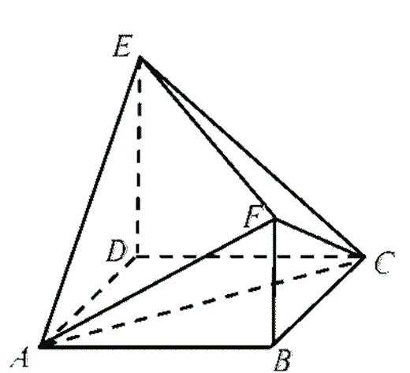

# 这玩意能求体积？

相应的视频版本：https://www.bilibili.com/video/BV1mC4y167CQ

## 魔法？

先说方法：首先我们将一个四面体的某个顶点设为原点，将其余顶点的坐标设为$(x_1, y_1, z_1)$， $(x_2, y_2, z_2)$，$(x_3,y_3,z_3)$，并列式如下：
$$
\begin{matrix}
	x_1 & y_1 & z_1 & x_1 & y_1\\
	x_2 & y_2 & z_2 & x_2 & y_2\\
	x_3 & y_3 & z_3 & x_3 & y_3
\end{matrix}
$$

然后，在刚才的式子上标出以下几个箭头，求出各箭头穿过的各个数字的乘积，写在箭头的头部。

然后，将上下两方的数字分别相加，并求出两组数字总和的差值的绝对值，得到的数值的$\frac16$即为原四面体的体积，即：

$$
V_{OABC}=\frac16|(x_1y_2z_3+y_1z_2x_3+z_1x_2y_3)-(x_3y_2z_1+y_3z_2x_1+z_3x_2y_1)|
$$

## 解密！

可能很是疑惑，right？

下面给出一种不超纲的证明：

我们设空间直角坐标系Oxyz中有互不共面四点$O(0, 0, 0)$，$A(x_1, y_1, z_1)$， $B(x_2, y_2, z_2)$，$C(x_3, y_3, z_3)$，则$\triangle ABC$中：

$$
S_{\triangle OAB} = \frac12|OA|\cdot|OB|\sin{O}
$$

而

$$
\vec{OA}\cdot\vec{OB} = |OA|\cdot|OB|\cos{O}
$$

所以有

$$
\begin{eqnarray}
	S_{\triangle OAB} ~&=& \frac12|OA|\cdot|OB|\sin{O}\\
	&=& \frac12|OA|\cdot|OB|\sqrt{1-\cos^2{O}}\\
	&=& \frac12\sqrt{(|OA|\cdot|OB)^2-\left(\overrightarrow{OA}\cdot\overrightarrow{OB}\right)^2}\\
	&=& \frac12\sqrt{(x_1^2+y_1^2+z_1^2)(x_2^2+y_2^2+z_2^2) - (x_1x_2+y_1y_2+z_1z_2)^2}\\
	&=& \frac12\sqrt{x_1^2y_2^2+x_1^2z_2^2+y_1^2x_2^2+y_1^2z_2^2+z_1^2x_2^2+z_1^2y_2^2-2x_1x_2y_1y_2-2x_1x_2z_1z_2-2y_1y_2z_1z_2}\\
	&=& \frac12\sqrt{(x_1y_2-x_2y_1)^2+(x_1z_2-x_2z_1)^2+(y_1z_2-z_1y_2)^2}
\end{eqnarray}
$$

同时我们可以很容易地求出平面$OAB$的一个法向量
$$
\vec{n} = (y_1z_2-z_1y_2,z_1x_2-x_1z_2,x_1y_2-y_1x_2)
$$
借助点到平面的距离公式，点$C$到平面$OAB$的距离
$$
\begin{eqnarray}
	d &=& \frac{|\vec{n}\cdot\vec{OC}|}{|\vec{n}|}\\
	&=& \frac{|(x_3,y_3,z_3)\cdot(y_1z_2-z_1y_2,z_1x_2-x_1z_2,x_1y_2-y_1x_2)|}{\sqrt{(y_1z_2-z_1y_2)^2+(z_1x_2-x_1z_2)^2+(x_1y_2-y_1x_2)^2}}\\
	&=& \frac{|x_3y_1z_2-x_3z_1y_2+y_3z_1x_2-y_3x_1z_2+z_3x_1y_2-z_3y_1x_2|}{2S_{\triangle ABC}}
\end{eqnarray}
$$
进而
$$
\begin{eqnarray}
	V_{OABC} &=& \frac13d\cdot S_{\triangle ABC}\\
	&=& \frac13\cdot\frac12\cdot|x_3y_1z_2-x_3z_1y_2+y_3z_1x_2-y_3x_1z_2+z_3x_1y_2-z_3y_1x_2|\\
	&=& \frac16[(x_1y_2z_3+y_1z_2x_3+z_1x_2y_3)-(x_3y_2z_1+y_3z_2x_1+z_3x_2y_1)]
\end{eqnarray}
$$
证毕。

## 行列式，混合积……

另外，接触过线性代数的同学很可能已经注意到，这种计算方法的主体为三阶行列式的求值，即
$$
V_{OABC}=\frac16\left|\left|\begin{matrix}
x_1&y_1&z_1\\
x_2&y_2&z_2\\
x_3&y_3&z_3\\
\end{matrix}\right|\right|
$$
这也是三阶行列式几何意义的一种体现。

另外这种方法也可以用混合积的形式表示：
$$
V_{OABC}=\left(\overrightarrow{OA}\times \overrightarrow{OB}\right)\cdot \overrightarrow{OC}
$$
留给读者自证。

## 细节答疑

- Q：如果四面体的顶点不包含原点该怎么办呢？

  A：可以在四面体中任取一点，用这一点指向其他三个点的向量就可以计算啦。

- Q：建立左手系或右手系会对结果有影响吗？

  A：两种坐标系下的结果都是一样的。

- Q：这个可以推广到其他多面体吗？

  A：多面体可视为由多个四面体拼接而成，把多面体分割成四面体就可以啦。

- Q：要是坐标写不出来怎么搞？

  A：其实如果坐标不好写的话，就说明这种方法不大适用了。（尽管理论上任何确定的四面体都是可以用这个方法求体积的）

## 应用举例

来用这种方法解一道高考题：

>
>
>【2022·新高考II，11】如图，四边形ABCD为正方形，ED⟂平面ABCD，FB∥ED，AB=ED=2FB，记三棱锥E-ACD，F-ABC，F-ACE的体积分别为$V_1$，$V_2$，$V_3$，则：
>
>A. $V_3=2V_2$
>
>B. $V_3=V_1$
>
>C. $V_3=V_1+V_2$
>
>D. $2V_3=3V_1$

我们设E为原点，设FB=1，以$\overrightarrow{DA}$、$\overrightarrow{DC}$和$\overrightarrow{DE}$为x，y，z轴正方向建系，则E(0, 0, 0)，A(2, 0, -2)，C(0, 2, -2)，F(2, 2, -1)，$V_1=\frac43$，$V_2=\frac23$，对于四面体E-ACF，列式如下：

所以$V_3=\frac16|-8+(-8)+0-(-4)-0-0|=2$，进而易知CD正确。

但是，也应该注意，只有很少一部分四面体体积适合用该方法求解，而且这种方法在大部分情况下也不一定是最简单明了、不易出错的。例如此题，我们完全也可以做出E、F与AC中点M的连线，借助AC垂直平面EFM的性质以一种更通俗易懂的方法求出$V_3$。

**技巧有风险，应用需谨慎。**