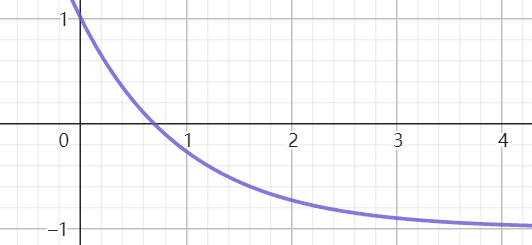
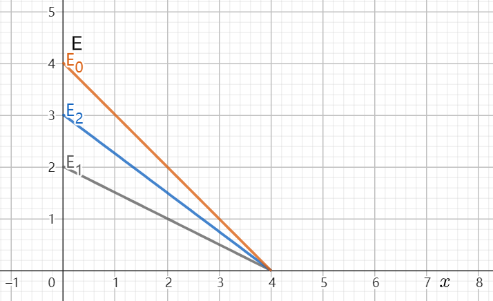
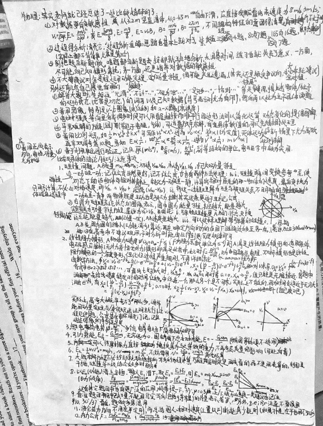
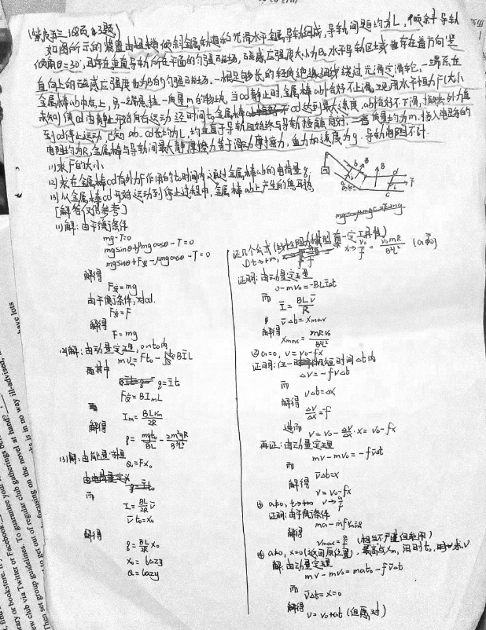

# 20230326·物理篇

> 背景：2023年3月25至26日，一模结束一个月后，给一位同学总结了自己所能想到的大部分解题方法。本文为其中的物理部分在添加注释后的版本，部分内容略有改动。

其实老师就已经总结了一些比价精辟的了

> 现在还未询问老师意见，所以暂不在这里写出。

另外还有几点自己感觉有用的

1. 解答大题时，先标注“光滑”、“粗糙”、“不计……”、“视为……”、“足够……”、“恰好……”、“轻质”等关键词，描述物体/粒子运动状态（尤其是初态）的词语以及已知数据（符号表示时尤为有用），然后再以此为主干具体读题。

   > 这一技巧貌似有“保质期”，刚开始用或用的时间太长以至完全成习惯后可能帮助也不会太大。

2. 善用图像，特别是$v-t$图像（求位移）和$a-x$图像（求速度）

   > 有时可以用直观观察简化运算。

3. 电场强度等向量合成很多时候可以用首尾相接而非平行四边形法则以简化运算。动态变化的提倡图解。

   > 首尾相接的一个好处是我们可以更方便地对一个整体的矢量图形进行合成。
   >
   > 实际上，因为图解法太好用，自己在高三以后就很少用解析法求解静力分析这样的题目了。（不过哦还是要会）

4. 异常难解的方程（组）（常见于电磁、气体），可适当放弃求解，有具体数值的，可以先猜根处理。

   > 笔者高考时考的是山东卷，一个特点就是计算繁杂，压轴题当中经常出现很多计算量特别大的方程组。当然，是否确实要这样做还是要更多地参考自身的情况。

5. 善用比例关系，如$\frac12mv^2=\frac12kx^2$可写作$v^2\propto x^2$，进而$v\propto x$，$\frac{v}{x}\propto1$（为定值），天体运动比例求解和新情境下尤为高效。再举双周考第10题，易知$E\propto r$，$\frac{v^2}{r}\propto \frac{qE}m\propto\frac{1}{rm}$，进而$v^2\propto\frac{1}{m}$，$mv^2\propto1$。

   > $\propto$为成正比的符号，与等号$=$有诸多相似的性质，但是，一个重要的不同是我们可以任意地“去除”$\propto$两边的式子中含有的常系数。

6. 善于利用单位进行验证，记住$\sqrt{gR}$（$m/s$）、$\frac{E}{B}$（$m/s$）、$\frac{B^2L^2}{mR}$（$s^{-1}$）等结构的单位。电磁学中较为实用。

   > 补充两个：$\frac{1}{RC}\sim s^{-1}$，$CB^2L^2\sim kg$，剩下请大家的在做题的同时慢慢挖掘吧！

7. 应善于正/负表示方向，电场、动量尤为如此。

   > 除非涉及像摩擦力这样的在物体运动方向变化时会发生“突变”的作用力，在运动学当中这样分析通常能统一多个单纯地因为一方是加速过程，另一方是减速过程等类似的原因而被割裂，但实际上大为相似的运动情形，从而减少分类讨论。（下面的两个图像，那一个看起来更容易分析一些呢？）
   >
   > 
   >
   > 

比较具体的结论/技巧/注意事项：

1. 碰撞问题，A、B质量$m_A$、$m_B$，初速$v_{A0}$、$v_{B0}$，末速$v_{A1}$、$v_{B1}$，已知动量守恒

   1. 弹性一动碰一动：记住公式当然更好，记不住公式，也有两种方法处理：i. 碰撞瞬间变换参考系，使初态下的一物体相对静止，转化为一动碰一静，计算出相对原先的那一物体的速度，最后变换为对地速度（只用于计算，不必体现在过程中），即$v_{B1}=v_{B0}+\frac{2m_A}{m_A+m_B}(v_{A0}-v_{B0})$。ii. 将这一过程理解为碰与被碰关系不明确的一动碰一静，两物体既是主动，也是被动（其实这条更适于助记公式）

      > 后来做的视频：[https://www.bilibili.com/video/BV1sK421k74e](https://www.bilibili.com/video/BV1sK421k74e)

   2. 右图为碰撞系统状态的图像表示，图中圆为能量守恒，半径越大，能量越大，实斜线为动量守恒方程虚线为$v_A=v_B$，由此：i. 弹性碰撞是A、B的状态交换。ii. 系统能量越大，（动量一定），AB速度差越大。iii. 可以这样理解带弹簧的碰撞，A、B先因为圆的缩小（动能减少）靠近，再在确定方向的力的作用下继续迁移至另一点。（来源：B站3Blue1Brown）

      

   2在高考中不建议现用，平时分析时能由此得到更深层的规律即可。

   > 这里其实可以忽略第2条。

2. 线性阻力模型。A物体的加速度$a_A=a-fv_A$，（$f$为阻力系数，单位为$s^{-1}$），则A满足线性阻力模型的适用条件。电磁感应单杆（无外力或恒定外力）模型即满足此条件，此时$f=\frac{B^2L^2}{mR}$，$ma$为恒力$F$，$R$为回路总电阻。双杆模型也是线性阻力模型的一个变形，但化归过程严重超纲，不再详细讨论。

   由数学方法，$v_A=v_0e^{-ft}+\frac af\left(1-e^{-ft}\right)=\frac af+\left(v_0-\frac af\right)e^{-ft}$，$x_A=\left(\frac{v_0}f-\frac a{f^2}\right)\left(1-e^{-ft}\right)+\frac aft$，对$v$求导，$a_A=v_A'=(a-fv_0)e^{-ft}$。各式中$e=2.718281828\cdots$。可看出$t$足够大时，$v_A\to \frac af$，$a_A\to0$,同时，若$a=0$，$x_A\to \frac {v_0}f$，但只能是无限接近。若题中为给出速度稳定时代时间、位移中任意一个，那么另一个是不可求，实际上不存在的，因为时间会趋近于无穷大。

   消去$e^{-ft}$，有$x_A=\left(\frac{v_0}f-\frac a{f^2}\right)\frac{v_0-v_A}{v_0-\frac af}\overset?=\frac1f(v_0-v_A)+\frac aft$；$a=0$时，$x_A=\frac1f(v_0-v_A)$、$v_A=v_0-fx_A$；$x_A=0$时，（自己求吧）。

   实际上，高考大概率考不了那么多，通常能用动量定理与/或微元法证明就行（过程见例题。公式基本都不用专门记，记住这些图像的特征足矣。

   

   > 其实这里最最重要的一点只是把握住阻力系数这个量，在常规的单杆模型下阻力系数$f=\frac{B^2L^2}{mR}$，其中，$B$为垂直导轨平面的磁感应强度，$L$为导轨间距，$m$为金属杆质量，$R$为回路电阻。另外需要需要着重关注的两点分别为不涉及超越函数$e^x$的公式$x=\frac1f(v_0-v_A)+\frac aft$及其变形，以及认识到“物体运动进入稳定状态”这个时刻其实是被假设出来的。
   >
   > 如果有兴趣对此作进步了解，可以先学习一下必要的微分方程知识。自己也已经写出了一篇面向高中生的微分方程教程以及一篇专门讨论线性阻力模型的文章的初稿（见Github），如无意外，大概会在不久后在此发布。

3. 点电荷电势$\varphi=\frac{kq}{r}$，多个点电荷电场下简单相加即可。

   > 例如，A、B两个点电荷在独自作用是在某点产生的电势之和即为两者共同作用时的电势。

4. 引力势能$E_G=-\frac{GMm}{r}$，无穷远为0，圆轨道下总机械能$E=-\frac{GMm}r$（椭圆轨道不适用）

5. 可以将摩擦力直接换算为与之等效的重力。不再考虑质量的影响（可能有毒）

   > 当时实际上要表达的大概是我们在研究单一物体的运动问题时要注意将研究的一个中心放在加速度，而不是力上。因为力与加速度只“相差”了一个质量，而做题时积累的经验经验表明，质量在研究单一物体的运动时经常是不会影响物体的运动的。

6. $E_k=\frac12mv^2=mgh$，$N=m\frac{v^2}R$，不妨用$N=\frac{2E_k}{R}=\frac{2mgh}R$简化运算

   > 适用于计算物体在圆弧轨道上运动时对轨道的压力大小的问题。

7. 大题求解方程不必按部就班地按所写出的方程计算，方程有些时候是用来看的，而不是用来算的，特别是平抛、碰撞等二级结论较多的部分。

   > 就比如，当我们计算物体从高度$h$处以未知初速度水平抛出后，落地速度与水平面成$45^\circ$角时物体的水平位移，我们可能会借助运动学公式写下如下方程
   > $$
   > x=v_0t\\
   > h=gt^2\\
   > \frac{v_y}{v_0}=\frac{gt}{v_0}=\tan45^\circ
   > $$
   > 从而得到我们所需要的答案。
   >
   > 但是，我们也完全可以直接由二级结论“平抛运动中速度俯仰角正切为位移俯仰角正切的2倍”写出答案，而不必刻意地对上面的方程组进行求解。

8. 以$E_0$（动能）滑上斜面，以$E_1$滑下，取$E_2=\frac{E_0+E_1}{2}$，则$E_2=mgx_{max}\sin\theta$（$\theta$为倾角），$\frac{F_f}{mg\sin\theta}=\frac{\mu mg\cos\theta}{mg\sin\theta}=\frac{\mu\cos\theta}{\sin\theta}=\frac{(E_2-E_1)}{E_0}=\frac{E_0-E_1}{E_2}$。这在其他题目中也有更广泛的应用，顺带提一下，$37^\circ$，$\mu=0.5$。上下坡加速度一类建议也记住。

   

   > 重点是抓住过程前后动能（在斜面底部时也可认为其等于机械能）均值$E_2$这个特殊值。物体在滑上与滑下斜面的两个过程中，路程相同，造成机械能损失的摩擦力大小也相同，故机械能的损失量相等。所以，我们可以自然地解释，物体在最高点处的机械能即为其滑上斜坡之前与滑下斜坡之后机械能的一个“中间值”，也就是平均值。借此，我们可以推导出一些有用的结论。
   >
   > 再结合机械能与位移的关系图像（重新绘制了一遍）：
   >
   > 
   >
   > 根据已有的结论不难验证，$E_0$、$E_2$所对应的两直线的斜率绝对值为物体在上行、下行过程中物体的受力大小。我们取两者的平均值，即为物体重力沿斜面方向的分力。由此也可解释前面给出的一系列公式。
   >
   > “更广泛的应用”暂时不好考证具体为何物。

9. 看准题目中已知量，不能用凭空写出（包括$g$等常量）的符号表示答案。另外，$q$、$e$；$R$、$r$注意不要误用。

   > 高三时曾经有一道题题干中电荷量符号全为$e$，结果自己却习惯地在解答过程中全写成了$q$。

10. $30^\circ$/$37^\circ$看准，题做多易混用。

11. 洛仑兹力方向不用左手定则，而总结圆心相对速度位置以判断能减少耗时（如果习惯，左手也用不了几秒）。

    > 前提是可以习惯，前提是可以习惯，前提是可以习惯，重要的事情说三遍。

12. 内力公式$F=\frac{m_AF_A-m_BF_B}{m_A+m_B}$

    

例题：（紫皮五三168页3题）

如图所示的装置<u>由粗糙倾斜金属轨道</u>和<u>光滑水平金属导轨</u>组成，导轨间距<u>均为</u>$\underline{L}$，倾斜导轨倾角$\underline{\theta=30^{\circ}}$，且存在<u>垂直</u>导轨所在平面的匀强磁场，磁感应强度大小为$\underline B$。水平导轨区域存在着方向<u>竖直向上</u>的磁感应强度<u>也为</u>$\underline B$的匀强磁场。一根<u>足够长</u>的<u>轻质</u><u>绝缘</u>细线绕过<u>光滑</u>定滑轮，一端系在金属棒<u>ab中点</u>上，另一端悬挂以质量$\underline m$的物块，当<u>cd静止</u>时，金属棒ab<u>恰好不上滑</u>。现用<u>水平恒力</u>$\underline F$（<u>大小未知</u>）使cd<u>由静止开始向右运动</u>，经时间$\underline {t_0}$金属棒cd<u>达到最大速度</u>，<u>ab恰好不下滑</u>，<u>撤去外力到cd停止运动</u>。已知ab、cd长<u>均为</u>$\underline L$、均垂直导轨且始终与导轨<u>接触良好</u>，二者质量<u>均为</u>$\underline m$，接入电路的电阻<u>均为</u>$\underline R$，金属棒与导轨间<u>最大静摩擦力等于滑动摩擦力</u>，重力加速度为$\underline g$。<u>导轨电阻不计</u>。

(1) 求$F$的大小

(2) 求在金属棒cd有外力$F$作用的$t_0$时间内，通过金属棒$ab$的电荷量$q$

(3) 从金属棒cd开始运动到停止运动的过程中，金属棒ab上产生的焦耳热

【解答仅供参考】

（1）解：由平衡条件
$$
mg-T=0
$$

$$
mg\sin\theta+\mu mg\cos\theta-T=0
$$

$$
mg\sin\theta+F_{安}-\mu mg\cos\theta-T=0
$$

解得
$$
F_{安}=mg
$$
由平衡条件，对cd
$$
F_{安}=F
$$
解得
$$
F=mg
$$
（2）解：由动量定理，$0～t_0$内
$$
mv_m=Ft_0-B\overline I L
$$
其中
$$
q=\overline I t_0
$$

$$
F_{安}=BI_mL
$$

$$
I_m=\frac{BLv_m}{2R}
$$

解得
$$
q=\frac{mgt_0}{BL}-\frac{2m^2gR}{B^3L^3}
$$
（3）由能量守恒
$$
Q=Fx_0
$$
而
$$
\overline I=\frac{BL}{2R}\overline v
$$

$$
\overline vt_0=x_0
$$

解得
$$
q=\frac{BL}{2R}x_0
$$

$$
x_0=lazy
$$

$$
Q=lazy
$$

证几个公式（线性阻力模型，有一定工具性）

1. $t\to+\infty$，$x\to\frac{v_0}f=\frac{v_0mR}{B^2L^2}$（$a=0$）

   证明：由动量定理
   $$
   0-mv_0=-BL\overline I\Delta t
   $$
   而
   $$
   \overline I=\frac{BL\overline {v}}{R}
   $$

   $$
   \overline v\Delta t=x_{max}
   $$

   解得
   $$
   x_{max}=\frac{mRv_0}{B^2L^2}
   $$

2. $a=0$，$v=v_0-fx$

   证明：任一极短时间内
   $$
   \Delta v=-fv\Delta t
   $$
   而
   $$
   v\Delta t=\Delta x
   $$
   解得
   $$
   \frac{\Delta v}{\Delta x}=-f
   $$
   进而
   $$
   v=v_0-\frac{\Delta v}{\Delta x}x=v_0-fx
   $$

3. $a\ne 0$，$t\to+\infty$，$v\to\frac{a}{f}$

   证明：由平衡条件
   $$
   ma-mfv_{max}=0
   $$
   解得
   $$
   v_{max}=\frac af
   $$
   （相当不严谨但能用）

4. $a\ne0$，$x=0$（返回原位置），最高点$x_m$，用时$t_0$，求$v$

   解：由动量定理
   $$
   mv-mv_0=mat_0-mf\overline vt_0
   $$
   而
   $$
   \overline vt_0=x=0
   $$
   解得
   $$
   v=v_0+at
   $$
   （但愿对）

原件：

