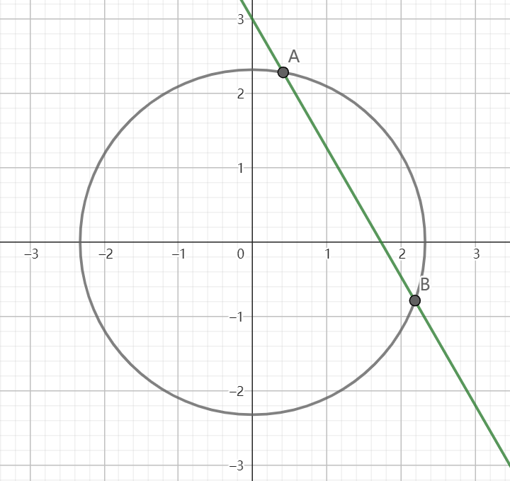

# 弹性碰撞“一动碰一动”模型的五种分析思路

视频版本：https://www.bilibili.com/video/BV1sK421k74e

## 思路一：公式法

最原始，最容易理解的方法，但是因为公式较长且容易记错，也是一个比较容易出错的方法。

先来一遍公式推导：

设有两物块在光滑水平面行进，物块A的质量为$m_1$，碰撞前后速度分别为$v_1$、$v_1'$，物块B的质量为$m_2$，碰撞前后速度分别为$v_2$、$v_2'$

由动量守恒
$$
m_1v_1+m_2v_2=m_1v_1'+m_2v_2'\tag{1}
$$
由机械能守恒
$$
\frac12m_1v_1^2+\frac12m_2v_2^2=\frac12m_1v_1'^2+\frac12m_2v_2'^2\tag{2}
$$
(1)、(2)分别可化为
$$
m_1v_1-m_1v_1'=m_2v_2'-m_2v_2\tag{3}
$$

$$
m_1v_1^2-m_1v_1'^2=m_2v_2'^2-m_2v_2^2\tag{4}
$$

(4)亦即
$$
m_1(v_1+v_1')(v_1-v_1')=m_2(v_2'+v_2)(v_2'-v_2)\tag{5}
$$
(5)两边分别除以(3)两边，有
$$
v_1+v_1'=v_2+v_2'\tag{6}
$$
此时，(1)与(6)组成了关于$v_1'$、$v_2'$的二元一次方程组，可以如下求解

(6)两边乘以$m_1$有
$$
m_1v_1+m_1v_1'=m_1v_2+m_1v_2'\tag{7}
$$
(1)两端同时加上(7)的两端有
$$
2m_1v_1+(m_2-m_1)v_2=(m_1+m_2)v_2'\tag{8}
$$
即
$$
v_2'=\frac{2m_1v_1+(m_2-m_1)v_2}{m_1+m_2}\tag{9}
$$
类似地，(6)两端同时乘以$m_2$有
$$
m_2v_1+m_2v_1'=m_2v_2+m_2v_2'\tag{10}
$$
（2)两端同时减去(10)两端有
$$
(m_2-m_1)v_1-2m_2v_2=-(m_1+m_2)v_1'\tag{11}
$$
即
$$
v_1'=\frac{2m_2v_2+(m_1-m_2)v_1}{m_1+m_2}\tag{12}
$$
至此推导完毕，式(9)与(12)即为所求。

## 思路二：两种“一动碰一静”同时发生

从公式形式不难注意到，$v_1'$可以被如下分解
$$
v_1'=\frac{2m_2v_2}{m_1+m_2}v_2+\frac{m_1-m_2}{m_1+m_2}v_1\tag{13}
$$
其中，分解出的两项分别对应“一动碰一静”模型下的“碰撞一方”与“被碰一方”的速度。这时，我们可以这样理解，在“一动碰一动”的过程中，两个物块中的任意一个既是主动去碰撞另一物块的物块（相当于“一动碰一静”下有初速一方），也是被动地被其他物块碰撞的物块（相当于“一动碰一静”下初始时静止的一方）。在“一动碰一动”发生后，物块即获得了两种过程叠加后的速度。

在这一表达形式下也更容易看出，“一动碰一静”为“一动碰一动”模型的特例。

$v_2'$也可以被以类似的方式分解，从而得出前面提到的公式的一套助记方案。

## 思路三：变换参考系

尽管前面的方法给了我们一套可以严谨地研究碰撞问题的方案，也为相应的公式做出了一定解释。但是，有没有一种更本质的视角来解决这一问题呢？

考虑这样一种方法：

在碰撞发生的瞬间，通过选取合适的参考系，使某一物块的初速度为0，即，若使物块A静止，则可选取在初始状态下与A以相同速度$v_1$匀速直线运动的另一假想的物块C为参考系，此时，两物块在参考系C下速度分别为
$$
v_A=0\tag{14}
$$

$$
v_B=v_2-v_1\tag{15}
$$

此时，我们就将“一动碰一动”转化为了“一动碰一静”模型，求解碰撞后物块相对C的速度，将其变换为相对原参考系的速度即可：

由”一动碰一动“模型解得A、B在碰撞后相对C的速度分别为
$$
v_A'=\frac{2m_2}{m_1+m_2}v_B=\frac{2m_2}{m_1+m_2}(v_2-v_1)\tag{16}
$$

$$
v_B'=\frac{m_2-m_1}{m_1+m_2}v_B=\frac{m_2-m_1}{m_1+m_2}(v_2-v_1)\tag{17}
$$

将求得的相对速度加上C的运动速度，即可将速度变换回原参考系
$$
v_1'=v_A'+v_1=\frac{2m_2v_2+(m_1-m_2)v_1}{m_1+m_2}\tag{18}
$$

$$
v_2'=v_B'+v_1=\frac{2m_1v_1+(m_2-m_1)v_2}{m_1+m_2}\tag{19}
$$

此时同样得出了与公式(9)与(12)，即这一思路与上面的思路是等价的。

乍看起来，这些过程可能会略显繁杂，但是，在熟练之后，这种方法也是相当便捷的。个人感觉，这一方法是在实际操作中是最好用的。

## 思路四：相图可视化

下面再给出一种更加直观的视角（来源：3Blue1Brown）：

我们知道，物块碰撞下的机械能守恒可以表示为
$$
\frac12m_Av_A^2+\frac12m_Bv_B=E_{k0}\tag{20}
$$
整理得
$$
(\sqrt{m_A}v_A)^2+(\sqrt{m_B}v_B)^2=2E_{k0}\tag{21}
$$
以$\sqrt{m_A}v_A$为横坐标，$\sqrt{m_B}v_B$为纵坐标，可绘制出方程(21)的图像为一个以原点为圆心，半径为$\sqrt{2E_{k0}}$的圆$C$，也就是说，机械能守恒决定了相图当中表示物块状态的点势必落在这样的一个圆上。

再看动量守恒
$$
m_Av_A+m_Bv_B=p_0\tag{22}
$$
即
$$
\sqrt{m_A}(\sqrt{m_A}v_A)+\sqrt{m_B}(\sqrt{m_B}v_B)-p_0=0\tag{23}
$$
该方程在上面绘制的相图当中为一条直线$l$（当且仅当系统动量$p_0=0$时$l$过原点）。

根据圆与直线的位置关系，$l$与$C$的位置关系有相交、相切与相离三种。

当$l$、$C$相交时，相图中有两个点同时位于$l$、$C$上，系统有两种可能的状态，分别对应$l$、$C$的两个交点。在物块发生碰撞时，系统从一个状态迁移到另一个状态。由此也可得出一个在此处比较显然的推论：若两个物块在第一次碰撞后又以相同的速度发生第二次碰撞，则第二次碰后物块的速度与第一次碰撞前一致。

当$l$、$C$相切时，系统只有一种可能的状态。做$l$过切点的垂线知，该状态对应的点也在直线$v_A=v_B$上，两物块共速，无相互作用。同时，由解析几何方法可知，在$\frac{m_A}{m_B}$确定的条件下，物块动量的绝对值取得最大值。

当$l$、$C$相离时，系统没有可能的状态，即动量过大过动能过小。

由图可知，系统动量不变时，系统动能越大，物块速度的差值越大。

再考虑碰撞耗时不可忽略的情形。以相对容易分析的弹簧模型为例，假定物块接触面固定有一个弹簧，物块碰撞时，物块的动能转化为弹簧的弹性势能，物块间（不含弹簧）组成的机械能减小，直到两者共速。此时，圆$C$的半径缩小，$l$的位置不变，最终，$l$、$C$相切。因为任一物块受到的作用力是单向的，两物块加速度方向也保持不变，所以系统的状态也在$C$半径变化的同时沿$l$单向移动。待弹簧复原后，系统完成状态的迁移。

此外，对于直线运动的两物块组成的系统，还可以得到以下六条结论：

1. 欲维持由两物块组成的系统动量为一定值$p_0$，两物体速度相等时系统动能最小，值为$E_{kmin}=\frac{p_0^2}{2(m_1+m_2)}$。
2. 使两物体动量相等，则$v_A=\frac{p_0}{2m_1}$，$v_B=\frac{p_0}{2m_2}$。
3. 能量一定，系统有两个可能状态，且在相图$\sqrt{m_A}v_A-\sqrt{m_B}v_B$中关于直线$v_1=v_2$对称。
   1. 推论：弹性碰撞即为系统在两状态间迁移的过程，且两物体在碰撞前后的速度的均值相等（$v_1+v_1'=v_2+v_2'$）。
   2. 推论：两物体组成的系统中，三个不同状态间能量与动量至少有一个不全相等。
4. 系统能量足够大或接近最小时，两物体速度分别趋近于反向、同向。
5. 系统能量越大，两物体弹性碰撞变速越大。

## 思路五：全过程分析

实际上，借助解微分方程的方法，我们可以求解弹簧模型下两物块的运动方程：

设等效的弹簧的劲度系数为$k$

由牛顿第二定律，碰撞期间
$$
m_1a_A=-k(x_A-x_B-x_0)\tag{24}
$$

$$
m_2a_B=-k(x_B-x_A-x_0)\tag{25}
$$

即
$$
x_A'''=-\frac k{m_1}(x_A'-x_B')\tag{27}
$$

$$
x_B'''=-\frac{k}{m_2}(x_B'-x_A')\tag{28}
$$

(28)乘以$n$与(27)相加
$$
x_A'''+nx_B'''=-k\left[\left(\frac1{m_1}-\frac n{m_2}\right)x_A'-\left(\frac1{m_1}-\frac n{m_2}\right)x_B'\right]\tag{28}
$$
令
$$
1:n=\left(\frac1{m_1}-\frac n{m_2}\right):-\left(\frac1{m_1}-\frac n{m_2}\right)=-1
$$

解得
$$
n=-1\tag{29}
$$
此时
$$
x_A'''-x_B'''=-k\left(\frac1{m_1}+\frac 1{m_2}\right)(x_A-x_B)'
$$
解得
$$
x_A'-x_B'=v_A-v_B=C\cos\left[t\sqrt{k\left(\frac1{m_1}+\frac 1{m_2}\right)}+\varphi\right]\tag{30}
$$
由动量守恒
$$
m_1v_A+m_2v_B=m_1v_1+m_2v_2\tag{31}
$$
联立(30)(31)解得
$$
v_A=\frac{m_1v_1+m_2v_2}{m_1+m_2}+\frac{m_2C}{m_1+m_2}\cos\left[t\sqrt{k\left(\frac1{m_1}+\frac 1{m_2}\right)}+\varphi\right]\tag{32}
$$

$$
v_B=\frac{m_1v_1+m_2v_2}{m_1+m_2}-\frac{m_1C}{m_1+m_2}\cos\left[t\sqrt{k\left(\frac1{m_1}+\frac 1{m_2}\right)}+\varphi\right]\tag{33}
$$

取碰撞开始时$t=0$，此时有
$$
v_A=v_{1}\tag{34}
$$

$$
v_B=v_2\tag{35}
$$

$$
v_A'=v_B'=a_A=a_B=0\tag{36}
$$

即
$$
v_1=\frac{m_1v_1+m_2v_2}{m_1+m_2}+\frac{m_2C}{m_1+m_2}\cos\left(\varphi\right)\tag{37}
$$

$$
v_2=\frac{m_1v_1+m_2v_2}{m_1+m_2}-\frac{m_1C}{m_1+m_2}\cos\left(\varphi\right)\tag{38}
$$

$$
0=C\sin(\varphi)\tag{39}
$$

解得
$$
\varphi=k\pi,k\in\Z\tag{40}
$$

$$
\pm C=v_1-v_2\tag{41}
$$

不妨设
$$
C=v_1-v_2\tag{42}
$$

$$
\varphi\in[0,2\pi)\tag{43}
$$

则
$$
\varphi=0
$$
解得
$$
v_A=\frac{m_1v_1+m_2v_2}{m_1+m_2}+\frac{m_2(v_1-v_2)}{m_1+m_2}\cos\left[t\sqrt{k\left(\frac1{m_1}+\frac 1{m_2}\right)}\right]\tag{44}
$$

$$
v_B=\frac{m_1v_1+m_2v_2}{m_1+m_2}-\frac{m_1(v_1-v_2)}{m_1+m_2}\cos\left[t\sqrt{k\left(\frac1{m_1}+\frac 1{m_2}\right)}\right]\tag{45}
$$

