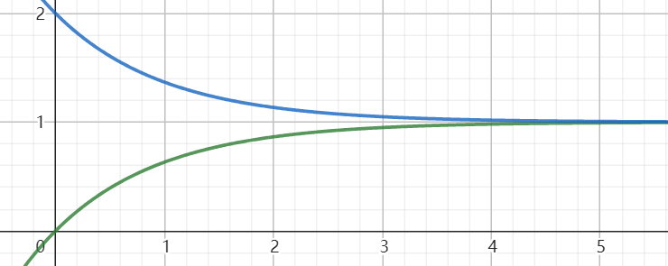

# 线性阻力模型

在高中物理中，我们经常遇到这样一种情形，即物体在一个与速度成正比的阻力加速度与一个可能存在的恒定加速度的作用下共同运动，也就是：
$$
a=a_0-fv\tag{1}
$$
其中$f$为常数，单位为时间单位的倒数（如$s^{-1}$）。

没见过？那是刷题还不到位！电磁感应中单杆模型就是线性阻力模型的一个典例，除此之外，双杆模型和电容器的放电也可以被变换到这一模型。同时，在研究该模型下物体运动时用到的一些方法也可被用于分析一些相对复杂的电磁学和一些带特殊情景的力学问题。

我们该如何准确求解出该情形下物体的$v-t$方程呢？

本文中，我们将探讨线性阻力模型下物体运动的一般规律，并尝试将这些规律运用到解题实践当中。

这里需要说明，本文仅面向学有余力的同学们作辅助学习与参考之用，而不建议将其作为在短时间内进行复习提高的资料。也是因此，本文可能会包含一些超纲以及有待读者自行验证或研究的内容，还望大家稍加留意。

因为笔者的时间有限，文中或许会包含一些细节或计算上的错误，望读者注意甄别，也欢迎大家提出各种建议。

## 基本公式推导

### 思路一：强行不超纲

因为加速度是速度对时间的瞬时变化率，所以在定义式两边同时对时间$t$求导，可以得到
$$
a'=-fv'=-fa\tag{2}
$$
这样，我们不妨先考虑求出一个适用于上式的$a-t$方程

我们注意到，$a$在对$t$求导后，前面多出一个常数$-f$，这不由使我们联想到导数公式
$$
(\alpha^x)'=a^x\ln{\alpha}\\
(e^{cx})'=ce^{cx}\tag{3}
$$
这样，便可以猜测，我们需要的$a-t$方程也是这种形式，为

$$
a=Ae^{-ft}\tag{4}
$$
其中$A$为常数。代入原式(2)，方程满足条件。

> 这一步也可以借助以下公式完成
> $$
> (\ln{f(x)})'=\frac{f'(x)}{f(x)}\tag{4.1}
> $$
> 我们注意到
> $$
> (\ln{a})'=\frac{a'}{a}=-f\tag{4.2}
> $$
> 这样，我们需要构建一个函数$\varphi(t)=-ft+C$，此时
> $$
> \varphi'(x)=-f=(\ln{a})'\tag{4.3}
> $$
> 所以
> $$
> lna=\varphi(t)\\\tag{4.4}
> $$
>
> $$
> a=e^{-ft+C}=e^{C}e^{-ft}=Ae^{-ft}\tag{4.5}
> $$

另外考虑到$t=0$时，$a=a_0-fv_o$（其中$v_0$为初速度），我们可以解得
$$
a=(a_0-fv_0)e^{-ft}\tag{5}
$$
这样，我们可以将$a-t$方程代入我们最开始得到的等式(1)中，解得
$$
v=\left(v_0-\frac{a_0}{f}\right)e^{-ft}+\frac{a_0}{f}\tag{6}
$$
那么位移呢？

刚才提到，加速度是速度对时间的导数，类似地，速度也是位移相对于时间的一个瞬时变化率，这样我们应该找到一个合适的函数，使其导数恰好等价与我们先前求解的$v-t$方程。我们猜测，$x-t$方程的形式如下
$$
x=ke^{-ft}+\frac{a_0}{f}t+C\tag{7}
$$
其中$k$、$C$为常数。

之所以这样猜测，是因为$v-t$方程中存在指数项$(v_0-\frac{a_0}{f})e^{-ft}$和常数项$\frac{a_0}{f}$，而这两项分别可由另一个指数项和关于$t$的一次项得出，而且在$x-t$方程的最后加上任意常数$C$都不会影响其导数的形式。

对该式求导，我们有
$$
x'=v=-fke^{-ft}+\frac{a_0}{f}=\left(v_0-\frac{a_0}{f}\right)e^{-ft}+\frac{a_0}{f}\tag{8}
$$
这样，容易得出
$$
-fk=v_0-\frac{a_0}{f}\tag{9}
$$
进而解得
$$
x=\left(\frac{a_0}{f^2}-\frac{v_0}{f}\right)e^{-ft}+\frac{a_0}{f}t+C\tag{10}
$$
我们认为，$t=0$这一时刻，物体位移为0，所以可以得到
$$
x=\left(\frac{v_0}{f}-\frac{a_0}{f^2}\right)\left(1-e^{-ft}\right)+\frac{a_0}{f}t\tag{11}
$$
求解完毕。

但是可能感觉有些奇怪，上面的公式大多是我们一点一点猜出来的，但是，我们怎么确定这些公式的形式是只有我们给出的这一种呢？接下来的两种思路，或许会给这一问题提供一个答案。

>  当然，也可以理解为，既然加速度的作用机制都确定了，那么速度，位移的变化情况自然也是确定的。

### 思路二：微积分硬解

**超纲知识，非专业人员请略过**

（不过系统地学过微积分后应该也不屑于看了罢）

对(1)两端求导，有
$$
\frac{da}{dt}=-f\frac{dv}{dt}=-fa\tag{12}
$$

$$
\frac{da}{a}=-f\cdot dt\tag{13}
$$

两端同时积分，有
$$
\int\frac1a\cdot da=\int -f\cdot dt
$$
即
$$
\ln{a}=-ft+C_0\tag{14}
$$

$$
a=e^{-ft+C_0}\tag{15}
$$

进而
$$
v=\int a\cdot dt=-\frac1fe^{-ft+C_0}+C_1\tag{16}
$$

$$
x=\int v\cdot dt=\frac1{f^2}e^{-ft+C_0}+C_1t+C_2\tag{17}
$$

考虑到$t=0$时
$$
\begin{cases}
v=v_0\\
a=a_0-fv_0\\
x=0\tag{18}
\end{cases}
$$
我们可以类似地求解出公式(5)、(6)和(11)。

### 思路三：时间片法（源于MC实体运动）

这些是MC实体运动中最为核心的两个公式
$$
v_{n} = \left(v_{0} - \frac{at_0}{1-k}\right)k^n + \frac{at_{0}}{1 - k}\tag{19}
$$

$$
d_{n} = \left[\frac{v_0t_0}{1-k} - \frac{at_0^2}{(1-k)^2}\right]( 1 - k^n) + \frac{a{t_{0}}^2n}{(1 - k)^{2}}\tag{20}
$$

隐约感觉与前面给出的公式有异曲同工之处，right？确实如此，因为MC中各种实体的运动在设定中也是满足线性阻力模型的，即实体的空气阻力与速度成正比，但是因为那里的时间是离散的，所以公式的最终形式会与原先的公式略有差异。

那么我们有没有可能，将这些适用于离散时间的公式拓展到时间连续的情形下呢？答案是肯定的！

此处给出自己在三模时押的一道数列题为引子（为方便讲解删去了部分参考信息）

> 为研究电磁感应单杆模型中杆的运动，我们可以将一个较长的时间段分解为若干足够短的等长时间片$t_0$（单位s），并由自然变化的连续性和平滑性认为一个时间片内杆的速度不变。由物理分析可知，杆在第n个$t_0$内的加速度为$\frac{v_n-v_{n-1}}{t_0}=a_0-fv_{n-1}$，其中$v_n$为物体在n个$t_0$时的速度，$v_0$为杆的初速度，$a_0$与$f$均为常数。记$\{v_nt_0\}$的前n-1项和为$S_n-v_nt_0$。
>
> (1) 若$t_0=1$（s），$f=0.5$（$s^{-1}$），$v_0=1$（m/s），$a_0=-1$（$m/s^2$），求$\{v_n\}$、$\{S_n\}$的通项公式，
>
> (2) (1)的条件下，若$t_0\to0$，设经过时间t后物体的位移大小为$x(t)$，求$x(t)$的解析式与值域。

由题意中公式可以整理得到
$$
\left(v_{n+1}-\frac{a_0}{f}\right)=(1-ft_0)\left(v_n-\frac{a_0}{f}\right)\tag{21}
$$
在排除$v_n-\frac{a_0}{f}=0$（匀速运动）的情形后，不妨构造等比数列$\{v_n-\frac{a_0}{f}\}$，此时有
$$
v_n-\frac{a_0}{f}=\left(v_0-\frac{a_0}{f}\right)\left(1-ft_0\right)^n\tag{22}
$$
令
$$
k=1-ft_0\tag{23}
$$
整理即得式(19)。

容易对该式的前$n$项求和，求和结果加上物体在“第0个”时间片内的位移$v_0t_0$，在整理后即为式(20)。

此处需要用到一个重要极限
$$
\lim_{x\to0}(1+x)^\frac{1}{x}=e\tag{24}
$$
我们设
$$
t=nt_0\tag{25}
$$
则第$t$时刻的速度可以由$v_{\frac{t}{t_0}}$表示。

令(19)中$t_0\to 0$，有
$$
\begin{eqnarray}
	\lim_{t_0\to0}v_{\frac{t}{t_0}}&=&\lim_{t_0\to0} \left[\left(v_{0} - \frac{at_0}{1-k}\right)k^{\frac{t}{t_0}} + \frac{at_{0}}{1 - k}\right]\\
	&=&\lim_{t_0\to0} \left[\left(v_{0} - \frac{a}{f}\right)(1-ft_0)^{\frac{t}{t_0}} + \frac{a}{f}\right]\\
	&=&\lim_{t_0\to0} \left\{\left(v_{0} - \frac{a}{f}\right)\left[1+(-ft_0)\right]^{-ft\cdot \frac{1}{-ft_0}} + \frac{a}{f}\right\}\\
	&=&\lim_{-ft_0\to0} \left(\left(v_{0} - \frac{a}{f}\right)\left\{\left[1+(-ft_0)\right]^{\cdot \frac{1}{-ft_0}}\right\}^{-ft} + \frac{a}{f}\right)\\
	&=&\left(v_{0} - \frac{a}{f}\right)\left\{\lim_{-ft_0\to0}\left[1+(-ft_0)\right]^{\cdot \frac{1}{-ft_0}}\right\}^{-ft} + \frac{a}{f}\\
	&=&\left(v_{0} - \frac{a}{f}\right)e^{-ft} + \frac{a}{f}\\
\end{eqnarray}\tag{26}
$$
即为时间连续情形下的$v-t$方程。类似地，我们也可以推导出时间连续情形下的$x-t$方程。

## 常用结论

### 速度与位移、时间的关系

由公式(11)可以解得
$$
e^{-ft}=1-\frac{x-\frac{a_0}{f}t}{\frac{v_0}{f}-\frac{a_0}{f^2}}=1-\frac{f^2x-fa_0t}{fv_0-a_0}\tag{27}
$$
代入(6)式
$$
v=v_0-fx+a_0t\tag{28}
$$
> 如果上面的基于动态方程的推导感觉看起来有些不大靠谱，这里还有一种使用动量定理和微元法的证明过程：
>
> 由动量定理
> $$
> mv-mv_0=ma_0t+\sum -mfv_i=ma_0t-mf\sum v_i=ma_0t-mfx\tag{29}
> $$
> 由此可解得公式(28)。
>

由此公式，我们可以清晰地看出，物体在恒力作用下产生的速度变化当中“本应完成而因为阻力而最终没有完成”

这个公式也是很多电磁感应习题中运动时间与运动位移互推题型背后的原理：
$$
t=\frac{v-v_0+fx}{a_0}\tag{30}
$$

$$
x=\frac{v_0-v+at_0}{f}\tag{31}
$$

特殊地，如果我们假定$a_0=0$，即物体仅受阻力作用，则有
$$
v=v_0-fx\tag{32}
$$
这时我们不难发现，速度随着位移的增大而降低，而且还是速度的一次函数，图像斜率的绝对值恰好等于阻力系数$f$。这一公式也是很多电磁感应计算题的命题基础——在大题中实际上是非常常用的。

> ——“既然速度与位移有这样一个关系，那么把物体往后拉，物体不就可以加速了吗？”
>
> ——“出院！”

此外，仅受阻力的条件下，令$v=0$，我们可以得到物体停止运动时物体的位移为
$$
x_T=\frac{v_0}{f}\tag{33}
$$

### 线性阻力模型下物体运动形式的进一步分析

我们先来分别作出$f=0.5s^{-1}$、$a_0=2.2 m/s^2$、$v_0=5m/s$时物体加速度、速度与位移的图像：

可以注意到，物体加速度在过程中逐渐趋近于0。事实上，这一加速度是从$a_0-fv_0$开始以指数衰减的方式趋近于0的。

容易看出这里速度也是在趋近于一个定值。实际上，考虑到最后的加速度趋近于0，我们也可以很容易地由定义式求出来实体速度所趋向的一个定值
$$
v_T=\frac{a_0}{f}\tag{34}
$$
如果分别讨论$v>0$和$v<0$的情形，我们可以得知，物体先后做加速度减小的减速运动和加速度减小的加速运动。

虽然位移在最后没有像速度与加速度一样趋近一个定值，但是，位移的图像在一段时间后会趋近于一条直线。可能看上边的图形还不是很清楚，那我们可以减小$a_0$的大小，并增加阻力系数，得到一个新的图像：

这样这一结论便显得十分明显。这里顺便给出$x-t$图像所趋近的直线的方程：
$$
x=\frac{a_0}{f}t+\frac{v_0}{f}-\frac{a_0}{f^2}\tag{35}
$$
当然，上面对$x-t$图像的讨论是基于$a_0$与$v_0$反向的前提展开的。对于两者同向的情况，我们除了因为物体不会折返而无法得出“极值点偏移”的结论外，其他结论也都是可以得到的。

### 有折返的运动中折返前后过同一点时运动状态的差异

此外，我们还注意到，$x-t$图像存在极值点偏移，换句话说，如果物体在运动时发生了折返且在运动方向上同时经过了同一点A（异于折返点），则从A到达折返点的耗时会小于从折返点再次到达A的耗时。

> 这里给一下相对严格的数学证明：
>
> 设物体位移为时间的函数$x(t)=\left(\frac{v_0}{f}-\frac{a_0}{f^2}\right)\left(1-e^{-ft}\right)+\frac{a_0}{f}t$，考虑将问题转化如下：$x(t)$的唯一极值点为$t_0>0$，若$x(t)=x_0$存在两个零点$t_1$、$t_2$（$0\le t_1<t_0<t_2$），则$t_0-t_1<t_2-t_0$，即$t_1+t_2>2t_0$。
>
> 设$X(t)=x(2t_0-t)-x(t_0)$，则
> $$
> \begin{eqnarray}
> X'(t)&=&-\left[\left(v_0-\frac{a_0}{f}\right)e^{-f(2t_0-t)}+\frac{a_0}{f}\right]-\left[\left(v_0-\frac{a_0}{f}\right)e^{-ft}+\frac{a_0}{f}\right]\\
> &=&-\left(v_0-\frac{a_0}{f}\right)(e^{-2ft_0+ft}+e^{-ft})-\frac{2a_0}{f}
> \end{eqnarray}\tag{36}
> $$
> 不妨先证明$v_0-\frac{a_0}f>0$的情形。应用基本不等式有
> $$
> X'(t)\le-2\left(v_0-\frac{a_0}{f}\right)e^{-ft_0}-\frac{2a_0}{f}\tag{37}
> $$
> 而
> $$
> x(t_0)=\left(v_0-\frac{a_0}{f}\right)e^{-ft_0}+\frac{a_0}{f}=0\tag{38}
> $$
> 由两式得
> $$
> X'(t)+2x(t_0)=X'(t)\le0\tag{39}
> $$
> 所以$X(t)$单调递减，进而
> $$
> X(t_1)>X(t_0)=0\tag{40}
> $$
> 即
> $$
> x(2t_0-t_1)>x(t_1)=x(t_2)\tag{41}
> $$
> 考虑到
> $$
> 2t_0-t_1=t_0+t_0-t_1>t_0\tag{42}
> $$
> 因为
> $$
> x''(t)=\left(a_0-fv_0\right)e^{-ft}<0\tag{43}
> $$
> 所以$x'(t)$单调递减，$t>t_0$时，$x'(t)<x'(t_0)=0$，$x(t)$单调递减，所以
> $$
> t_2>2t_0-t_1\tag{44}
> $$
> 即
> $$
> t_1+t_1>2t_0\tag{45}
> $$
> 原命题得证。$v_0-\frac{a_0}f<0$的情形留给作者自证。

同时也可以证明，物体在首次到达A处时速度大小要大于第二次到达A时的速度大小：

从A到折返点的过程中，由动量定理
$$
0-mv_{A1}=ma_0t_1-mf~\overline{v}_1t_1\tag{46}
$$
由折返点回到A的过程中，由动量定理
$$
mv_{A2}-0=ma_0t_2-mf~\overline{v}_2t_2\tag{47}
$$
式中$\overline{v}_1$、$\overline{v}_2$分别为前后两过程物体的平均速度，$t_1$、$t_2$为前后两过程物体的运动耗时。

分别解得
$$
v_{A1}=f~\overline{v}_1t_1-a_0t_1\tag{48}
$$

$$
v_{A2}=a_0t_2-f~\overline{v}_1t_2\tag{49}
$$

不妨设$v_{A1}$的方向为正方向，则$v_{A1}>0$，$v_{A2}<0$，$a_0<0$，此时
$$
|v_{A1}|=f~\overline{v}_1t_1-a_0t_1>0\tag{50}
$$

$$
|v_{A2}|=f~\overline{v}_2t_2-a_0t_2>0\tag{51}
$$

考虑到从A运动到折返点的位移$\Delta x=\overline{v}_1t_1=-\overline{v}_2t_2>0$
$$
|v_{A1}|=f\Delta x-a_0t_1>0\tag{52}
$$

$$
|v_{A2}|=-f\Delta x-a_0t_1>0\tag{53}
$$

两式相减
$$
|v_{A1}|-|v_{A2}|=2f\Delta x>0\tag{54}
$$
所以
$$
|v_{A1}|>|v_{A2}|\tag{55}
$$
原命题得证。

> 这一规律还可以用能量的观点做一个更简洁解释：
>
> 我们知道，$a_0$对应一个保守力（高三时的课堂上偷来的名词，可以理解为大小、方向仅与受力物体与位置有关的力，如电场力），而保守力均对应一个势能，那么，从A开始运动再返回A的过程中，物体的这一势能不变。同时，阻力一直与物体速度反向，恒做负功，由动能定理，物体的动能在整个过程中减小，速度大小也减小。故原结论成立。

最后来看物体在两次经过A时的加速度关系。在上文的讨论中，我们获知，物体的加速度大小一直在减小，所以物体第一次到达A时的加速度必然大于第二次到达A时的加速度。

### 指数项在运动中的实际意义

不难注意到，我们在最开始得到的三个基本公式中都包含指数项$e^{-ft}$，这一项也在物体的实际运动中有重要的物理意义。

我们不妨设$k=e^{-ft}$，则三个基本公式分别可以改写成
$$
a=(a_0-fv_0)k=(a_0-fv_0)k+0\cdot(1-k)\tag{56}
$$

$$
v=\left(v_0-\frac{a_0}{f}\right)k+\frac{a_0}{f}=v_0k+\frac{a_0}{f}(1-k)\tag{57}
$$

$$
x=\left(\frac{v_0}{f}-\frac{a_0}{f^2}\right)\left(1-k\right)+\frac{a_0}{f}t=0\cdot k+\left(\frac{v_0}{f}-\frac{a_0}{f^2}\right)\left(1-k\right)+\frac{a_0}{f}t\tag{58}
$$

……看起来貌似有一点规律，但是还是说不清。那么再来看这么一个“定比分点”问题：

> 有一条线段AB，其中$A(m,0)$、$B(n,0)$，试找到线段上的一个点M，使得$|AM|=k|AB|$。

我们不妨先讨论$m<n$的情形，此时$|AB|=n-m$，$|AM|=k(n-m)$，则M的横坐标
$$
x_M=m+k(n-m)=m(1-k)+nk\tag{59}
$$
这时候应该就可以看出前两个公式共同的结构特征了，即它们都可以被表示为$m(1-k)+nk$的形式。而且，两个公式中含有因子$k$和$1-k$的项分别对应系统变化的初态与最终的稳定状态，比如在速度的公式当中，$v_0$和$\frac{a_0}f$分别是物体的初速度和最终稳定的速度。

再看位移公式，考虑到末态物体会趋近于匀速直线运动，我们不妨把公式分为两个部分，一个部分包含描述物体最终趋于匀速的$t$的一次项$\frac{a_0}ft$，另一个部分包含其他各项。第二部分在非0时可以这样理解：因为物体的初速度与稳态速度不同，所以物体会与一直匀速直线运动的另一参照物的位移有所差异，第二部分即表示这一差异。有上面的形式不难注意到，这一差异是由0开始增大，最终趋近于一个极限$\Delta x_{max}=\frac{v_0}{f}-\frac{a_0}{f^2}$的。对第二部分套用上面的理解方法，我们认为物体的初态是位移差为0，稳态为位移差到达$\Delta x_{max}$。

这样，类比于上面定比分点坐标中的$k$对应$M$点从$A$向$B$移动的进度，我们也可以将我们的公式中的指数项$k=e^{-ft}$认为是物体运动状态由初态向稳态变化的一个进度。这时，我们可以得到并理解一些有用的结论，比如：

- 物体速度与稳定速度的差值减少到原来的$k$倍的同时，其加速度也减少到原来的$k$倍，反之亦然。
- 特殊地，物体在$a_0=0$时，即仅受阻力作用时，当物体速度减少到原来的$k$倍的同时，其加速度也减少到原来的$k$倍，位移与最大位移的差值也减少到原来的$k$倍，反之亦然。

## 模型应用

当然，要学习此处的方法，读者还需先掌握高中物理中的常规方法。尽管上面的方法看似“法力无边”，但也有明显的局限性（最明显的，不能直接做大题），切不可迷信。

此处公式较多，所以不再标号。

### 与速度成正比的空气阻力

自己第一次将线性阻力模型应用到物理习题当中时就是解决的这一问题。因为时间久远（应该是2021年底遇到的）且没有相应的教辅，原题目已不可考，现在只能凭记忆写出当时的题目的一个关键问题：

> 一个物体以$v_0$从地面向上竖直抛出，物体受到一个与速度大小成正比的空气阻力的作用，比例系数为$k$，重力加速度为$g$，试求物体在经过时间$t_0$后落回地面时的速度大小$|v_1|$。

显然，物体运动满足线性阻力模型，套用速度与位移、时间的关系可得
$$
v_1=v_0-kx-gt=v_0-gt
$$
对速度方向进行分析后可得
$$
|v_1|=gt-v_0
$$

### 简单单杆模型的定性分析

> （2021·山东）如图所示，电阻不计的光滑U形金属导轨固定在绝缘斜面上。区域Ⅰ、Ⅱ中磁场方向均垂直斜面向上，Ⅰ区中磁感应强度随时间均匀增加，Ⅱ区中为匀强磁场。阻值恒定的金属棒从无磁场区域中*a*处由静止释放，进入Ⅱ区后，经*b*下行至*c*处反向上行。运动过程中金属棒始终垂直导轨且接触良好。在第一次下行和上行的过程中，以下叙述正确的是（　　）
>
> 
>
> A．金属棒下行过*b*时的速度大于上行过*b*时的速度
>
> B．金属棒下行过*b*时的加速度大于上行过*b*时的加速度
>
> C．金属棒不能回到无磁场区
>
> D．金属棒能回到无磁场区，但不能回到*a*处

设$B_1=kt+B_0$，导轨在$B_1$中的面积为$S$，由法拉第电磁感应定律，金属棒在有磁场区域内运动时两端电压为$U$与速度$v$满足
$$
U=BLv+\frac{\Delta B_1S}{\Delta t}=BLv+kS
$$
对金属棒，由部分电路欧姆定律
$$
I=\frac UR
$$
由牛顿第二定律
$$
ma=mg\sin\theta-BIL
$$
解得
$$
a=g\sin\theta-\frac{kBLS}{mR}-\frac{B^2L^2}{mR}v
$$
式中前两项为常数，最后一项为关于速度的一次项。至此可知金属棒的运动满足线性阻力模型。

> 上面的计算只是为了顺带着证明这一模型是满足线性阻力模型的定义的，实际操作时通常只需确认条件是否符合即可。

我们先对过程进行分析。进入磁场前，金属棒向下做匀加速直线运动；进入磁场后，金属棒做符合有折返的线性阻力模型的运动，最终返回无磁场区继续做匀变速直线运动。

再看选项，A两项要求我们比较金属棒在磁场中两次经过b处的速度大小。套用前边的结论，我们可知金属棒在第一次（即下行时）经过b处时的速度要更大，所以A正确。B项，物体在磁场中的加速度是递减的，B项也正确。由上面的过程分析，C错误。比较金属棒在两次经过磁场上边界时的速度大小，我们可知金属棒在离开磁场时的速度较小，没有足够的动能克服重力返回a处，D正确。故选ABD。

### 简单单杆模型的定量计算

> （2022·菏泽高二期中）如图所示，宽度为L的U型光滑金属导体框固定在绝缘水平面上，ef左侧为圆弧形轨道；ef右侧导轨水平且处于竖直向下的匀强磁场中，磁感应强度大小为B。长度为L、质量为m、电阻为r的金属棒ab从距离水平面高度为h的位置由静止释放，沿导体框进入匀强磁场区域。已知棒在运动过程中始终未脱离轨道且接触良好，其他电阻不计。则（　　）
>
> 
>
> A. ef右侧轨道的最小长度$\frac{mr\sqrt{2gh}}{B^2L^2}$
>
> B. 整个过程中，金属棒产生的焦耳热为$\frac12mgh$
>
> C. 整个过程中，通过金属棒的电荷量为$\frac{m\sqrt{2gh}}{BL}$
>
> D. 金属棒刚运动到ef位置时，受到的安培力大小为$\frac{B^2L^2\sqrt{2gh}}{r}$

> 依稀记得那次考试是ta在高中最辉煌的时间，前前后后发生的点点滴滴都那么美妙、那么令人怀念。
>
> 故引此题，致敬“十七岁那年的雨季”。

（emo完接着讲题。）

从开始到金属棒到达ef的过程中，由动能定理
$$
\frac12mv_1^2-0=mgh
$$
解得
$$
v_1=\sqrt{2gh}
$$
不难证明，金属杆的运动满足线性阻力模型，写出阻力系数
$$
f=\frac{B^2L^2}{mr}
$$

> 这里可以当作一个公式来记，应用时注意中找准回路电阻

因为单杆在水平面上运动时只受安培力造成的阻力的作用，我们得知金属杆最终会停止，而且我们能顺便写出金属杆的在磁场中的最大位移为
$$
x_{max}=\frac{v_1}{f}=\frac{mr\sqrt{2gh}}{B^2L^2}
$$
要使金属杆不脱离轨道，水平轨道长度至少为$x_{max}$，A正确。

金属棒在磁场中运动时，机械能转化为焦耳热。因为回路中只有金属棒有电阻，故焦耳热全部在金属棒上产生。由能量守恒
$$
Q=mgh
$$
B错误。

> 很多题也喜欢不全部把电阻放在棒上，应注意甄别。

考虑公式
$$
q=\overline{I}\Delta t=\frac{BL}{r}\overline{v}\Delta t=\frac{BL}{r}x
$$
整个过程中
$$
q_{总}=\frac{BL}{r}x_{max}=\frac{m\sqrt{2gh}}{BL}
$$
C正确。

金属棒在ef处时，由牛顿第二定律
$$
|F|=|ma|=mfv_1=\frac{B^2L^2\sqrt{2gh}}{r}
$$
D正确。故选ACD。

再来一例（暂时找不到题就先自己出吧，不过这种题确实是挺常见的）：

> 平行光滑金属导轨所在平面与水平面夹角为$\theta=37\degree$，间距为$L=1m$，空间内充满垂直于导轨平面向上的匀强磁场$B=1T$，导轨上方有一质量为$m=0.1kg$、电阻为$R=1\Omega$的金属杆$ab$。静止释放金属杆，$t_0=5s$后开始金属杆匀速运动。导轨电阻不计，金属棒始终垂直导轨且接触良好，重力加速度$g=10m/s^2$试求：
>
> （1）金属棒匀速运动时的速度$v_m$；
>
> （2）金属棒在从释放到开始匀速运动的过程中运动的位移$x_0$；
>
> （3）金属棒在从静止到开始匀速运动的过程中金属棒上产生的焦耳热$Q$。

> 因为懒得出选择题，所以直接出成解答题，尽管平时我们不能直接用这一模型做计算题。

（1）解：注意到金属杆的运动满足线性阻力模型，且
$$
f=\frac{B^2L^2}{mR}=10s^{-1}
$$

$$
a_0=g\sin\theta=6m/s^2
$$

$$
v_0=0
$$

所以金属杆匀速运动时的速度为
$$
v_m=\frac{a_0}{f}=0.6m/s
$$
（2）解：物体开始匀速运动时套用速度与位移、时间的关系
$$
v_m=v_0-fx_0+a_0t_0
$$
代入数值解得
$$
x_0=\frac{v_0-v_m+a_0t_0}{f}=2.94m
$$
（3）解：过程中由能量守恒
$$
mgx_0\sin\theta=\frac12mv_m^2+Q
$$
解得
$$
Q=1.744J
$$

> 尽管这种方法是做不了大题的，这里还是再来一遍常规过程，体会一下差距
>
> （1）解：由牛顿第一定律
> $$
> 0=mg\sin\theta-BI_mL
> $$
> 由闭合电路欧姆定律
> $$
> I_m=\frac{BLv_m}{R}
> $$
> 连立解得
> $$
> v_m=0.6m/s
> $$
> （2）解：过程中，由动量定理
> $$
> mv_m-0=mg\sin\theta t_0-B\overline ILt_0
> $$
> 其中
> $$
> \overline I=\frac{BL\overline{v}}{R}
> $$
> 又
> $$
> \overline{v}t_0=x_0
> $$
> 解得
> $$
> x_0=2.94m
> $$
> （3）同上，略
>
> （好像也多不了多少步骤）

需要注意的是，涉及金属棒开始匀速运动时金属棒的位移、经过的时间、通过金属棒的电荷量，产生的焦耳热等在匀速状态下还会继续变化的量时，我们必须得知其中至少一个量才能求出其他量，因为严格的匀速运动状态实际上永远无法开始，所谓开始匀速时的时间等匀速后也会随时间变化的量均是命题人刻意假设出来的。

最后再来一道可以“打开思路”的题目：

> 现有一对竖直且足够长的平行光滑金属导轨，其间距为$L=1m$，两导轨最上端相互连接。导轨之间的区域中的上半部分存在一个与之所在平面垂直、面积为$S=0.1m^2$的圆形匀强磁场区域$B$，其大小如图所示，其中图像倾斜部分斜率可记为$k$。下半部分处于同样与之垂直、大小为$B_0=1T$的匀强磁场当中。$B$的正方向与$B_0$的方向一致。现于导轨平面的下半部分垂直导轨静止放置一质量为$m=1kg$金属杆$P$，使得金属杆与导轨所成回路电阻恒为$r=10m\Omega$。$t_0=5s$时金属杆视为匀速运动，重力加速度大小为$g=10m/s^2$。试求：
>
> （1）$0\sim t_0$时段当中，金属杆运动的位移$x_1$
>
> （2）$t_0$瞬间竖直敲击$P$使其再次进入匀速直线运动状态，作用时间极短，此刻金属杆受到的冲量$I$
>
> 

（1）解：由牛顿第二定律
$$
ma=mg-BIL
$$
其中
$$
I=\frac{BLv-kS}{r}
$$
解得
$$
a=g-\frac{BLkS}{mr}-\frac{B^2L^2}{mr}v
$$
由此可知，$P$的运动满足$a_0=g-\frac{BLkS}{mr}$、$f=\frac{B^2L^2}{mr}$的线性阻力模型。由此，实际上可以将这里均匀变化的磁场等效为一个竖直向上的恒力。代入数值
$$
a=(6-100v)m/s^2
$$
由平衡条件或稳态速度公式知匀速运动的速度为
$$
v_1=\frac{a_0}{f}=0.06m/s
$$
由动量定理
$$
mv_1=ma_0t_1-f\overline{v}t_1=m\left(g-\frac{BLkS}{mr}\right)t_1-fx_1
$$
解得
$$
x_1=0.2994m
$$

> 这一数值也可由“常用结论”一节得到的速度与位移、时间的关系方程
> $$
> v=v_0-fx+a_0t
> $$
> 进行求解。将参数$v=v_1$、$v_0=0$、$t=t_1$以及$f$、$a_0$带入其中，可以很容易地解得
> $$
> x_1=\frac{a_0t_1-v_1}{f}=0.2994m
> $$
> 这在解答选择题时这一方程往往会大大地简化操作。

（2）解：与（1）同理易知$t_0$以后
$$
a=g-\frac{B^2L^2}{mr}v
$$
即
$$
a=(10-100v)m/s^2
$$
解得稳态速度
$$
v_2=0.1m/s
$$
由动量定理
$$
mv_2-mv_1=I
$$
解得
$$
I=0.04N\cdot s
$$
且由分析知其方向竖直向下。

### 简单双杆模型到线性阻力模型的化归

为不失一般性，我们在这里还是现出一道题目：

> 现有两组平行水平光滑导轨，均足够长，导轨同侧有导线相连，两组导轨宽度分别为$L_1$、$L_2$。两导轨上有分别有a、b两金属棒垂直导轨静止放置，质量分别为$M$、$m$，金属棒与导轨组成的回路电阻恒为$r$。空间中充满与垂直导轨平面向下的匀强磁场$B$。某时刻，a以速度$v_0$向右运动。
>
> （1）$L_1=L_2$时分别描述两导轨在足够长时间后的回路中通过的电荷量与金属棒的运动状态
>
> （2）$2L_1=L_2$，$M=m$时求解上述问题。
>
> （3）$L_1=L_2$，$M=m$，$v_0=0$，且a始终受到一向右的恒力$F$，描述a、b的运动状态
>
> （4）$L_1=L_2$，$M=m$，金属杆阻值为$r$，用值为$2r$的电阻连接两导轨，描述a、b的运动状态

解：以a棒中低电势处指向高电势处的方向为电流正方向，由牛顿第二定律
$$
Ma_a=-BIL_1
$$

$$
ma_b=BIL_2
$$

由闭合电路欧姆定律
$$
I=\frac{BL_1v_1-BL_2v_2}{r}
$$
解得
$$
a_a=-\frac{B^2L_1^2v_1}{Mr}+\frac{B^2L_2^2v_2}{Mr}
$$

$$
a_b=-\frac{B^2L_2^2v_2}{mr}+\frac{B^2L_1^2v_1}{mr}
$$

若$L_1=L_2$
$$
a_a=-\frac{B^2L_1^2}{Mr}(v_1-v_2)
$$

$$
a_b=-\frac{B^2L_1^2}{mr}(v_2-v_1)
$$

不妨令两式相减
$$
a_a-a_b=-\frac{B^2L_1^2}{r}\left(\frac1M+\frac1m\right)(v_1-v_2)
$$
这样我们可以认为，a、b的相对速度的变化满足只有阻力参与的线性阻力模型，阻力系数
$$
f=\frac{B^2L_1^2}{r}\left(\frac1M+\frac1m\right)
$$
最终两金属棒趋近于共速。

由动量守恒可得
$$
Mv_{共}+mv_{共}=Mv_0
$$
解得
$$
v_{共}=\frac{Mv_0}{M+m}
$$

同时可求出两金属杆的相对位移最大为
$$
x_{max}=\frac{v_0-0}{f}=\frac{v_0rMm}{B^2L_1^2(M+m)}
$$
结合公式
$$
q=\frac{\Delta\Phi}{r}
$$
可得
$$
q=\frac{v_0Mm}{BL_1(M+m)}
$$
（2）解：由（1）
$$
a_a=-\frac{B^2L_1^2v_1}{Mr}+\frac{4B^2L_1^2v_2}{Mr}=-\frac{B^2L_1^2v_1}{Mr}(v_1-4v_2)
$$

$$
a_b=-\frac{4B^2L_1^2v_2}{mr}+\frac{B^2L_1^2v_1}{mr}=-\frac{B^2L_1^2v_1}{Mr}(4v_2-v_1)
$$

我们继续尝试加减两式，使得$a_a$、$a_b$的系数与$v_1$、$v_2$的系数成正比。
$$
a_a+na_b=-\frac{B^2L_1^2v_1}{Mr}[(1-n)v_1+(4n-4)v_2]
$$

$$
\frac1{1-n}=\frac{n}{4n-4}
$$

$$
n^2+3n-4=0
$$

解得
$$
n=1或-4
$$
回代可得
$$
a_a+a_b=0
$$

$$
a_a-4a_b=-\frac{5B^2L_1^2v_1}{Mr}(v_1-4v)
$$

第一个等式指出$a_a+a_b$恒为0，即$v_1+v_2$为定值$v_0$（类似于动量守恒）。

第二个等式指出$v_1-4v_2$这么个奇怪的“加权相对速度”的变化满足只有阻力的线性阻力模型，其大小趋向于0。

所以可以得到，足够长时间后，两金属棒速度分别为
$$
v_2=\frac{v_0}{5}\\
v_1=\frac{4v_0}{5}
$$
由动量定理
$$
Mv_0-\frac45Mv_0=B\overline{I}L\Delta t=BLq
$$
解得
$$
q=\frac{Mv_0}{5BL}
$$
看起来不比常规法简单，不过这里指出了，双杆模型下依然有类似于线性阻力模型的规律，即物体的运动状态与末态的差距都以一种指数衰减的方式减小（也就是说会存在一系列可以无限趋近于0的值），而且相对位移（此处对应于电荷量）与相对速度之间存在着线性的关系。这在我们对此类系统进行分析时常常会有帮助。

（3）解：由牛顿第二定律
$$
Ma_a=F-BIL_1
$$

$$
ma_b=BIL_2
$$

由闭合电路欧姆定律
$$
I=\frac{BL_1v_1-BL_2v_2}{r}
$$
解得
$$
a_a=\frac{F}{m}-\frac{BL_1^2}{mr}(v_1-v_2)
$$

$$
a_b=\frac{BL_1^2}{mr}(v_1-v_2)
$$

两式相减、相加分别有
$$
a_a-a_b=\frac Fm-\frac{2B^2L_1^2}{mr}(v_1-v_2)
$$

$$
a_a+a_b=\frac Fm
$$

由此可知，两金属杆的相对速度满足线性阻力模型，其大小会稳定于某个定值，且两金属杆加速度之和为定值。

考虑到$v_0=0$，由个两个等式分别可得
$$
v_1-v_2=\left(-\frac{Fr}{2B^2L_1^2}\right)e^{\frac{2B^2L_1^2}{mr}t}+\frac{Fr}{2B^2L_1^2}
$$

$$
v_1+v_2=\frac Fmt
$$

> 当然，第二个关系式也可以由动量定理得到

解得
$$
v_1=\frac{F}{2m}t+\frac{Fr}{4B^2L_1^2}\left(1-e^{\frac{2B^2L_1^2}{mr}t}\right)
$$

$$
v_2=\frac{F}{2m}t-\frac{Fr}{4B^2L_1^2}\left(1-e^{\frac{2B^2L_1^2}{mr}t}\right)
$$

$t$足够大时，有
$$
v_1\to\frac{F}{2m}t+\frac{Fr}{4B^2L_1^2}
$$

$$
v_2\to\frac{F}{2m}t-\frac{Fr}{4B^2L_1^2}
$$

也就是说，两者的运动均趋向于匀加速直线运动，其加速度和速度差均趋向于同一个定值。这一结论给了我们这样一种感觉，即末态下两金属杆是作为一个整体在加速的，等效于金属杆a在接着磁场这一根无形的“细绳”“拖拽”着金属杆b运动。

（4）解：由牛顿第二定律
$$
Ma_a=-BI_aL_1
$$

$$
ma_b=-BI_bL_2
$$

由闭合电路欧姆定律
$$
BL_1v_1=I_ar+I_R\cdot2r
$$

$$
BL_2v_2=I_br+I_R\cdot2r
$$

而
$$
I_a+I_b=I_R
$$
解得
$$
a_a=-\frac{B^2L_1^2}{mr}\left(\frac35v_1-\frac25v_2\right)
$$

$$
a_b=-\frac{B^2L_1^2}{mr}\left(\frac35v_2-\frac25v_1\right)
$$

这里再次尝试按一定比例“混合”两式，使得金属杆a、b运动状态量的系数分别成比例。易知
$$
a_a+\lambda a_b=-\frac{B^2L_1^2}{5mr}\left(\left(3-2\lambda\right)v_1+\left(3\lambda-2\right)v_2\right)
$$
为满足系数成比例这一目的，这里应有
$$
\frac1\lambda=\frac{3-2\lambda}{3\lambda-2}
$$
即
$$
\lambda^2=1
$$
解得$\lambda=\pm1$，代入原式，得到以下两方程
$$
a_a+a_b=-\frac{B^2L_1^2}{5mr}\left(v_1+v_2\right)
$$

$$
a_a-a_b=-\frac{B^2L_1^2}{mr}\left(v_1-v_2\right)
$$

此时可知，两金属棒的速度之和与速度之差满足线性阻力模型。我们暂时不关心其物理意义是什么，而只需要知道我们通过数学方法可以求解$v_1$、$v_2$的表达式：
$$
v_1+v_2=v_0e^{-\frac{B^2L_1^2}{5mr}t}
$$

$$
v_1-v_2=v_0e^{-\frac{B^2L_1^2}{mr}}
$$

$$
v_1=\frac12v_0\left(e^{-\frac{B^2L_1^2}{5mr}t}+e^{-\frac{B^2L_1^2}{mr}t}\right)
$$

$$
v_2=\frac12v_0\left(e^{-\frac{B^2L_1^2}{5mr}t}-e^{-\frac{B^2L_1^2}{mr}t}\right)
$$

对这一表达式进行研究，我们不难发现，$v_1$的速度始终在降低，而$v_2$的速度会先增大再降低，最终两者均趋向于0。可以绘制出一个典型的$v-t$图像如下。

实际上，这种情形自己在“正经”的练习题当中几乎从未遇到过，只在当年的一次课下讨论中研究过这一模型，但为了总结的完整性，这里还是选择了对这种并联电阻的情况进行举例讲解。

一般而言，根据前文中关于$\lambda$的方程的实根存在情况，或者物体速度是否出现反向，可以将物体的运动过程定性地归结为无震荡（对应有实根的情形，存在本问结果和$v=te^{-t}$两种速度方程形式）和无震荡（对应无实根有复根的情形，速度方程形如$v=e^{-t}\sin t$）两种模式。这一结论过于超纲，此处仅作拓展视野之用。

到这里，我们回顾一下此题目的四个小问对应的情形：

第一问对应了双杆模型中两杆均处于宽度相同的轨道且不受外力的情形，这时两个杆满足动量守恒，而且，为了使双杆处于稳定（匀速）的运动状态，整个系统的动能应保持恒定。为了保持能量的恒定，稳态下应没有焦耳热产生，因此回路中不能存在电流，回路内的磁通量与回路围成的面积应该不变，继而两个杆的间距也应保持不变，即两杆在稳态下应趋近于共速，相对速度会从初值渐渐减小到0。借助前边的计算，相对速度的变化满足无恒定加速度$a_0$的线性阻力模型。这样，我们可以使用动量不变、相对速度以指数衰减的趋势趋近于0来这两个关键点描述两杆的运动。

第二问对应双杆模型两杆处于不同宽度的轨道且不受外力的情况。应留意，尽管此时两杆的运动不再满足动量守恒，但是，它们的速度却一样呈现出一种“此消彼长”且消长比例固定的规律，同时，它们速度的一个“加权和”（形如$v_1+\lambda v_2$）依然保持恒定。与前一问类似，这里回路围成的面积依然会有一种保持不变的趋势，这也就意味着，两杆速度的一个“加权差”（形如$v_1-\mu v_2$）最终会趋向于0，而且可以验证，这一趋向于0的过程是满足线性阻力模型的。同时，也可以由此得知，两杆速度的比例最终是趋近于一个定值的。所以，此时两杆的运动过程可归结为“加权和”恒定、“加权差”趋近于0（或速度比趋近于某定值），在此表述下我们也可以从另一个角度看出第一问的情形是这一问的一个特例。

第三问对应着双杆模型当中两杆中一方受到恒定外力的情形。相较于前两问，这时整个系统会一直拥有一个稳定的能量与动量输入，构成稳态不再要求回路中的电流为0。而且，相较于具有外力的简单单杆模型，回路中受力单杆以外的部分不是被固定死的，而是会随着电荷的流过向受力单杆运动的方向“跟进”，这样整个回路磁通量变化及系统消耗机械能的速度均会被那种“跟进”的过程放缓，这给了受恒力单杆持续加速的可能。通过磁通量的变化速度这一桥梁，单杆模型中单杆的速度与双杆模型当中两杆的（加权）相对速度可以等价，这样，双杆系统中最终趋近于定值的将不再是某一个杆的速度，而是两个杆的（加权后的）相对速度。同时，因为系统始终具有恒定的动量输入，而为了保持两杆（加权后的）相对速度恒定，单位时间内最终施加到两个杆上的冲量（加速度）之比亦恒定。而且，可以证明系统的因为两杆接入回路的宽度差而产生的动量流失（或输入）亦在恒力提供的动量输入中占据固定的比例。结合两点可知，两杆获得的动量和系统因磁场作用而流失或获得的动量均在恒力提供的冲量中占有固定的比例，所以，可以定性地总结两杆最终以恒定加速度运动，保持恒定的速度差。

两杆同时受力的情形实质上与此大同小异，在此不再展开讨论。

第四问是在简单的双杆模型当中加入了一个并联的电阻，本质上等于为电流提供了一个额外的流动路径，破坏了两杆中电流的等量关系，同时也破坏了由安培力产生的加速度的比例关系。进而，这种情况与前三问有本质性的区别，我们不再能借助简单的方法对其进行研究。

综上，前三问当中，我们均可以从题目变量中找到或构建出一个满足线性阻力模型的量，继而，我们也可以类似地把握“阻力系数$f$”，并套用合适的公式来简化（或者说程序化）操作。这里我们给出一个简单的例题以供参考：

> 现有一对间距$L=1m$且足够长的水平的光滑平行金属直导轨置于与其所在平面垂直的磁场当中，导轨上放置两个与导轨垂直、质量$m=1kg$的金属杆$P$、$Q$，使它们分别处在磁感应强度恒为$B_1=1T$和$B_2=2T$的区域，且与导轨一同构成电阻恒为$r=1\Omega$的回路。现在$P$以初速度$v_0=12m/s$沿导轨运动，经过$t_0=5s$，认为金属杆已经开始匀速运动，且全程两金属棒均未离开所在匀强磁场区域，试求两杆末态速度分别为$v_{PT}$、$v_{QT}$，以及初始时至$t_0$的过程当中两杆的位移。

解：由牛顿第二定律
$$
ma_P=-B_1IL
$$

$$
ma_Q=B_2IL
$$

其中
$$
I=\frac{B_1Lv_P-B_2Lv_Q}{r}
$$
解得
$$
a_P=-\frac{B_1^2L^2}{mr}v_P+\frac{B_1B_2L^2}{mr}v_Q
$$

$$
a_Q=-\frac{B_2^2L^2}{mr}v_Q+\frac{B_1B_2L^2}{mr}v_P
$$

即
$$
a_P=(2v_Q-v_P)m/s^2
$$

$$
a_Q=(2v_P-4v_Q)m/s^2
$$

解得
$$
a_P+2a_Q=0
$$

$$
a_P-2a_Q=-5(v_P+2v_Q)
$$

前者意味着$a_P$与$a_Q$间始终存在$a_P=-2a_Q$这样的等价关系。所以全程当中
$$
\Delta v_P=v_{PT}-v_0=\overline{a_P}t_0=-2\overline{a_Q}t_0=-2\Delta v_Q=-2v_{QT}
$$
后者说明$v_P-2v_Q$这样一个“加权的”相对速度满足阻力系数$f=-5s^{-1}$、无恒定加速度$a_0$的线性阻力模型。继而不难得知这一“加权相对速度”的末态值为
$$
v_{PT}-2v_{QT}=0
$$
由此可以解得两杆的末态速度
$$
v_{PT}=6m/s
$$

$$
v_{QT}=3m/s
$$

同样，套用无恒定加速度的线性阻力模型中末位移公式，有
$$
x_P-2x_Q=\frac{v_0-2\cdot0}{f}=2.4m
$$

> 也可以套用方程$v=v_0-fx+a_0t$

考虑到前边得到的方程
$$
a_P+2a_Q=0
$$
继而$0\sim t_0$内任意时刻$t$均有
$$
v_P+2v_Q=(v_0+\overline{a_P}t)+2\cdot(0+\overline{a_Q}t)=v_0+\overline{a_P}+2\overline{a_Q}=v_0
$$
$t_0$时
$$
x_P+2x_Q=(\overline{v_P}+2\overline{v_Q})t_0=v_0t_0=60m
$$
解得
$$
x_P=31.2m
$$

$$
x_Q=14.4m
$$

### 含容、含电感的单杆模型与线性阻力模型

到这里其实已经十分接近此处“线性阻力模型”处理能力的边缘了。

先来出一道简单的例题：

> 存在一对无限长，间距为$L$的竖直光滑金属导轨，导轨上有一质量为$m$，电阻为$r$的金属杆$P$始终与导轨接触良好，且始终垂直导轨。整个系统处于垂直导轨平面，大小为$B$的匀强磁场当中，重力加速度为$g$。现无初速释放金属杆$P$，请在以下条件下分别求解$P$的稳态加速度$a_T$。
>
> (1) 两导轨上端串联有一个大小为$C$，无初始电压的电容
>
> (2) 两导轨上端串联有一个大小为$L_1$的电感

先用一些“不讲武德”的办法暴力求出$P$在整个过程当中运动状态的变化。

(1) 解：不妨试着写出$P$的加速度与其他量之间的关系。由牛顿第二定律
$$
ma=mg-BLI
$$
由闭合电路欧姆定律
$$
BLv=Ir+U_C
$$
而
$$
U_C=\frac{q}{C}
$$

$$
q=\int_0^t Idt
$$

解得
$$
a=g-\frac{B^2L^2v}{mr}+\frac{BLq}{mrC}
$$
对上式两边同时求导，有
$$
a'=-\frac{B^2L^2a}{mr}+\frac{BLI}{mrC}
$$
解得
$$
a'=-\frac{B^2L^2}{mr}a+\frac{g-a}{rC}
$$
此时该式实际上是一个关于$a$的微分方程，可做如下化归
$$
a'=-\frac{CB^2L^2+m}{mrC}a+\frac{g}{rC}
$$
注意到该方程与线性阻力模型的定义式$a=v'=a_0-fv$具有形似。考虑到初态加速度$a|_{t=0}=g$，继而可以类似地给出上式的解为
$$
a=\left(g-\frac{mg}{CB^2L^2+m}\right)e^{-\frac{CB^2L^2}{mrC}t}+\frac{mg}{CB^2L^2+m}
$$
由此易知，$a$与稳态值的差距呈指数衰减，最终趋近于定值$\frac{mg}{CB^2L^2+m}$。

等一下，细心的同学们有没有发现，这一个定值的形式结构有一种熟悉的感觉呢？就有一种，金属杆上被绑上了一个质量为$CB^2L^2$的物块的感觉，不是吗？

联想一下前面那种带有外力作用的双杆模型，被拉动的金属杆在稳态下与此处一样是处于加速度不变的状态下，而且稳态加速度同样具有这种恒力同时被两个“质量”分担的形式。相较于那一模型，这里我们只是将另一个杆替换成了电容，所以，在这里我们能否将电容等效于一个金属杆呢？为了保持一般性，我们再给出一个新的情景：

> 存在一对足够长的平行光滑金属导轨置于与其所在平面垂直、大小为$B$的匀强磁场当中，导轨间距分别为$L$。导轨电阻不计，两根导轨的一端之间由一个大小为$C$的理想电容器连接。现于导轨上垂直两导轨放置一质量为$m$、接入回路电阻为$r$的金属杆$P$，使$P$以初速度$v_0$开始运动，并对$P$施加一个大小为$F$的恒力。将电容器替换为另一对不计电阻的宽为$l$的光滑长导轨，放置在原导轨所在的平面内，在该导轨上垂直导轨放置一电阻不计的光滑金属杆$Q$，试问$Q$的质量$M$是否存在一个取值，使得$P$的$v-t$方程与替换掉电阻前保持一致。

解：由牛顿第二定律，替换前
$$
ma_P=F-BIL
$$
其中
$$
I=\frac{BLv_P-\frac{q}{C}}{r}
$$
解得
$$
a_P=\frac Fm-\frac{B^2L^2}{mr}v_P+\frac{BL}{rC}q
$$
同理，替换后，我们有
$$
ma_P=F-BIL
$$

$$
I=\frac{BLv_P-Blv_Q}{r}
$$

对$Q$，由动量定理
$$
Mv_Q=Bl\overline I\Delta t=Blq
$$
解得
$$
a_P=\frac Fm-\frac{B^2L^2}{mr}v_P+\frac{B^3Ll^2}{rM}q
$$
我们发现，这个方程与替换前的方程具有形势，我们使其对应项系数相等，可以解得
$$
M=CB^2l^2
$$
此时，替换前后$a$的加速度具有相同的决定式。我们不妨将其记为
$$
a_P=a_0-fv_p+Aq
$$
对$P$由动量定理，我们可以得知
$$
mv_P-mv_0=Ft-BLq
$$
所以，通过$P$的电荷量$q$也是和$v_P$挂钩的。这样我们可以完全地用$v_P$这一个状态量表示$a_P$
$$
a_P=a_0-fv_P+\frac{A}{BL}(Ft-mv_P+mv_0)
$$
而且，$P$的加速度$a$仅由$P$的速度$v$和经过的时间$t$有关，而这两个变量是可以局限于$P$本身、与外部电路的结构无关的。因此，替换前后$P$的加速度有着同样的“决定规则”，所以$P$的速度方程也应保持不同。

> 可以求解微分方程做更严谨的说明。

因为这里给出的恒力$F$和初速$v_0$等常量可以取得包括0在内的一系列取值，所以，在题目中只存在一个金属杆和一个电容的情况下，我们完全可以将导轨间连接的电容等效为一个质量一定的无电阻金属杆。显然地，对于电容带有初始电荷的情形，我们也应为其等效的金属杆施加一个初速度，以保持题中原有金属杆初始状态的一致性。

But why？很简单，电容和金属杆同样是一种两端电压随着通过的电荷量不断地线性增大的元件，其充电过程可以等价于金属杆的加速过程。因此，除了上边的方法外，我们也可以利用这种一致性更直观地说明两者的等价性，此处限于篇幅不再赘述。

对于双杆+电容乃至多杆+电容的模型，前面的那一等价关系理应还是存在的，但因为情景略为复杂，在高中阶段出现的可能性略低，此处暂不进行深入的探讨，感兴趣的读者可以自行验证这一结论正确与否，自己也将在后续时间充足时补充相关内容。

言归正传，高中阶段中研究更多的情形其实是整个回路无电阻、仅存在金属杆和电容的情形。这时，我们可以认为$r\to0$，继而认为原$v-t$方程指数位置的系数$-\frac{CB^2L^2}{mrC}\to-\infty$。这样相当于初态向稳态变化的速度被加快到无穷大，可以认为过程中金属杆的运动状态在瞬间转化到了末态，也就是说物体在整个过程中均以末态在运动，即始终具有加速度$\frac{mg}{CB^2L^2+m}$。这时这一取值可以很容易地用动量定理和微元法求解：

设$\Delta t$为一个过程中任意一个极短的时间段，则有
$$
m\Delta v=mg\Delta t-BIL\Delta t
$$
由电容的工作特性
$$
\Delta U_C=\frac{\Delta Q}{C}=\frac{I\Delta t}{C}
$$
考虑到回路电阻为0，则有$Ir=0$，进而
$$
BL\Delta v=Ir+\Delta U_C=\Delta U_C
$$
解得
$$
a=\frac{\Delta v}{\Delta t}=g-\frac{CB^2L^2\Delta v}{m\Delta t}=g-\frac{CB^2L^2}{m}a
$$
解得
$$
a=\frac{mg}{CB^2L^2+m}
$$
这也可以通过单杆+电容与双杆的等效来解释。大致的思路为，假想一个与电容等效的金属杆$Q$，若$P$、$Q$与导轨形成的回路中的磁通量发生了变化（为方便起见，可以设$P$、$Q$接入回路的长度相等，此时所谓磁通量发生变化等价于两者存在相对速度），回路当中就会存在一个感应电动势，因为电阻极小，所以这一电动势就会产生一个极大的电流，并以趋近于无穷大的加速度加速速度慢的一方并减慢速度快的一方，使两者瞬间趋近于共速。以此也可以求解出上面那种平衡状态。

接下来看含电感的情形。这一情形在高中阶段较为罕见，实际上自己在印象中似乎从未见到此类问题，在此给出讲解的目的仅仅是保证情形覆盖的完整性。

（2）解：由牛顿第二定律
$$
ma=mg-BIL
$$
由闭合电路欧姆定律
$$
BLv=Ir+U_L
$$
而
$$
U_L=-L_1I'
$$
其中$I'$为回路电流$I$关于$t$的导数。

> 这实际上是$U=-L\frac{\Delta I}{\Delta t}$在$\Delta t\to 0$时的表示

联立诸式，解得
$$
a=g-\frac{B^2L^2}{mr}v-L_1-\frac{BLL_1}{mr}I'
$$
对两边同时求导，
$$
a'=-\frac{B^2L^2}{mr}a-\frac{BLL'}{mr}I''
$$
将有牛顿第二定律得到的方程两边分别求二阶导，回代入上式
$$
a'=-\frac{B^2L^2}{mr}a-\frac{a''L_1}{r}
$$
或写作
$$
a''+\frac{r}{L_1}a'+\frac{B^2L^2}{mL_1}a=0
$$
这是关于$a$的一个二阶微分方程，事实上，到这里我们简单地使用线性阻力模型已无法对其进行求解。（我们实际上可以通过移项构造关于$a+\lambda a'$的“线性阻力模型”来解决此问题，感兴趣的读者可以顺着这一思路稍加探究）为此，我们这里略去了上述方程的求解过程，而直接给出$a$的三种可能的表达式形式
$$
a=Ae^{-f_1t}+De^{-f_2t}
$$

$$
a=(At+D)e^{-ft}
$$

$$
a=Ae^{-ft}\sin(\omega t+\varphi)
$$

其中$f$、$f_1$、$f_2$均为非负实数，$A$、$D$均为常数。由此可见，过程中$a$可能会出现单调减小、先增后减或无限震荡这三种变化情况，但它们最终都将趋近于0。这也就意味着，含电感的单杆模型中金属杆最终应趋于匀速运动。

我们最后来验证一下上述稳态的合理性，并求解速度的稳态值。

由平衡条件
$$
0=mg-BI_TL
$$
其中
$$
I_T=\frac{BLv_T-U_{LT}}{r}
$$
考虑到平时时$I_T$为常数
$$
U_{LT}=-L_1I'=0
$$
解得
$$
v_T=\frac{mgr}{B^2L^2}
$$
我们注意到这与两个导轨仅由无电阻导线连接时金属杆的稳态速度相等，这实际上对应了电感对电流变化的阻滞作用随时间的流逝而结束后等价于导线这一事实。

### 广义的线性阻力模型

我们在前文中曾多次尝试过将线性阻力模型定义式当中的速度与加速度分别替换成另一物理量与其变化率（或导数），就像下边这样：
$$
a_1-a_2=g-f(v_1-v_2)
$$
这时，我们把定义式当中速度替换成了一个相对速度。当然，我们还曾对“加权的”相对速度，甚至是加速度套用过这一模型。那么，我们之前的哪些操作是否合理呢，我们又能否将这一模型推广到更多相似的变化过程当中呢？答案是肯定的。

我们的线性阻力模型实际上可以一般地写成
$$
f'(t)=a-kf(t)
$$
其中$a$、$k$均为常数，$f(t)$为一个待求解的函数。这实际上是一个几乎最简单的微分方程，我们可以仿照着我们的线性阻力模型写出其求解公式
$$
f(t)=\left(f(0)-\frac ak\right)e^{-kt}+\frac ak
$$
只要满足线性阻力模型的一般形式，这里的$f(t)$可以是任何“自然的”或解题过程中构造的函数。除了线性阻力模型外，借此我们实际上还可以对电容放电、电感的自感电动势甚至是一些化学反应中物质浓度的变化等多种物理量的变化进行理论建模。因为这一内容属于超纲内容，在高中阶段直接出现的可能性极低，几乎只有拓展知识面的意义，在此，我们仅给出一例以供参考：

> 一个大小为$C$的电容器的初始电荷量为$Q_0$，现在其两端串联一值为$R$的电阻，试求解电容器极板上的电荷量减半需要的时间。

解：由闭合电路欧姆定律
$$
\frac{Q}{C}=IR
$$
而
$$
I=-Q'
$$
解得
$$
Q'=-\frac{Q}{RC}
$$
解得
$$
Q=Q_0e^{-\frac{t}{RC}}
$$
令$Q=\frac12Q_0$，解得
$$
t=\frac{\ln2}{RC}
$$

## 总结

线性阻力模型在前些年的高考物理中占据了相当重要的地位，尽管近三年该模型的典型情形在试题中有被新情境取代的趋势，但在可预见的未来，该模型应仍将发挥其基础作用。

整体而言，线性阻力模型下物体的运动状态（位移、速度、加速度、加速度的导数及物体间各量有加权或无加权的差值或总和等等）是以一种“指数衰减”的方式变化的，具有有限的初始值，变化过程中变化的速度渐渐减慢，最终单调地趋向一个确定的稳态（一般为一个常数，也可以是关于$t$的多项式）但理论上在有限的时间内不会进入稳态。

实际上，这里我们通常不需要完全掌握暂态过程的各个运动方程，只需要：

- 把握阻力系数$f$和恒定加速度$a_0$这两个关键物理量以简化计算，尤其是前者；
- 着重注意不含指数项的公式，会使用动量方法在大题当中“合法地”使用这些公式；
- 理解“常用结论”一节给出的一系列定性结论；
- 认识到线性阻力模型下物体没有一个确定的进入稳态的时间点。

借助这一教程，我们可以从一个更高的层次理解以电磁感应为主的线性阻力模型题目，以一种更准确、直观且有效的方法描述其中物体的运动状态乃至其他物理量的变化。但也需说明，本文的内容大多仅供在学习/复习阶段解决问题或自主探究时作为参考使用，鉴于其中方法操作上的复杂性和存在错误的可能性，不建议在大型考试甚至高考当中完全采用其中的方法解答较复杂的题目。
