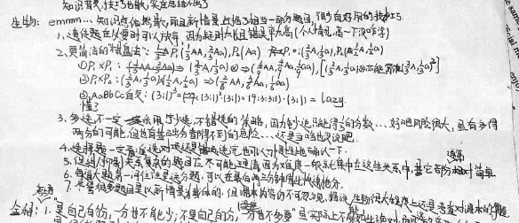

emmm...知识点依然散，而且新情境占据了相当一部分题目，很少有好用的技巧。

1. 遗传题在必要时可以放弃，因为耗时太长且错误率太高（个人情况，高一下没咋学）

2. 更简洁的“棋盘法”：$P_1(\frac13 AA,\frac23Aa)$，$P_2(Aa)$

   $P_1:(\frac23A,\frac13a)$，$P_2:(\frac12A+\frac12a)$

   1. $P_1\times P_1:(\frac23A,\frac13a)\otimes\Rightarrow(\frac49AA,\frac49Aa,\frac19aa)$（$(\frac23A,\frac13a)$亦能写作$(\frac23A,\frac13a)^2$
   2. $P_1\otimes P_2:(\frac23A,\frac13a)\times(\frac12A,\frac12a)\Rightarrow(\frac26AA,\frac36Aa,\frac16aa)$
   3. AaBbCc自交：$(3:1)^3=(3:1)^2\cdot(3:1)=(9:3:3:1)\cdot(3:1)=(27:9:9:9:3:9:3:3:1)$

   懂？

3. 多选不一定采用宁少选不错选的策略，因为少选只能得$\frac13$的分数…好吧风险很大，虽有多得两份的可能，但也有基础分都得不到的危险…还是当啥也没说吧。

4. 选择题一定看准选对项还是错项，选完也可以习惯性地确认一下。

5. 促进/抑制关系复杂的题目应尽可能理清，因为难度一般就集中在这些关系中，其他部分通常相对简单。

6. 每道大题第一问往往是送分题，可以在最后两三分钟借此快速抢分。

7. 尽管很多题目是以新情境为载体的，但课本的内容仍不可忽视，据说，生物很大程度上还是考察对课本的掌握。

